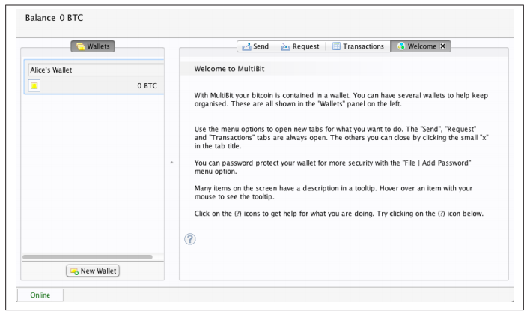
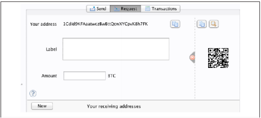
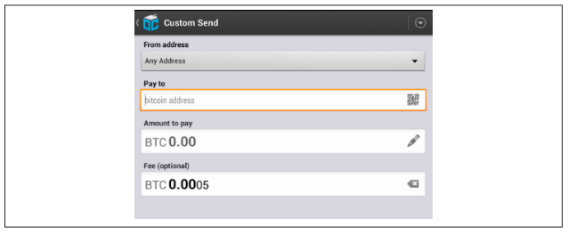

第一章 介绍
=========

# 什么是比特币
比特币是一系列构成数字货币生态系统的概念和技术的组合。比特币的货币单位叫做“比特币”，用于存储和传递价值。比特币用户间的通讯主要通过比特币协议在因特网上进行，也可以在其他通讯网络中进行。比特币协议栈是开源的，可以在各种不同的计算设备上运行，包括笔记本电脑，智能手机等，用户可以很方便的接入比特币网络。

用户可以在网络中传递比特币，完成一切传统货币可以完成的事情，包括买卖商品，转账给特定的个人或者组织，发放贷款等等。比特币可以进行买卖，也可以在专业的货币交易所中，与其他货币进行兑换。比特币交易快速、安全并且没有边界，从某种程度上来说，是因特网上的一种完美的货币形式。

不像传统货币，比特币是一种彻底的虚拟货币，没有物理货币，甚至连电子货币本身都不存在。货币隐含在发送者与接受者进行价值交换的交易当中。比特币用户拥有自己的密钥，用以证明比特币网络中的交易所有权，从而实现交易消费，或将其传递给新的接收者。这些密钥通常存储于用户计算机的数字钱包中。拥有解锁交易的密钥是花费比特币的唯一要求，这也就把对比特币的控制权完完全全的交给了用户。

比特币是一个分布式的，点对点系统。网络中没有“中央”服务器，也没有控制点。比特币是由称之为“挖矿”的过程产生的，它是一种在验证比特币交易的过程中竞争解决一类数学问题的机制。任何比特币网络的参与者（运行完整的比特币协议栈的人）都可以成为挖矿者，他们可以使用自己的算机的处理能力去验证和记录交易。平均每隔10分钟，总有人能完成过去10分钟产生的交易的验证过程，并因此获得全新产生的比特币的奖励。本质上说，比特币的的挖矿机制使得央行的货币发行和清算机制得以去中心化，央行的功能被这种全局竞争机制替代了。

比特币协议内建的算法规范了全网挖矿的行为。矿工处理记录交易区块的难度可以动态调整，确保了不管网络上有多少矿工（CPU）同时在工作，最终都能维持大致10分钟挖到一个区块的速度。协议同样规定了每隔四年，新比特币的创建速度将减半，这将比特币的总量限制在了2100万的总量内。因此，比特币的发行量与预测的曲线可以尽量靠近，直到2140年达到2100万的总量。鉴于比特币发行量递减的原因，在长期内，比特币是维持通缩的。此外，比特币无法突破限制“印制”新钱导致通胀。

除了表现出来的货币属性，比特币也是协议的名称，它是一个网络，一种分布式计算的创新。比特币货币仅仅是基于这个发明的第一个真正的应用。作为一个开发者，我觉得比特币对货币的革新就如同当年互联网的出现，它是一种传播价值，通过分布式计算保护数字资产的拥有权的网络。比特币能做的比你第一眼看到的多得多。

在本章中，我们从解释主要的概念和名词开始，下载所需软件，并使用比特币进行简单交易。接下来的几章中，我们将一步步解释使比特币成为可能的技术细节，并深入了解比特币网络和协议的运行机制。

|比特币之前的数字货币|
|-------|
|数字货币的出现与密码学的发展紧密相关。考虑到利用数字来表示货物或者服务的价值的根本挑战，数字货币的出现也就不足为奇了。任何接受数字货币的人都面对两个基本问题：
1. 我能相信钱是真实的而不是伪造的吗？
2. 我能确定没人会声明钱是他的而不是我的吗？（又叫“双重支付”问题）
纸币的发行者为了防止假钞，通过采用越来越复杂的纸张和更为先进的印刷技术来印制钞票。使用物理货币情况下，解决重复支付问题非常简单，因为同一张钞票不能同时在两个地方出现。当然，传统货币也经常以电子的方式进行存储和传递，在这种情况下，防伪和防止双重支付是通过中央机构对电子交易进行集中清算实现的，这个机构拥有货币流通的全局视角。对于数字货币而言，它无法依靠防伪油墨，全息安全线来提供安全保证，密码学提供了基础的保证，得以实现对用户合法价值的信任。特别的，加密数字签名算法使得用户可以对数字资产或数字资产的交易进行签名。利用合理的架构，数字签名也能用于解决双重支付问题。

上世纪80年代，当密码学越来越被人所熟知，并得到了越来越广泛的应用时，许多研究人员开始尝试使用密码学创建数字货币系统。这些早期的数字货币项目发行的货币通常由国家货币或者贵金属进行背书。

虽然这些数字货币系统也能运行，但是他们是中心化的，很容易被政府或者黑客攻击。早期数字货币与传统银行系统一样，利用中央清算机构定时去处理所有交易。不幸的是，这些数字货币系统大都都成了政府担忧的目标，最终因诉讼失败而消失了。也有因为母公司突然破产清算而悲壮倒闭的。为了应对反对者（不管是合法政府还是罪恶元素）的干扰，防止单点攻击，一个去中心化的数字货币系统成为必要。比特币就是这样一个系统，设计出来时就是完全的去中心化的，不需任何的中央集权机构，也不需要可被攻击且容易崩溃的单一控制节点。

比特币是几十年来密码学和分布式系统研究的巅峰之作，它汇集了四个方面的创新，形成了一个单一的强大组合。比特币系统由以下几个部分组成：

	* 去中心化的点对点网络（比特币协议）
	* 公共交易账本（区块链）
	* 去中心化的基于数学的确定性的货币发行体系（分布式挖矿）
	* 去中心化的交易验证系统（交易脚本)
|

# 比特币历史
2008年，一个化名为中本聪的人公开发表了一篇叫做《比特币：一个点对点数字货币系统》的论文，比特币从此出现在世人面前。中本聪结合之前发明的几种数字货币如b-money，HashCash等创建了一个完全去中心化的货币系统，它不依赖于任何中央机构进行货币发行或者交易结算、验证。其最主要的创新在于利用分布式计算系统（称之为“工作量证明”算法）来组织10分钟一次的全局“选举”，以使去中心化的网络达到对交易状态的共识。这个机制优雅的解决了双重支付问题，避免了货币能被多次消费的问题。之前，双重支付一直都是数字货币系统的弱点，以致不得不引入一个中央清算机构来完成交易清算。

比特币网络开始于2009年，基于中本发布的并被大量其他程序员修订过的参考实现发展而来。比特币发明以来，为比特币提供安全性和弹性保障的分布式计算已经实现了指数级的增长，现在其计算能力已超过了全世界最强大的超级计算机的处理能力。基于比特币与美元的汇率估算，比特币的全部市场容量介于50亿到100亿美元间。比特币网络迄今处理的最大的一笔交易额为1.5亿美元，瞬间就完成了传递和处理，并且产生没有任何费用。

中本聪自2011年4月起从公众视野中消失，将开发代码和建设网络的责任交给了一个活跃的志愿者小组。这个站在比特币后面的人（或者群体）的身份依然未知。但是，不管是中本聪还是任何其他人均无法对比特币系统进行控制，这个系统只依赖于完全透明的数学法则。发明本身是开创性的，并且已经在分布式计算、经济学、计量经济学的领域中产生了新的学科。

|分布式计算问题的一个解决方案|
|----|
|中本聪的发明也是对之前未能解决的分布式计算问题（拜赞庭将军问题）的一个实用方案。简单的说，问题在于如何在一个不可靠且存在潜在背叛风险的网络中交换信息并达成共识。中本聪的解决方案是在一个没有中央可信节点的情况下，利用工作量证明来达成共识，它标志着分布式计算科学的一个重大创新，它的适用性远远超过货币领域。比特币可以在去中心化的网络中达成共识，从而证明选举、彩票、资产注册、数字公证等等等等的公正性。|

# 比特币使用，用户，以及他们的故事

比特币是一种技术，但它所代表的货币，本质上是人与人之间实现价值交换的语言。我们来看看使用比特币的人们，并通过他们的故事来了解几种常见的货币和协议使用场景。我们也将在本书中不断重复使用这些故事，以展示数字货币在现实生活中的用途，以及比特币中的各种技术是如何使这些用途成为可能的。

*北美低价值零售*
	爱丽丝（Alice）住在北加州湾区，她从她的技术迷朋友中听说了比特币，也想开始使用它。我们将一路追随她的故事，从她了解到比特币，获得一些比特币，到花费比特币从帕洛阿尔托的鲍勃咖啡屋购买一杯咖啡。这个故事将从零售客户的角度介绍比特币软件，兑换，以及基本的交易过程。

*北美高价值零售*
	卡洛（Carol）是旧金山一家画廊的老板，她以比特币计价出售昂贵的画作。这个故事将介绍高价值零售商面临的的51%共识攻击的风险。

*离岸合同服务*
	鲍勃（Bob），帕洛阿尔托一家咖啡店的老板，正在建设一个新的网站。他与一个居住在印度班加罗尔的网站开发工程师高佩什（Gopesh）签订了合同。高佩什同意以比特币进行支付。这个故事将检验比特币在外包、合同服务以及国际汇款中的使用。

*慈善捐赠*
	尤金妮娅（Eugenia）是菲律宾一家儿童慈善机构的负责人。近来，她听闻了比特币，希望通过比特币接触到一个全新的国内外捐献群体，以支持她的慈善事业。她研究了利用比特币将善款分发到需要的地方的方法。这个故事将展示利用比特币进行跨币种和国界的筹款过程以及利用开放账本实现慈善组织的透明化。

*进出口*
	穆罕默德是（Mohammed）一个迪拜的电子产品进口商。他希望利用比特币从美国和中国进口电子产品到阿联酋，以加快进口的支付过程。这个故事将展示比特币是如何用于大型商业机构间的基于物理货品的国际支付的。

*比特币挖矿*
	景（Jing）是上海的一个计算机工程专业的学生。他建了一个矿机在比特币网络上挖矿，利用他的专业特长增加收入。这个故事将检验比特币的“产业”基础：专业的设备用于保护比特币网络，并发行新的货币。

以上每个故事均基于那些正在利用比特币创造新的市场、新的产业，提出创新方案以解决全球经济问题的真实人物和真实产业。

# 新手入门

要加入比特币网络并开始使用这种货币，用户首先要下载一个软件或者利用一个web应用。由于比特币是一种标准，存在很多的比特币客户端的实现。当然，也有一个参考实现，称之为中本聪客户端，它作为开源项目由一个开发团队进行维护，是由中本聪开发的原型中继承而来的。

主要有三种形式的比特币客户端：

*完全客户端*

	完全客户端，或者叫“完全节点”，是一个保存全部比特币交易历史（包含每个用户的每笔交易）的客户端，它管理用户的钱包，也可以直接在比特币网络上开始一笔交易。这种客户端类似于一个独立的email服务器，不需要依赖任何其他服务器或第三方服务就可以处理协议的方方面面。

*轻量级客户端*

	轻量级客户端保存用户的钱包，它依赖于第三方服务器访问比特币交易和网络。轻量级客户端不保存完整的交易，所以，它必须信任第三方服务器以进行交易验证。就像email的客户端，连接到一个email服务器上访问邮箱，通过第三方与整个网络进行交互。

*web客户端*

	web客户端通过浏览器访问，用户的钱包保存在一个第三方的服务器上。就像webmail，完全依赖第三方服务器。

|移动客户端|
|----|
|在手机上运行的移动客户端，比如那些基于安卓系统的客户端，可以是完全客户端，也可以是轻量级客户端或者web客户端。一些移动客户端与web或者桌面客户端同步，提供一个基于相同资金来源的跨设备的多平台钱包|

客户端的选择基于客户对资金的控制意图。完全客户端提供了最高级别的独立控制，但是它也给用户带来了备份和安全的负担。另一方面，web客户端最容易安装和使用，但是由于安全和控制是与web服务提供方共享的，这就带来了交易风险。如果web钱包服务被盗用（实际上已经发生过多次），用户就会失去他们的所有资金。相反的，如果一个用户拥有完全客户端，却没有进行足够的备份，他们也可能会因为电脑故障而丢失自己的资金。

基于本书的目的，我们将从参考实现（中本聪客户端）到web钱包，演示各种可以下载的客户端。某些例子需要参考客户端，它不仅是一个完整的客户端，也向我们暴露了钱包、网络和交易服务的API接口。如果你准备研究比特币系统的编程接口，参考客户端是必须的。

## 快速入门

爱丽丝，我们在第4页《比特币使用，用户和他们的故事》中介绍过的那位，不是一个技术宅，只是从朋友那听说了比特币。她通过访问[http://bitcoin.org](http://bitcoin.org)开始了她的比特币历程，在那儿，她看到了一个包含很多客户端列表的版单。根据[http://bitcoin.org](http://bitcoin.org)网站的建议，她选择了一个叫Mutibit的客户端。

爱丽丝根据[http://bitcoin.org](http://bitcoin.org)的下载链接，在自己的电脑上下载并安装了Multibit。Multibit提供了Windows，Mac OS和linux桌面等多个版本。

比特币钱包必须由密码或口令进行保护。有很多坏蛋会尝试破解脆弱的密码，所以必须小心地选择一个无法轻易破解的密码。尽量使用混合了大小写字母、数字和其他符号的密码。避免使用生日、运动队名称等与个人相关的信息。也要避免很容易在字典中找到的任何语言的词语。如果可能，采用密码生成器生成一个完全随机的，至少12个字符长度的密码。记住：比特币是钱，而且可以在瞬间转移到世界上的任何地方。如果不好好进行保护，它是很容易被人窃取的。

当爱丽丝下载并安装了Multibit软件后，她点击运行，并出现了一个欢迎界面，如**图1-1**:

*图1-1 Multibit 比特币客户端欢迎界面*

通过点击Request选项卡，可以看到Multibit已自动为爱丽丝创建了一个钱包和比特币地址。如**图1-2**：

*图1-2 在Multibit客户端的Request选项卡下看到的爱丽丝的新比特币地址*

屏幕中最重要的部分是爱丽丝的比特币地址，就像一个email地址，爱丽丝可以将这个地址分享给别人，任何人也可以利用这个地址直接给爱丽丝转钱，转完后钱将直接进入爱丽丝的新钱包。屏幕上，地址看起来是一长串由字母和数字组成的字符串：1Cdid9KFAaatwczBwBttQcwXYCpvK8h7FK。挨着比特币地址的是一个二维码，它是另一种包含了相同信息的表现形式，可以被智能手机扫描识别。二维码就是窗口右方黑白图案构成的方框。爱丽丝可以通过点击比特币地址或者二维码边上的copy（拷贝）按钮将比特币地址或者二维码拷贝至剪贴板。如果单击二维码本身，它将放大显示以方便智能手机的摄像头扫描。

爱丽丝也可以将二维码打印下来，方便的交给其他人，免得他们输入那串冗长的字母和数字。

比特币地址开始于1或3。就像email地址一样，可以在比特币用户间分享，别人可以通过这个地址给你的钱包直接发送比特币。不像email地址的地方是，只要你愿意，你可以随时创建新的比特币地址，所有这些地址都可以让收到的资金直接进入你的钱包。钱包就是简单的一堆地址和他们内含的解锁资金的密钥的集合。你可以通过每笔交易采用采用一个不同的地址以提高交易的隐私性。事实上，一个用户能创建的地址数量是没有限制的。

爱丽丝现在已经准备好可以使用她的新比特币钱包了。

## 获取第一笔比特币

现在还没有办法从银行或者外币兑换亭买到比特币。截至2014年，在大多数国家要购买到比特币都还是很困难的。你可以去一些专业的货币交易所，在那儿，你可以以一定的汇率利用当地货币买卖比特币。这些交易所的运营模式通常都是基于web的，主要包括：

*Bitstamp*
	
	一个欧洲货币市场，它支持欧元(EUR)和美元(USD)等几种货币，通过电子转账的方式完成。

*Coinbase*

	一个位于美国的比特币钱包和交易平台，在这个平台上，商家和客户可以通过比特币进行交易。Coinbase允许用户通过ACH系统将交易所账户与美元支票账户相连接，使得比特币的买卖变得非常简单。

这些加密货币交易所，是法币和加密货币的交汇点。它们同样需要符合国内国际的监管要求，并且经常被限定在一个国家或者经济区内，且指定使用该地区的法币。你指定的货币交易所只能使用你所在国家的货币，并且只能位于你的国家拥有司法管辖权的地方。与银行开户类似，你可能需要花上几天到几周的时间来开立使用这项服务的账户。他们要求你提供各种形式的身份证明以满足KYC（了解你的客户）和AML（反洗钱）等银行监管规定。一旦你拥有了一个比特币交易所账户，你就可以像使用代理账户买卖外币一样开始买卖比特币了。

Bitcoin Charts是一个提供价格行情以及大量货币交易所市场数据的网站，在这你可以找到更完整的列表。

以下是作为新用户获得比特币的四个其他渠道：

- 找到一个拥有比特币的用户，直接从他那买一些。这也是很多新用户最初获取比特币的方法。

- 使用类似localbitcoins.com这样的分类服务网站找到一个当地的卖家，并通过当面交易的方式用现金从他手里购买比特币。

- 以比特币计价的方式出售一项商品或服务。如果你是个程序员，可以出售你的编程技巧。

- 利用你所在城市的比特币ATM。利用CoinDesk的在线地图在你附近找到一个比特币ATM。

爱丽丝通过朋友介绍认识比特币的，因此当她在等待加州货币市场对她的账户进行验证和激活的过程中，也有很方便的途径可以获取她的第一个比特币。

## 发送和接收比特币

爱丽丝已经创建好了比特币钱包，现在她可以接收资金了。她的钱包软件随机生成了一个私钥（细节参看第63页的《私钥》）以及相应的比特币地址。这时候，她的比特币地址并没有让比特币网络知道，也没有注册到比特币系统的任何部分。她的比特币地址仅仅是一个数字，它与控制资金的密钥相关联。没有账户，也没有地址与账户间的关联关系。直到作为交易的价值接收方发布到比特币账本（区块链）前，该地址只是无数可能的比特币“有效”地址的一部分。一旦它和交易相关联，它就变成了网络中已知地址的一部分，而爱丽丝也就可以在公共账本上查看它的余额了。

爱丽丝在一个当地餐馆碰到她的朋友乔（Joe），就是他介绍爱丽丝进入了比特币世界，爱丽丝用美元跟乔交换了一些比特币。她带了一张打印好的比特币地址和二维码作为她钱包的标识。从安全的角度看，比特币地址无关敏感信息。它可以发到任何地方而不用担心对她的账户造成威胁。

爱丽丝希望换10美元的比特币，她不想在这项新技术上冒太多金钱上的风险。她给了乔10美元的现金以及打印出来的地址。然后乔就可以给他相应金额的比特币了。

接着，乔需要查出当前的汇率，从而把正确金额的比特币发给爱丽丝。有很多很多软件和网站提供当前的市场汇率。以下是几个比较流行的：

*Bitcoin Charts*

	一个市场数据服务，提供世界范围内多个交易所的以本地货币标价的比特币市场汇率。

*Bitcoin Average*

	一个提供每种货币的“容量-权重-均值”的简单视图的网站。

*ZeroBlock*

	一个免费的安卓和iOS应用，可以显示不同交易所的比特币价格。参看**图1-3**

*Bitcoin Wisdom

	另一个市场数据服务

*图1-3 ZeroBlock， 一个比特币市场汇率应用（安卓、iOS）*

使用以上的某个网站或者应用，乔确定每个比特币的价格约为100美元。在这个汇率下，作为爱丽丝给他的10美元的对价，他需要给爱丽丝0.10个比特币，或者100毫币。

当乔确定了合理的交换价格后，他打开他的移动钱包应用，选择发送比特币。比方说，在安卓手机上选择“Blockchain（区块链）”移动钱包，他将看到屏幕上有两个必须的输入项，如**图1-4**。

- 交易目标地址

- 待发送比特币金额

在地址输入域中，有个类似二维码的小图标。它允许乔利用他的手机摄像头扫描二维码，这样就避免了手工输入爱丽丝的那串又长又难输的比特币地址（1Cdid9KFAaatwczBwBttQcwXYCpvK8h7FK）。乔点击二维码图标，激活手机摄像头，从爱丽丝给他的打印好的钱包上扫描到了二维码，并自动填充到比特币地址字段上。乔可以从中挑几个字符与爱丽丝打印出来的地址进行比对，以确认是否正确。

乔然后输入比特币交易金额，0.10比特币。他认真地进行了检查以确定输入了正确的金额，因为他准备做的是真正的金钱的传递，任何错误都会带来实打实的损失。最后他按下了发送按钮，将交易发送出去。这样，乔的手机比特币钱包构造了一个交易，这个交易将发送0.10比特币给爱丽丝提供的地址，资金的来源是乔的钱包，采用乔的私钥进行了签名。这告诉比特币网络，乔已经授权从他的地址转账到爱丽丝的新地址。随着交易通过点对点协议进行的传输，它很快就广播到了比特币网络中。不到一秒，大部分有良好连接的节点已经接收到了交易，并且第一次看到了爱丽丝的新地址。

如果爱丽丝随身带着智能手机或者笔记本电脑，她也能看到这笔交易。比特币账本（一种持续增长的，记录所有已发生的比特币交易的文件）是公开的，意味着她只需要关注她自己的地址，查看是否有资金发送到该地址。她可以在blockchain.info网站上输入她的地址，很轻易就能做到这点。网站会向她展示一个页面，这个页面包含了从这个地址发出或接收到的所有交易的信息。如果爱丽丝正在查看这个页面的话，在乔点击发送后，页面很快就会显示出最新的一笔乔转给她的0.10比特币的交易信息。

|确认|
|----|
|最初，爱丽丝的钱包会显示乔发出来的交易处于“未确认”状态。意思是交易已经广播到网络中，但是还没有被包含到比特币交易账本（称之为区块链）中。为了被包含进去，交易需要被矿工挑出，并打包进一个交易区块中。在差不多10分钟内，当一个新的交易区块被创建出来时，已包含入区块的交易被网络接受为“已确认”状态，这笔钱已经可以使用了。交易立即就可以看到，但是只有被包含进新挖出来的区块中，才能得到所有人的“信任”。|

爱丽丝现在是光荣的比特币的所有者了，她拥有了0.10个可以使用的比特币。在下章，我们将看到她使用比特币的第一次购买行为，并会更细致地了解交易底层及交易传播技术。

