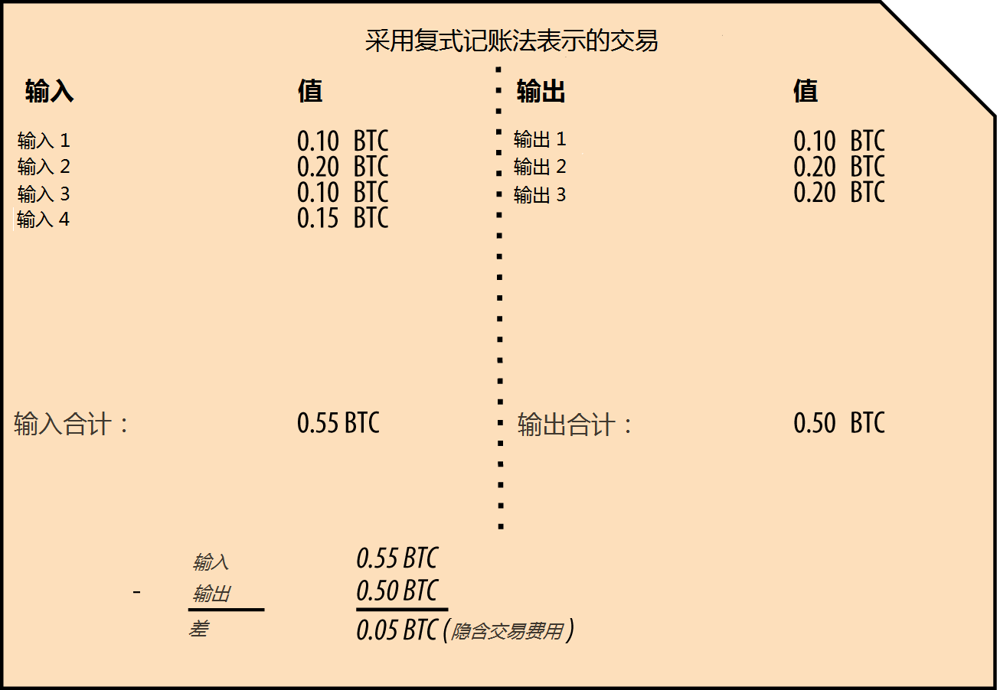
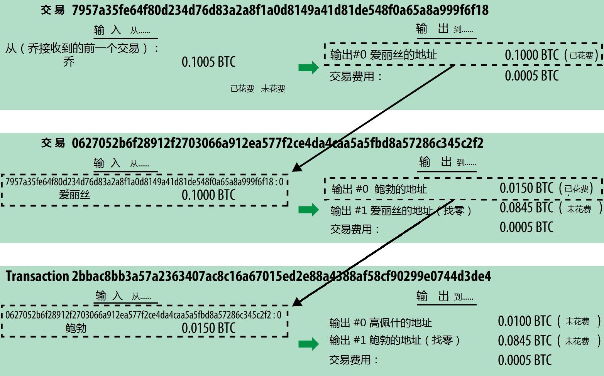
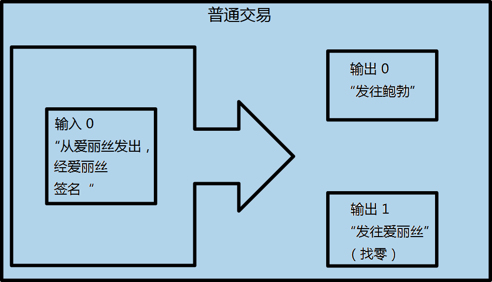
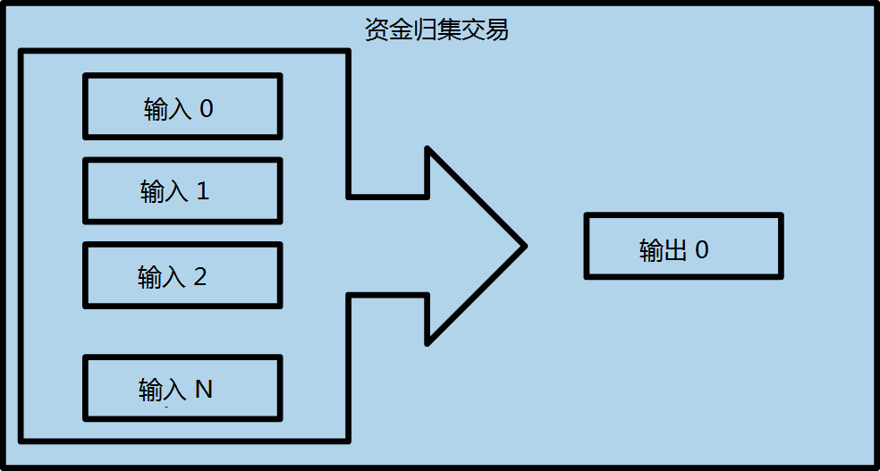
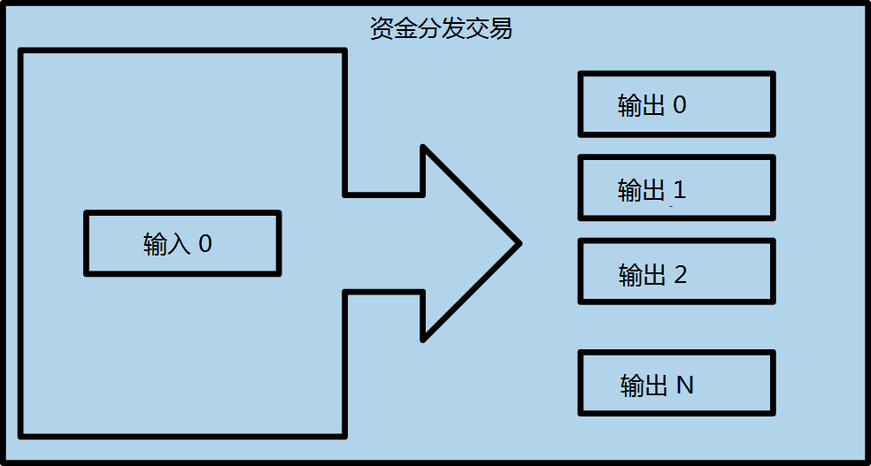
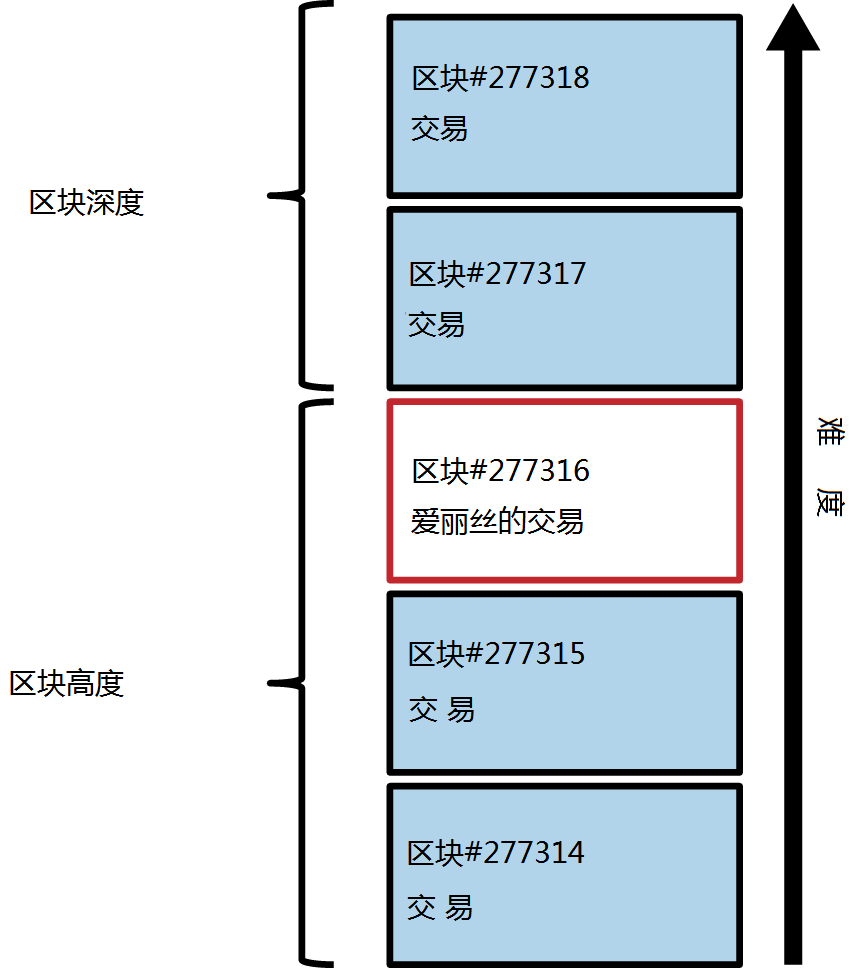
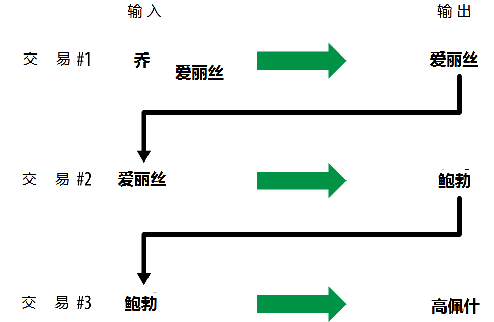

第2章  比特币是如何工作的
=======

# 交易，区块，挖矿以及区块链

比特币系统不像传统银行系统或支付系统，它基于一种去中心化的信任。与传统中央权威信任机构相反，比特币的信任是系统的一种自然属性，源于比特币系统不同参与者间的交互。在本章中，我们将从较高的层面审视比特币系统，通过跟踪一笔交易，看它是如何在分布式共识机制下变为“被信任”和被接受，并最终被记录到区块链上（记录所有交易的分布式账本）。

文中的每个例子都是在比特币网络上真实执行过的交易，模拟了资金在用户间（乔，爱丽丝，鲍勃）转移的交互过程，即比特币从一个钱包进入另一个钱包的过程。为了在比特币网络和区块链中跟踪交易，我们可以利用区块链浏览器网站来可视化地展现每个步骤。区块链浏览器是一个web应用，起到了比特币搜索引擎的作用，通过它，可以搜索地址、交易、区块并查看他们间的关系和流程。

流行的区块链浏览器包括：

* Blockchain info
* Bitcoin Block Explorer
* insight
* blockr Block Reader

以上每个网站的区块链浏览器均带有搜索功能，可以依据地址，交易哈希，区块号码进行搜索，每个网站的搜索结果在比特币网络和区块链中都是等价的。在每个例子中，我们都会提供一个URL，让你直接找到相应的入口，以便对细节进行进一步研究。

## 比特币概览

在下述概览图（**图2-1**）中，我们可以看到，比特币系统由用户、交易和矿工组成，用户拥有钱包，钱包中管理着用户的密钥；交易在网络中传播；矿工通过竞争性计算来创建共识区块链，它是所有交易的权威账本。在本章中，我们将从较高的层面，跟踪一个交易在网络中的传播过程，并检视由此引起的比特币系统不同部分间的交互。接下来的章节中，我们将深入了解钱包、挖矿和商户系统后的更多技术细节。

*图2-1 比特币概览*

## 购买一杯咖啡

爱丽丝，这位我们之前已经介绍过的主角，是一个新用户，她刚刚获得了她的第一笔比特币。在第9页的《获取第一笔比特币》中，爱丽丝遇到了她的朋友乔，并用现金跟他交换了一笔比特币。那笔由乔创建的交易往爱丽丝的钱包中存进了0.10的比特币（BTC）。现在爱丽丝将进行她的第一笔基于比特币的零售交易---在鲍勃位于加州帕洛阿尔托的咖啡店中购买一杯咖啡。鲍勃的咖啡店最近刚开始接受比特币支付，他在销售系统上添加了比特币的选项。咖啡店的价格是以当地货币（美元）标注的，但是在收银处，客户可以选择以美元或者比特币进行支付。销售系统将自动依据主流市场的汇率，将美元价格转换为比特币价格，并同时显示两种价格，销售终端还会在屏幕上显示一个带有本笔支付请求的二维码：

	合计:
	$1.50 美元
	0.015 比特币

*图2-2 支付请求二维码（提示：扫扫看！）*
	
支付二维码按照BIP0021的要求，将以下URL进行编码：

    bitcoin:1GdK9UzpHBzqzX2A9JFP3Di4weBwqgmoQA?
	amount=0.015&
	label=Bob%27s%20Cafe&
	message=Purchase%20at%20Bob%27s%20Cafe

	URL的组成元素
	比特币地址：1GdK9UzpHBzqzX2A9JFP3Di4weBwqgmoQA
	支付金额：“0.015”
	接收人地址的标签："鲍勃咖啡店”
	支付描述：“在鲍勃咖啡店买东西”

不像一个只包含目标地址的二维码，支付请求二维码是一个二维码编码的URL，包含了目标地址，支付金额，通用的交易描述，如“鲍勃咖啡店”。比特币钱包软件可以使用这些信息预填充用于发送支付指令的信息，同时也可以人工可读的方式显示给用户。你可以使用一个钱包软件扫描二维码，看看爱丽丝看到了什么。

鲍勃说：“共1.5美元或者15毫比特币。”

爱丽丝用她的智能手机在屏幕上扫了一下二维码，手机显示需要支付0.0150比特币给鲍勃咖啡店，她点了*发送*，授权了这笔支付交易。几秒钟后（与刷信用卡授权的时间差不多），鲍勃在收银机上看到了这笔交易，交易完成了。

在接下来的章节中，我们将剖析这笔交易的细节，了解爱丽丝的钱包是如何构建这笔交易，如何将它广播到网络中，交易如何获得确认，最后鲍勃是怎么才能在后续交易中使用这笔钱的。

比特币网络支持将比特币拆分成小额进行交易，从千分之一比特币(一毫比特币）到一亿分之一比特币（通常称作聪）都可以。在本书中，我们用“比特币”指代任何数量的比特币货币，从最小的单位（1聪）到全部可被挖出的数量（2100万）。

# 比特币交易

简单的说，一个比特币交易，就是告诉网络，某个拥有一定数量比特币的用户已经授权将这笔比特币转让给另一位用户。新的所有者可以通过另外一笔授权转让交易来使用这些比特币，以此类推，形成一个所有者转换的链条。

交易就像复式账本的一笔笔记录，每个交易均包含一到多条的“输入”---这是比特币账户的借方。另一方面，每笔交易也包含了一到多条的“输出”---这是比特币账户的贷方。输入和输出（借和贷）加起来不要求相等，实际上，输出加起来的和应稍小于输入的和，这个差额就是隐含的“交易费用”，这笔小额费用归将交易归集到账本的矿工所有。以复式账本表示的比特币交易如**图2-3**。

交易同样包含每笔待转让比特币（交易输入）的所有权证明，以所有者数字签名的方式来表示，数字签名可以被任何人独立验证。在比特币的术语中，“消费”就是签署一笔交易，将所有者从前序交易中获得的价值权益转让给以比特币地址代表的新所有者。

交易将价值从交易输入移动到交易输出。交易输入是价值的来源，通常是上一笔交易的输出。交易输出将一笔与私钥关联的价值赋给一个新用户。目标密钥称为*安全锁*。在未来的交易中，需要通过签名来获取这笔资金。一笔交易的输出作为新交易的输入，这样，随着价值不断从一个地址转移到另一个地址，形成了一条所有权的链条（见**图2-4**）。

*图2-3 采用复式记账法表示的交易*

*图2-4 一个交易的链条，在链上一个交易的输出成为下一笔交易的输入。*

爱丽丝支付给鲍勃咖啡店的交易使用了上一笔交易的输出作为这笔交易的输入。在上一章中，爱丽丝用现金从她的朋友乔那里换到了一笔比特币。那个交易的一笔资金被爱丽丝的密钥锁定（阻碍）。她向鲍勃咖啡店支付咖啡费用的新交易中，引用了上笔交易的输出作为本笔交易的输入，输出则包含两部分，一部分是支付咖啡费用，另一部分用于找零。交易形成了一个链条，最新交易的输入对应上一笔交易的输出。爱丽丝的密钥提供的签名解锁了前笔交易的输出，向比特币网络证明了她对这些资金的所有权。她在交易中附上鲍勃的地址，形成一个“阻碍”，限制鲍勃必须使用签名才能花费这笔资金。这个过程展示了价值在爱丽丝和鲍勃中转移的过程。这个从乔到爱丽丝在到鲍勃的交易链见**图2-4**。

## 常见交易形式

最常见的交易就是从一个地址到另一个地址的支付，它通常还包含需要返还给初始所有者的零钱。这种类型的交易包含一个输入和两个输出，参见图2-5.

*图2-5 最常见普通交易*

另外一种常见交易形式是绑定几个输入，形成一个输出（见图2-6）。这与现实生活中将零钱换为大额钞票的场景类似。这种交易通常是钱包软件对交易中找回的一堆零钱进行清理的情况。

*图2-6 资金归集交易*

最后，还有一种在比特币账本中常见的交易形式，将一个交易输入分配给多个输出，每个输出代表不同接收者（见图2-7）。这种类型的交易有时是商业实体用于分发资金，比如给员工发工资。

*图2-7 资金分发交易 *

# 创建交易

钱包软件知道如何选择合适的输入和输出以创建符合爱丽丝要求的交易。爱丽丝要做的只是指定一个接收人和交易金额，不用操心具体的细节，钱包软件会自动完成剩下的工作。很重要的一点，钱包软件即使在离线的情况下也可以创建交易。就像在家里写一张支票，然后将其装进信封寄给银行，交易不需要在连接到比特币网络的情况下进行创建和签名。只有在执行交易时才需要将交易发送到网络。

## 获得正确的输入

爱丽丝的钱包软件首先必须找到足以支付鲍勃资金的交易输入。大部分钱包软件会保留一个“未花费的交易输出”的小型数据库，由钱包所有者的私钥锁定（阻碍）。因此，爱丽丝的钱包含有那笔她用现金跟乔交换比特币的交易输出的副本（参见第9页《获取第一笔比特币》）。一个运行在完全模式客户端下的钱包软件，实际上包含了网络上所有交易的“未花费的输出”。这使得钱包软件不仅能快速构建交易输入，也能验证一个新来的交易，判断其输入是否有效。由于完全客户端需要耗费非常多的存储空间，实际上大部分用户的钱包只运行一个轻量级客户端，只能用于跟踪用户自己的未花费输出。

如果一个钱包软件没有维护完整的“未花费的输出”，它可以使用不同供应商提供的API接口向比特币网络询问这些信息，或者也可以使用JSON RPC接口向一个完全节点询问相关信息。**例2-1**展示了一个RESTful API请求，它以HTTP GET命令的方式构造一个请求发往特定的URL地址。这个URL将根据请求中的地址信息返回所有“未花费的输出”信息，供任何需要使用这些信息构造交易输入的应用使用。在这里我们使用简单的命令行模式的HTTP客户端cURL来发送请求并获取应答。

*例2-1 获取爱丽丝比特币地址下所有未花费的输出*

	$curl https://blockchain.info/unspent?active=1Cdid9KFAaatwczBwBttQcwXYCpvK8h7FK

*例2-2 请求应答*

	{
	"unspent_outputs":[
			{
			"tx_hash":"186f9f998a5...2836dd734d2804fe65fa35779",
			"tx_index":104810202,
			"tx_output_n": 0,
			"script":"76a9147f9b1a7fb68d60c536c2fd8aeaa53a8f3cc025a888ac",
			"value": 10000000,
			"value_hex": "00989680",
			"confirmations":0
			}
		]
	}

**例2-2**的应答显示，只有一个归属于爱丽丝的地址1Cdid9KFAaatwczBwBttQcwXYCpvK8h7FK下的“未花费的输出”（尚未兑现）。应答还包含了产生这笔输出的交易引用（乔发起的支付交易），以单位聪表示的交易金额是1000万聪，也就是0.10比特币。利用这些信息，爱丽丝的钱包软件就可以构建出一个新交易向新地址发送资金了。

[点击http://bit.ly/1tAeeGr 查看乔到爱丽丝的交易](http://bit.ly/1tAeeGr)

就像你看到的，爱丽丝钱包中唯一的未花费输出已足够支付一杯咖啡的费用。如果这个条件不能满足，钱包软件就不得不去翻找所有小额未花费输出凑够这笔交易输入，就像从手提袋中翻找足够的硬币来凑够一杯咖啡的钱。在以上两种情况下，钱包软件都可能需要在交易输出中找回一些零钱，我们将在下节讨论。

## 创建输出

交易输出以一种脚本的形式创建一个针对特定价值的阻碍，只能通过解决脚本问题来解除阻碍，从而兑现这笔输出。简单的说，爱丽丝的交易输出包含一个脚本，脚本大意是这样的：“这个输出将支付给那个能提供与鲍勃的公开地址匹配的签名的人”。由于只有鲍勃拥有与其地址匹配的密钥，所以只有鲍勃的钱包可以提供这样一个签名来兑现这笔输出。爱丽丝就以要求提供签名的方式，锁定了一笔输出价值。

这笔交易还包含另一部分，因为爱丽丝的资金是以0.10比特币表示的一个输出，超过了一杯咖啡0.015比特币的金额。爱丽丝需要拿回0.085比特币的找零。爱丽丝的找零操作是钱包在生成给鲍勃的支付交易时一并产生的。本质上看，爱丽丝的钱包将她的资金分成两笔支付，一笔给鲍勃，剩下的交还她自己。她可以在下一笔交易中使用这个找零输出。

最后，为了这笔交易尽快被网络执行，爱丽丝的钱包应用将添加一小笔的交易费用。这个金额不是显式的，它隐含于交易输入输出的差值中。假如交易中找零金额不是填0.085，而是用0.0845作为交易第二个输出（找零输出），这样就有0.005比特币（半毫比特）的剩余。输入的0.10比特没有被两个输出完全花费完，因为它们加起来不到0.10。输入输出的差额就构成了交易费用，矿工们将这笔交易加入到区块，并放入区块链账本的过程中会收集这些交易费用作为它们挖矿的报酬。

交易结果可以通过一种叫做区块链浏览器的web应用来查看，用普通浏览器访问：http://bit.ly/1tAeeGr ，结果如**图2-8**：

*图2-8 爱丽丝给鲍勃咖啡店付款的交易*

[点击http://bit.ly/1tAeeGr 查看爱丽丝给鲍勃咖啡店付款的交易](http://bit.ly/1u0FIGs)

## 将交易添加到账本上

爱丽丝的钱包软件创建的交易共258字节长，它包含用以证明她的资金所有权的信息以及资金接收者的信息。现在，交易必须发送到比特币网络上并使之成为分布式账本（区块链）的一部分。在接下来的一节中，我们将看到一个交易如何变成新区块的一部分，以及区块是如何被“挖出来”的。最后，我们还将看到这个新区块被加入到区块链后，是如何随着区块数量的增长而变得越来越可信的。

### 发送交易

因为交易已包含所有用于后续处理的信息，所以不要关心它是如何或者从哪里传入比特币网络的。比特币网络是一个点对点的网络，每个比特币客户端通过与不同的客户端连接，成为网络的参与者。比特币网络的目标就是把交易和区块广播给所有的参与者。

### 如何传播

爱丽丝的钱包软件可以将新交易发送到所有通过互联网与它相连的客户端，不管它是通过有线、WiFi，还是通过移动网络相连。她的比特币钱包不一定非要与鲍勃的钱包直接相连，她也不必非要使用咖啡店提供的互联网接入，虽然这两种方式也没什么不可以。任何比特币网络节点（其他客户端）接收到之前未见过的有效交易时将立即将其转发给与它相连的其他客户端。这样，交易就很快在这个点对点网络中传播开来，在短短几秒内即可到达大部分节点。

### 鲍勃的视角

如果鲍勃的钱包软件与爱丽丝的直接相连，鲍勃的钱包软件将是第一个接收到交易的节点。不过，即使爱丽丝的钱包通过别的节点发送，交易也会在短短几秒内到达鲍勃的钱包。鲍勃的钱包会立即将爱丽丝的交易识别为一笔消费支付交易，因为交易含有需要鲍勃的密钥进行解锁的输出。鲍勃的钱包软件也能独立确认这笔交易是有效封装的，使用了之前未花费的输出，并且附带了足够的交易费用使其能够被下个区块包含。基于此，鲍勃可以认定这个交易会很快被确认并添加到区块中，被骗的风险很小。

关于比特币的交易，有个常见认识误区，认为交易必须等待10分钟被新区块包含，或者等待一小时得到6个确认后才是有效的。虽然确认可以确保交易被全网接受，但是这种延迟对于小额支付，比如一杯咖啡，其实是没有必要的。商户对这种小额交易可以直接接受，其风险不会比一笔没有使用身份证或签名的信用卡交易风险更大，而现在商户一般都接受这种信用卡支付方式。

# 比特币挖矿

交易现在被广播到了网络中，在没有被确认并通过挖矿包含到区块前，它还没有成为共享账本（区块链）的一部分。关于挖矿，在**第8章**中将有详细解释。

比特币系统的信任是建立在计算的基础上的。交易打包进区块需要巨大的计算量来证明，但是验证这个证明只需很少的计算量。挖矿过程在比特币系统中有以下两个目的：

* 挖矿过程在每个新区块中创建新的比特币，就像中央银行发行货币。每个区块创建的新比特币是固定的，随着时间推移，这个数量会逐渐减少。
* 挖矿过程创造信任，需要确保只有足够运力投入到包含这些交易的区块后交易才能被确认。更多的区块意味着更多的计算量投入，也意味着更多的信任。

挖矿的过程就像一个巨大的竞争性数字拼图游戏，当有人找到一个解决方案时，游戏就重新开始，而游戏的难度也会自动进行调整，使得每找一个解决方案的时间大致维持在10分钟左右。想象一个巨大的数字拼图，高度有几千行，宽度有几千列。如果我给你看已经填充好的拼图，你可以很快的验证有没有错误。但是，如果只填了一部分，剩下的都是空白的，那就需要花费大量的时间才能解决。数字拼图游戏的难度可以通过调整尺寸（增减行列数）来调节，但是不管尺寸大小，其确认过程都很简单。比特币中用的“拼图”是建立在密码学哈希算法之上的，它展现了与拼图类似的特性：它也是不对称的，很难解决却很容易验证，而且它的难度也可以调整。

在第4页的《比特币的使用，用户和他们的故事》中，我们介绍过景，一个上海的计算机工程专业学生。景是以矿工的身份参与到比特币网络中的。每10分钟左右，景与成千上万的矿工一起展开一场查找一个区块解决方案的全球竞赛中。为了找到一个解决方案（称之为工作量证明），全网每秒要进行几亿亿次的哈希计算。比特币中的工作量证明算法是采用SHA256加密哈希函数不断地对区块头和一个随机数进行哈希计算，直到找到一个与预设的模式匹配的方案。第一个找到这个解决方案的矿工将赢得这一回合的竞争，随即将这个区块发布到区块链当中。

景从2010年开始挖矿，他使用了一台非常快的桌面电脑来查找新区块的工作量证明。随着越来越多的矿工加入到比特币网络中，挖矿的难度急速增长。很快的，景和其他矿工将他们的电脑升级到了更专业的硬件，比如那些在游戏电脑或终端中使用的高端专用图形处理单元（GPU）。截止到写这本书的时候，难度已经非常非常高，为了保证有利可图，只能使用特定用途集成电路芯片（application-specific integrated circuits， ASIC）来进行挖矿，这些ASIC芯片将几百个挖矿算法集成到硬件中，并使他们在一个芯片内并行计算。景加入了一个“矿池”，就像彩票池，允许多个参与者参与其中，共同工作并共享收益。景现在使用两个USB连接的ASIC机器每天24小时挖矿，他通过出售挖矿获得的比特币来支付购买硬件的费用，并获取一定收入。他的电脑运行着一个bitcond，比特币客户端的参考实现，作为他的专用挖矿软件的后端。

# 交易区块挖矿

一个在网络上传播的交易直到成为全局分布式账本（区块链）的一部分才真正得到确认。平均每隔10分钟，矿工会创建一个包含上个区块以来产生的所有交易的区块。新交易不停的从用户钱包或者其他应用中流入网络。当这些交易被其他节点捕获时，就会被加入一个各自维护的临时未验证交易池中。矿工创建新区块时，他们将未验证交易池中的交易取出，并入新建区块，然后尝试解决一个极为困难的问题（即工作量证明）来证明这个区块的有效性。挖矿的过程我们将在173页《介绍》中详细说明。

交易根据费用优先原则及其他一些规则被顺序加入到新区块中。当矿工从网络中接收到上一个区块时，他意识到已经在上一轮竞争中失败了，所以立即开始新区块的挖矿过程。他首先创建一个新区块，填上交易以及上个区块的指纹，然后开始计算这个新区块的工作量证明。矿工还会在区块中包含一个特殊的交易，这个交易向他自己的比特币地址发送一个新创建的比特币作为奖励（当前每区块25比特币。译者：此为作者写本书时的金额，现在是12.5比特币）。如果他找到一个工作量证明使得区块有效，他即赢得了这个奖励，因为他的成功挖出的区块被加入到全局区块链中后，他加入的奖励交易也变得可用了。景，由于加入了矿池，他把挖矿软件的新区块奖励地址设置为矿池的地址。在矿池中，一旦在上一轮挖矿竞争中胜出，它将把上一轮的奖励按照贡献工作量的大小分配给矿工。

爱丽丝的交易被网络节点提取并放进未验证交易池。因为交易包含了足够的费用，它会被放进景所在矿池的新建区块当中。交易从爱丽丝的钱包提交后大概5分钟，景的ASIC矿机找到了这个区块的工作量证明，并将其发布为277,316号区块，这个区块还包含419个其他交易。随着新区块在网络中的发布，其他矿工将立即对其进行验证并开始新一轮的挖矿竞争以生成下一个区块。

你可以通过这个地址：https://blockchain.info/block-height/277316 查看包含了爱丽丝交易的区块。

几分钟后，第277,317号区块又被别的矿工挖出。由于这个新区块是基于上一个包含了爱丽丝交易的区块 (277,316号区块)的，它在原有区块的基础上进行了更多的计算，因此，能进一步强化对那些交易的信任。包含爱丽丝交易的区块被认为是对该笔交易的一个确认。基于这个区块每产生一个新区块，就是是对交易的一次额外确认。由于新区块一个个的叠加在原有区块之上，这使得推翻原有交易的难度呈指数级增长，这样就保证了交易可信程度越来越高。

在**图2-9**中，我们可以看到包含爱丽丝交易的277,316号区块。在它之下有277,316个区块（包括区块#0），这些区块互相连接，直到0号区块---称之为创世区块，形成一个区块的链表（区块链）。随着时间的推移，区块的“高度”不断增长，每个区块以及整个链的计算难度都不断增加。由于在这个越来越长的链表上，不断叠加新的计算，包含爱丽丝交易的区块之后挖出的区块成了该笔交易的额外保证。按照惯例，任何经过6次确认后的区块被认为是不可撤销的，因为要撤销并重新计算6个区块需要极大的计算量。我们将在第8章审查挖矿的过程以及它创建信任的机制。

*图2-9 爱丽丝的交易包含在第277,316号区块中

# 花费交易

既然爱丽丝的交易已经作为区块的一部分被包含进区块链中，它就成了比特币分布式账本的一部分，对所有比特币应用可见。每个比特币客户端都可以独立校验交易，确认其实有效的，可花费的。完全节点客户端可以从比特币在区块中创建的时刻起跟踪一笔资金的流转过程，直到他们到达鲍勃的地址。轻量级客户端只能确认交易是否在区块链中，有几个区块在它之后被挖出，从而获知网络已确认它的有效性并接受它，轻量级客户端的这种操作被称之为简化支付验证（参看第147页《简化支付验证节点（SPV）》

鲍勃现在可以创建他自己的交易，通过引用这笔及其他笔交易的输出作为新交易的输入，将资金转移给新的所有者。举个例子，鲍勃可以将从爱丽丝那获得的咖啡的钱用来支付一个合同或者供应商。比较可能的情况，鲍勃的区块链软件需要聚合多个小的支付收入并入到一个大的支付中，有可能是将一天的比特币收入整合到一个交易中，这将把不同的支付结果并到咖啡店的通用入账账户。参看图2-6了解整合交易。

当鲍勃将从爱丽丝及其他客户收到的款项花费出去的时候，他扩展了交易链条，结果是，新的交易加入到全局区块链账本，所有人都能看到和信任。我们可以假设鲍勃向他的网站设计师，班加罗尔的高佩什支付新网页的费用。现在交易链条看起来像图2-10这样。

*图2-10 爱丽丝的交易成为从乔到高配什的交易链条的一部分*

