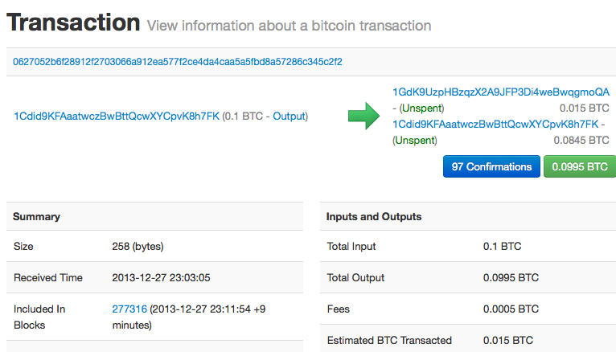

第2章  比特币是如何工作的
=======

##交易，区块，挖矿以及区块链

比特币系统不像传统银行系统和支付系统，是基于去中心化的信任的。与传统中央权威信任机构相反，比特币的信任是以一种自然属性的方式获得的，这种自然属性来源于比特币系统不同参与者间的交互。在本章中，我们将从较高的水平上在比特币系统中跟踪一笔交易，看它如何变为“被信任”，被比特币的分布式共识机制接受，最后被记录到所有交易的分布式账本中，也就是区块链上。

每个例子均基于在比特币网络上执行的一个真实交易，模拟了用户间（乔，爱丽丝，鲍勃），资金从一个钱包进入另一个钱包的一种交互过程。当在比特币网络和区块链中跟踪交易时，我们利用区块链浏览器网站来可视化的展现每个步骤。区块链浏览器是一个web应用，起到了比特币的搜索引擎的作用，利用它，可以搜索地址，交易，区块以及查看他们间的关系和流程。

流行的区块链浏览器包括：
* Blockchain info
* Bitcoin Block Explorer
* insight
* blockr Block Reader

其中的任何一个均有搜索功能，可以依据地址，交易哈希值，区块号码进行搜索，并且在网络和区块链中搜到的数据是一样的。在每个例子中，我们会提供一个URL，让你直接找到相应的入口，以便对细节进行进一步研究。

###比特币概览

在下述概览图（图2-1）中，我们可以看到，比特币系统由用户、交易和矿工组成。用户拥有钱包，钱包中包含了用户的密钥；交易在网络中传播；矿工通过竞争性计算来创建共识区块链，它是所有交易的权威账本。在本章中，我们将在较高的水平上跟踪一个交易在网络中的旅行并且检查由此引起的比特币系统不同部分的交互。接下来的章节中，我们将深入了解钱包、挖矿和商户系统后更多的技术细节。

*图2-1 比特币概览*

###购买一杯咖啡
爱丽丝，这位我们之前已经介绍过的主角，是一个新用户，她刚刚取得了她的第一笔比特币。在第9页的《获取你的第一笔比特币》中，爱丽丝遇到了她的朋友乔，并用现金跟他交换了一笔比特币。那笔由乔创建的交易往爱丽丝的钱包中存进了0.10的比特币（BTC）。现在爱丽丝将进行她的第一笔零售交易---在鲍勃位于加州帕洛阿尔托的咖啡店中购买一杯咖啡。鲍勃的咖啡店最近刚开始接受比特币支付，他在销售系统上添加了比特币的选项。咖啡店的价格是以当地货币（美元）标注的，但是在收银处，客户可以选择以美元或者比特币进行支付。销售系统将自动依据主流市场的汇率，将美元价格转换为比特币价格，并同时显示两种价格，销售终端还显示一个带有本笔支付请求的二维码到屏幕上：

	合计:
	$1.50 美元
	0.015 比特币

*图2-2 支付请求二维码（提示：扫扫看）*
	
	支付二维码按照BIP0021的要求，将以下URL进行编码：

    bitcoin:1GdK9UzpHBzqzX2A9JFP3Di4weBwqgmoQA?
	amount=0.015&
	label=Bob%27s%20Cafe&
	message=Purchase%20at%20Bob%27s%20Cafe

	URL的组成元素
	比特币地址：1GdK9UzpHBzqzX2A9JFP3Di4weBwqgmoQA
	支付金额：“0.015”
	接收人地址的标签："鲍勃咖啡店”
	支付描述：“在鲍勃咖啡店买东西”

不像一个只包含目标地址的地址二维码，支付请求二维码是一个二维码编码的URL，包含了目标地址，支付金额，一个通用描述，如“鲍勃咖啡店”。比特币钱包软件可以使用这些信息预填充用于发送支付指令的信息，同时也可以人工可读的方式显示给用户。你可以使用一个钱包软件扫描二维码，看看爱丽丝看到了什么。

鲍勃说：“共1.5美元或者15毫比特币。”

爱丽丝用她的智能手机在屏幕上扫了一下二维码，手机显示需要支付0.0150比特币给鲍勃咖啡店，她选择发送，授权了这笔支付交易。几秒钟后（与刷信用卡授权的时间差不多），鲍勃在收银机上看到了这笔交易，交易完成了。

在接下来的章节中，我们将更细节的去剖析这笔交易，看爱丽丝的钱包是如何构建这笔交易，如何将它广播到网络中，如何确认，最后鲍勃是怎么才能在后续交易中使用这笔钱的。

*比特币网络可以支持零钱交易，比如，从毫比特币（一个比特币的千分之一）一直到一个比特币一亿分之一（通常称为聪币）。在本书中，我们用比特币指代任何数量的比特币货币，从最小的单位（1聪币）到全部可被挖出的数量（2100万）。*

##比特币交易

简单的说，一个交易，就是告诉网络，某个拥有一定数量比特币的用户已经授权将这笔比特币转让给另一位用户。新的所有者可以通过另外一笔交易进行授权转让的方式来使用这些比特币，以此类推，形成一个所有者转换的链条。

交易就像复试账本的一笔笔记录，每个交易均包含一到多条“输入”--这是比特币账户的借方。另一方面，每笔交易也包含了一到多条“输出”--这是比特币账户的贷方。输入和输出（借和贷）加起来不要求相等，相反的，输出加起来的和应稍小于输入的和，这个差异代表了隐含的“交易费用”，这笔小额费用归将交易归集到账本的矿工所有。以复试账本表示的比特币交易如图2-3.

交易同样包括输入域中每笔代转让资金金额的所有权证明，这种证明以所有者数字签名的方式来表示，数字签名可以被任何人独立验证。在比特币的术语中，“消费”就是签署一笔交易，交易将所有者从前序交易中获取的价值权益转让给以比特币地址代表的新所有者。

交易将价值从交易输入移动到交易输出。一个交易输入是价值的来源，通常是上一笔交易的输出。交易输出将一笔与私钥关联的价值赋给一个新用户。目标密钥被称为产权证明。在未来的交易中，需要通过签名来获取这笔资金。交易的输出可以作为新交易的输入，这样价值不断从一个地址转移到另一个地址，形成了一条拥有者的链条（见图2-4）。

*图2-3 采用复式记账法表示的交易*

*图2-4 一个交易链，一个交易的输出作为下一笔交易的输入。*

爱丽丝支付给鲍勃咖啡的交易使用了上一笔交易的输出作为这笔交易的交易输入。在上一章中，爱丽丝从他们的朋友乔那边用现金换到了一笔比特币。那个交易的一笔资金被爱丽丝的密钥锁定。她是否给鲍勃咖啡的新交易引用上笔交易的输出作为本笔交易的输入，输出则包含两部分，一部分是支付开发费用，另一部分用于找零。交易形成了一个链条，输入就是最近的上笔交易的输出。爱丽丝的密钥提供的签名接受了前序交易的输出，这使得比特币网络可以确认她对这些资金的所有权。她在交易中附上鲍勃的地址，这样就限制了鲍勃必须使用签名解锁这个输出才能使用这笔资金。这个过程展示了价值在爱丽丝和鲍勃中转移的过程。这个从乔到爱丽丝在到鲍勃的交易链见图2-4。

###常见交易形式
最常见的交易就是从一个地址到另一个地址的支付，它通常还包含一定需要返还给初始所有者的零钱。这种类型的交易包含一个输入和两个输出，参见图2-5.

*图2-5 普通交易

另外一种常见交易形式是绑定几个输入，形成一个输出（见图2-6）。这是现实生活中将零钱换为大额钞票的场景。这种交易通常是钱包软件将交易中找回的一堆零钱换成一个大额以清理的情况。

*图2-6 资金归集交易*

最后，另外一个在比特币账本中常见的交易是将一个输入转换为多个代表不同接收者的输出（见图2-7）。这种类型的交易有时是商业实体用于分发资金，比如给员工发工资。

*图2-7 资金分发交易 *

##创建交易

爱丽丝的钱包软件拥有各种逻辑以选择合适的输入和输出以创建符合爱丽丝要求的交易。爱丽丝需要做的只是指定一个接收人和交易金额，剩下工作的钱包软件会自动完成而不需要让她看到细节。很重要的，钱包软件甚至在离线的情况下也可以创建交易。就像在家里写一张支票，然后将其装进信封寄给银行，交易不需要在连接到比特币网络的情况下进行创建和签名。它只需要最终将交易发送到网络已进行最后执行。

###获得正确的输入
爱丽丝的钱包软件必须首先找到能够支付给鲍勃的金额的输入。大部分钱包软件会保留一个“未使用的交易输出”的小数据库，它们由钱包所有者的私钥锁定。这样，爱丽丝的钱就包含有那笔她用现金跟乔交换比特币的交易输出的拷贝（参见第9页”获取你的第一笔比特币”）。一个运行在全索引模式客户端下的比特币钱包软件实际上区块链上包含交易的“未花费的输出”。这使得钱包软件不仅能快速构建交易输入，也能验证一个新来的交易的输入是有效的。但是，一个全索引客户端需要耗费非常多的存储空间，大部分用户钱包只是运行轻量客户端，只能跟踪用户自己的未花费的输出。

如果一个钱包应用没有维护完整的“未花费的输出”，它可以使用不同供应商提供的API接口向比特币网络询问这些信息，或者也可以使用JSON RPC接口向一个全索引节点询问相关信息。例2-1展示了一个RESTful API请求，它以HTTP GET命令的方式构造一个请求发往特定的URL地址。这个URL将根据请求中的地址信息返回所有“未花费的输出”信息，供任何需要使用这些信息构造交易输入的应用使用。我们在这里使用简单的命令行模式的HTTP客户端cURL来获取应答。

*例2-1 寻找爱丽丝比特币地址下所有未花费的输出*
	$curl https://blockchain.info/unspent?active=1Cdid9KFAaatwczBwBttQcwXYCpvK8h7FK

*例2-2 请求应答*

	{
	"unspent_outputs":[
			{
			"tx_hash":"186f9f998a5...2836dd734d2804fe65fa35779",
			"tx_index":104810202,
			"tx_output_n": 0,
			"script":"76a9147f9b1a7fb68d60c536c2fd8aeaa53a8f3cc025a888ac",
			"value": 10000000,
			"value_hex": "00989680",
			"confirmations":0
			}
		]
	}

例2-2的应答显示只有一个归属于爱丽丝的地址1Cdid9KFAaatwczBwBttQcw
XYCpvK8h7FK下的“未花费的输出”（尚未兑现的输出）。应答还包含了产生这笔输出的交易引用（乔发起的支付交易），它的以聪计算的价值，1000万聪，也就是0.10比特币。利用这些信息，爱丽丝的钱包应用可以构建一个交易向新的所有者地址发送价值了。

[参看乔到爱丽丝的交易](http://bit.ly/1tAeeGr)

就像你看到的，爱丽丝钱包中单一的未花费的输出已足够支付一杯咖啡的费用。如果这个条件不能满足，钱包软件就不得不去翻找所有小额未花费输出凑够这笔交易输入，就像从手提袋中翻找足够的硬币来凑够一杯咖啡的钱。在两种情况下，钱包软件都都可能需要在交易输出中找回一些零钱，我们将在下节讨论。

###创建输出

交易输出以一种脚本的形式锁定一个价值的所有权证明，它只能通过解决脚本问题来解除锁定。简单的说，爱丽丝的交易输出包含一个脚本，脚本大概意图是这样的：“这个输出将支付给那个能提供与鲍勃的公开地址匹配的签名的人”。由于只有鲍勃拥有与其地址对应的密钥，所以只有鲍勃的钱包可以提供这样一个签名来解锁这笔输出。爱丽丝就可以以要求提供签名的方式，锁定了一笔输出价值。

这笔交易还包含另一部分，因为爱丽丝的资金是以0.10比特币表示的一个输出，超过了一杯咖啡0.015比特币的数额。爱丽丝需要拿回0.085比特币的找零。爱丽丝的找零操作是由钱包在生成给鲍勃支付的交易时同时生成的。本质上看，爱丽丝的钱包将她的资金分成两笔支付，一笔给鲍勃，剩下的交还她自己。她可以在下一笔交易中使用这个找零输出。

最后，为了这笔交易尽快被网络执行，爱丽丝的钱包应用将添加一个小笔的交易费用。这个过程不是显式的，它隐含于交易输入输出的差值中。假如交易中找零金额不是填0.085，而是用0.0845作为交易第二个输出（找零输出），这样就有0.005比特币（半毫比特）的剩余。输入的0.10比特没有被两个输出完全花费完，因为它们加起来不到0.10。结构的差异就构成了交易费用，矿工们在将这笔交易加入到区块，并放入区块链账本的过程中会收集这些交易费用作为它们挖矿的补偿。

交易结果可以通过一种叫做区块链浏览器的web应用来查看，用普通浏览器访问：http://bit.ly/1tAeeGr ，结果如图2-8：

*图2-8 爱丽丝给鲍勃咖啡店付款的交易*

[通过web查看爱丽丝给鲍勃咖啡店付款的交易（http://bit.ly/1tAeeGr）](http://bit.ly/1u0FIGs)

###将交易添加到账本上
爱丽丝钱包应用创建的交易共258字节长，它包含所有必须的用于确认她的资金所有权以及资金接收者的信息。现在，交易必须发送到比特币网络上并使之成为分布式账本（区块链）的一部分。在接下来的一节中，我们将看到一个交易时如何变成新区快的一部分，以及区块是如何通过挖矿挖出。最后，我们还将看到这个新区快一旦被加入到区块链后，是如何随着区块的增加而变得越来越可信的。

####发送交易
因为交易已包含所有用于后续处理的信息，所以不要关心它是如何或者从哪里传入比特币网络的。比特币网络是一个点对点的网络，每个比特币客户端通过连接到不同的客户端成为网络的参与者。比特币网络的目标就是把交易和区块广播给所有的参与者。

####如何广播

爱丽丝的钱包应用可以将新交易发送到所有通过互联网与它相连的客户端：不管是有线、WiFi，移动网络均可。她的比特币钱包不一定非要与鲍勃的钱包直接相连，她也不必非要使用咖啡店提供的互联网接入，虽然这两种方式也没什么不可以。任何比特币网络节点（其他客户端）接收到有效的，它尚未见过的的交易时将立马将其转发给与它相连的其他客户端。这样，交易就很快在这个点对点网络中广播，在短短几秒内即可到达大部分节点。

####鲍勃的视角

如果鲍勃的钱包软件与爱丽丝的直接相连，鲍勃的钱包软件将是第一个接收到交易的节点。不过，即使爱丽丝的钱包通过别的节点发送，交易也会在短短几秒内到达鲍勃的钱包。鲍勃的钱包会立即将爱丽丝的交易识别为一笔支付交易，因为交易含有需要鲍勃的密钥进行解锁的输出。鲍勃的钱包软件也能独立确认这笔交易是有效封装的，使用了之前未消费的输出，并且附带足够的交易费用能得以被下个区块包含。基于此，鲍勃可以基本确认，这个交易会很快被确认并添加到区块中，被骗的风险很小。

一个常见的关于比特币交易的认识误区是交易必须等待10分钟被新区块包含，或者等待一小时等待全部6个确认。虽然确认可以确保交易被全网接受，但是这种延迟对于小额支付，比如一杯咖啡，其实是没有必要的。商户对这种小额交易可以直接接受，其风险不会比一笔没有身份信息或签名的信用卡交易更大，所以，现在商户一般都接受这种方式。

##比特币挖矿

交易现在被广播到了网络中，在没有被确认并通过挖矿包含到区块前，它还没有成为共享账本（区块链）的一部分。请参看第8章获得详细的解释。

比特币系统的信任机制是基于计算的。交易被绑定到区块中需要巨大的计算量来证明，但是验证这个证明只要很少的计算。挖矿过程为两个目的服务：

* 挖矿会在每个新区块中造出新的比特币，就像中央银行印制新币。每个区块造出的新比特币是固定的，随着时间推移，这个数量会逐渐减少。
* 挖矿创造信任，需要确保只有足够运力投入到包含这些交易的区块后交易才能被确认。更多的区块被挖出意味着更多的计算，也意味着更多的信任。

挖矿的过程就像一个巨大的竞争性数字拼图游戏，当有人找到一个解决方案时，游戏就进行重置，而游戏的难度也自动进行调整，使得每找一个解决方案的时间大致维持在10分钟左右。想象一个巨大的数字拼图游戏，拥有几千行几千列的尺寸。如果给你看已经填充好的拼图，你可以很快的验证有没有错误。但是，如果只填了一部分，剩下的都是空白的，那就需要花费大量的时间才能解决。数独游戏的难度可以通过调整尺寸（增减行列数）来调节，但是不管尺寸大小，其确认过程都很简单。比特币中用的“拼图”是建立在密码学哈希算法之上的，它展现了与拼图类似的特性：它也是不对称的，很难解决却很容易确认，而且它的难度也可以调整。

在第4页的《比特币使用，用户和他们的故事》中，我们介绍过景，一个上海的计算机工程学生。景是作为一个矿工参与到比特币网络中的。在每个10分钟左右的时间里，景会与成千上万的矿工一起加入到全球查找区块解决方案的竞赛中。为了找到一个解决方案（称之为工作量证明），全网每秒要进行几亿亿次的哈希计算。工作量证明算法涉及使用SHA256加密算法不断的对区块头和一个随机数进行哈希计算，直到找到一个与预定义的模式匹配的方案。第一个找到这个解决方案的矿工将赢得这一回合的竞争，随即将这个区块发布到区块链当中。

景从2010年开始挖矿，他使用了一台非常快的电脑来查找新区块的合适的工作流证明。随着越来越多的矿工加入到比特币网络中，挖矿的难度增加的非常快。很快的，景和其他矿工升级了他们的装备，新装备采用了专用的硬件，比如高端专用图形处理单元（GPU），就像那些在游戏电脑或终端中使用的。截止到写这本书的时候，难度已经非常高，为了保证挖矿有利可图，只有用特定用途集成电路芯片（application-specific integrated circuits， ASIC），几百个挖矿算法被集成到硬件中，在一个芯片上并发执行。景加入了一个“矿池”，就像彩票池，允许几个参与者参与其中，共同工作并分享收益。景现在使用两个USB连接的ASIC机器每天24小时挖矿，他通过出售挖矿获得的比特币来支付购买硬件的费用，同时从收益中获取一定收入。他的电脑运行着一个bitcond，比特币客户端的参考实现，作为他的挖矿软件的后端。

##交易区块挖矿

一个在网络上传递的交易直到成为全局分布式账本（区块链）的一部分才真正得到确认。平均每隔10分钟，矿工会创建一个包含上个区块以来产生的所有交易的区块。新交易不停的从用户钱包或者其他应用中流入网络。当这些交易被其他节点捕获时，就会被加入一个各自维护的临时未确认交易池中。矿工创建新区块时，他们将未确认交易池的交易取出，并入新建区块，然后尝试解决一个极为困难的问题（工作量证明）来证明这个区块的有效性。挖矿的过程我们将在173页《介绍》中详细说明。

交易根据费用最高优先及其他一些规则被顺序加入到新区块中。当矿工从网络中接收到上一个区块时，他也意识到已经在上一轮竞争中失败了，所以立即开始新区块的挖矿过程。他立即创建一个新的区块，填上交易以及上个区块的指纹，然后开始计算这个区块的工作量证明。矿工还会在区块中包含一个特殊的交易，这个交易向他自己的比特币地址发送一个新创建的比特币作为奖励（译者：作者写书时为25比特币，现在是12.5比特币）。如果他找到一个解决使得区块有效，他即赢得了这个奖励，因为他的成功挖出的区块已经被加入到全局区块链中，他加入的奖励交易变得可用。景，他加入了一个矿池，他把挖矿软件的新区块奖励地址设置为矿池的地址。在矿池中，一旦在上一轮挖矿竞争中胜出，它将把上一轮的奖励按照每个矿工的工作量分给参与的所有矿工。

爱丽丝的交易被网络提取并放进未确认交易池。因为交易包含了足够的费用，它会被放进景所在矿池的新建区块当中。交易从爱丽丝的钱包提交后大概5分钟，景的ASIC矿机找到了这个区块的解决方案并且将新区块发布到比特币网络中，在网络中，其他矿工队其进行验证并开始新一轮的挖矿竞争以生成下一个区块。

你可以看到包含了爱丽丝的交易的区块。【添加url】

几分钟后，一个新的区块，#277317，又被别的矿工挖出。由于这个新区块是基于上一个包含了爱丽丝交易的区块 (#277316)，它在原有区块之上进行了更多的计算，这样，进一步强化了对那些交易的信任。包含爱丽丝交易的区块被认为是对该笔交易的一个确认。每个在在包含交易的区块之上的区块是对交易的额外确认。由于新区块一个个的叠加在原有区块之上，这使得推翻原有交易的难度呈指数级增长，这样就保证交易越来越被网络信任。

在图2-9中，我们可以看到包含爱丽丝交易的区块#277316。在它之下有277316个区块（包括区块#0），互相连接形成一个区块的链表（区块链）直到区块#0---称之为创世区块。随着时间的过去，区块的高度不断增长，每个区块的计算难度也不断增加。由于在越来越长的区块链表中，计算越来越多，这些在包含爱丽丝交易的区块之后挖出的区块成了该笔交易的额外保证。按照惯例，任何经过6次确认后的区块被认为是不可撤销的，因为要使交易无效，并重新计算6个区块需要极大的计算量。我们将在第8章审查挖矿的过程以及它创建信任的机制。

*图2-9 爱丽丝的交易包含在区块#277316中

##花费交易

现在爱丽丝的交易已经作为区块的一部分嵌入到区块链中，成了比特币分布式账本的一部分，并且对所有比特币应用可见。每个比特币客户端可以独立校验交易是有效的，可花费的。全索引客户端可以从创建比特币的时刻起跟踪一笔资金的流转过程，直到他们到达鲍勃的地址。轻量级客户端只能确认交易是否在区块链中，有几个区块在它之后被挖出，以提供网络已确认它的有效性并接受它的保证，这个操作被称之为简化支付验证（参看第147页《简化支付验证节点（SPV）》

鲍勃现在可以创建他自己的交易，通过引用这笔及其他笔交易的输出作为新交易的输入，将资金转移给新的所有者。举个例子，鲍勃可以将从爱丽丝那获得的咖啡的钱用来支付一个合同或者供应商。比较可能的情况，鲍勃的区块链软件需要聚合多个小的支付收入并入到一个大的支付中，有可能是将一天的比特币收入整合到一个交易中，这将把不同的支付结果并到咖啡店的通用入账账户。参看图2-6了解整合交易。

当鲍勃将从爱丽丝及其他客户收到的款项花费出去的时候，他扩展了交易链条，结果是，新的交易加入到全局区块链账本，所有人都能看到和信任。我们可以假设鲍勃向他的网站设计师，班加罗尔的高佩什支付新网页的费用。现在交易链条看起来像图2-10这样。

*图2-10 爱丽丝的交易成为从乔到高配什的交易链条的一部分*

