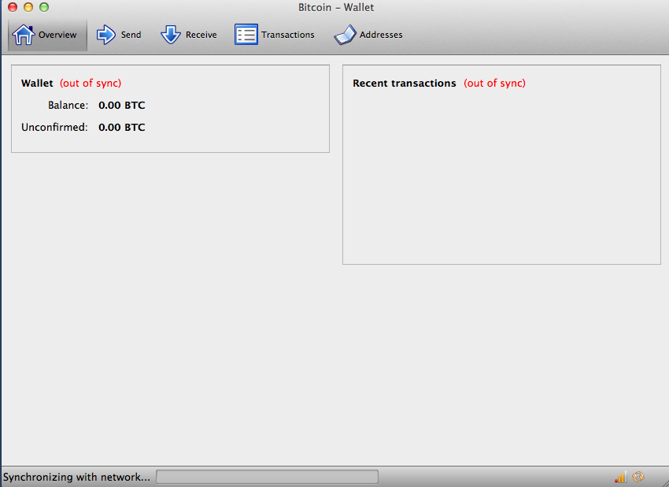

第三章 比特币客户端
======

# 比特币核心：参考实现

你可以从[http://bitcoin.org](http://bitcoin.org "bitcoin.org")下载比特币的参考客户端*比特币核心*，也叫“中本聪客户端”。这个参考客户端实现了比特币系统的所有功能，包括钱包，一个交易验证引擎（用于对全部交易账本，即区块链的全量副本进行交易验证），以及一个用于接入点对点比特币网络的完全网络节点。

在[bitcoin.org](http://bitcoin.org)网站的“选择钱包”页面，点击“比特币核心（Bitcoin Core）”下载参考客户端。基于你的操作系统，你可以下载到不同的安装包可执行文件。对于Windows系统，有zip压缩包和.exe可执行程序可供下载。对于MacOS，则是一个.dmg磁盘映像。对于Linux版本，包括Ubuntu系统的PPA包，或者tar.gz档案。[bitcoin.org](http://bitcoin.org)网页中列出的建议客户端见**图3-1**。

 *图3-1 从bitcoin.org选择下载合适的比特币客户端* 

 *注：所选截图为当前最新客户端列表* 

## 首次运行比特币核心

如果你已经下载了安装包，比如.exe，.dmg或者PPA，你可以像安装其他任何软件一样，在你的操作系统上安装比特币核心。对于Windows，运行.exe，并根据提示一步步进行安装。对于MacOS，先运行.dmg，完成后将Bitcoin-QT图标拉到应用程序文件夹即可。对于Ubuntu，在文件浏览器中双击PPA，系统将会打开软件包管理器进行软件包的安装。一旦安装完成，你将在应用列表中看到一个新的叫做Bitcoin-Qt的软件。双击图标可以启动比特币客户端。

首次运行比特币核心，它将开始下载区块链，这个过程可能需要持续几天（参看**图3-2**）。让它在后台运行，直到显示“同步完成”，并且余额旁不再显示“未同步”。

 *图3-2 比特币核心在区块链初始化时的屏幕显示* 

比特币核心本地保存一份交易账本（区块链）的全量副本，包含了自2009年比特币创立以来在比特币网络上发生过的所有交易。数据集大小约有几十G字节（在2013年末大概是16GB），它会以增量的形式，在几天内逐步下载完成。在区块链数据集下载完成之前，客户端都没法执行交易或者更新账户余额。这段时间内，客户端会在账户余额边上显示“未同步”，下方状态栏则会显示“正在同步”。为了完成初始化同步，请确保你有充足的硬盘空间、网络带宽和足够的时间。

## 从源代码编译比特币核心
对于开发者来说，也可以选择下载全量的源码（ZIP压缩包）或者从GitHub的官方源码库中克隆代码。在Github的bitcoin页面，从边栏选择下载ZIP包。或者，使用git命令行创建一个本地代码库，并从github下载副本。在下面的例子中，我们使用类Unix系统（linux，MacOS等）的命令行从github上克隆代码。

	$ git clone https://github.com/bitcoin/bitcoin.git
	Cloning into 'bitcoin'...
	remote: Counting objects: 31864, done.
	remote: Compressing objects: 100% (12007/12007), done.
	remote: Total 31864 (delta 24480), reused 26530 (delta 19621)
	Receiving objects: 100% (31864/31864), 18.47 MiB | 119 KiB/s, done.
	Resolving deltas: 100% (24480/24480), done.
	$

终端上的提示和输出结果可能会因为版本不同而有所不同。只要按照代码中所带的文档执行，即使实际输出结果与例子中显示的有轻微差异，也是正常的。

当git克隆操作完成后，在bitcoin目录中就拥有了一份代码库的完整副本。在提示符下键入命令“cd bitcoin",进入该目录：

	$ cd bitcoin

不加参数的情况下，检出的本地副本与最新代码保持同步，这可能是比特币的一个不稳定版或beta版。因此在编译代码前，应通过加版本标签的形式来检出某个特定版本。这将让本地副本与版本库上某个特定版本的快照进行同步。这些版本标签是利用tag关键词进行标记的，它是开发者使用版本号对特定代码版本进行标记的一种技术。首先，为了找出所有可用标签，我们使用*git tag*命令：

	$ git tag
	v0.1.5
	v0.1.6test1
	v0.2.0
	v0.2.10
	v0.2.11
	v0.2.12
	[... many more tags ...]
	v0.8.4rc2
	v0.8.5
	v0.8.6
	v0.8.6rc1
	v0.9.0rc1

这个标签列表列出了所有比特币的发行版本。按照惯例，*release candidates（候选发行版）*用于测试目的，带有“rc”后缀。稳定发行版则没有后缀，可以在生产系统上运行。从上述列表中，选择最高版本号的发行版，在写本书时，这个版本是v0.9.0rc1。为了让本地代码与这个版本同步，使用*git checkout*命令：

	$ git checkout v0.9.0rc1
	Note: checking out 'v0.9.0rc1'.
	HEAD is now at 15ec451... Merge pull request #3605
	$

源码中包含了文档，可以在几个文件中找到。键入*more README.md*, 查阅在bitcoin目录中的README.md主文档，根据提示，使用空格键来引导文档翻到下页。在本章中，我们将构建命令行比特币客户端，在linux上又名bitcoind。键入*more doc/build-unix.md*可以查阅在你的平台上编译bitcoind命令行客户端的指南。其他平台，如Mac OS X或者Windows的编译指南也可以在doc目录下找到，相应的文件为build-osx.md或者build-msw.md。

仔细研究构建的前置条件，在构建文档的前面部分有描述。这是一些必须在编译bitcoind之前已经在系统安装好的库文件。如果前置条件缺失，构建过程会失败，并显示错误信息。如果编译过程发现缺少了某些必须的库文件，你可以在安装好这些库文件后，重新执行编译程序，它将从刚才中断的地方开始继续进构建。假设所有前置要求都已经满足，你可以开始利用*autogen.sh*生成一系列构建脚本，开始构建过程。

比特币核心构建过程从0.9版开始变为采用autogen/configure/make系统。早期版本采用一个简单的Makefile文件，工作过程与下述例子有些微区别。请按照选定版本的操作指南来操作。0.9版引入的autogen/configure/make构建系统很可能成为所有后续版本的构建方法，也是下面例子演示的构建系统。

	$ ./autogen.sh
	configure.ac:12: installing `src/build-aux/config.guess'
	configure.ac:12: installing `src/build-aux/config.sub'
	configure.ac:37: installing `src/build-aux/install-sh'
	configure.ac:37: installing `src/build-aux/missing'
	src/Makefile.am: installing `src/build-aux/depcomp'
	$

*autogen.sh*脚本将创建一套自动化配置脚本，这些脚本通过检查你的系统以发现正确的设置，并确保你已经安装了编译代码所需的所有库文件。这些脚本里面最重要的是configure脚本，它提供了一系列不同选项，帮助你定制构建过程。输入*./configure --help*，可以查看所有选项：

	$ ./configure --help
	
	`configure' configures Bitcoin Core 0.9.0 to adapt to many kinds of systems.
	
	Usage: ./configure [OPTION]... [VAR=VALUE]...
	
	To assign environment variables (e.g., CC, CFLAGS...), specify them as
	VAR=VALUE.  See below for descriptions of some of the useful variables.
	
	Defaults for the options are specified in brackets.
	
	Configuration:
	  -h, --help              display this help and exit
	      --help=short        display options specific to this package
	      --help=recursive    display the short help of all the included packages
	  -V, --version           display version information and exit
	
	[... many more options and variables are displayed below ...]
	
	Optional Features:
	  --disable-option-checking  ignore unrecognized --enable/--with options
	  --disable-FEATURE       do not include FEATURE (same as --enable-FEATURE=no)
	  --enable-FEATURE[=ARG]  include FEATURE [ARG=yes]
	
	[... more options ...]
	
	Use these variables to override the choices made by `configure' or to help
	it to find libraries and programs with nonstandard names/locations.
	
	Report bugs to <info@bitcoin.org>.
	
	$

configure脚本允许你通过--enable-FEATURE或--disable-FEATURE选项，来启用或禁用bitcoind某些功能。其中的FEATURE由具体功能名称代替，功能名称在上面的帮助信息中已经列出。在本章中，我们将构建的bitcoind客户端打开所有默认功能。我们不配置任何选项，但你最好还是好好研读一下帮助信息，了解客户端包含了哪些可选功能。接下来，运行configure脚本来自动发现所有必要的库，并为系统创建一个定制的构建脚本：

	$ ./configure
	checking build system type... x86_64-unknown-linux-gnu
	checking host system type... x86_64-unknown-linux-gnu
	checking for a BSD-compatible install... /usr/bin/install -c
	checking whether build environment is sane... yes
	checking for a thread-safe mkdir -p... /bin/mkdir -p
	checking for gawk... no
	checking for mawk... mawk
	checking whether make sets $(MAKE)... yes
	[... many more system features are tested ...]
	configure: creating ./config.status
	config.status: creating Makefile
	config.status: creating src/Makefile
	config.status: creating src/test/Makefile
	config.status: creating src/qt/Makefile
	config.status: creating src/qt/test/Makefile
	config.status: creating share/setup.nsi
	config.status: creating share/qt/Info.plist
	config.status: creating qa/pull-tester/run-bitcoind-for-test.sh
	config.status: creating qa/pull-tester/build-tests.sh
	config.status: creating src/bitcoin-config.h
	config.status: executing depfiles commands
	$

如果一切顺利，configure命令将成功完成定制化构建脚本的创建，这个脚本允许我们编译bitcoind。如果有缺失的库或者其他错误，configure命令将终止创建构建脚本，并输出错误。如果发生错误，很可能是因为缺失库或者库不兼容。再次查阅构建文档，确保已安装了所有先决要求。然后重新运行configure看看是否已修复了错误。接下来，你将编译源代码，这个过程可能会持续一个钟头。在编译的过程中，每隔几秒或几分钟就会输出一些信息，如果有什么问题，错误信息也会显示出来。编译如果被中断，你也可以随时恢复编译过程。键入*make*开始编译吧：

	$ make
	Making all in src
	make[1]: Entering directory `/home/ubuntu/bitcoin/src'
	make all-recursive
	make[2]: Entering directory `/home/ubuntu/bitcoin/src'
	Making all in .
	make[3]: Entering directory `/home/ubuntu/bitcoin/src'
		CXX addrman.o
		CXX alert.o
		CXX rpcserver.o
		CXX bloom.o
		CXX chainparams.o
	[... many more compilation messages follow ...]
		CXX test_bitcoin-wallet_tests.o
		CXX test_bitcoin-rpc_wallet_tests.o
		CXXLD test_bitcoin
	make[4]: Leaving directory `/home/ubuntu/bitcoin/src/test'
	make[3]: Leaving directory `/home/ubuntu/bitcoin/src/test'
	make[2]: Leaving directory `/home/ubuntu/bitcoin/src'
	make[1]: Leaving directory `/home/ubuntu/bitcoin/src'
	make[1]: Entering directory `/home/ubuntu/bitcoin'
	make[1]: Nothing to be done for `all-am'.
	make[1]: Leaving directory `/home/ubuntu/bitcoin'
	$

顺利的话，bitcoind就编译好了。最后的步骤是将bitcoind安装到系统路径中，仍然使用*make*命令：

	$ sudo make install
	Making install in src
	Making install in .
	 /bin/mkdir -p '/usr/local/bin'
	  /usr/bin/install -c bitcoind bitcoin-cli '/usr/local/bin'
	Making install in test
	make  install-am
	 /bin/mkdir -p '/usr/local/bin'
	  /usr/bin/install -c test_bitcoin '/usr/local/bin'
	$

你可以通过查看系统中以下两个可执行程序的位置来确认bitcoind是否已经正确安装：

	$ which bitcoind
	/usr/local/bin/bitcoind

	$ which bitcoin-cli
	/usr/local/bin/bitcoin-cli

默认安装时，bitcoind会被安装到*/usr/local/bin*目录下。当你第一次运行bitcoind时，它会提醒你创建一个配置文件，这个配置文件包含访问JSON-RPC接口的高强度密码。键入*bitcoind*在终端上运行bitcoind：

	$ bitcoind
	Error: To use the "-server" option, you must set a rpcpassword in the configuration file:
	/home/ubuntu/.bitcoin/bitcoin.conf
	It is recommended you use the following random password:
	rpcuser=bitcoinrpc
	rpcpassword=2XA4DuKNCbtZXsBQRRNDEwEY2nM6M4H9Tx5dFjoAVVbK
	(you do not need to remember this password)
	The username and password MUST NOT be the same.
	If the file does not exist, create it with owner-readable-only file permissions.
	It is also recommended to set alertnotify so you are notified of problems;
	for example: alertnotify=echo %s | mail -s "Bitcoin Alert" admin@foo.com

在你喜欢的编辑器中编辑配置文件，设置参数，将密码替换为一个bitcoind建议的高强度密码。**不要**使用范例中使用的密码。在*.bitcoin*目录下创建一个命名为*.bitcoind/bitcoin.conf*的配置文件，输入用户名和密码：

	rpcuser=bitcoinrpc
	rpcpassword=2XA4DuKNCbtZXsBQRRNDEwEY2nM6M4H9Tx5dFjoAVVbK

当你编辑这个配置文件时，你可能还希望设置其他几个选项，比如*txindex*（参见第47页《交易数据库索引和txindex选项）。若需要查看所有可用选项，请键入*bitcoind --help*。

现在，运行比特币核心客户端。第一次运行时，它会通过下载所有区块来重建比特币区块链。这是一个好几G的大文件，平均需要花费两天才能全量下载完成。你可以利用BitTorrent客户端从SourceForge下载部分区块链副本来缩短区块链初始化时间。

通过*-daemon*选项可以在后台运行bitcoind:

	$ bitcoind -daemon
	Bitcoin version v0.9.0rc1-beta (2014-01-31 09:30:15 +0100)
	Using OpenSSL version OpenSSL 1.0.1c 10 May 2012
	Default data directory /home/bitcoin/.bitcoin
	Using data directory /bitcoin/
	Using at most 4 connections (1024 file descriptors available)
	init message: Verifying wallet...
	dbenv.open LogDir=/bitcoin/database ErrorFile=/bitcoin/db.log
	Bound to [::]:8333
	Bound to 0.0.0.0:8333
	init message: Loading block index...
	Opening LevelDB in /bitcoin/blocks/index
	Opened LevelDB successfully
	Opening LevelDB in /bitcoin/chainstate
	Opened LevelDB successfully
	[... more startup messages ...]

# 通过命令行调用比特币核心的JSON-RPC接口

比特币核心客户端实现了一个可供命令行助手*bitcoin-cli*调用的JSON-RPC接口。这使我们可以实验那些通常由程序通过API调用的功能。开始前，我们先调用help命令来看一下全部可用的RPC命令列表：

	$ bitcoin-cli help
	addmultisigaddress nrequired ["key",...] ( "account" )
	addnode "node" "add|remove|onetry"
	backupwallet "destination"
	createmultisig nrequired ["key",...]
	createrawtransaction [{"txid":"id","vout":n},...] {"address":amount,...}
	decoderawtransaction "hexstring"
	decodescript "hex"
	dumpprivkey "bitcoinaddress"
	dumpwallet "filename"
	getaccount "bitcoinaddress"
	getaccountaddress "account"
	getaddednodeinfo dns ( "node" )
	getaddressesbyaccount "account"
	getbalance ( "account" minconf )
	getbestblockhash
	getblock "hash" ( verbose )
	getblockchaininfo
	getblockcount
	getblockhash index
	getblocktemplate ( "jsonrequestobject" )
	getconnectioncount
	getdifficulty
	getgenerate
	gethashespersec
	getinfo
	getmininginfo
	getnettotals
	getnetworkhashps ( blocks height )
	getnetworkinfo
	getnewaddress ( "account" )
	getpeerinfo
	getrawchangeaddress
	getrawmempool ( verbose )
	getrawtransaction "txid" ( verbose )
	getreceivedbyaccount "account" ( minconf )
	getreceivedbyaddress "bitcoinaddress" ( minconf )
	gettransaction "txid"
	gettxout "txid" n ( includemempool )
	gettxoutsetinfo
	getunconfirmedbalance
	getwalletinfo
	getwork ( "data" )
	help ( "command" )
	importprivkey "bitcoinprivkey" ( "label" rescan )
	importwallet "filename"
	keypoolrefill ( newsize )
	listaccounts ( minconf )
	listaddressgroupings
	listlockunspent
	listreceivedbyaccount ( minconf includeempty )
	listreceivedbyaddress ( minconf includeempty )
	listsinceblock ( "blockhash" target-confirmations )
	listtransactions ( "account" count from )
	listunspent ( minconf maxconf ["address",...] )
	lockunspent unlock [{"txid":"txid","vout":n},...]
	move "fromaccount" "toaccount" amount ( minconf "comment" )
	Using Bitcoin Core’s
	ping
	sendfrom "fromaccount" "tobitcoinaddress" amount ( minconf "comment" "commentto" )
	sendmany "fromaccount" {"address":amount,...} ( minconf "comment" )
	sendrawtransaction "hexstring" ( allowhighfees )
	sendtoaddress "bitcoinaddress" amount ( "comment" "comment-to" )
	setaccount "bitcoinaddress" "account"
	setgenerate generate ( genproclimit )
	settxfee amount
	signmessage "bitcoinaddress" "message"
	signrawtransaction "hexstring" ( [{"txid":"id","vout":n,"scriptPubKey":"hex","redeemScript":"hex"},...] ["privatekey1",...] sighashtype )
	stop
	submitblock "hexdata" ( "jsonparametersobject" )
	validateaddress "bitcoinaddress"
	verifychain ( checklevel numblocks )
	verifymessage "bitcoinaddress" "signature" "message"
	walletlock
	walletpassphrase "passphrase" timeout
	walletpassphrasechange "oldpassphrase" "newpassphrase"

## 从比特币核心客户端的状态中获取消息

命令：*getinfo*

比特币的*getinfo* RPC命令显示比特币网络节点、钱包、区块链数据库状态的基础信息，运行*bitcoin-cli getinfo*：

	$ bitcoin-cli getinfo
	{
		"version" : 90000,
		"protocolversion" : 70002,
		"walletversion" : 60000,
		"balance" : 0.00000000,
		"blocks" : 286216,
		"timeoffset" : -72,
		"connections" : 4,
		"proxy" : "",
		"difficulty" : 2621404453.06461525,
		"testnet" : false,
		"keypoololdest" : 1374553827,
		"keypoolsize" : 101,
		"paytxfee" : 0.00000000,
		"errors" : ""
	}

数据以JavaScript对象符号（JSON）格式返回，这种格式不仅可以轻易被编程语言“消费”，也便于人工阅读。在数据中，我们可以看到比特币客户端的版本号（90000），协议版本号（70002），钱包版本号（60000）。也能看到钱包的余额，当前为0。还能看到区块高度，告诉我们客户端总共看到了多少区块（当前286,216）。另外，返回信息中还包含各种比特币网络相关的统计数据以及当前客户端相关的设置信息。我们将在本章剩余部分更详细的了解这些设置。

这将需要一些时间，也许超过一天，等待bitcoind客户端从其他比特币客户端下载区块，以“追赶上”当前的区块链高度。你可以通过getinfo查看已知的区块来检查同步进度。

## 钱包设置和加密

命令：*encryptwallet, walletpassphrase*

在开始创建密钥和其他命令前，你需要首先利用密码来给钱包加密。在这个例子中，我们使用*encryptwallet*命令和密码“foo”，显然用更加强壮和复杂的密码替代“foo”是必须的！

	$ bitcoin-cli encryptwallet foo
	wallet encrypted; Bitcoin server stopping, restart to run with encrypted wallet. The keypool has been flushed, you need to make a new backup.
	$

你可以重新运行*getinfo*来检查钱包是否已经加密。这次，你会注意到有个新的条目叫*unlocked_until*。这是一个计数器，显示钱包解密密码在内存中存储，保持钱包解锁状态的时间。最初，计数器会被设为0，代表钱包是被锁定的：

	$ bitcoin-cli getinfo
	{
		"version" : 90000,
	#[... other information...]
		"unlocked_until" : 0,
		"errors" : ""
	}
	$

为了解锁钱包，发出*walletpassphrase*命令，它包含两个参数--密码、直到钱包重新锁定的超时秒数（时间计数器）：

	$ bitcoin-cli walletpassphrase foo 360
	$

你可以重新运行*getinfo*确认钱包是否已解锁以及超时时间：

	$ bitcoin-cli getinfo
	{
		"version" : 90000,
	#[... other information ...]
		"unlocked_until" : 1392580909,
		"errors" : ""
	}

## 钱包备份，明文导出，恢复

命令：*backupwallet, importwallet, dumpwallet*

接下来，我们练习创建钱包备份文件，然后从备份文件中恢复钱包。使用*backupwallet*命令来备份，提供文件名作为命令的参数。这里，我们将钱包备份到文件*wallet.backup*中：

	$ bitcoin-cli backupwallet wallet.backup
	$

现在，利用*importwallet*从备份文件中恢复钱包。如果钱包是锁定状态的，你需要先进行解锁（在上节可以查看*walletpassphrase*命令用法）。

	$ bitcoin-cli importwallet wallet.backup
	$

*dumpwallet*命令用于将钱包导出到人类可读的文本文件：

	$ bitcoin-cli dumpwallet wallet.txt
	$ more wallet.txt
	# Wallet dump created by Bitcoin v0.9.0rc1-beta (2014-01-31 09:30:15 +0100)
	# * Created on 2014-02- 8dT20:34:55Z
	# * Best block at time of backup was 286234 (0000000000000000f74f0bc9d3c186267bc45c7b91c49a0386538ac24c0d3a44),
	#   mined on 2014-02- 8dT20:24:01Z
	
	KzTg2wn6Z8s7ai5NA9MVX4vstHRsqP26QKJCzLg4JvFrp6mMaGB9 2013-07- 4dT04:30:27Z change=1 # addr=16pJ6XkwSQv5ma5FSXMRPaXEYrENCEg47F
	Kz3dVz7R6mUpXzdZy4gJEVZxXJwA15f198eVui4CUivXotzLBDKY 2013-07- 4dT04:30:27Z change=1 # addr=17oJds8kaN8LP8kuAkWTco6ZM7BGXFC3gk
	[... many more keys ...]
	
	$

## 钱包地址和接收交易

命令：*getnewaddress, getreceivedbyaddress, listtransactions, getaddressesbyaccount, getbalance*

比特币参考客户端维护着一个地址池，地址池的大小在命令*getinfo*的输出项*keypoolsize*中展示。这些地址是自动生成，可用于公开接收地址或者找零地址。使用*getnewaddress*命令，可以生成一个新地址：

	$ bitcoin-cli getnewaddress
	1hvzSofGwT8cjb8JU7nBsCSfEVQX5u9CL

现在，我们可以从外部钱包（假设你在交易所、网络钱包或者在其他地方运行的bitcoind钱包中已经拥有一些比特币），通过这个地址发送一笔小额的比特币到我们的bitcoind钱包。在这个例子中，我们将发送50毫比特（0.050比特币）到这个地址。

我们可以询问bitcoind客户端此地址已经接收到的比特币金额，查询时，需要指定确认次数，即多少次确认一笔资金才计入余额中，在这里，我们指定0次确认。从另一个钱包发送比特币几秒后，我们就可以看到，交易已经在钱包的余额中体现出来了。现在，我们使用*getreceivedbyaddress*命令并结合地址以及0确认次数来查看：

	$ bitcoin-cli getreceivedbyaddress 1hvzSofGwT8cjb8JU7nBsCSfEVQX5u9CL 0
	0.050000

如果省略掉命令最后一个0，我们将只能看到经过至少*minconf*次确认的金额，*minconf*是最少确认次数的设置值，未达到这个确认次数，交易不会计入余额。*minconf*的值是在bitcoind配置文件中设置的。因为发送这个比特币的交易仅仅发生在几秒前，它尚未被确认，所以我们看到它只列出了一个0余额：

	$ bitcoin-cli getreceivedbyaddress 1hvzSofGwT8cjb8JU7nBsCSfEVQX5u9CL
	0.00000000

钱包接收到的所有交易也可以利用*listtransactions*命令列出来：

	$ bitcoin-cli listtransactions
	[
	    {
	        "account" : "",
	        "address" : "1hvzSofGwT8cjb8JU7nBsCSfEVQX5u9CL",
	        "category" : "receive",
	        "amount" : 0.05000000,
	        "confirmations" : 0,
	        "txid" : "9ca8f969bd3ef5ec2a8685660fdbf7a8bd365524c2e1fc66c309acbae2c14ae3",
	        "time" : 1392660908,
	        "timereceived" : 1392660908
	    }
	]

我们还可以利用*getaddressesbyaccount*命令列出钱包中的所有地址：

	$ bitcoin-cli getaddressesbyaccount ""
	[
	    "1LQoTPYy1TyERbNV4zZbhEmgyfAipC6eqL",
	    "17vrg8uwMQUibkvS2ECRX4zpcVJ78iFaZS",
	    "1FvRHWhHBBZA8cGRRsGiAeqEzUmjJkJQWR",
	    "1NVJK3JsL41BF1KyxrUyJW5XHjunjfp2jz",
	    "14MZqqzCxjc99M5ipsQSRfieT7qPZcM7Df",
	    "1BhrGvtKFjTAhGdPGbrEwP3xvFjkJBuFCa",
	    "15nem8CX91XtQE8B1Hdv97jE8X44H3DQMT",
	    "1Q3q6taTsUiv3mMemEuQQJ9sGLEGaSjo81",
	    "1HoSiTg8sb16oE6SrmazQEwcGEv8obv9ns",
	    "13fE8BGhBvnoy68yZKuWJ2hheYKovSDjqM",
	    "1hvzSofGwT8cjb8JU7nBsCSfEVQX5u9CL",
	    "1KHUmVfCJteJ21LmRXHSpPoe23rXKifAb2",
	    "1LqJZz1D9yHxG4cLkdujnqG5jNNGmPeAMD"
	]

最后，命令*getbalance*可以显示钱包的全部余额，它将合并所有经过至少*minconf*次确认的交易的金额。

	$ bitcoin-cli getbalance
	0.05000000

如果交易尚未确认，getbalance命令返回的余额是0。“*minconf*”选项决定了需要经过几次确认，交易金额才会体现到余额上。

## 探索及解码交易

命令：*gettransaction、getrawtransaction、decoderawtransaction*

现在，我们来看看前面利用*gettransaction*命令列出的传入交易。我们可以通过交易哈希提取到一笔交易，交易哈希就是前面我们看到的*txid*，提取交易的命令为：*gettransaction*。

	$ bitcoin-cli gettransaction 9ca8f969bd3ef5ec2a8685660fdbf7a8bd365524c2e1fc66c309acbae2c14ae3
	{
	    "amount" : 0.05000000,
	    "confirmations" : 0,
	    "txid" : "9ca8f969bd3ef5ec2a8685660fdbf7a8bd365524c2e1fc66c309acbae2c14ae3",
	    "time" : 1392660908,
	    "timereceived" : 1392660908,
	    "details" : [
	        {
	            "account" : "",
	            "address" : "1hvzSofGwT8cjb8JU7nBsCSfEVQX5u9CL",
	            "category" : "receive",
	            "amount" : 0.05000000
	        }
	    ]
	}

在未确认前，交易ID不具有权威性。区块链中交易哈希缺失不意味着交易未被执行。这被称之为“交易可锻性”，因为交易哈希可以在区块确认前被修改。一旦确认，*txid*就是不变的，权威的。

通过命令*gettransaction*显示的交易形式是一种简化的形式。为了获取完整交易代码并解码它，我们需要利用两个命令：*getrawtransaction*和*decoderawtransaction*。首先，使用命令*getrawtransaction*，并以交易哈希（*txid*）作为参数，将返回一个“原始”的十六进制字符串，就像它在比特币网络上的样子。

	$ bitcoin-cli getrawtransaction 9ca8f969bd3ef5ec2a8685660fdbf7a8bd365524c2e1fc66
	c309acbae2c14ae3
	
	0100000001d717279515f88e2f56ce4e8a31e2ae3e9f00ba1d0add648e80c480ea22e0c7d3000000
	008b483045022100a4ebbeec83225dedead659bbde7da3d026c8b8e12e61a2df0dd0758e227383b3
	02203301768ef878007e9ef7c304f70ffaf1f2c975b192d34c5b9b2ac1bd193dfba2014104793ac8
	a58ea751f9710e39aad2e296cc14daa44fa59248be58ede65e4c4b884ac5b5b6dede05ba84727e34
	c8fd3ee1d6929d7a44b6e111d41cc79e05dbfe5ceaffffffff02404b4c00000000001976a91407bd
	b518fa2e6089fd810235cf1100c9c13d1fd288ac1f312906000000001976a914107b7086b3151893
	5c8d28703d66d09b3623134388ac00000000

为了解码这个十六进制字符串，需要使用*decoderawtransaction*命令。拷贝粘贴这些十六进制作为命令*decoderawtransaction*的第一个参数，就得到了完整的以JSON数据格式表示的内容。（出于格式化需要，十六进制字符串在以下例子中被截短了）：

	$ bitcoin-cli decoderawtransaction 0100000001d717...388ac00000000
	{
	    "txid" : "9ca8f969bd3ef5ec2a8685660fdbf7a8bd365524c2e1fc66c309acbae2c14ae3",
	    "version" : 1,
	    "locktime" : 0,
	    "vin" : [
	        {
	            "txid" : "d3c7e022ea80c4808e64dd0a1dba009f3eaee2318a4ece562f8ef815952717d7",
	            "vout" : 0,
	            "scriptSig" : {
	                "asm" : "3045022100a4ebbeec83225dedead659bbde7da3d026c8b8e12e61a2df0dd0758e227383b302203301768ef878007e9ef7c304f70ffaf1f2c975b192d34c5b9b2ac1bd193dfba20104793ac8a58ea751f9710e39aad2e296cc14daa44fa59248be58ede65e4c4b884ac5b5b6dede05ba84727e34c8fd3ee1d6929d7a44b6e111d41cc79e05dbfe5cea",
	                "hex": "483045022100a4ebbeec83225dedead659bbde7da3d026c8b8e12e61a2df0dd0758e227383b302203301768ef878007e9ef7c304f70ffaf1f2c975b192d34c5b9b2ac1bd193dfba2014104793ac8a58ea751f9710e39aad2e296cc14daa44fa59248be58ede65e4c4b884ac5b5b6dede05ba84727e34c8fd3ee1d6929d7a44b6e111d41cc79e05dbfe5cea"
	            },
	            "sequence" : 4294967295
	        }
	    ],
	    "vout" : [
	        {
	            "value" : 0.05000000,
	            "n" : 0,
	            "scriptPubKey" : {
	                "asm" : "OP_DUP OP_HASH160 07bdb518fa2e6089fd810235cf1100c9c13d1fd2 OP_EQUALVERIFY OP_CHECKSIG",
	                "hex" : "76a91407bdb518fa2e6089fd810235cf1100c9c13d1fd288ac",
	                "reqSigs" : 1,
	                "type" : "pubkeyhash",
	                "addresses" : [
	                    "1hvzSofGwT8cjb8JU7nBsCSfEVQX5u9CL"
	                ]
	            }
	        },
	        {
	            "value" : 1.03362847,
	            "n" : 1,
	            "scriptPubKey" : {
	                "asm" : "OP_DUP OP_HASH160 107b7086b31518935c8d28703d66d09b36231343 OP_EQUALVERIFY OP_CHECKSIG",
	                "hex" : "76a914107b7086b31518935c8d28703d66d09b3623134388ac",
	                "reqSigs" : 1,
	                "type" : "pubkeyhash",
	                "addresses" : [
	                    "12W9goQ3P7Waw5JH8fRVs1e2rVAKoGnvoy"
	                ]
	            }
	        }
	    ]
	}

这个JSON格式的输出展示了一个交易的所有组成元素，包括交易输入和输出。在这个例子中，我们看到交易使用了一个输入生成了两个输出，往我们的新地址记入了50毫比特。这个交易的输入是上一笔已确认交易的输出（显示为*vin*下*d3c7*开始的*txid*）。两个输出一个是50毫比特的入账，另一笔是交易找零。

我们可以使用同样的命令（*gettransaction*），通过查看txid引用的交易进一步对区块链进行探索。如此一级一级循着交易链条，我们可以看到资金一次又一次的从一个所有者地址转移到另一个所有者地址。

如果接收到交易已经被确认，*gettransaction*命令还将额外返回交易所在区块的*区块哈希（标识符）*：

	$ bitcoin-cli gettransaction 9ca8f969bd3ef5ec2a8685660fdbf7a8bd365524c2e1fc66↵
	c309acbae2c14ae3
	{
		 "amount" : 0.05000000,
		 "confirmations" : 1,
		 "blockhash" : "000000000000000051d2e759c63a26e247f185ecb7926ed7a6624bc31c↵
		2a717b",
		 "blockindex" : 18,
		 "blocktime" : 1392660808,
		 "txid" : "9ca8f969bd3ef5ec2a8685660fdbf7a8bd365524c2e1fc66c309acbae2c14ae3",
		 "time" : 1392660908,
		 "timereceived" : 1392660908,
		 "details" : [
			 {
			 "account" : "",
			 "address" : "1hvzSofGwT8cjb8JU7nBsCSfEVQX5u9CL",
			 "category" : "receive",
			 "amount" : 0.05000000
			 }
		]
	}

在这儿，我们看到输出项中多了一个blockhash条目（区块哈希，交易所在区块的哈希值）和值为18的blockindex条目（区块索引，指出此交易是区块内的第18个交易）

|交易数据库索引和txindex选项|
|----|
|默认情况下，比特币核心创建一个仅包含与用户钱包相关的交易数据库。如果你希望访问所有类似gettransaction等命令能查看的交易，你需要配置比特币核心客户端，使其创建一个完整的交易索引。这可以通过设置txindex选项来实现。在比特币核心的配置文件（该文件通常位于你的Home目录下的*.bitcoin/bitcoin.conf*）中将txindex设置为1.一旦你修改了参数，你需要重启bitcoind并等待其完成索引创建|

## 探索区块

命令：*getblock, getblockhash*

现在我们已经知道交易位于哪个区块内，我们可以查询该区块。使用*getblock*命令并以区块哈希作为参数：

	$ bitcoin-cli getblock 000000000000000051d2e759c63a26e247f185ecb7926ed7a6624bc31c2a717b true
	{
		 "hash" : "000000000000000051d2e759c63a26e247f185ecb7926ed7a6624bc31c2a717b",
		 "confirmations" : 2,
		 "size" : 248758,
		 "height" : 286384,
		 "version" : 2,
		 "merkleroot" : "9891747e37903016c3b77c7a0ef10acf467c530de52d84735bd55538719f9916",
		 "tx" : [
			 "46e130ab3c67d31d2b2c7f8fbc1ca71604a72e6bc504c8a35f777286c6d89bf0",
			 "2d5625725b66d6c1da88b80b41e8c07dc5179ae2553361c96b14bcf1ce2c3868",
			 "923392fc41904894f32d7c127059bed27dbb3cfd550d87b9a2dc03824f249c80",
			 "f983739510a0f75837a82bfd9c96cd72090b15fa3928efb9cce95f6884203214",
			 "190e1b010d5a53161aa0733b953eb29ef1074070658aaa656f933ded1a177952",
			 "ee791ec8161440262f6e9144d5702f0057cef7e5767bc043879b7c2ff3ff5277",
			 "4c45449ff56582664abfadeb1907756d9bc90601d32387d9cfd4f1ef813b46be",
			 "3b031ed886c6d5220b3e3a28e3261727f3b4f0b29de5f93bc2de3e97938a8a53",
			 "14b533283751e34a8065952fd1cd2c954e3d37aaa69d4b183ac6483481e5497d",
			 "57b28365adaff61aaf60462e917a7cc9931904258127685c18f136eeaebd5d35",
			 "8c0cc19fff6b66980f90af39bee20294bc745baf32cd83199aa83a1f0cd6ca51",
			 "1b408640d54a1409d66ddaf3915a9dc2e8a6227439e8d91d2f74e704ba1cdae2",
			 "0568f4fad1fdeff4dc70b106b0f0ec7827642c05fe5d2295b9deba4f5c5f5168",
			 "9194bfe5756c7ec04743341a3605da285752685b9c7eebb594c6ed9ec9145f86",
			 "765038fc1d444c5d5db9163ba1cc74bba2b4f87dd87985342813bd24021b6faf",
			 "bff1caa9c20fa4eef33877765ee0a7d599fd1962417871ca63a2486476637136",
			 "d76aa89083f56fcce4d5bf7fcf20c0406abdac0375a2d3c62007f64aa80bed74",
			 "e57a4c70f91c8d9ba0ff0a55987ea578affb92daaa59c76820125f31a9584dfc",
			 "9ca8f969bd3ef5ec2a8685660fdbf7a8bd365524c2e1fc66c309acbae2c14ae3",
	#[... many more transactions ...]
		 ],
		 "time" : 1392660808,
		 "nonce" : 3888130470,
		 "bits" : "19015f53",
		 "difficulty" : 3129573174.52228737,
		 "chainwork" : "000000000000000000000000000000000000000000001931d1658fc04879e466",
		 "previousblockhash" : "0000000000000000177e61d5f6ba6b9450e0dade9f39c257b4d48b4941ac77e7",
		 "nextblockhash" : "0000000000000001239d2c3bf7f4c68a4ca673e434702a57da8fe0d829a92eb6"

区块包含367个交易，你可以看到，第18个交易（9ca8f9....）是往我们的地址上发送50毫比特的交易ID(txid)。输出项高度（*height*）告诉我们这是区块链中的第286384个区块。

我们也可以利用*getblockhash*命令，根据区块的高度来获取区块信息。这种情况下，我们使用区块高度作为参数，返回区块哈希：

	$ bitcoin-cli getblockhash   0
	000000000019d6689c085ae165831e934ff763ae46a2a6c172b3f1b60a8ce26f

这里，我们取得了创世区块的哈希，它是中本聪挖到的第一个区块，其高度为0。进一步获取区块的详细信息如下：

	$ bitcoin-cli getblock 000000000019d6689c085ae165831e934ff763ae46a2a6c172b3f1b60a8ce26f
	{
		 "hash" : "000000000019d6689c085ae165831e934ff763ae46a2a6c172b3f1b60a8ce26f",
		 "confirmations" : 286388,
		 "size" : 285,
		 "height" : 0,
		 "version" : 1,
		 "merkleroot" : "4a5e1e4baab89f3a32518a88c31bc87f618f76673e2cc77ab2127b7afdeda33b",
		 "tx" : [
		 	"4a5e1e4baab89f3a32518a88c31bc87f618f76673e2cc77ab2127b7afdeda33b"
		 ],
		 "time" : 1231006505,
		 "nonce" : 2083236893,
		 "bits" : "1d00ffff",
		 "difficulty" : 1.00000000,
		 "chainwork" : "0000000000000000000000000000000000000000000000000000000100010001",
		 "nextblockhash" : "00000000839a8e6886ab5951d76f411475428afc90947ee320161bbf18eb6048"
	}

*getblock,getblockhash*以及*gettransaction*命令也可用于程序中查询区块链数据库。

## 基于未花费的交易输出创建、签名、提交交易

命令：*listunspent, gettxout, createrawtransaction, decoderawtransaction, signrawtransaction, sendrawtransaction*

比特币的交易是基于花费“输出”的概念，“输出”是前序交易的结果，由此创建了一个在所有者地址间的价值传递的交易链。我们的钱包现在接收到了一个交易，它将一个输出分配给我们的地址。一旦这个交易被确认，我们就能花费这个输出。

首先：我们利用*listunspent*命令来显示我们钱包中的未花费*已确认*的交易输出:

	$ bitcoin-cli listunspent
	[
		 {
			 "txid" : "9ca8f969bd3ef5ec2a8685660fdbf7a8bd365524c2e1fc66c309acbae2c14ae3",
			 "vout" : 0,
			 "address" : "1hvzSofGwT8cjb8JU7nBsCSfEVQX5u9CL",
			 "account" : "",
			 "scriptPubKey" : "76a91407bdb518fa2e6089fd810235cf1100c9c13d1fd288ac",
			 "amount" : 0.05000000,
			 "confirmations" : 7
		 }
	]

我们看到交易9ca8f9...创建了一个输出(vout索引号为0)，为地址1hvzSo...存入50毫比特，这个时刻，该交易已经经过7次确认。交易使用前序交易创建的输出作为它的输入，通过引用前序交易的txid和vout索引形成与前序交易的连接。我们现在可以创建一个新的交易来花费txid为9ca8f9...的第0个输出（vout=0），在这个交易中，我们将把上述交易的输出作为新交易的输入，并将它发给一个新的地址。

首先，我们更详细的查看这个交易的输出。我们使用*gettxout*来获取这个未花费输出。交易输出总是通过txid和vout被引用，这也是我们传给*gettxout*的参数：

	$ bitcoin-cli gettxout 9ca8f969bd3ef5ec2a8685660fdbf7a8bd365524c2e1fc66c309acbae2c14ae3 0
	{
		 "bestblock" : "0000000000000001405ce69bd4ceebcdfdb537749cebe89d371eb37e13899fd9",
		 "confirmations" : 7,
		 "value" : 0.05000000,
		 "scriptPubKey" : {
			 "asm" : "OP_DUP OP_HASH160 07bdb518fa2e6089fd810235cf1100c9c13d1fd2
			 OP_EQUALVERIFY OP_CHECKSIG",
			 "hex" : "76a91407bdb518fa2e6089fd810235cf1100c9c13d1fd288ac",
			 "reqSigs" : 1,
			 "type" : "pubkeyhash",
			 "addresses" : [
			 	"1hvzSofGwT8cjb8JU7nBsCSfEVQX5u9CL"
			 ]
		},
		"version" : 1,
		"coinbase" : false
	}

我们在这儿看到的是给我们的地址1hvz...发送50毫比特的交易输出。为了花费这个输出，我们将创建一笔新交易。首先，我们生成一个新的地址用于发送资金：

	$ bitcoin-cli getnewaddress
	1LnfTndy3qzXGN19Jwscj1T8LR3MVe3JDb

我们将发送25毫比特到这个新创建的地址（1LnfTn...)。在新交易中，我们将花费50毫比特的输出，并且发送25毫比特到这个新地址。由于我们必须花费前序交易的*整个*输出，所以交易还会产生一部分找零。我们将找零发送回原地址（1hvz...)。最后，我们还需要发送一些交易费用。为了发送费用，我们把找零的数额减少0.5毫比特，仅找回24.5毫比特。交易输出的总额为（25mBTC+24.5mBTC=49.5mBTC）与输入（50mBTC)的差额将会作为交易费用被矿工收集走。

我们使用*createrawtransaction*来创建这个交易。作为参数，我们提供交易输入（已确认交易的50毫比特未花费输出），以及2个交易输出（发往新地址的资金和返回发送者自身地址的交易找零）：

	$ bitcoin-cli createrawtransaction '[{"txid" : "9ca8f969bd3ef5ec2a8685660fdbf7a8bd365524c2e1fc66c309acbae2c14ae3", "vout" : 0}]' '{"1LnfTndy3qzXGN19Jwscj1T8LR3MVe3JDb": 0.025, "1hvzSofGwT8cjb8JU7nBsCSfEVQX5u9CL": 0.0245}'

	0100000001e34ac1e2baac09c366fce1c2245536bda8f7db0f6685862aecf53ebd69f9a89c0000000000ffffffff02a0252600000000001976a914d90d36e98f62968d2bc9bbd68107564a156a9bcf88ac50622500000000001976a91407bdb518fa2e6089fd810235cf1100c9c13d1fd288ac00000000

*createrawtransaction*命令产生一串原始十六进制字符串，将我们提供的交易细节进行了编码。接下来，我们通过解码这串字符串确认一下所有事情是不是已正确完成，使用*decoderawtransaction*命令：

	$ bitcoin-cli decoderawtransaction 0100000001e34ac1e2baac09c366fce1c2245536bda8f7db0f6685862aecf53ebd69f9a89c0000000000ffffffff02a0252600000000001976a914d90d36e98f62968d2bc9bbd68107564a156a9bcf88ac50622500000000001976a91407bdb518fa2e6089fd810235cf1100c9c13d1fd288ac00000000

	{
	 "txid" : "0793299cb26246a8d24e468ec285a9520a1c30fcb5b6125a102e3fc05d4f3cba",
	 "version" : 1,
	 "locktime" : 0,
	 "vin" : [
		 {
		 	"txid" : "9ca8f969bd3ef5ec2a8685660fdbf7a8bd365524c2e1fc66c309acbae2c14ae3",
			 "vout" : 0,
			 "scriptSig" : {
				 "asm" : "",
				 "hex" : ""
			 },
			 "sequence" : 4294967295
		}
	],
	"vout" : [
		 {
			 "value" : 0.02500000,
			 "n" : 0,
			 "scriptPubKey" : {
			 "asm" : "OP_DUP OP_HASH160 d90d36e98f62968d2bc9bbd68107564a156a9bcf OP_EQUALVERIFY OP_CHECKSIG",
			 "hex" : "76a914d90d36e98f62968d2bc9bbd68107564a156a9bcf88ac",
			 "reqSigs" : 1,
			 "type" : "pubkeyhash",
			 "addresses" : [
			 	"1LnfTndy3qzXGN19Jwscj1T8LR3MVe3JDb"
			 ]
			}
		},
		{
			 "value" : 0.02450000,
			 "n" : 1,
			 "scriptPubKey" : {
			 "asm" : "OP_DUP OP_HASH160 07bdb518fa2e6089fd810235cf1100c9c13d1fd2 OP_EQUALVERIFY OP_CHECKSIG",
			 "hex" : "76a91407bdb518fa2e6089fd810235cf1100c9c13d1fd288ac",
			 "reqSigs" : 1,
			 "type" : "pubkeyhash",
			 "addresses" : [
			 	"1hvzSofGwT8cjb8JU7nBsCSfEVQX5u9CL"
			 ]
			 }
		}
	 ]
	}

看起来像是正确的！我们的新交易“花费”了我们的已确认交易中的未花费输出，并将其拆分为两个输出，一个是25毫比特，发到我们新地址，另一个24.5毫比特作为交易找零返回原地址。0.5毫比特的差额作为交易费用，将发给找到找到包含本交易区块的矿工。

就像你可能注意到的那样，交易包含一个空的*scriptSig*(脚本签名），因为我们尚未对其签名。没有签名，一笔交易是毫无意义的；因为我们尚未证明我们*拥有*未花费输出的地址。通过签名，我们移除了输出的阻碍，证明了我们确实拥有这笔输出，并且能够使用它。我们使用*signrawtransaction*命令来签名交易。它以原始交易的十六进制字符串作为参数。

一个加密的钱包必须先进行解锁才能对交易进行签名，因为签名需要访问钱包中的密钥。

	$ bitcoin-cli walletpassphrase foo 360
	$ bitcoin-cli signrawtransaction 0100000001e34ac1e2baac09c366fce1c2245536bda8f7db0f6685862aecf53ebd69f9a89c0000000000ffffffff02a0252600000000001976a914d90d36e98f62968d2bc9bbd68107564a156a9bcf88ac50622500000000001976a91407bdb518fa2e6089fd810235cf1100c9c13d1fd288ac00000000
	{
		 "hex" : "0100000001e34ac1e2baac09c366fce1c2245536bda8f7db0f6685862aecf53ebd69f9a89c000000006a47304402203e8a16522da80cef66bacfbc0c800c6d52c4a26d1d86a54e0a1b76d661f020c9022010397f00149f2a8fb2bc5bca52f2d7a7f87e3897a273ef54b277e4af52051a06012103c9700559f690c4a9182faa8bed88ad8a0c563777ac1d3f00fd44ea6c71dc5127ffffffff02a0252600000000001976a914d90d36e98f62968d2bc9bbd68107564a156a9bcf88ac50622500000000001976a91407bdb518fa2e6089fd810235cf1100c9c13d1fd288ac00000000",
		 "complete" : true
	}

*signrawtransaction*命令返回另外一个十六进制编码的原始交易。我们解码看看有什么变化：

	{
	    "txid" : "ae74538baa914f3799081ba78429d5d84f36a0127438e9f721dff584ac17b346",
	    "version" : 1,
	    "locktime" : 0,
	    "vin" : [
	        {
	            "txid" : "9ca8f969bd3ef5ec2a8685660fdbf7a8bd365524c2e1fc66c309acbae2c14ae3",
	            "vout" : 0,
	            "scriptSig" : {
	                "asm" : "304402203e8a16522da80cef66bacfbc0c800c6d52c4a26d1d86a54e0a1b76d661f020c9022010397f00149f2a8fb2bc5bca52f2d7a7f87e3897a273ef54b277e4af52051a0601 03c9700559f690c4a9182faa8bed88ad8a0c563777ac1d3f00fd44ea6c71dc5127",
	                "hex" : "47304402203e8a16522da80cef66bacfbc0c800c6d52c4a26d1d86a54e0a1b76d661f020c9022010397f00149f2a8fb2bc5bca52f2d7a7f87e3897a273ef54b277e4af52051a06012103c9700559f690c4a9182faa8bed88ad8a0c563777ac1d3f00fd44ea6c71dc5127"
	            },
	            "sequence" : 4294967295
	        }
	    ],
	    "vout" : [
	        {
	            "value" : 0.02500000,
	            "n" : 0,
	            "scriptPubKey" : {
	                "asm" : "OP_DUP OP_HASH160 d90d36e98f62968d2bc9bbd68107564a156a9bcf OP_EQUALVERIFY OP_CHECKSIG",
	                "hex" : "76a914d90d36e98f62968d2bc9bbd68107564a156a9bcf88ac",
	                "reqSigs" : 1,
	                "type" : "pubkeyhash",
	                "addresses" : [
	                    "1LnfTndy3qzXGN19Jwscj1T8LR3MVe3JDb"
	                ]
	            }
	        },
	        {
	            "value" : 0.02450000,
	            "n" : 1,
	            "scriptPubKey" : {
	                "asm" : "OP_DUP OP_HASH160 07bdb518fa2e6089fd810235cf1100c9c13d1fd2 OP_EQUALVERIFY OP_CHECKSIG",
	                "hex" : "76a91407bdb518fa2e6089fd810235cf1100c9c13d1fd288ac",
	                "reqSigs" : 1,
	                "type" : "pubkeyhash",
	                "addresses" : [
	                    "1hvzSofGwT8cjb8JU7nBsCSfEVQX5u9CL"
	                ]
	            }
	        }
	    ]
	}

现在，交易中的输入包含了*scriptSig*，这是一个地址（1hvz...）拥有者提供的数字签名，解除了原交易输出上的阻碍，输出得以使用。签名使得交易可以被比特币网络上的任何节点进行确认。

是时候将这个新交易提交到网络了。我们使用*sendrawtransaction*命令，该命令以上述已签名交易的原始十六进制字符串作为参数，也就是刚刚我们解码的字符串。

	$ bitcoin-cli sendrawtransaction0100000001e34ac1e2baac09c366fce1c2245536bda8f↵
	7db0f6685862aecf53ebd69f9a89c000000006a47304402203e8a16522da80cef66bacfbc0c80↵
	0c6d52c4a26d1d86a54e0a1b76d661f020c9022010397f00149f2a8fb2bc5bca52f2d7a7f87e3↵
	897a273ef54b277e4af52051a06012103c9700559f690c4a9182faa8bed88ad8a0c563777ac1d↵
	3f00fd44ea6c71dc5127ffffffff02a0252600000000001976a914d90d36e98f62968d2bc9bbd↵
	68107564a156a9bcf88ac50622500000000001976a91407bdb518fa2e6089fd810235cf1100c9↵
	c13d1fd288ac00000000ae74538baa914f3799081ba78429d5d84f36a0127438e9f721dff584a↵
	c17b346

当交易提交到网络后，命令*sendrawtransaction*返回一个交易哈希(txid)。我们可以利用*gettransaction*命令来查询这个交易ID：

	{
	    "amount" : 0.00000000,
	    "fee" : -0.00050000,
	    "confirmations" : 0,
	    "txid" : "ae74538baa914f3799081ba78429d5d84f36a0127438e9f721dff584ac17b346",
	    "time" : 1392666702,
	    "timereceived" : 1392666702,
	    "details" : [
	        {
	            "account" : "",
	            "address" : "1LnfTndy3qzXGN19Jwscj1T8LR3MVe3JDb",
	            "category" : "send",
	            "amount" : -0.02500000,
	            "fee" : -0.00050000
	        },
	        {
	            "account" : "",
	            "address" : "1hvzSofGwT8cjb8JU7nBsCSfEVQX5u9CL",
	            "category" : "send",
	            "amount" : -0.02450000,
	            "fee" : -0.00050000
	        },
	        {
	            "account" : "",
	            "address" : "1LnfTndy3qzXGN19Jwscj1T8LR3MVe3JDb",
	            "category" : "receive",
	            "amount" : 0.02500000
	        },
	        {
	            "account" : "",
	            "address" : "1hvzSofGwT8cjb8JU7nBsCSfEVQX5u9CL",
	            "category" : "receive",
	            "amount" : 0.02450000
	        }
	    ]
	}

就像之前看到的，我们依然可以使用*getrawtransaction*和*decodetransaction*命令查看更详细信息。它们返回的信息与交易提交网络前看到的是一样的。

# 替代客户端，库，工具集

除了参考客户端（bitcoind），其它客户端和库也能用来与比特币网络及其数据结构进行交互。这里是一些通过不同语言实现的客户端，提供了相应语言的本地化接口。

*libbitcoin和sx工具集*

	一个C++多线程完全节点客户端和库，包含命令行工具

*bitcoinj*

	一个Java完全节点客户端库

*btcd*

	一个Go语言完全节点比特币客户端

*Bits of Proof(BOP)*

	一个Java实现的企业级比特币客户端

*picocoin*

	一个轻量级比特币客户端库的C语言实现

*pybitcointools*

	一个Python实现的比特币库

*pycoin*

	另一个Python比特币库

还有很多其他各种语言实现的库，同时还有更多的库正在开发中。

## libbitcoin和sx工具集

libbitcoin库是一个C++的可扩展多线程、模块化的实现，它支持完全节点客户端，它还带一个命令行工具集，叫做sx，这个工具集提供很多与我们在本章中展示过的bitcoind客户端命令行一样的功能。sx工具集还提供一些bitcoind未提供的密钥管理和维护工具，包括type-2确定性密钥和密钥助记符功能。

### 安装sx

为了安装sx以及其支持库libbitcoin，在Linux系统上下载并安装在线安装包：

	$ wget http://sx.dyne.org/install-sx.sh
	$ sudo bash ./install-sx.sh

现在，sx工具集已经安装好了，键入不带参数的sx命令打印帮助文档，这会列出所有可用命令（参看附录D）

sx工具集提供了许多实用命令来对地址进行编码或解码，也可以将它们的格式或者表现方式互相转换。可以利用它们来探索各种不同的格式，比如Base58，Base58Check，十六进制，等等。

## pycoin

Python库pycoin，最早由理查德.吉斯（Richard Kiss）开发和维护，是一个基于python的库，它支持操作比特币密钥和交易，甚至也支持使用脚本语言来正确处理非标准交易。

pycoin库支持Python 2（2.7.x）和Python 3（3.3之后版本），同时还随带了一些好用的命令行工具，*ku*和*tx*。在python 3的虚拟环境（venv）安装pycoin 0.42的步骤如下：

	$ python3 -m venv /tmp/pycoin
	$ . /tmp/pycoin/bin/activate
	$ pip install pycoin==0.42
	Downloading/unpacking pycoin==0.42
	  Downloading pycoin-0.42.tar.gz (66kB): 66kB downloaded
	  Running setup.py (path:/tmp/pycoin/build/pycoin/setup.py) egg_info for package pycoin
	
	Installing collected packages: pycoin
	  Running setup.py install for pycoin
	
	    Installing tx script to /tmp/pycoin/bin
	    Installing cache_tx script to /tmp/pycoin/bin
	    Installing bu script to /tmp/pycoin/bin
	    Installing fetch_unspent script to /tmp/pycoin/bin
	    Installing block script to /tmp/pycoin/bin
	    Installing spend script to /tmp/pycoin/bin
	    Installing ku script to /tmp/pycoin/bin
	    Installing genwallet script to /tmp/pycoin/bin
	Successfully installed pycoin
	Cleaning up...
	$

这里是一个利用pycoin库来获取并花费比特币的python脚本：

	#!/usr/bin/env python
	
	from pycoin.key import Key
	
	from pycoin.key.validate import is_address_valid, is_wif_valid
	from pycoin.services import spendables_for_address
	from pycoin.tx.tx_utils import create_signed_tx
	
	def get_address(which):
	    while 1:
	        print("enter the %s address=> " % which, end='')
	        address = input()
	        is_valid = is_address_valid(address)
	        if is_valid:
	            return address
	        print("invalid address, please try again")
	
	src_address = get_address("source")
	spendables = spendables_for_address(src_address)
	print(spendables)
	
	while 1:
	    print("enter the WIF for %s=> " % src_address, end='')
	    wif = input()
	    is_valid = is_wif_valid(wif)
	    if is_valid:
	        break
	    print("invalid wif, please try again")
	
	key = Key.from_text(wif)
	if src_address not in (key.address(use_uncompressed=False), key.address(use_uncompressed=True)):
	    print("** WIF doesn't correspond to %s" % src_address)
	print("The secret exponent is %d" % key.secret_exponent())
	
	dst_address = get_address("destination")
	
	tx = create_signed_tx(spendables, payables=[dst_address], wifs=[wif])
	
	print("here is the signed output transaction")
	print(tx.as_hex())

命令行工具*ku*和*tx*的例子参看附录B。

## btcd

btcd是一个Go语言开发的完全节点比特币工具。目前，它的下载、验证、服务区块链的规则与参考实现bitcoind接受区块的规则完全一致（甚至bug也一致）。它同样正确中转新挖出的区块，维护一个交易池，转发尚未进入区块的交易。它确保获准进入交易池的交易严格遵守通用规则以及大多数矿工提出的更为严格的过滤原则（“标准”交易）。

btcd和bitcoind间最主要的一个区别在于，btcd没有钱包功能，这是btcd的一个故意的设计选择。这意味着，你无法直接使用btcd发送或接收支付款项。钱包功能由btcwallet和btcgui提供，这两个软件都处于积极开发中。其他比较显著的区别还包括：btcd同时支持HTTP POST请求（bitcoind也支持）和默认的Websocket连接，实际上，btcd的RPC连接是默认启用TLS的（译者：TLS，安全传输层协议，用于在两个通信应用程序之间提供保密性和数据完整性）。

### 安装btcd

要在Windows下安装btcd，需要从GitHub（https://github.com/conformal/btcd/releases）上下载msi安装包，并进行安装；如果是Linux系统，假设你已安装了Go语言：

	$ go get github.com/conformal/btcd/...

若需要更新btcd版本，直接执行：

	$ go get -u -v github.com/conformal/btcd/...

### 控制btcd

btcd有一系列配置选项，你可以通过以下命令查看：

	$ btcd --help

btcd安装时随带了一些好东西，比如btctl，这是一个命令行工具，可以用于通过RPC控制或查询btcd。btcd默认没有启用其RPC服务，要启动该服务，你至少需要在文件*btcd.conf*和btctl.conf*中配置好RPC的用户名和密码：

* *btcd.conf*

	[Application Options]

	rpcuser=myuser

	rpcpass=SomeDecentp4ssw0rd

* *btcctl.conf*

	[Application Options]

	rpcuser=myuser

	rpcpass=SomeDecentp4ssw0rd

或者你也可以通过命令来覆盖配置文件，命令如下：

	$ btcd -u myuser -P SomeDecentp4ssw0rd
	$ btcctl -u myuser -P SomeDecentp4ssw0rd

要获取可用选项的列表，可以运行以下命令：

	$ btcctl --help