第四章 密钥，地址，钱包
======
# 简介 

比特币的所有权是建立在*数字密钥*，*比特币地址*以及*数字签名*的基础上的。数字密钥实际上并不存储于网络上，而是由用户创建并以文件或者简单数据库的形式由用户自行保存， 叫做钱包。用户钱包中的数字密钥是完全独立于比特币协议的，它可以由钱包软件创建、管理，而无需与区块链关联或者访问互联网。密钥的存在使比特币的很多有意思的特性得以实现，包括去中心化的信任和控制，持有证明，加密安全模型等等。

为了加入到区块链中，每个比特币交易都需提供一个有效签名，这个签名只能由有效的数字密钥产生；因而，任何持有密钥的人都拥有这个账户中比特币的控制权。 密钥是成对出现的，包含一个私钥（需要保密）和一个公钥。我们可以把公钥想象成银行的账户代号，私钥则是控制这个账户的密码，或者支票上的用户签名。这些数字密钥极少被比特币用户看到。实际上，大多数时候，他们存储在钱包文件中，并且由钱包软件进行管理。

在比特币的支付环节，接收者的公钥是由其数字指纹所替代的，称为*比特币地址*，它就像支票上的接收人名称（“收款人”）。大多数情况下，比特币地址是从公钥产生并与之关联的。但是比特币地址也不全代表一个公钥，它也可以是其它“受益人”，比如稍后我们将在本章中将见到的“脚本”。这种将资金接收方抽象为一个比特币地址的方式，使得交易目标更为灵活，类似于纸质支票：一笔支付指令既可用于向个人账户付款，也可以用于向公司账户付款，既可以账单支付，也可以现金支付。比特币地址是用户可见的唯一表现形式，因为它是需要于公众共享的部分。

在本章中，我们将介绍钱包，它管理着用户的密钥。我们将了解密钥是如何产生，存储和管理的。我们也将回顾各种用于公私钥、比特币地址、脚本地址的编码格式。最后，我们将了解一下密钥的特殊使用场景，如消息签名、所有权证明、创建“炫耀”地址、纸钱包等。

## 公钥密码学和加密货币

公钥密码学诞生于上世纪70年代，是计算机和信息安全的数学基础。

自公钥密码学发明以来，素数幂运算、椭圆曲线乘法等合适的数学函数陆续被发现。这些函数都是不可逆的运算，也就是说，我们很容易从一个方向进行计算得出结果，但是想从结果倒推却是不可行的。基于这些数学函数，密码学使得数字密码和不可伪造数字签名的创建成为可能。比特币使用椭圆曲线乘法作为其公钥密码学的基础。

在比特币中，我们利用公钥学创建密钥对来控制对比特币的访问权。密钥对由私钥和公钥（由私钥派生而来）组成，公钥用于接收比特币，私钥用于对支付比特币的交易进行签名。

公钥与私钥在数学上的关系使得私钥可用于生成消息签名。在不泄露私钥的情况下，公钥可以对该签名的有效性进行验证。

花费比特币时，当前比特币的持有人需要随同交易同时提供公钥和签名（签名每次不同，但都由相同的私钥创建）。通过附带的公钥和签名，比特币网络中的所有参与都可以验证交易的有效性，并接受该笔交易，即确认该笔交易的资金在交易的发起时点确实由发起人所有。

在大部分钱包的实现中，出于便利性，私钥和公钥是以*密钥对*的形式存储在一起的。但是由于公钥可以由私钥计算得来，因此只存储私钥也是可行的。

## 私钥和公钥

一个比特币钱包通常包含一个密钥对的集合，每个密钥对包含一个私钥和一个公钥。私钥(k)，是个数字，通常随机获取。从私钥出发，利用椭圆曲线乘法（一种单向加密函数），可以计算得出一个公钥（K）。从公钥出发，利用单向加密哈希函数可以生成比特币地址（A）。在本节中，我们从生成私钥开始，接着研究生成公钥的椭圆曲线函数，最后从公钥生成一个比特币地址。私钥、公钥、比特币地址的关系见下图

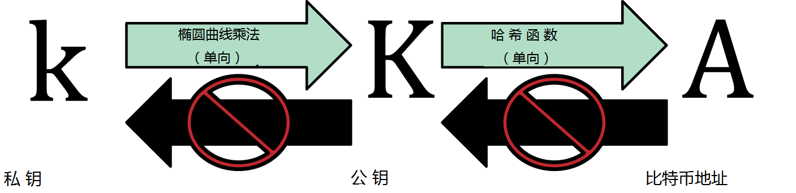

*图4-1 私钥，公钥和比特币地址* 

## 私钥

一个私钥就是一串随机提取的数字，拥有和控制私钥是用户控制与比特币地址关联的所有资金的根本。用户交易时需要证明使用的资金是他自己的，这就需要使用其私钥对交易进行签名。私钥在任何时候均必须保证其私密性，将私钥透露给第三方等同于把由这个私钥保护的比特币的控制权交给了第三方。私钥同样要进行备份，保护，防止意外丢失，如果私钥丢失，将是不可恢复的，受它保护的资金也就彻底丢失了。

*比特币私钥只是一串数字。你可以利用硬币、铅笔和纸张的来随机获取：抛256次硬币，你就获得了一个256位的二进制数字，这个数字可用作比特币钱包的私钥。生成私钥后，相应的公钥就可以利用私钥计算得出*

### 从一个随机数生成私钥

要生成私钥，第一步也是最关键的一步是找到一个安全的熵源或者随机源。创建比特币密钥本质上就是“取得一个0到\\(2^{256}\\)之间的数字”。如果能保证随机数获取的方式是不可预测、不可重复的，则实际采用哪种方法无关紧要。比特币软件利用操作系统底层的随机数生成器来生成256比特的熵（随机数），通常操作系统的随机数是利用一种人工随机源进行初始化的，这也是为什么生成的过程中要你随机晃动鼠标几秒钟。对于真正的偏执狂，投256次骰子，并且用铅笔和纸张记录下来还是更靠谱的。

更准确的说，私钥是从1到n-1之间的任意数字，其中n是一个常量（\\(n=1.158*10^{77}\\),比 \\(2^{256}\\) 略小），在比特币中这个常量是作为椭圆曲线的幂来定义的（参见第65页，《椭圆曲线密码学解释》）。为了生成这样一个密钥，我们随机取一个256比特长度的数字，并验证其是否小于n-1。以程序的术语，这通常是从一个密码学安全的随机源中抽取一长段字符串，并通过SHA256哈希算法进行计算，这样就可以很方便的生成一个256比特长度的数字。如果上述步骤结果小于n-1，我们就得到了一个合适的私钥。否则，我们需要重复以上步骤，直到最终得到一个合适的私钥。

*不要试图自己写代码生成密钥或者采用编程语言提供的“简单”的随机数生成器。采用密码学安全的伪随机数生成器（CSPRNG），并且从具有足够信息熵的来源中提取随机数种子。仔细研究你的随机数生成库的文档，以确定你选择的随机数生成器是密码学安全的。正确选择的CSPRNG算法对于密钥的生成至关重要。*

以下是以十六进制形式表示的随机生成的私钥(k)（256比特的二进制数字用十六进制表示共有64位，每位代表4比特）：
	1E99423A4ED27608A15A2616A2B0E9E52CED330AC530EDCC32C8FFC6A526AEDD

比特币私钥的可选范围是0-\\(2^{256}\\)，\\(2^{256}\\) 是一个难以想象的大数，以十进制表示，它大概是\\(10^{77}\\)， 而可见的宇宙大概是由\\(10^{80}\\)个原子构成的

为了使用比特币核心客户端（参见第3章）创建一个新的密钥，可以使用getnewaddress命令。出于安全考虑，命令输出只显示公钥，私钥不显示。要让bitcoind进程暴露私钥，使用dumpprivkey命令。dumpprivkey命令以"Base58校验和"(Base58 checksum-encoded)编码格式表示密钥，叫做钱包导入格式（Wallet Import Format, WIF)，我们将在第76页的《私钥格式》中进一步详细介绍。以下例子展示了利用上述两个命令生成和显示私钥的步骤：
	
	$ bitcoind getnewaddress
	1J7mdg5rbQyUHENYdx39WVWK7fsLpEoXZy
	
	$ bitcoind dumpprivkey 1J7mdg5rbQyUHENYdx39WVWK7fsLpEoXZy
	KxFC1jmwwCoACiCAWZ3eXa96mBM6tb3TYzGmf6YwgdGWZgawvrtJ

*dumpprivkey*命令打开钱包并且解压出由*getnewaddress*生成的私钥。bitcoind是无法通过公钥知道私钥的，除非它们同时存储于钱包中。

*dumpprivkey命令不是从公钥生成一个私钥，因为这根本不可能。这个命令只是简单的从“钱包”中取出由getnewaddress生成的私钥。*

你也可以使用命令行工具sx（参见第56页，《libbitcoin和sx工具集》）来生成和展示私钥；相应的sx命令是*newkey*：

	$ sx newkey
	5J3mBbAH58CpQ3Y5RNJpUKPE62SQ5tfcvU2JpbnkeyhfsYB1Jcn

## 公钥

公钥是使用椭圆曲线乘法从私钥计算得来的，这是一个不可逆的过程:*K=k\*G*，其中，*k*是私钥，*G*是一个常数点（称之为*生成点*）,*K*是计算结果，即公钥。其反向操作被称为“查找离散对数”---已知*K*，求*k*，其难度与尝试所有k可能值的难度差不多，也就是暴力搜索。在我们演示如何从私钥生成公钥之前，我们先仔细看一下椭圆曲线加密算法。

## 椭圆曲线加密算法解释

椭圆曲线加密算法是一种非对称加密算法，或者叫公钥加密算法，它的基础是表示为椭圆曲线上点的加法或乘法运算的离散对数问题。

图4-2是一个椭圆曲线的例子，与比特币中使用的类似。

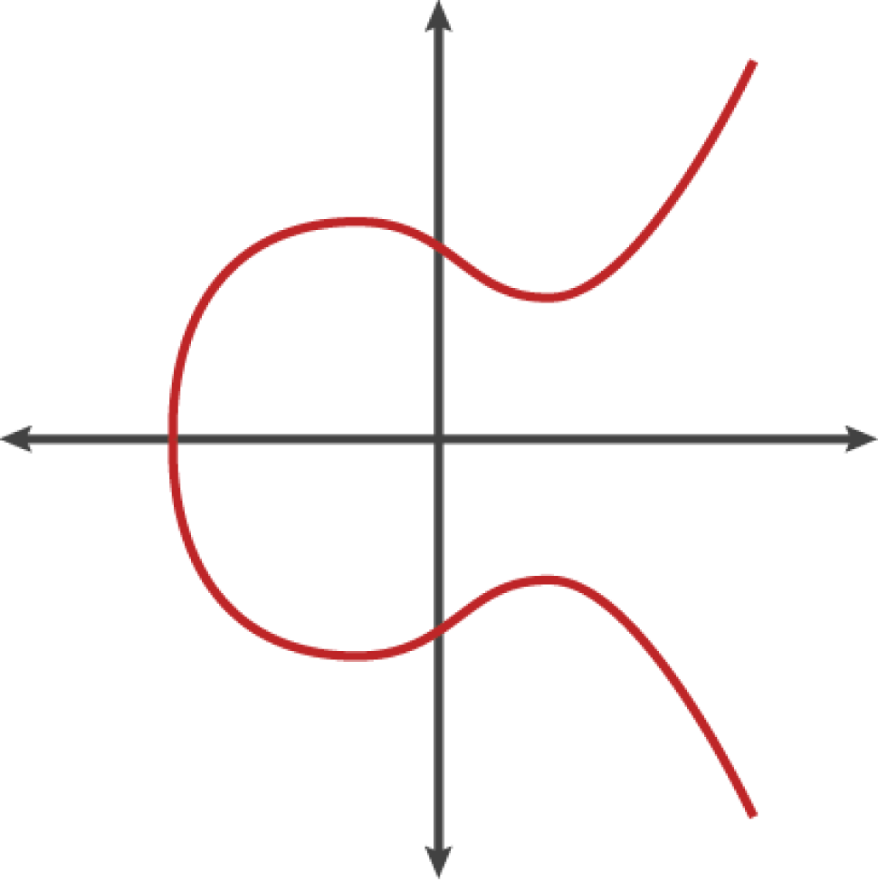

*图4-2 一条椭圆曲线*

比特币使用一个特定的椭圆曲线和一系列数学常量，这些内容在美国国家标准技术研究所（NIST）的secp256k1标准中进行了定义。secp256k1曲线是由以下函数定义的，是一条椭圆曲线：

over(\mathbb{F}_p))

$$ y^2=(x^3+7)over(\mathbb{F}_p) $$

或者

~\text{mod}~p)

$$ y^2 \text{mod} ~p=(x^3+7)~\text{mod}~p $$

*mod p*(对素数p取模）表明，这个曲线是在素数幂p的有限域上，也写成\\(\mathbb{F}_p\\)，其中
\\(p=2^{256}-2^{32}-2^9-2^8-2^7-2^6-2^4-1\\)，是一个非常大的素数。

由于这条曲线是基于素数幂而不是基于实数有限域定义的，它的图像看起来像一堆散乱在两个象限上的点，很难画图表示。但是它在数学原理上与基于实数的椭圆曲线是一样的。作为一个例子，**图4-3**显示了一个基于素数幂17（远小于实际值）的有限域上的椭圆曲线，可以看到一系列点散布在网格上。而*secp256k1*比特币椭圆曲线可以想作一个在巨大网格上的更为复杂的散列点。

*图4-3 椭圆曲线密码学：一个在F(p)上的椭圆曲线的图像，其中p=17*

作为例子，点P，其坐标为(x,y)，是一个secpk1曲线上的一个点。可以用Python来进行检验：

	P = (55066263022277343669578718895168534326250603453777594175500187360389116729240, 32670510020758816978083085130507043184471273380659243275938904335757337482424)

	Python 3.4.0 (default, Mar 30 2014, 19:23:13)
	[GCC 4.2.1 Compatible Apple LLVM 5.1 (clang-503.0.38)] on darwin
	Type "help", "copyright", "credits" or "license" for more information.
	>>> p = 115792089237316195423570985008687907853269984665640564039457584007908834671663
	>>> x = 55066263022277343669578718895168534326250603453777594175500187360389116729240
	>>> y = 32670510020758816978083085130507043184471273380659243275938904335757337482424
	>>> (x ** 3 + 7 - y**2) % p
	0
	
在椭圆曲线数学中，有个点叫做"无穷远点"，它与0在加法中扮演的角色大致相同。在计算机中，它有时也表示为x=y=0（虽然不满足椭圆曲线方程，但它是一个简单可校验的独立案例）。

还有个“+”号运算符，叫做“加法”，它有点类似于小时候学过的传统实数加法。给定在椭圆曲线上的两个点\\( P_1 \\), \\(P_2\\)，存在第三个点\\( P_3=P_1+P_2\\)，也在椭圆曲线上。

在几何学上，这个点\\(P_3\\)是通过在\\(P_1\\)和\\(P_2\\)间绘制一条直线来计算的。这条直线将与椭圆曲线相交于一点\\(P_3'=(x,y)\\)，通过x轴映射，得到\\(P_3=(x,-y)\\)。

有很多特殊案例解释了“无穷远点”存在的必要性。

如果\\(P_1\\)和\\(P_2\\)是同一点，那\\(P_1\\)，\\(P_2\\)的连接线必然与曲线在\\(P_1\\)点相切，曲线有且仅有一个新的点与直线相交。可以使用微积分技术来计算切线的斜率。虽然我们感兴趣的限制到曲线上两个坐标均为整数的点，这些技术仍然能奇怪的满足要求！

在某些情况下（比如：\\( P_1 \\)和\\( P_2 \\)的x值相同，但y值不同），切线将是垂直的，则\\( P_3 \\)=“无穷远点”。

如果P1是无穷远点，那么\\( P_1+P_2=P_2\\)。相应的，如果P2是无穷远点，那么\\( P_1+P_2=P_1\\)。这显示了其与0一样的性质。

事实证明，这里的“+”号符合联合率，也就是说\\((A+B)C=A(B+C)\\)。这意味着，我们可以不带括号的写\\(A+B+C\\)，而不会有任何歧义。

至此，我们已经定义了加法，我们也可以按照标准的方式通过扩展加法的方式来定义乘法。对于椭圆曲线上的点P，如果k是个整数，那么\\(kP=P+P+P+...+P\\) (k次）。需要注意的是，在这种情况下，k有时也叫做“指数”。

## 生成一个公钥
从一个密钥（形式上是一个随机生成的数字k）出发，我们将它与曲线上预定义的点相乘，可以生成曲线上的另一个点，这就是相应的公钥K，而这个预定义的点叫做生成点G。生成点是作为secp256k1标准的一部分定义的，对于比特币而言，其所有密钥均使用相同G点。
	
$$ K=k*G $$

这里，k是密钥，G是生成点，K是生成的公钥，椭圆曲线上的一个点。由于生成点对所有比特币用户来说都是一样的，一个密钥k与G相乘后总能得到相同的公钥K。k与K将的关系是固定的，但是只能从k到K单向计算。这也是比特币地址（从K衍生而来）可以与任何人共享，却不会暴露用户私钥（k）的原因。

私钥可以转换为公钥，但是公钥不能转换回私钥，因为数学上，这种计算是单向的。

实现椭圆曲线乘法，我们使用之前生成的私钥k，与生成点G相乘，以获得公钥K：

	K = 1E99423A4ED27608A15A2616A2B0E9E52CED330AC530EDCC32C8FFC6A526AEDD * G

公钥K定义成一个点K=(x,y):

	k=(x,y)
	其中，
	x = F028892BAD7ED57D2FB57BF33081D5CFCF6F9ED3D3D7F159C2E2FFF579DC341A
	y = 07CF33DA18BD734C600B96A72BBC4749D5141C90EC8AC328AE52DDFE2E505BDB

为了形象化演示一个点与整数的相乘，我们使用一个简单的基于实数的椭圆曲线--记住，实数与整数曲线数学上是一样的。我们的目标是找到生成点G的倍数kG。也就是G相加k次。在椭圆曲线中，一个点与其自身相加等同于在这个点上画一条切线，找到切斜与曲线相交的点，相交点相对x轴对称的点就是我们要找的点。

**图4-4**显示了如何利用几何学操作在曲线上获得G，2G，4G。

大多数比特币实现都利用OpenSSL加密库来完成椭圆曲线算法的计算。比如，为了获得公钥，就会用到EC_POINT_mul()函数。

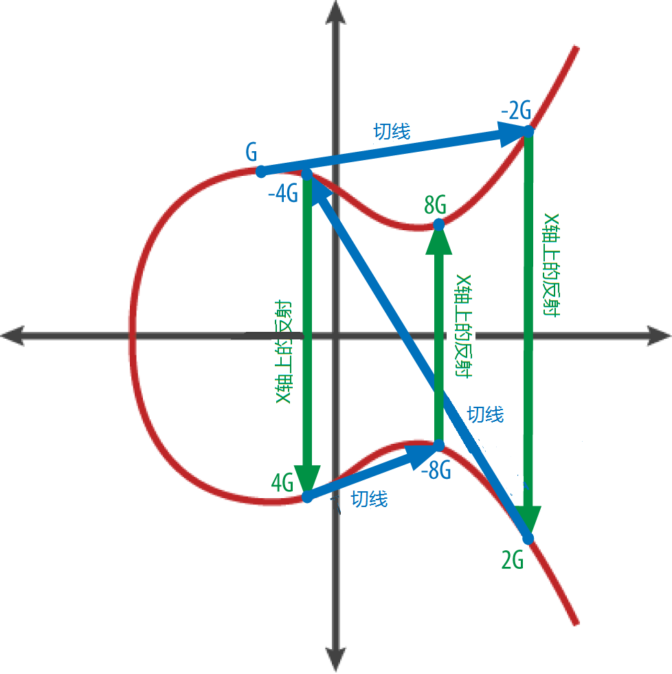

*图4-4 椭圆曲线密码学：演示G在椭圆曲线上被整数k相乘*

# 比特币地址

比特币地址是一串由数字和字母构成的字符串，可以分享给任何想给你转钱的人。地址是从公钥转换而来的，包含数字和字母，其第一个字符是1（数字）。下面就是一个比特币地址的例子：

	1J7mdg5rbQyUHENYdx39WVWK7fsLpEoXZy

比特币地址最常见的情况是交易中资金的“接受者”。如果我们将比特币交易与纸质支票做个类比，那么比特币地址就相当于支票上的受益人，也就是我们写入支票“受款人”后的内容。在纸质支票上，受益人可以是一个银行账户持有者的姓名，也可以是公司，机构，甚至现金。由于支票不需要指定账号，只是使用一个抽象的名字作为资金接收人，因此支票作为支付工具非常灵活。比特币交易采用了类似的抽象即比特币地址，使其同样极具灵活性。比特币地址可以指代一个密钥对的拥有者，也可以指代其他一些东西，比如支付脚本，我们将在第132页《支付到脚本哈希（P2SH）》中讲到。现在我们来看一个简单例子，用比特币地址代表公钥以及从公钥衍生比特币地址。

比特币地址是通过一个单项密码学哈希算法从公钥衍生出来的。“哈希算法”是一种单向创建任意长度输入的指纹或者“哈希”的函数。密码学哈希函数在比特币中得到了广泛应用，包括比特币地址，脚本地址，以及挖矿中的工作量证明算法等。用于从公钥创建比特币地址的算法是安全哈希算法（SHA）和RACE完整性原语求值信息摘要(RIPEMD)，特别是SHA256和RIPEMD160。

我们从公钥K开始，计算它的SHA256的哈希值，然后从其结果中计算RIPEMD160的哈希值，这样我们就创建了一个160比特（20字节）长度的数字：

	A = RIPEMD160(SHA256(K))

	其中K是公钥，A是计算结果，即比特币地址

比特币地址与公钥不一样，比特币地址是利用单向哈希函数从公钥衍生得来的。

比特币地址基本上是以Base58Check编码形式展现给用户的，它使用58个字符（一个Base58数字系统）和一个校验码以让人易于阅读，避免歧义，避免地址转录及输入时犯错。第72页有详细的相关Base58和Base58Check编码的说明。为便于用户易于阅读及正确转录数字，Base58Check在比特币中还有很多其他应用，比如比特币地址、用户私钥、加密的密钥、脚本哈希等。在下一节，我们将看到Base58Check的编码和解码机制，以及他们的结果展示。图4-5阐述了从公钥到比特币地址的转换过程。

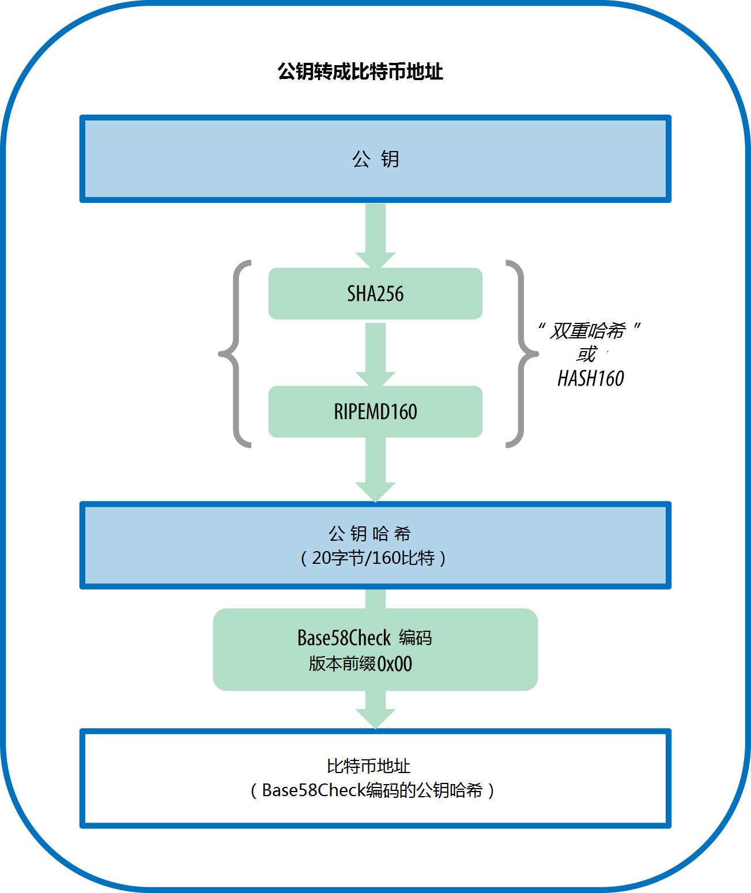

*图 4-5 从公钥到比特币地址：将公钥转换为比特币地址*

##Base58和Base58Check编码
为了采用更少的符号，用更紧凑的方式表示一个很大的数，很多计算机系统使用超过10的进制（底数），并混合字母和数字来表示一个很大的数。举例来说，传统十进制系统使用10个从0到9的数字字符，十六进制系统使用16个字符，包括10个数字字符和A到F 6个字母。一个数采用十六进制表示的话就会比用十进制表示来得短。Base-64编码采用26个小写字母，26个大小字母，10个数字字符，以及额外的两个字符，比如“+”，“/”将二进制数据转换为基于文本的媒体，比如email。Base-64主要用于email中二进制附件的编码。Base58是一个基于文本的二进制编码格式，用于比特币及很多其他密码货币系统中。它在紧凑表示、可读性和错误检测及预防方面提供了一种平衡。Base58是Base64的一个子集，使用大小写字母和数字，但是省略了一些容易混淆的字符。具体来说，Base58是Base64中去掉0(数字零)、O(大写的o)、l(小写的L）、I(大写的i)、字符“+”和字符“/”。或者更简单的说，它是个去掉四个字符（0,O,l,I)的大小写字母与数字的集合。

*例4-1, 比特币的Base58字符表*

	123456789ABCDEFGHJKLMNPQRSTUVWXYZabcdefghijkmnopqrstuvwxyz

为了增加额外安全性，防止打字和转录错误，常用于比特币的Base58Check编码在Base58编码格式的基础上增加了内置的错误检测码。校验码4个字节长，添加到需要编码的数据后面。校验码从编码后数据的哈希值得到，从而可以检测和避免转录和输入错误。取得一个Base58Check编码的数据后，解码软件可以计算原始数据的校验码，并与数据中的校验码进行比对。如果两者不一致，就说明原始数据有误，Base58Check数据无效。举例来说，这可以避免钱包将输错的比特币地址当做一个有效目标，防止了资金丢失风险。

为了将数据（一个数）转换为Base58Check编码格式，我们首先添加一个前缀到数据中，称之为“版本字节”，这可以让我们更容易判断数据的类型。例如，比特币地址的前缀是0（十六进制表示为0x00），而私钥的前缀为128（十六进制表示为0x80）。常用版本前缀请参看表4-1。

接下来，我们计算“双重SHA”校验码，意思是我们对前面得到的数据（前缀+数据）进行两次SHA256哈希计算：

	checksum = SHA256(SHA256(prefix+data))

从结果的32字节哈希值（哈希的哈希），我们取前面四个字节。这四个字节作为错误检查码，或者校验码附加到数据的最后。

这样，就形成了由三部分（前缀，原始数据，校验码）组成的结果数据。现在可以利用前面介绍的Base58字符表，对结果数据进行编码。图4-6描述了Base58Check的编码过程。

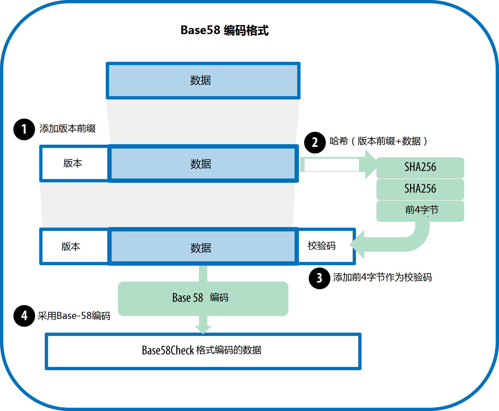

*Base58Check编码：一种Base58的，版本化的，可校验的比特币数据无歧义编码格式*

在比特币中，大多数需要向用户展示的数据均以Base58Check格式进行编码，这使得数据紧凑，易读，易于检查错误。Base58Check编码的版本前缀用于创建易于辨别的格式，这意味着，当以Base58编码时，使用Base58Check编码后的数据头部包含了特定的字符。这个字符使用户很容易判断出数据类型，以及如何去使用它。比如，Base58Check编码的比特币地址以1打头，而Base58Check编码的WIF格式私钥以5打头。一些版本前缀的例子，及其编码后的Base58字符见表4-1.

*表4-1 Base58Check版本前缀及编码后结果的举例*

| 类型 | 版本前缀（十六进制） | Base58结果前缀 |
| ---- | ---- | ---- |
| 比特币地址 | 0x00 | 1 |
| 脚本支付地址 | 0x05 | 3 |
| 比特币测试网地址 | 0x6F | m或n |
| 私钥钱包导入格式 | 0x80 | 5, K or L |
| BIP38加密私钥 | 0x0142 6P |
| BIP32扩展公钥 | 0x0488B21E | xpub |

我们来看一下完整的比特币地址生成过程，从私钥到公钥（椭圆曲线上的一个点），到双重哈希的地址，最后Base58Check编码。例4-2的C++代码一步步展示了从私钥一直到Base58Check编码的比特币地址的完整的过程。代码使用了libbitcoin库中的一些函数（第56页《其他替代客户端，库和工具集》中介绍过）

*例4-2 从私钥创建Base58Check编码的比特币地址*

	#include <bitcoin/bitcoin.hpp>
	int main()
	{
		// Private secret key.
		bc::ec_secret secret = bc::decode_hash("038109007313a5807b2eccc082c8c3fbb988a973cacf1a7df9ce725c31b14776");
		// Get public key.
		bc::ec_point public_key = bc::secret_to_public_key(secret);
		std::cout << "Public key: " << bc::encode_hex(public_key) << std::endl;
		// Create Bitcoin address.
		// Normally you can use:
		// bc::payment_address payaddr;
		// bc::set_public_key(payaddr, public_key);
		// const std::string address = payaddr.encoded();
		// Compute hash of public key for P2PKH address.
		const bc::short_hash hash = bc::bitcoin_short_hash(public_key);
		bc::data_chunk unencoded_address;
		// Reserve 25 bytes
		// [ version:1 ]
		// [ hash:20 ]
		// [ checksum:4 ]
		unencoded_address.reserve(25);
		// Version byte, 0 is normal BTC address (P2PKH).
		unencoded_address.push_back(0);
		// Hash data
		bc::extend_data(unencoded_address, hash);
		// Checksum is computed by hashing data, and adding 4 bytes from hash.
		bc::append_checksum(unencoded_address);
		// Finally we must encode the result in Bitcoin's base58 encoding
		assert(unencoded_address.size() == 25);
		const std::string address = bc::encode_base58(unencoded_address);
		std::cout << "Address: " << address << std::endl;
		return 0;
	}

代码使用预定义好的私钥，使得没错运行都可以得到相同的比特币地址，就像例4-3展示的一样：

*例4-3 编译运行这段代码*

	# Compile the addr.cpp code
	$ g++ -o addr addr.cpp $(pkg-config --cflags --libs libbitcoin)
	# Run the addr executable
	$ ./addr
	Public key: 0202a406624211f2abbdc68da3df929f938c3399dd79fac1b51b0e4ad1d26a47aa
	Address: 1PRTTaJesdNovgne6Ehcdu1fpEdX7913CK

##密钥格式
不管私钥还是公钥都可以表示为一系列不同的格式。这些表现形式均对同样数字进行编码，尽管他们看起来并不一样。这些格式主要用于使用户易于阅读及密钥转录，避免引入错误。

###私钥格式
私钥可以表示为几种不同格式，所有格式均代表与之对应的相同的256比特长的数字。表4-2显示三种用于表示私钥的常用格式。

*表4-2 私钥表示形式（编码格式）

|类型|前缀|说明|
|----|----|----|
|Hex|无|64位十六进制数字|
|WIF|5|Base58Check编码：带128前缀和32比特校验码的Base58编码|
|WIF-compressed|K 或L| 与上面一样，但编码前加一个0x01后缀|

表4-3通过这三种格式展示同一个私钥

*表4-3 例子：相同密钥，不同格式

| 格式 | 私钥 | 
|----|----|
| Hex | 1E99423A4ED27608A15A2616A2B0E9E52CED330AC530EDCC32C8FFC6A526AEDD |
| WIF | 5J3mBbAH58CpQ3Y5RNJpUKPE62SQ5tfcvU2JpbnkeyhfsYB1Jcn |
| WIF-compressed |KxFC1jmwwCoACiCAWZ3eXa96mBM6tb3TYzGmf6YwgdGWZgawvrtJ|

以上这些是用不同格式对相同密钥编码后的展示。虽然看起来不同，但是一种编码格式可以很容易的转换为另一种格式。

###从Base58Check到十六进制解码

使用sx工具包（参看第56页《libbitcoin和sx工具集》）可以让我们很容易写出脚本或者命令行“管道”来操控比特币密钥，地址和交易。你可以使用sx工具集通过命令行来解码Base58Check格式。

我们使用*base58check-decode*命令：

	$ sx base58check-decode 5J3mBbAH58CpQ3Y5RNJpUKPE62SQ5tfcvU2JpbnkeyhfsYB1Jcn
	1e99423a4ed27608a15a2616a2b0e9e52ced330ac530edcc32c8ffc6a526aedd 128

结果是一个十六进制格式的密钥，跟着一个钱包导入格式（WIF）的版本前缀128。

###从十六进制到Base58Check编码

为了编码为Base58Check格式（与前述命令刚好相反），我们提供十六进制的私钥，跟着一个钱包导入格式（WIF）的版本前缀128：

	$ sx base58check-encode	1e99423a4ed27608a15a2616a2b0e9e52ced330ac530edcc32c8ffc6a526aedd 128
	5J3mBbAH58CpQ3Y5RNJpUKPE62SQ5tfcvU2JpbnkeyhfsYB1Jcn

###从十六进制（压缩格式密钥）到Base58Check的编码

为了将“压缩”格式的私钥（参见80页《压缩格式私钥》）编码到Base58Check，我们在十六进制密钥的最后加上后缀01，然后进行编码：

	$ sx base58check-encode 1e99423a4ed27608a15a2616a2b0e9e52ced330ac530edcc32c8ffc6a526aedd01 128
	KxFC1jmwwCoACiCAWZ3eXa96mBM6tb3TYzGmf6YwgdGWZgawvrtJ

生成的WIF-压缩格式结果以字母“K”开头。这代表私钥带有“01”后缀，并且只可用于生成压缩格式的公钥（参见第78页《压缩格式公钥》）。

###公钥格式

公钥也同样采用不同的格式显示，最重要的是*压缩*和*非压缩*公钥格式。

就像我们一起看到的，公钥是一个在椭圆曲线上的点，包含一对坐标（x,y）。它通常表现为04前缀开头，紧跟两个256比特长度的数字，一个代表x坐标，另一个代表y坐标。04前缀用于区别非压缩公钥和压缩公钥，压缩公钥是以02或03开头的。

下面是之前我们通过私钥生成的公钥，以x,y坐标显示之：

	x = F028892BAD7ED57D2FB57BF33081D5CFCF6F9ED3D3D7F159C2E2FFF579DC341A
	y = 07CF33DA18BD734C600B96A72BBC4749D5141C90EC8AC328AE52DDFE2E505BDB

下面是520比特（130个十六进制数字）的数字显示的相同的密钥，04开头，紧跟着x坐标和y坐标，即04 x y：

	K = 04F028892BAD7ED57D2FB57BF33081D5CFCF6F9ED3D3D7F159C2E2FFF579DC341A07CF33DA18BD734C600B96A72BBC4749D5141C90EC8AC328AE52DDFE2E505BDB

###压缩公钥

压缩公钥引入比特币的目的是为了降低交易大小，以使负责保存比特币区块链数据库的节点更加节省磁盘空间。大多数交易均包含公钥，用以验证所有者的身份并花费比特币。每个公钥要求520比特长度（前缀+x+y），每个区块由几百个交易组成，而每天都有成千上万个交易加入区块，这给区块链的存储带来了一定负担。

我们在第65页《公钥》中看到，公钥是由椭圆曲线上的一个点。因为曲线代表了一个数学公式，曲线上的一个点代表了方程的一个解，那么，如果我们知道x坐标，那y坐标也能通过求解方程得到： ~\text{mod}~p) 。这允许我们只存储公钥中的x坐标，而把y坐标省略掉，这样就将所需空间减少了256比特，几乎少了一半。长期来看，交易中节省的空间是相当可观的。

未压缩公钥带04前缀，而压缩公钥开始于02或者03。我们看看为什么它有两个可能的前缀：方程的左边是y^2，这意味着y的解是个平方根，可以是正值或者负值。直观的说，这意味着结果中y坐标可以位于x轴之上，也能位于x轴之下。就如我们在图4-2上看到的曲线的图像，它是对x轴对称的。所以，当我们省略y坐标时，我们必须保存y的符号（正还是负），换言之，我们必须记住这个点是在x轴之上还是x轴之下，在上还是在下，代表了两个不同的公钥。当我们在素数阶P的有限域内使用二进制算法运算来计算椭圆曲线的时候，y坐标可能是偶数也可能是奇数，分别对应y坐标的正/负符号。这样，为了区分两个可能的y值，我们在压缩公钥中用前缀02代表偶数，03代表奇数，允许软件从x坐标准确推断出y坐标，并将公钥解压成完整坐标的点。公钥压缩过程参见图4-7.

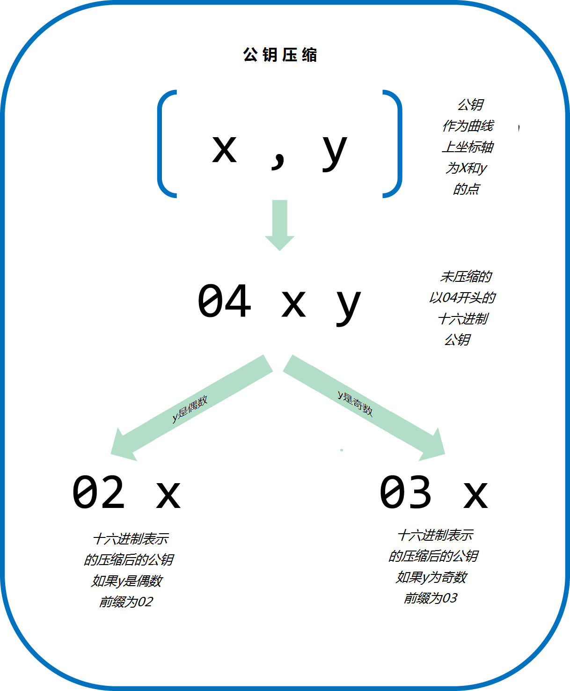

*图 4-7 公钥压缩*

这是前面生成的，用压缩格式存储的264比特（66十六进制长）公钥，以03前缀，代表y坐标是奇数：

	K = 03F028892BAD7ED57D2FB57BF33081D5CFCF6F9ED3D3D7F159C2E2FFF579DC341A

压缩公钥对应相同的私钥，也就是从相同的私钥生成的。但是它看起来与非要说公钥不一样。更重要的是，如果我们将一个压缩公钥使用双重哈希函数（RIPEMD160(SHA256(K))）转换为一个比特币地址，那么将生成一个不同的地址。这很容易引起混淆，因为这意味着一个私钥可以生成两种不同表达方式的公钥（压缩、非压缩），进一步还生成了两个不同的比特币地址。但是对应这两个不同比特币地址的私钥却是相同的。

压缩公钥已逐渐成了比特币客户端的默认配置，这对降低交易大小，从而降低区块链大小造成了一定正面影响。但是，还不是所有客户端都支持压缩公钥格式。新的支持压缩密钥的客户端必须兼容不支持压缩公钥的老客户端发来的交易。这对钱包应用从其他钱包应用中引入私钥尤为重要，因为新钱包需要扫描区块链以发行与这些引入的私钥相关的所有交易。那种类型的比特币地址需要比特币钱包去找？非压缩公钥生成的地址还是压缩公钥生成的地址？这两种地址都是有效的比特币地址，他们都可以被使用签名，但他们的确是不同的两个地址！

为了解决这个麻烦，当私钥从钱包中导出时，用于表示私钥的钱包导入格式在新比特币钱包中采用了不同的实现方式，它可以指示私钥已经被用于创建压缩公钥，并且也生成了*压缩*比特币地址。这就使得导入钱包可以辨别私钥是从旧的钱包来还是新的钱包来，从而根据非压缩还是压缩的比特币地址从区块链上搜索交易。我们将在下一节来看看这个过程的细节。

###压缩私钥
有点讽刺意味，名词“压缩私钥”是让人迷惑的，实际上私钥以WIF-压缩格式输出实际上比那些“未压缩”的还长了一字节。这是因为它加了一个01的后缀，这个后缀标注了它是从一个新钱包来的，只能用于生成压缩公钥。私钥既没有压缩，也不可能压缩。“压缩私钥”的真正含义是“只能用于生成压缩公钥的私钥”，同样，“非压缩私钥”就是“只能生成非压缩公钥的私钥”。为避免更多混淆，你最好将导出格式称之为“WIF-压缩格式”或者“WIF”，而不是将私钥称之为“压缩的”或者“非压缩的”。

记住，这些格式不是可交换的。在实现了压缩公钥的新钱包中，私钥只能被导出为WIF-压缩格式公钥（带K或L前缀）。如果钱包是一个叫老的实现，还不能支持压缩公钥，这种情况，私钥只能导出为WIF（带5前缀）。这样做的目的是通知钱包导入这些私钥后，是在区块链中以压缩公钥以及他们相应的比特币地址进行搜索，还是采用非压缩公钥即其地址进行搜索。

如果比特币钱包支持压缩公钥，它将在所有交易中使用压缩公钥。钱包中的私钥用于在曲线中生成公钥点，这将被进行压缩。压缩后公钥用于生成比特币地址，并用于交易当中。当在一个支持压缩公钥的钱包是导出私钥时，钱包导入格式将被改的，添加一个01的后缀到私钥中。经过Base58Check编码后的私钥称之为“压缩WIF”，开始于字母K或L，而不是像老钱包使用的WIF编码（未压缩）一样开始于数字“5”。

表4-4显示同一个密钥的WIF和WIF压缩格式

|格式|私钥|
|----|----|
|十六进制|1E99423A4ED27608A15A2616A2B0E9E52CED330AC530EDCC32C8FFC6A526AEDD|
|WIF|5J3mBbAH58CpQ3Y5RNJpUKPE62SQ5tfcvU2JpbnkeyhfsYB1Jcn|
|十六进制压缩|1E99423A4ED27608A15A2616A2B0E9E52CED330AC530EDCC32C8FFC6A526AEDD_01_|
|WIF-压缩|KxFC1jmwwCoACiCAWZ3eXa96mBM6tb3TYzGmf6YwgdGWZgawvrtJ|

 “压缩私钥”是一个误会！它们并没有被压缩；相反的，WIF-压缩格式只是指示它们只能用于生成压缩公钥以及他们相应的比特币地址。很讽刺的，一个“WIF-压缩”编码的私钥比“不压缩”的格式长一个字节，因为它被加上了一个“01”的后缀用于与“非加密”进行区分。

#在Python中实现密钥和地址

最全的Python比特币库是维塔里克.布特林（Vitalik Buterin，就是那个后来发明了以太坊的家伙）发明的*pybitcointools*。在例4-4中，我们利用这个库（import时使用bitcoin）来生成密钥和地址，并以不同格式进行展示。

*例4-4 利用pybitcointools库生成并格式化密钥和地址

	import bitcoin
	
	# 生成一个随机私钥
	valid_private_key = False
	while not valid_private_key:
	    private_key = bitcoin.random_key()
	    decoded_private_key = bitcoin.decode_privkey(private_key, 'hex')
	    valid_private_key =  0 < decoded_private_key < bitcoin.N
	
	print "Private Key (hex) is: ", private_key
	print "Private Key (decimal) is: ", decoded_private_key
	
	# 私钥转换为 WIF 格式
	wif_encoded_private_key = bitcoin.encode_privkey(decoded_private_key, 'wif')
	print "Private Key (WIF) is: ", wif_encoded_private_key
	
	# 添加后缀"01" 以提示这是个压缩的私钥
	compressed_private_key = private_key + '01'
	print "Private Key Compressed (hex) is: ", compressed_private_key
	
	# 从压缩私钥生成WIF格式(WIF-compressed)
	wif_compressed_private_key = bitcoin.encode_privkey(
	    bitcoin.decode_privkey(compressed_private_key, 'hex'), 'wif')
	print "Private Key (WIF-Compressed) is: ", wif_compressed_private_key
	
	# 将椭圆曲线生成点与私钥相乘得到一个公钥点
	public_key = bitcoin.fast_multiply(bitcoin.G, decoded_private_key)
	print "Public Key (x,y) coordinates is:", public_key
	
	# 十六进制编码, 前缀 04
	hex_encoded_public_key = bitcoin.encode_pubkey(public_key,'hex')
	print "Public Key (hex) is:", hex_encoded_public_key
	
	# 压缩公钥，依据y的奇偶数性质调整前缀
	(public_key_x, public_key_y) = public_key
	if (public_key_y % 2) == 0:
	    compressed_prefix = '02'
	else:
	    compressed_prefix = '03'
	hex_compressed_public_key = compressed_prefix + bitcoin.encode(public_key_x, 16)
	print "Compressed Public Key (hex) is:", hex_compressed_public_key
	
	# 从公钥生成比特币地址
	print "Bitcoin Address (b58check) is:", bitcoin.pubkey_to_address(public_key)
	
	# 从压缩公钥生成压缩比特币地址
	print "Compressed Bitcoin Address (b58check) is:", \
	    bitcoin.pubkey_to_address(hex_compressed_public_key)

例4-5显示这段代码的运行结果	
*例 4-5. 运行 key-to-address-ecc-example.py*

	$ python key-to-address-ecc-example.py
	Private Key (hex) is:
	 3aba4162c7251c891207b747840551a71939b0de081f85c4e44cf7c13e41daa6
	Private Key (decimal) is:
	 26563230048437957592232553826663696440606756685920117476832299673293013768870
	Private Key (WIF) is:
	 5JG9hT3beGTJuUAmCQEmNaxAuMacCTfXuw1R3FCXig23RQHMr4K
	Private Key Compressed (hex) is:
	 3aba4162c7251c891207b747840551a71939b0de081f85c4e44cf7c13e41daa601
	Private Key (WIF-Compressed) is:
	 KyBsPXxTuVD82av65KZkrGrWi5qLMah5SdNq6uftawDbgKa2wv6S
	Public Key (x,y) coordinates is:
	 (41637322786646325214887832269588396900663353932545912953362782457239403430124L,
	 16388935128781238405526710466724741593761085120864331449066658622400339362166L)
	Public Key (hex) is:
	 045c0de3b9c8ab18dd04e3511243ec2952002dbfadc864b9628910169d9b9b00ec243bcefdd4347074d44bd7356d6a53c495737dd96295e2a9374bf5f02ebfc176
	Compressed Public Key (hex) is:
	 025c0de3b9c8ab18dd04e3511243ec2952002dbfadc864b9628910169d9b9b00ec
	Bitcoin Address (b58check) is:
	 1thMirt546nngXqyPEz532S8fLwbozud8
	Compressed Bitcoin Address (b58check) is:
	 14cxpo3MBCYYWCgF74SWTdcmxipnGUsPw3

例4-6是另一个例子，使用python的ECDSA库来计算椭圆曲线，没有使用任何特定的比特币库

*例4-6. 演示比特币密钥中使用的椭圆曲线数学的脚本*

	import ecdsa
	import os
	from ecdsa.util import string_to_number, number_to_string
	
	# secp256k1, http://www.oid-info.com/get/1.3.132.0.10
	_p = 0xFFFFFFFFFFFFFFFFFFFFFFFFFFFFFFFFFFFFFFFFFFFFFFFFFFFFFFFEFFFFFC2FL
	_r = 0xFFFFFFFFFFFFFFFFFFFFFFFFFFFFFFFEBAAEDCE6AF48A03BBFD25E8CD0364141L
	_b = 0x0000000000000000000000000000000000000000000000000000000000000007L
	_a = 0x0000000000000000000000000000000000000000000000000000000000000000L
	_Gx = 0x79BE667EF9DCBBAC55A06295CE870B07029BFCDB2DCE28D959F2815B16F81798L
	_Gy = 0x483ada7726a3c4655da4fbfc0e1108a8fd17b448a68554199c47d08ffb10d4b8L
	curve_secp256k1 = ecdsa.ellipticcurve.CurveFp(_p, _a, _b)
	generator_secp256k1 = ecdsa.ellipticcurve.Point(curve_secp256k1, _Gx, _Gy, _r)
	oid_secp256k1 = (1, 3, 132, 0, 10)
	SECP256k1 = ecdsa.curves.Curve("SECP256k1", curve_secp256k1, generator_secp256k1, oid_secp256k1)
	ec_order = _r
	
	curve = curve_secp256k1
	generator = generator_secp256k1
	
	def random_secret():
	    convert_to_int = lambda array: int("".join(array).encode("hex"), 16)
	
	    # 从操作系统的密码学安全随机生成器收集256比特的随机数
	    byte_array = os.urandom(32)
	
	    return convert_to_int(byte_array)
	
	def get_point_pubkey(point):
	    if point.y() & 1:
	        key = '03' + '%064x' % point.x()
	    else:
	        key = '02' + '%064x' % point.x()
	    return key.decode('hex')
	
	def get_point_pubkey_uncompressed(point):
	    key = '04' + \
	          '%064x' % point.x() + \
	          '%064x' % point.y()
	    return key.decode('hex')
	
	
	# 生成一个新私钥
	secret = random_secret()
	print "Secret: ", secret
	
	# 获取公钥点
	point = secret * generator
	print "EC point:", point
	
	print "BTC public key:", get_point_pubkey(point).encode("hex")
	
	# 给定点(x, y) 我们利用下面生成对象:
	point1 = ecdsa.ellipticcurve.Point(curve, point.x(), point.y(), ec_order)
	assert point1 == point

例4-7显示了这个例子的输出。

*例4-7，安装python ECDSA库并运行ec_math.py脚本

	$ # Install Python PIP package manager
	$ sudo apt-get install python-pip
	$ # Install the Python ECDSA library
	$ sudo pip install ecdsa
	$ # Run the script
	$ python ec-math.py
	Secret:
	38090835015954358862481132628887443905906204995912378278060168703580660294000
	EC point:
	(70048853531867179489857750497606966272382583471322935454624595540007269312627,
	105262206478686743191060800263479589329920209527285803935736021686045542353380)
	BTC public key: 029ade3effb0a67d5c8609850d797366af428f4a0d5194cb221d807770a1522873
	
#钱包
钱包是保持私钥的容器，通常以结构化文件或者简单数据库的方式实现。另一生成密钥的方式是*确定性密钥生成*。这种情况下，可以通过单向哈希函数从上一个私钥中生成一个新的私钥，按顺序连接，形成了一个链条。如果需要重建这个链，你只需生成第一个私钥（称之为种子或者主密钥）即可生成整个序列。在本节中，我们将检查不同的的密钥生成方式以及相应的钱包结构。

比特币钱包包含的是密钥，不是比特币。每个用户拥有一个包含很多密钥的钱包。钱包实际上是一个密钥链，包含一对对的私/公钥（参看第63页《私钥和公钥》）。用户使用密钥对交易进行签名，以证明交易输出是他们的（他们的比特币）。比特币以交易输出的方式存储于区块链上（通常记为vout或者txout）。

##非确定性（随机）钱包
在早期的比特币客户端中，钱包是随机生成私钥的简单集合。这种类型的钱包称为Type-0非确定性钱包。举例来说，比特币核心客户端在第一次启动时预生成100个随机私钥，后面则根据需要继续产生，每个密钥只使用一次。这种类型钱包被戏称为“只是一堆密钥”，或者简写为“JBOK”，这种钱包已逐渐被确定性钱包所替代，因为它们使之难以管理，备份和导入。随机密钥的缺点在于如果你生成了太多的密钥，你必须经常对所有这些密钥进行备份，如果没有备份，一旦钱包无法访问，这些密钥控制的资金将彻底消失。每个地址仅在交易中使用一次也与避免地址重用的原则直接冲突。地址重用允许他人通过将多个交易和地址互相关联，减少了隐私保护。一个Type-0非确定型钱包是一个无奈的选择，特别是你想避免地址重用而不得不使用大量密钥时，这使得频繁备份成为必要。虽然比特币核心客户端包含一个Type-0钱包，但比特币核心的开发者却不建议使用这个钱包。图4-8展示了一个非确定型钱包，包含一些随机密钥的松散组合。

##确定性（种子）钱包
确定性或者叫“种子”钱包是另一种钱包类型，它包含的私钥全部是通过使用单向哈希函数，从一个共同的种子衍生而来的。种子是一个随机生成的数字，它与其他诸如索引号或者“链码”（参看第87页《层次化的确定性钱包（BIP0032/BIP0044）》）等组合并计算得出私钥。在确定性钱包中，种子已足够恢复所有衍生密钥，这样，只要在创建时间做个简单备份就够了。种子也一样足够作为钱包的导入导出使用，允许简单的将用户的所有密钥从一个钱包软件迁移到另一个。

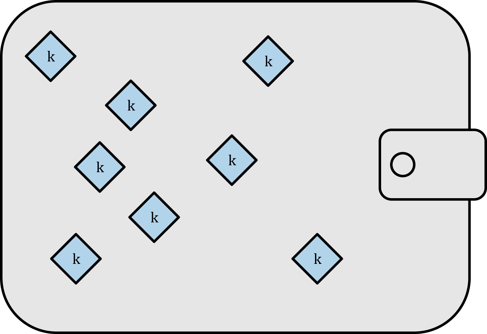

*图4-8 Type-0 非确定性（随机）钱包：随机生成密钥的集合*

##助记码词汇表
助记码是一些英文单词序列，用于代表（编码）一个随机数字，这个随机数字就是用于创建确定性钱包的种子。通过这个单词序列足以重建种子并根据种子重建钱包及所有衍生而来的密钥。一个实现了确定性钱包（带助记码功能）的应用，在首次启动时将会向用户展示一个12到24个单词的序列。这个单词序列就是钱包的一个备份，可以用于在相同的应用或者兼容的应用中恢复并重建所有密钥。助记码词汇表使得用户钱包备份变得极为简单，毕竟相对一串随机数字，这些词汇更容易阅读和转录。

助记码在比特币改进建议39（[BIP0039]）中首次定义，目前还属于草案状态。需要注意的是，BIP0039仍是一个草案，而不是标准。特别的，还有一个不同的标准，使用了一套不同的词汇，在以太坊钱包中使用，并且其定义早于BIP0039。BIP0039已被Trezor钱包和其他一些钱包使用，但是与以太坊的实现不兼容。

BIP0039按如下步骤定义助记码和种子：

1. 创建一个128位到256位随机序列（熵）
2. 创建随机序列的校验码，即随机序列SHA256哈希值的前几位
3. 将校验码附加到随机序列之后
4. 将序列拆成11位长的小段，使用这些小段与一个预定义的包含2048个单词的词典做对应（译者：2^11=2048，故每段均可以对应到一个单词）
5. 生成12到24个单词作为助记码

**表4-5** 显示熵的大小与助记码长度的关系

*表4-5 助记码：熵与词汇数量*

|熵（位数）|（校验码（位数）|熵+校验码|词汇数量|
|---------|--------------|--------|-------|
|128|4|132|12|
|160|5|165|15|
|192|6|198|18|
|224|7|231|21|
|256|8|264|24|

助记码代表了128到256位的数字，使用密钥扩展函数（PBKDF2），可以产生长的多（512位）的种子。种子用于创建确定性钱包以及所有衍生的密钥。

表**4-6**和**4-7**显示了一些助记码及其他们生成的种子的例子

*表4-6 128位助记码和结果种子*

|---|---|
|熵输入（128位）|0c1e24e5917779d297e14d45f14e1a1a|
|助记码（12个单词）|army van defense carry jealous true garbage claim echo media make crunch|
|种子（512位）|3338a6d2ee71c7f28eb5b882159634cd46a898463e9d2d0980f8e80dfbba5b0fa0291e5fb88
8a599b44b93187be6ee3ab5fd3ead7dd646341b2cdb8d08d13bf7|

*表4-7 256位助记码和结果种子*

|---|---|
|熵输入（128位）|2041546864449caff939d32d574753fe684d3c947c3346713dd8423e74abcf8c|
|助记码（12个单词）|cake apple borrow silk endorse fitness top denial coil riot stay wolf luggage oxygen faint major edit measure
invite love trap field dilemma oblige|
|种子（512位）|3972e432e99040f75ebe13a660110c3e29d131a2c808c7ee5f1631d0a977fcf473bee22
fce540af281bf7cdeade0dd2c1c795bd02f1e4049e205a0158906c343|

##层次化确定性钱包（BIP0032/BIP0044）
确定性钱包是开发来使得可以轻易从一个“种子”生成很多密钥。形式最先进的确定性钱包是*层次化确定性钱包*，或者叫HD钱包，在BIP0032中被定义为标准。层次化确定性钱包包含的密钥是一种树形结构，一个父密钥可以衍生出一系列的子密钥，每个子密钥又可以衍生出一系列孙密钥，以此类推，直到树的深度达到无穷大。树的结构如图4-9。

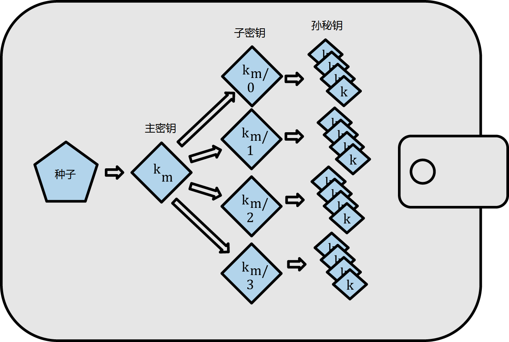

*图4-9 Type-2层次化确定性钱包：从种子生成一棵密钥树*

如果你自己开发一个比特币钱包，它必须是一个HD钱包，遵循BIP0032和BIP0044标准

HD钱包相对随机（非确定性）密钥有两大优势。首先，树结构可以用于表达额外的组织含义，比如，一个特定分支的子密钥用于接收进来的支付交易，而另一个分支的密钥用于接收支付交易的找零。不同分支的密钥同样可以用于公司设置，分配不同的分支给不同的部门，子公司，用于特定用途或者会计账目。

HD钱包的第二个优势在于用户可以在不访问私钥的情况下创建一系列公钥。这使得HD钱包可以在不安全的服务器上使用，也可以针对每笔交易发行一个不同的公钥。公钥不需要提前预载或者衍生，即使服务器尚无可用于花费资金的私钥。

###从种子生成HD钱包
HD钱包从单一的根种子产生，它是一个128,256或者512位的随机数字。HD钱包终端其他一切东西均确定性的从这个根种子衍生而来，这使得从种子重建整个兼容HD钱包得以成为可能。这同样使得包含成千上万密钥的钱包易于备份，恢复，导出和导入，所有要做的仅仅是传输一个根种子。根种子最常见表现形式为助记码单词序列，这使得根种子的转录和保存更易进行。在上一节《助记码词汇表》中我们已经进行详述。

下图是HD钱包创建主密钥和主链码的过程：

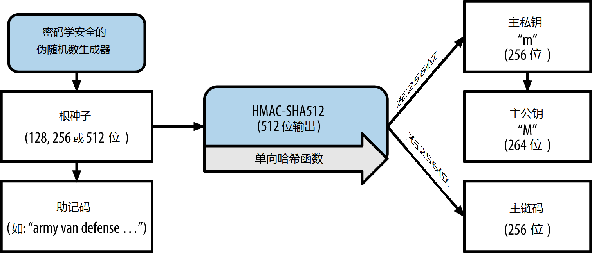

*图4-10 从根种子创建主密钥和链码*

根种子是作为HMAC-SHA512算法的输入，生成的哈希值用于创建*主私钥*（m）和*主链码*。通过主私钥（m）相应生成一个主公钥（M），这过程使用我们之前见过的椭圆曲线乘法*m\*G*。链码用于引入熵，这在从父密钥创建子密钥的过程中需要用到，我们将在下节讲述。

###子私钥的衍生

层次化确定钱包使用一个*子密钥衍生*（CKD）函数从父密钥衍生出子密钥。

子密钥衍生函数基于单向哈希函数，它包括：

* 一个父私钥或公钥（ECDSA 非压缩密钥）
* 一个叫做链码的种子（256位）
* 一个索引号（32位）

链码用于引入看似随机的数据到这个过程中，使得单凭索引不足以衍生其他子密钥。这样，拥有一个子密钥无法找到其同辈密钥，除非你也知道链码。初始链码种子（在树的根部）是由随机数生成的，但是子节点的链码是从父节点的链码派生而来。

这三个元素组合并哈希生成子密钥。如下。

父公钥，链码，索引号组合后，采用HMAC-SHA512算法进行哈希计算，生成512位的哈希。结果哈希分成两半。右边的256位哈希输出变为子节点的链码。左边的256位哈希与索引号被加入到父私钥从而形成子私钥。在图4-11中，我们可以看到从父密钥生成第0个子密钥（索引号为0）的过程。

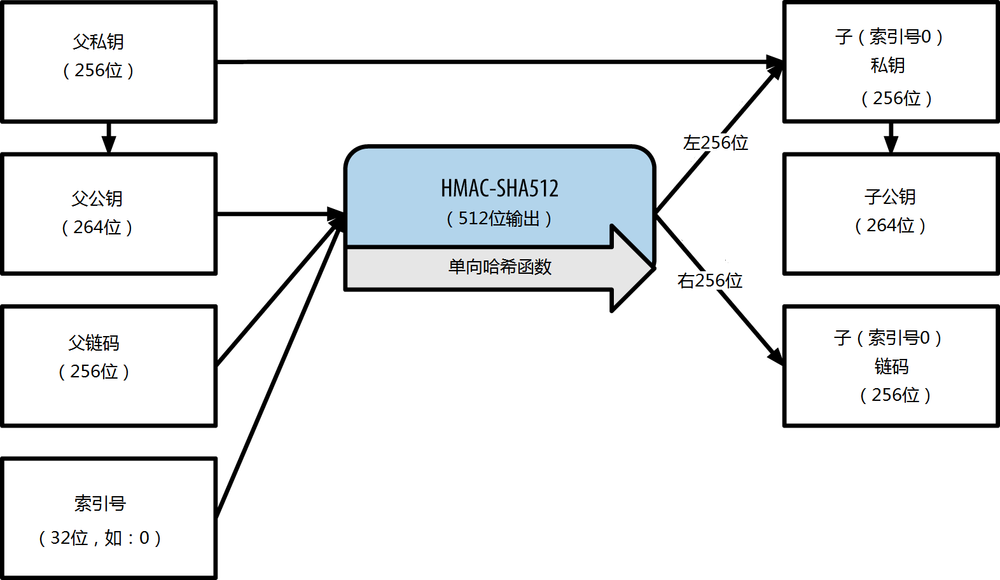

*图4-11 扩展父私钥生成子私钥*

改变索引号，允许我们扩展父密钥，并顺序生成其他子密钥，比如子密钥0，子密钥1，子密钥2，等等。每个服密钥可以最多产生20亿个子密钥。

从树上下降一层，重复以上步骤，每个子密钥变成了父密钥，可以创建它们自己的子密钥，以此类推，可以产生无穷多的后代。

###使用派生子密钥
子私钥与非确定性（随机）密钥是不可区分的。因为衍生函数是一个单项函数，子密钥不能用于找到其父密钥。子密钥同样不能用于找到任何同辈密钥。如果你拥有第n个子密钥，你无法找到它的同辈，比如第n-1子密钥或者第n+1子密钥，或者其他任何序列中的子密钥。只有福密云和链码可用于衍生所有子密钥。没有子链码，子密钥也无法用于衍生任何孙密钥。你需要同时拥有子私钥和子链码来开始一个新的分支并衍生孙密钥。

那么，子密钥本书可以拿来做什么呢？它可以用于产生一个公钥，一个比特币地址。然后你可以用于签署交易花费发送到该地址上的资金。

子私钥，相应的公钥以及比特币地址，和随机生成的密钥、地址没有任何区别。事实上，它们构成的序列在生成它们的HD钱包外是不可见的。一旦创建，它们与“普通”密钥并没有任何区别。

###扩展密钥

就像之前看到的，密钥衍生函数可以在树的任何层次基于三个要素：密钥、链码、索引号，创建新的子密钥。两个至关重要的要素是密钥和链码，它们的组合叫做*扩展密钥*。名词“扩展密钥”也可以理解为“可扩展的密钥”，因为这样一个密钥可用于衍生子密钥。

扩展密钥将一个256位密钥和256位链码连接成一个512位的序列进行存储和展现。有两种类型的扩展密钥：扩展私钥连接私钥和链码，用于产生子密钥（并由此产生子公钥）；扩展公钥连接公钥和链码，可用于创建子公钥，就如第68页《创建公钥》中描述的。

将扩展公钥想象为HD钱包树状结构中一个分支的根节点，从分支的根节点出发，可以派生出分支下的其他节点。扩展私钥可以创建完整的分支，而扩展公钥只能创建分支中的公钥。

一个扩展密钥包括一个私钥或者公钥，链码。一个扩展密钥可以创建其子密钥，在树状结构中生成它自己的分支。分享一个扩展密钥可以授权对整个分支的访问权限。

扩展密钥采用Base58Check编码格式以便在不同的BIP0032兼容的钱包软件间进行导入和导出。扩展密钥的Base58Check编码采用一个特殊的版本号，当采用Base58字符进行编码时，其前缀为“xprv”和“xpub”，以便于识别。由于扩展密钥是512或513位，它比我们之前看到的其他Base58Check编码的字符串长很多。

下面是一个Base58Check编码的扩展私钥的例子：

	xprv9tyUQV64JT5qs3RSTJkXCWKMyUgoQp7F3hA1xzG6ZGu6u6Q9VMNjGr67Lctvy5P8oyaYAL9CAWrUE9i6GoNMKUga5biW6Hx4tws2six3b9c

下面是其对应的扩展公钥，同样以Base58Check格式进行编码：

	xpub67xpozcx8pe95XVuZLHXZeG6XWXHpGq6Qv5cmNfi7cS5mtjJ2tgypeQbBs2UAR6KECeeMVKZBPLrtJunSDMstweyLXhRgPxdp14sk9tJPW9

###子公钥派生

就如之前提到过的，层次化确定性钱包的一个很有用的特性就是可以从父公钥派生子公钥，而不需要其私钥。这使我们可以使用两种方式派生子公钥：或者从子私钥计算得出，或者直接从其父公钥派生。

如此，一个扩展公钥可以用于派生其HD钱包结构的分支下的所有子公钥（只有子公钥）。

当服务器或者应用程序只有一个扩展公钥的副本，而没有任何私钥时，这种快捷的公钥派生方式可以用于创建非常安全的仅限公钥的部署。这种部署方式可以创建无穷多的公钥和比特币地址，但是不能花费任何发送到这些地址上的资金。同时，在其他更安全的服务器上，扩展私钥可以派生出与扩展公钥相对应的私钥，用于签署交易并花费资金。

这种解决方案下的一个典型应用场景是在一台用于电子商务应用的web服务器上安装扩展公钥。web服务器可以利用公钥派生函数创建一个全新的比特币地址用于每个交易（比如，用于客户的购物车）。Web服务器没有任何私钥部署在其上，这样就避免了私钥丢失的风险。若没有HD钱包，唯一的解决途径就是在分开的安全服务器上创建成千上万个比特币地址，然后将它们预加载到电子商务服务器上。这种方式很麻烦，需要持续的维护以避免电子商务服务器用尽那些密钥。

另外一个场景是用于冷存储或硬件钱包。在这种情景下，扩展私钥可以存储在一个纸钱包或者硬件设备（比如Trezor硬件钱包）上，而扩展公钥可以在线保存。用户可以随时创建“接收”地址，而私钥却可以安全的存储在线下。为了花费资金，用户可以在离线签名比特币客户端上使用扩展私钥，或者使用硬件钱包设备（比如Trezor）来签署交易。图4-12显示扩展父公钥派生子公钥的机制。

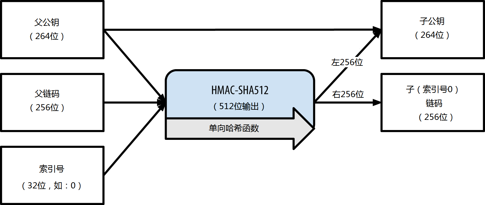

*图4-12 扩展一个父公钥以创建子公钥*

###强化的子密钥派生

从扩展公钥派生一个分支的公钥的能力非常有用的，但是它有个与身俱来的潜在威胁。访问一个扩展公钥不会给予访问子私钥的权限。但是，因为扩展公钥包含链码，如果子私钥已知，或者不小心泄露，那么就可以利用子私钥和链码派生出所有子私钥。一个泄露的子私钥，配合一个父链码，导致了所有子节点的私钥的泄露。更糟糕的是，一个子私钥，连同父链码，可以推导出父私钥。

为防止这种威胁，HD钱包使用一个替代的派生函数叫做*强化派生(hardened derivation)*，它断开了父公钥与子链码间的关系。强化派生函数利用父私钥来派生子链码，而不是父公钥。这样就创建了一个父/子顺序间的“防火墙”。银行派生函数看起来与普通子私钥派生一模一样，除了使用父私钥替代了父公钥。如图4-13：

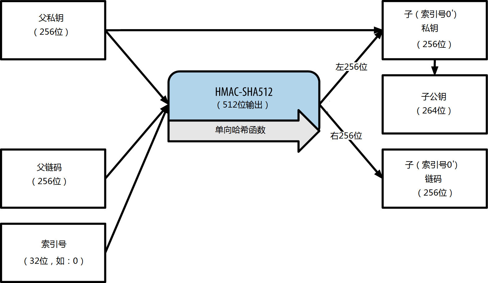

*图4-13 子密钥的强化派生；省略了父公钥*

当使用强化的私钥派生函数时，产生的子私钥和链码是与普通的派生函数产生的结果完全不同的。其产生的密钥“分支”可以用于生成没有弱点的扩展公钥，因为它们包含的链码无法用于推导任何私钥。强化派生因此被用于创建一个所用的扩展公钥所在层级之上的树上的一个鸿沟。

用简单的话来说，如果你想利用扩展公钥派生公钥分支的便利性，有不想使自己暴露在链码泄露的风险中，你需要从一个强化的父密钥，而不是普通父密钥来派生。作为最佳实践，主密钥的第一层子密钥总是通过一个强化派生函数派生而来，避免主密钥的推导。

###普通派生和强化派生的索引号

派生函数中用到的索引号是一个32位的整数。为了易于区分从普通派生函数和强化派生函数派生的密钥，索引号被拆分成两个范围。介于0到2^{32}-1（0x0到0x7FFFFFFF）只用于普通派生，索引号介于2^{31}到2^{32}-1(0x80000000 to 0xFFFFFFFF)只用于强化派生。这样，如果索引号小于2^31，意味着这是个普通子密钥，而如果索引号大于等于2^31，子密钥就是强化的。

为了使索引号易于阅读和显示，强化子密钥的索引号从0开始显示，但是带一个上引号。第一个普通子密钥显示为0，但是第一个强化子密钥（索引号为0x80000000）显示为0'。相应的，第二个强化密钥的索引号为0x80000001，显示为1',以此类推。当你看到一个HD钱包的索引号i'，与2^31+i等价。

###HD钱包密钥标识符（路径）
HD钱包中的密钥使用“路径”命名规则进行标识，树上的层与层之间采用一个“/”分隔符进行分隔。从主私钥派生而来的私钥开始于“m”。从主公钥派生而来的公钥开始于“M”。这样，主私钥的第一个子私钥表示为"m/0"。主公钥的第一个子公钥表示为“M/0"。第一个子私钥的第二个孙子私钥表示为“m/0/1”，以此类推。

一个密钥的“血缘关系”是从右往左读的，直到到达主密钥的位置。举例来说，标识符“m/x/y/z”描述一个密钥，它是密钥“m/x/y”的第z个子密钥，而“m/x/y”是“m/x”的第y个子密钥，“m/x”是m的第x个子密钥。

*表4-8 HD钱包的路径举例*

|HD路径|密钥描述|
|------|-----|
|m/0|主私钥（m）的第一个（0）子私钥|
|m/0/0|第一个子私钥的第一个孙私钥|
|m/0'/0|第一个强化子私钥（m/0'）的第一个普通孙私钥|
|m/1/0|第二个子私钥（m/1）的第一个孙私钥|
|M/23/17/0/0|第24个子公钥的第18个孙公钥的第1个曾孙公钥的第1个曾曾孙公钥|

###HD钱包树状结构导航

HD钱包的树状结构提供了无比强大的弹性。每个父扩展密钥可以拥有40亿个子密钥：20亿普通子密钥和20亿强化子密钥。每个子密钥又拥有40亿个子密钥，以此类推。只要你愿意，这课树任意扩展到无限代。但是，正因为其弹性，要对这课无限树进行导航也变得极其困难。尤为困难的是在不同HD钱包间进行转移时，因为内部机构到分支及子分子的映射的可能性是无穷多的。

对这一复杂性，两个比特币改进建议（BIP）提供了一种解决方案，即对HD钱包的树状结构创建一些建议标准。BIP0043建议第一个强化子索引作为一个特别的标识符，用于表示树结构的“目的”。基于BIP0043，HD钱包只能使用一个层级-1的分支，通过定义索引号的目的，使用索引号表示树的剩余部分的结构和命名空间。举例来说，一个HD钱包只使用分支m/i'/是为了标识一个特定目的，而这个目的由索引号“i”进行指定。

BIP0044扩展了上述规范，提出一种多账号结构作为BIP0043下索引号44'的“目的”。所有遵循BIP0044的结构仅使用树的一个分支：m/44'/。

BIP0044规定包含五个预定义层级的树状结构：

>m / purpose' / coin_type' / account' / change / address_index

第一层“目的”（purpose）总是设置为44'。第二层“币类别”(coin_type)指定加密币类型，允许多币种HD钱包，每个币种在第二层下拥有自己的子树。目前已经定义了三种货币类型：比特币m/44'/0;比特币测试网络（Bitcoin Testnet）m/44'/1';莱特币（Litecoin）m/44'/2'。

第三层是“账户”（account），它允许用户将它们的钱包分成几个逻辑独立的子账户，用作会计或组织机构用途。比如，一个HD钱包可能包含两个比特币“账户”：m/44'/0'/0'，m/44'/0'/1'。每个账户都是它们子树的根。

在第四层，“找零”（changge），一个HD钱包有两个子树，一个用于创建接收地址，另一个用于创建找零地址。注意，不管上层是否使用强化派生，这层均使用普通派生。这是为了允许在这层树上可以导出扩展公钥用于不安全的环境中。可用的地址作为第四层的子密钥，是由HD钱包进行派生计算得来的，从而形成了第五层的“地址索引”（address_index）。比如：主账户中的第三个比特币支付接收地址就是M/44'/0'/0'/0/2.**表4-9**列出了更多的例子：

*表4-9 BIP0044 HD钱包结构示例*

|HD路径|密钥描述|
|------|--------|
|M/44'/0'/0'/0/2|主账户上的第3个收款公钥|
|M/44'/0'/0'/1/14|第4个比特币账户上的第15个找零地址公钥|
|m/44'/2'/0'/0/1|莱特币主账户的第二个私钥，用于交易签名|

###使用sx工具集进行HD钱包试验

使用第3章介绍的命令行工具sx，你可以生成和扩展BIP0032确定性密钥，并以不同格式展示它们：

	$ sx hd-seed > m #从一个种子创建一个新的主私钥，并存储于文件“m”中
	$ cat m #显示主扩展私钥
	xprv9s21ZrQH143K38iQ9Y5p6qoB8C75TE71NfpyQPdfGvzghDt39DHPFpovvtWZaRgY5uPwV7RpEgHs7cvdgfiSjLjjbuGKGcjRyU7RGGSS8Xa
	$ cat m | sx hd-pub 0 #生成M/0扩展公钥
	xpub67xpozcx8pe95XVuZLHXZeG6XWXHpGq6Qv5cmNfi7cS5mtjJ2tgypeQbBs2UAR6KECeeMVKZBPLrtJunSDMstweyLXhRgPxdp14sk9tJPW9
	$ cat m | sx hd-priv 0 #生成m/0扩展私钥
	xprv9tyUQV64JT5qs3RSTJkXCWKMyUgoQp7F3hA1xzG6ZGu6u6Q9VMNjGr67Lctvy5P8oyaYAL9CAWrUE9i6GoNMKUga5biW6Hx4tws2six3b9c
	$ cat m | sx hd-priv 0 | sx hd-to-wif #以WIF格式显示私钥m/0
	L1pbvV86crAGoDzqmgY85xURkz3c435Z9nirMt52UbnGjYMzKBUN
	$ cat m | sx hd-pub 0 | sx hd-to-address # show the bitcoin address of M/0
	1CHCnCjgMNb6digimckNQ6TBVcTWBAmPHK
	$ cat m | sx hd-priv 0 | sx hd-priv 12 --hard | sx hd-priv 4 #生成m/0/12'/4
	xprv9yL8ndfdPVeDWJenF18oiHguRUj8jHmVrqqD97YQHeTcR3LCeh53q5PXPkLsy2kRaqgwoS6YZBLatRZRyUeAkRPe1kLR1P6Mn7jUrXFquUt

#高级密钥和地址

在本节中，我们将观察密钥和地址的高级形式，比如加密私钥，脚本和多签名地址，炫耀地址以及纸钱包。

##加密私钥（BIP0038）

私钥必须一直保持私密。私钥的保密性要求在实践中是很难实现的，因为它与同等重要的安全目标---可用性，形成了直接冲突。当你需要保存使用的备份以防丢失时，如何保证私钥的私密性更为困难。将私钥保存在钱包中，并通过密码加密会安全一些，但是这样钱包就需要进行备份。时不时的，用户需要将密钥从一个钱包转移到另一个钱包---比如为了升级或者更换钱包软件。私钥备份可能也需要保存在纸上（见第104页《纸钱包》），或者一个外置存储介质上，比如U盘。但是假如备份自己被盗或者丢失呢？这些冲突的安全目标，推动了一个私钥加密提议的诞生，它便携、方便，可以被不同的钱包和比特币客户端所理解，这个提议由比特币改进建议38号标准化，称之为BIP0038（见[BIP0038])。

BIP0038提出了使用密码加密私钥，并进行Base58Check编码的标准，该标准保证密钥可以在备份介质上安全存储、在不同钱包间安全转移、在任何可能导致密钥泄露的场合保存。这个加密标准使用**高级加密标准**（AES），AES标准是美国国家标准技术研究所（NIST）创立的，广泛应用于商业及军事领域的数据加密。

BIP0038加密方案以一个比特币私钥作为输入，私钥通常以钱包导入格式（WIF）编码，是一个使用Base58Check字符，并带前缀“5”的字符串。另外，BIP0038方案还需要一个长密码---由多个单词或者包含数字字母的复杂的字符串。BIP0038方案的结构是一个Base58Check编码的加密私钥，以前缀“6P”开头。如果你看到一个密钥以“6P”开头，意味着它是一个加密的密钥，需要密码才能将其转换（解密）回可在钱包中使用的WIF格式的私钥（前缀为“5”）。很多钱包软件现在已经支持编码BIO0038加密私钥，并会提示用户输入密码以解密和导入使用。第三方应用，比如难以置信的好用的基于浏览器的“**Bit Address**”（Wallet Details选项卡）就可用于解密BIP0038密钥。

BIP0038加密密钥最常用的案例是使用纸钱包，纸钱包用于在一张纸上备份私钥。一旦用户选择了足够强壮的密码，一个带BIP0038加密密钥的纸钱包将会极为安全，是比特币离线存储的极好选择（这也被称为“冷存储”）。

使用[bitaddress.org](http://bitaddress.org)测试表4-10中的加密密钥，看是如何通过输入密码得到解密密钥的。

*表4-10 BIP0038加密私钥示例*

|  |  |
|-----|-----|
|**私钥(WIF)**|5J3mBbAH58CpQ3Y5RNJpUKPE62SQ5tfcvU2JpbnkeyhfsYB1Jcn|
|**密码**|MyTestPassphrase|
|**加密密钥（BIP0038）**|6PRTHL6mWa48xSopbU1cKrVjpKbBZxcLRRCdctLJ3z5yxE87MobKoXdTsJ|

##支付给脚本的哈希值(P2SH)与多重签名地址

就如我们了解的，传统比特币地址是以数字“1”开头的，从公钥派生而来，而公钥又是从私钥派生而来的。虽然任何人都可以往一个“1”开头的比特币地址发送比特币，但是只有能提供与公钥哈希相对应的私钥，并进行签名的人才能花费这笔比特币。

以“3”开头的比特币地址是pay-to-script hash(支付给脚本哈希值，P2SH)地址，有时也被错误的称作多重签名（multi-signature或multi-sig）地址。这种地址指定交易的受益人是一个脚本的哈希而不是公钥的所有人。这项功能于2012年1月以BIP0016建议的形式引进，由于它为比特币地址本身提供了一个拥有更多功能的机会，目前已被广泛采纳。不像发送资金到“1”开头比特币地址（也被称为“支付给公钥的哈希值”（P2PKH））的普通交易，发送资金到“3”开头地址，除了需要公钥哈希和作为所有权证明的私钥签名，还需要更多的东西。这些要求在地址创建时就在脚本中指定了，所有以这个地址作为目标的交易输入都会被这些要求所阻隔。一个发生到脚本哈希地址是从一个交易脚本中创建的，它定义了谁可以花费这个交易输出（更详细的说明，参见第132页《支付给脚本的哈希值(P2SH)》）。编码一个支付给脚本的哈希值地址需要使用与创建比特币地址相同的双重哈希函数，只是它作用于脚本上而不是公钥上：

	script hash = RIPEMD160(SHA256(script))

结果的“脚本哈希”加上版本前缀“5”，并以Base58Check格式编码，得到一个3开头的已编码的地址。这是一个P2SH地址的范例：*32M8ednmuyZ2zVbes4puqe44NZumgG92sM*

P2Sh不必与多重签名标准交易相同。一个P2SH地址*常常*表示一个多重签名脚本，但它也可以表示其他类型的交易。

##多重签名地址和P2SH

目前，P2SH实现的功能大多是多重签名地址脚本。就像名字暗示的，底层脚本要求超过一个签名来证明所有权并花费资金。比特币多重签名功能是设计来要求在N个密钥中，至少需要M个签名（称之为“阈值”）的，称之为M-N多重签名，这里M小于等于N。举例来说，咖啡店老板鲍勃（第一章介绍的）可以使用一个多重签名地址，要求进行1-2签名，其中一个密钥来自于鲍勃，另一个来自于他妻子，以确保他们中的人一个都可以签名花费被这个地址锁定的交易输出。这与传统银行提供的“联合账户”功能类似，联合账户允许夫妻中任何一人签名即可使用资金。或者高佩什，那个为鲍勃设计网站的设计师，可以为其业务创建一个2-3签名地址，确保至少两个业务合作伙伴对交易签名后才能花费此地址内的资金。

我们在第5章中将探索如何创建一个交易以花费从P2SH（以及多重签名）地址接收到的资金。

##虚荣地址
虚荣地址是一种包含人工可读信息的有效比特币地址。比方说*1LoveBPzzD72PUXLzCkYAtGFYmK5vYNR33*就是一个有效地址，它包含了英文单词“Love”，并作为Base-58字符的前面4位。虚荣地址需要生产并测试数十亿的候选私钥，直到找到一个能生成指定模式的私钥。虽然有些生成虚荣地址的优化算法，但是归根结底，其过程都是随机选择一个私钥，生成公钥，并由此生成地址，最后检查地址是否满足虚荣需求，重复这个过程几十亿次直到找到匹配的。

一旦找到一个与期望模式匹配的虚荣地址，与之相应的私钥就可用于花费比特币，这与其他地址完全一样。虚荣地址与普通地址相比没有任何区别。它们基于相同的椭圆曲线密码学（ECC）和安全哈希算法（SHA）。想通过虚荣地址查找私钥其难度也与普通地址一样。

在第1章中，我们介绍过尤金妮亚，一个菲律宾儿童慈善机构的总监。假设尤金妮亚正举办一个比特币的募捐活动，她想使用公布虚荣地址作为募捐地址。尤金妮亚创建了一个以“1Kids”开头的比特币地址，用于募捐宣传。下面我们来看看这个虚荣地址是如何创建的，以及这个地址对于尤金妮亚的慈善机构又意味着什么。

###创建虚荣地址
首先，我们必须认识到比特币地址只是一个简单的数字，以Base58字符编码表示。为了找到“1Kids”开头的地址，可以看做是从1Kids11111111111111111111111111111到1Kidszzzzzzzzzzzzzzzzzzzzzzzzzzzzz中随便找到一个。则总共约有58^29（约等于1.4*10^{51}）个地址，都是以“1Kids”开头。表4-11显示了具有1Kids开头的地址范围：

*表4-11 以“1Kids”开头的虚荣地址范围*

|---|----|
|**开始** |1Kids11111111111111111111111111111|
|**截止** |1Kidszzzzzzzzzzzzzzzzzzzzzzzzzzzzz|

我们把模式“1Kids”看作一个数字，看一下在比特币地址里找到这个模式的频率（参看表4-12）。一台不带特殊硬件的台式电脑，每秒大概可以进行100000次密钥搜索。

*表4-12 出现虚荣模式（“1KidsCharity”）的频率以及在台式电脑上平均消耗时间*

|长度|模式|频率|平均搜索时间|
|----|----|----|-------|
|1|1K|1/58(58个密钥中1次)|<1毫秒|
|2|1Ki|1/3,364|50毫秒|
|3|1Kid|1/(195*10^3)	|<2秒|
|4|1Kids|1/(11*10^6)|1分钟|
|5|1KidsC|1/(656*10^6)|1小时|
|6|1KidsCh|1/(38*10^9)|2天|
|7|1KidsCha|1/(2.2*10^{12})|3-4个月|
|8|1KidsChar|1/(128*10^12)|13-18年|
|9|1KidsChari|1/(7*10^15)|800年|
|10|1KidsCharit|1/(400*10^15)|46,000年|
|11|1KidsCharity|1/(23*10^18)|250万年|

就像你看到的尤金妮亚不可能马上创建“1KidsCharity”这样的地址，即使她能同时访问几千台计算机。任何一个字符的增加，难度就会增加58倍。超过7个字符的模式一般只能通过特定的硬件找到，比如定制的带有多块图形处理单元（GPU）的电脑。这些电脑通常是比特币“矿机”再利用的产物，这些“矿机”用作挖矿已经无利可图，但是作为查找虚荣地址却是可用的。在GPU上查找虚荣地址要比通用CPU上查找快很多数量级。

查找虚荣地址的另外一种方式是外包给虚荣矿池，比如“Vanity Pool”矿池。矿池是那些拥有GPU硬件的人提供的一种服务，他们通过帮助别人查找虚荣地址还挣取比特币。通过支付一笔很小的资金（0.01比特币，在写本书时大概相当于5美元），尤金妮亚就可以通过外包搜索得到一个7位数的虚荣地址，这个过程仅需几个小时，而如果自己用CPU计算的话，需要花上几个月时间。

创建虚荣地址是一种暴力破解过程：尝试一个随机密钥，检查它的地址是否与目标模式匹配，不断重复直到成功。**例4-8**演示了一个“虚荣地址矿工”，一个用于查找虚荣地址的程序，基于C++。例子使用了我们在第56页《替代客户端、库和工具集》中介绍过的libbitcoin库。

*例4-8 虚荣地址矿工*

	#include <bitcoin/bitcoin.hpp>
	
	//待查找字符串
	const std::string search = "1kid";
	
	//创建一个32字节随机密钥.
	bc::ec_secret random_secret(std::default_random_engine& engine);
	//从EC密钥中解压出比特币地址.
	std::string bitcoin_address(const bc::ec_secret& secret);
	//与搜索字符串进行不区分大小写的比较
	bool match_found(const std::string& address);
	
	int main()
	{
	    std::random_device random;
	    std::default_random_engine engine(random());
	
	    // Loop continuously...
	    while (true)
	    {
	        //创建一个随机密钥.
	        bc::ec_secret secret = random_secret(engine);
	        //获取地址.
	        std::string address = bitcoin_address(secret);
	        //与我们的搜索字符串匹配吗? (1kid)
	        if (match_found(address))
	        {
	            //成功!
	            std::cout << "Found vanity address! " << address << std::endl;
	            std::cout << "Secret: " << bc::encode_hex(secret) << std::endl;
	            return 0;
	        }
	    }
	    // 永远无法到达这里!
	    return 0;
	}
	
	bc::ec_secret random_secret(std::default_random_engine& engine)
	{
	    // 创建新密钥...
	    bc::ec_secret secret;
	    //对每个设置随机值的字节进行迭代...
	    for (uint8_t& byte: secret)
	        byte = engine() % std::numeric_limits<uint8_t>::max();
	    // 返回结果.
	    return secret;
	}
	
	std::string bitcoin_address(const bc::ec_secret& secret)
	{
	    // 密钥转换为公钥...
	    bc::ec_point pubkey = bc::secret_to_public_key(secret);
	    // 最后创建地址.
	    bc::payment_address payaddr;
	    bc::set_public_key(payaddr, pubkey);
	    // 返回编码后的地址.
	    return payaddr.encoded();
	}
	
	bool match_found(const std::string& address)
	{
	    auto addr_it = address.begin();
	    //循环比较搜索字符串和小写的地址字符.
	    for (auto it = search.begin(); it != search.end(); ++it, ++addr_it)
	        if (*it != std::tolower(*addr_it))
	            return false;
	    //到达搜索字符串尾部，地址匹配与搜索模式匹配.
	    return true;
	}

示例代码必须使用C++编译器进行编译，并与libbitcoin库连接（库必须预先安装在系统上）。运行示例时，只要运行vanity-miner（假设编译时输出文件为vanity-miner）可执行程序，不需任何参数（参看例4-9），程序将尝试找到一个“1Kids”开头的地址。

*例4-9 编译并运行vanity-miner示例程序*

	$ # 使用g++编译
	$ g++ -o vanity-miner vanity-miner.cpp $(pkg-config --cflags --libs libbitcoin)
	$ # 运行例子
	$ ./vanity-miner
	Found vanity address! 1KiDzkG4MxmovZryZRj8tK81oQRhbZ46YT
	Secret: 57cc268a05f83a23ac9d930bc8565bac4e277055f4794cbd1a39e5e71c038f3f
	$ # 重新运行以查找其他结果
	$ ./vanity-miner
	Found vanity address! 1Kidxr3wsmMzzouwXibKfwTYs5Pau8TUFn
	Secret: 7f65bbbbe6d8caae74a0c6a0d2d7b5c6663d71b60337299a1a2cf34c04b2a623
	$ # 使用"time"命令查看需要多长时间找到一个结果
	$ time ./vanity-miner
	Found vanity address! 1KidPWhKgGRQWD5PP5TAnGfDyfWp5yceXM
	Secret: 2a802e7a53d8aa237cd059377b616d2bfcfa4b0140bc85fa008f2d3d4b225349
	
	real    0m8.868s
	user    0m8.828s
	sys     0m0.035s

示例代码需要花费数秒钟找到一个匹配三个字符模式“Kid”的结果，就如我们刚刚通过Unix的*time*命令看到的执行时间。你可以在源码中修改搜索模式，看搜索四个甚至五个字符的模式需要多长时间。

###虚荣地址的安全

虚荣地址是一把双刃剑，既可以用于增强也可以用于削弱安全措施。用于提高安全性方面，一个与众不同的地址使得入侵者难以使用他们自己的地址替换成你的地址，以欺骗你的客户向他们付款。不幸的是，虚荣地址使得任何人都可以创建一个类似于随机地址的地址，或者另一个虚荣地址，以此欺骗你的客户。

尤金妮亚可以向愿意捐款的人宣布一个随机生成地址（比如：1J7mdg5rbQyUHENYdx39WVWK7fsLpEoXZy），或者她也可以生成一个以1Kids开头的易于识别的虚荣地址。

不管是哪种方式，均面临同样的威胁就，在使用固定地址（而不是每个捐献人一个独立的动态地址）的情况下，一旦有人侵入网站，并将这个地址替换为他自己的地址，捐献人的资金将被转入他的账户。如果你通过不同的渠道发布捐献地址，你的客户可以在确定支付前直观的检查这个地址，它与他们在你的网站、你的email或者你的传单上发布的是一样的。如果是一个随机地址，就像*1J7mdg5rbQyUHENYdx39WVWK7fsLpEoXZy*这样，大部分客户可能会比对签名几个字符，比如*1J7mdg*，如果相同则认为地址是一样的。对于有意盗取资金的入侵者，可以使用一个虚荣地址生成器，生成一个前面几位相同的替代地址，看起来与这个地址很接近，就如表4-13所示的：

*表4-13 生成与随机地址类似的虚荣地址*

<table>
<tr>
<td>原始随机地址</td>
<td>1J7mdg5rbQyUHENYdx39WVWK7fsLpEoXZy</td>
</tr>
<tr>
<td>虚荣地址（4个字符匹配）</td>
<td>1J7md1QqU4LpctBetHS2ZoyLV5d6dShhEy</td>
</tr>
<tr>
<td>虚荣地址（5个字符匹配）</td>
<td>1J7mdgYqyNd4ya3UEcq31Q7sqRMXw2XZ6n</td>
</tr>
<tr>
<td>虚荣地址（6个字符匹配）</td>
<td>1J7mdg5WxGENmwyJP9xuGhG5KRzu99BBCX</td>
</tr>
</table>

那么虚荣地址能增强安全性吗？如果尤金妮亚生成一个虚荣地址*1Kids33q44erFfpeXrmDSz7zEqG2FesZEN*，客户很可能就会比对虚荣模式和其后的几个字符，比如“1Kids33”。这就使得攻击者必须至少生成6个字符（多两个字符），这将比尤金妮亚查找4位虚荣地址所花时间多3,364倍（58X58）。最重要的，尤金妮亚花费的努力（或者向虚荣地址矿池交付的资金）使得攻击者不得不生成更长的虚荣地址。如果尤金妮亚缴费让虚荣地址矿池生成一个8个字符的虚荣地址，攻击者将不得不创建10个字符长度的虚荣地址，这在普通电脑上已无法完成，而如果采用虚荣地址挖矿机或者虚荣地址矿池，也是极为昂贵的。尤金妮亚可承受的费用到了攻击者这边就变成难以承受的了，特别是如果潜在的回报无法覆盖生成虚荣地址需要花费的费用时。

#纸钱包

纸钱包就是将比特币私钥银证在纸张上。通常，出于方便起见，纸钱包也包含相应的比特币地址，不过这不是必须的，因为地址可以从私钥派生而来。纸钱包是一个非常高效的创建备份或离线比特币存储的手段，也称之为“冷存储”。作为一个备份机制，纸钱包可以提供足够的安全手段防止因为计算机的灾难造成的私钥丢失，比如硬盘失效，被盗或者意外删除。作为一种“冷存储”机制，如果纸钱包的密钥是离线生成，且从未在计算机系统上存储过，那么它们在对抗黑客，键盘记录以及其他在线威胁方面更具安全性。

纸钱包可以有不同的形状、尺寸和外观设计，但是本质上，就是将密钥和地址打印在纸张上。表4-14显示了一个最简单形式的纸钱包。

*表4-14 最简单形式的纸钱包---打印出来的比特币地址和私钥*

|公开地址|私钥（WIF格式）|
|------|----------|
|1424C2F4bC9JidNjjTUZCbUxv6Sa1Mt62x|5J3mBbAH58CpQ3Y5RNJpUKPE62SQ5tfcvU2JpbnkeyhfsYB1Jcn|

使用一些工具，比如bitaddress.org上客户侧的JavaScript生成器，可以简便的生成纸钱包。这个页面包含生成私钥和纸钱包必须的所有代码，即使与互联网完全断开，也不影响使用。为了使用这个工具，将HTML页面保持到本地硬盘或者外置U盘，然后断开与互联网的连接，在浏览器中打开刚才保存的文件。更安全的使用方法是，启动一个干净的操作系统，比如一个CDROM启动的干净Linux系统，来使用这个工具。这个工具在离线状态下生成的任何密钥均能通过USB线（不是无线）在本地打印机上打印出来。这样，创建的纸钱包的密钥只在本地纸张上存在，而不会在任何在线系统上存储。将纸钱包存在一个防火的保险箱内，发送比特币到它们对应的地址，一个降低但是高效的“冷存储”方案就实现了。图4-14显示一个通过bitaddress.org网站生成的纸钱包。

*图4-14 通过bitaddress.org生成的简单纸钱包的例子*

简单纸钱包系统的缺点是打印的密钥容易被贼盯上。一个能接触到纸钱包的贼既可以把那张纸偷走，也可以把私钥拍下来，从而控制被这些密钥控制的比特币。更复杂的纸钱包存储系统采用BIP0038加密私钥。打印在纸钱包上的密钥被主人脑袋记着的密码保护着。没有密码，加密密钥毫无用处。不管怎样，纸钱包仍然比密码保护的钱包更为安全，因为这些密钥从未在线，并且必须通过物理的方式从保险柜或者其他物理安全的存储设备上取得。图4-15显示一个在bitaddress.org上生成的使用加密密钥（BIP0038）的纸钱包。

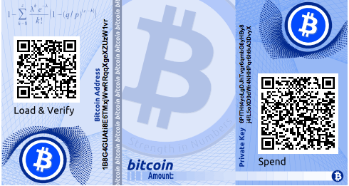

*图4-15 通过bitaddress.org生成的加密钱包，密码是“test”*

虽然你可以往一个纸钱包上多次存入资金，但是你必须一次性使用掉所有资金。这是因为在解锁和使用资金的过程中，你已经暴露了密钥，同样也因为当你花费的金额少于全部金额时。一些钱包可以生成一个找零地址。解决这个问题的一种方案是，一次性取出纸钱包地址上的所有余额，将剩余部分发送到另外一个新的纸钱包中。

纸钱包具有不同的设计和尺寸，也拥有不同的功能。有些设计来作为礼物送给别人，因此设计了季节主题，比如圣诞主题，元旦主题等；另外一些则存于银行金库或者保险柜中，私钥需要通过某些方式进行隐藏，比如覆盖不透明的贴纸，折叠并使用防篡改粘合箔密封等等。图4-16到4-18是一系列带安全保护和备份功能的不同的纸钱包。

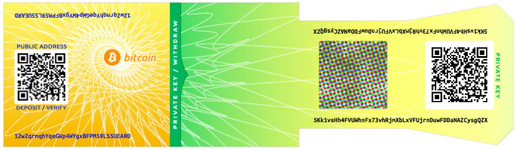

*图4-16 bitcoinpaperwallet.com生成纸钱包例子，私钥打印在折叠翼片上*

*图4-17 bitcoinpaperwallet.com的纸钱包，私钥被密封隐藏*

另外一种设计，支持额外的私钥和地址的备份，形式上是一个附加的存根，类似票根，允许存储多个副本以达到防火防洪以及其他自然灾害的目的。

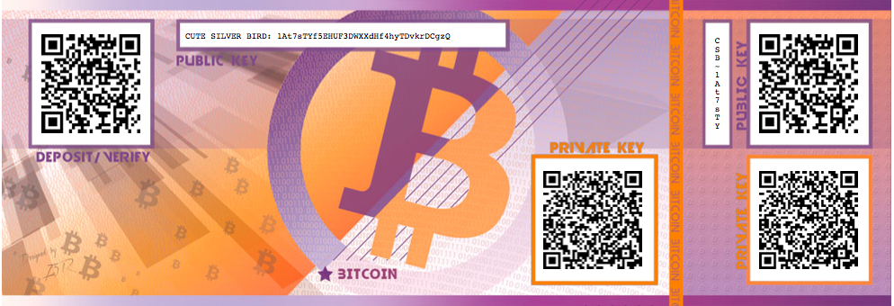

*图4-18 具有额外密钥副本的纸钱包，印制在备份“存根”上*

