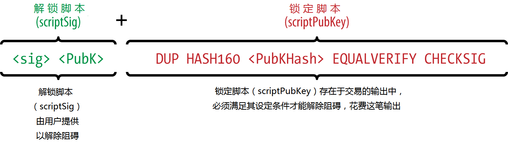
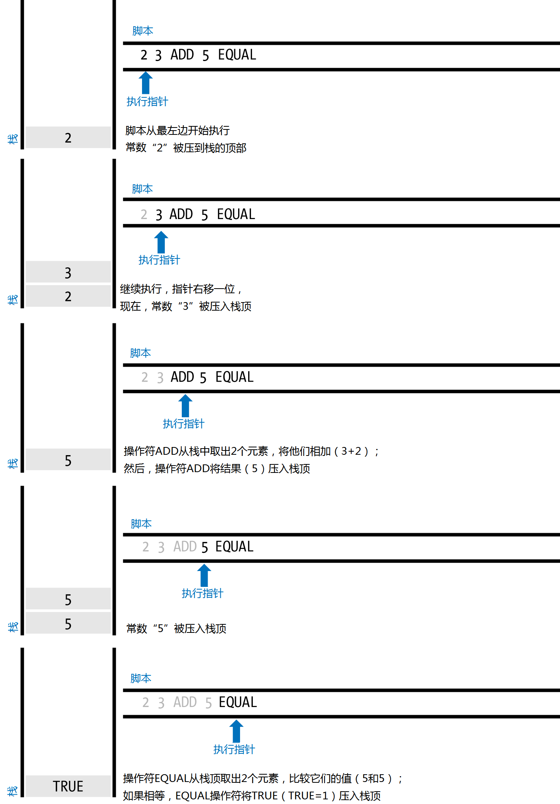
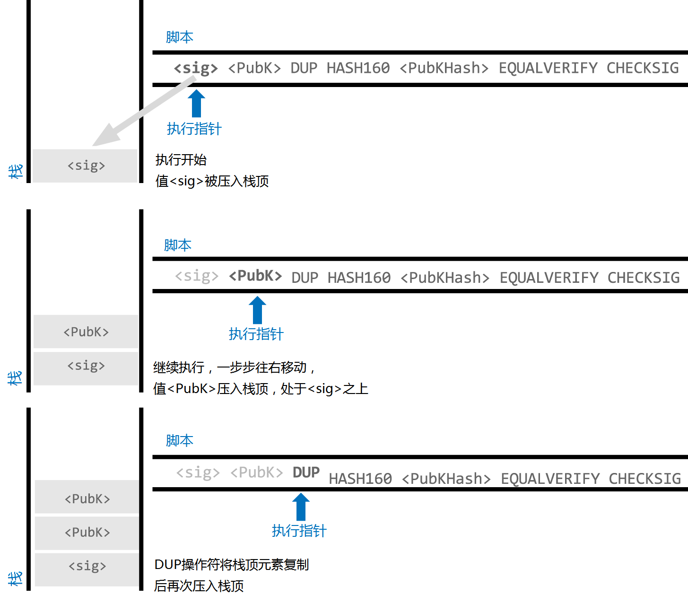
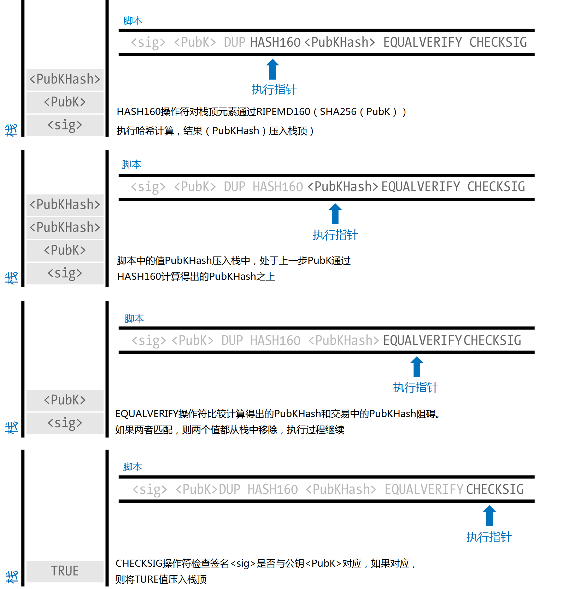

第5章 交易
=======

## 介绍

交易是比特币系统中最重要的部分。其他部分都是设计来为交易服务的，确保交易顺利创建，在网络中传播，验证，最后加入到全局交易账本（区块链）。交易是一个数据结构，用于对比特币系统中不同参与者间的价值传递进行编码。每个交易都是比特币区块链中的一条公开记录，而区块链则是一个全局的复式簿记账本。

在本章中，我们将研究交易的各种形式，它们包含什么内容，如何创建，如何验证，它们又是如何成为永久交易记录的一部分的。

## 交易生命周期

交易的生命周期始于交易的创建，也称之为起源。然后交易被签署上一个到多个签名，用于对交易中引用资金的授权。接着交易被广播到比特币网络，在那儿，网络节点（参与者）对交易进行验证并继续广播出去，直到被网络中的（几乎）所有节点获知。最后，交易被矿工节点确认，并被包含到一个交易区块中，记录到区块链上。

一旦被记录到区块链上，并被足够多的后续区块确认后，交易就成了比特币账本的永久组成部分，被所有参与者接受。交易中分配给新所有者的资金，现在可以在新交易中使用了。就这样，所有者链条得以延伸，一个新交易的生命周期开始了。

### 创建交易

为帮助理解交易的概念，可以将比特币交易想象成纸质支票。跟支票类似，交易也是一种表达资金转移意愿的工具，在提交执行前，它对金融系统是透明的；另外，交易的发起人不一定是对交易进行签名的人，这也跟支票一样。

任何人都可以在线或离线创建交易，甚至创建交易的人可以不是账户的有权签署人。举例来说，应付账款办事员可能会处理一笔需经CEO签字的付款支票。相似的，应付账款办事员也可以创建一笔比特币交易，然后经过CEO的数字签名使得交易生效。不同的是，支票需要关联一个账户作为其资金来源，而比特币交易是引用一个特定的前序交易作为其资金来源，而不是账户。

一旦交易被创建，它将被资金来源的所有者签名。如果交易的格式正确，签名合法，签名后的交易就是有效的了，它包含了用于执行资金转移的所有必须信息。最后，有效交易必须送达比特币网络，并被传播出去，直到被一个矿工包含到公开账本（区块链）之中。

### 将交易广播到比特币网络

首先，交易需要送达比特币网络，这样才能被传播出去并被加入区块链。本质上，一个比特币交易只有300到400字节的数据，需要传播到成千上万的比特币节点。发送者无需信任广播交易的任何节点，只要他们使用超过一个节点确保交易能被传播出去就行。接收节点也不需要信任发送者或者确认他们的“身份”。因为交易已被签名并且不含任何机密信息，比如私钥，证书，它可以通过任何方便的底层网络传输协议进行公开广播。不像信用卡交易，由于包含敏感信息，只能通过加密网络传输数据，比特币交易可以在任何网络上传输数据。只要交易送达能将其广播到比特币网络的节点，至于它是如何传递到第一个节点的，并不需要在乎。

因而，比特币交易可以通过不安全的网络传输到比特币网络中，比如WiFi，蓝牙，NFC，线性调频，条形码，甚至拷贝粘贴到一个web表单中。在极端情况下，比特币交易还可以通过无线电分组交换网、卫星中继，或者突发短波、扩频，或者防止检测和干扰的跳频的方式进行数据传输。比特币交易甚至也可以编码为一段表情符号（情感符），发布到公共论坛上，或者以文本消息或者Skype消息的形式发送。比特币将货币转换成了一种数据结构，实际上已经无法阻止任何人创建或执行比特币交易。

### 在比特币网络中传播交易

一旦比特币交易发送到任一与比特币网络相连的节点，交易就将被这个节点进行验证，如果有效，这个节点会将它继续传播到其他相连的节点上，交易发起者也会同步接收到一个成功应答。如果交易无效，接收节点将拒绝交易并返回一个交易拒绝的消息给交易发起者。

比特币网络是一个点对点网络，意味着每个节点均与其他一些启动时通过点对点协议发现的节点相连。整个网络构成一个松散连接的网状结构，没有固定的拓扑或其他结构，使得所有节点都是平等的。小写，包括交易和区块从一个节点被传播到与之相连的节点上。新注入到网络中任何节点的有效交易简便发送到三到四个相邻节点，每个相邻节点又再次将其发送到三到四个新的相邻节点，以此类推。利用这种方式，在短短几秒内，一个有效交易像指数级扩散的波纹一样在网络中迅速传播，直到到达所有连接着的节点。

比特币网络被设计成可以高效、弹性的方式在所有节点间传播交易和区块，同时它又能够有效防止攻击。为防止网络垃圾、拒绝服务攻击、或者其他针对系统的恶意攻击，每个节点均在传播交易前先进行独立验证。有缺陷的交易将无法传出节点。这个交易验证规则将在第177页《独立交易验证》中进行详细解释。

## 交易结构
一个交易就是一个数据结构，它用于对从资金源到目标的价值传递进行编码，其中资金源在交易中被称之为*输入*，目标被称之为*输出*。交易输入和输出与账户或者用户身份没有关联性。相反的，你应该把它们想象为交易金额，一组比特币，被一个特定的密钥锁定，只有所有者，或者知道那个密钥的人才能进行解锁。一个交易包含一系列字段，如表5-1所示：

|大小|字段|描述|
|----|----|------|
|4字节|Version|指定这个交易需要遵循那个规则|
|1-9字节|Input Counter|有多少输入|
|可变长度|Inputs|一个或多个交易输入|
|1-9字节|Output Counter|有多少输出|
|可变长度|Outputs|一个或多个交易输出|
|4字节|Locktime|Unix时间戳或者区块号|

|交易锁定时间（Transaction Locktime）|
|----|
|锁定时间定于一个交易可以被加入区块链的最早时间。大多数交易此值设置为0，意指立即执行。如果锁定时间一个非0，并且小于5亿，它被解释为区块高度，意思是交易不要被包含进指定高度以下的区块中。如果大于5亿，它是一个Unix时间戳（从1970.1.1以来的秒数），代表交易不要在这个时间前被加入到区块链中。锁定时间的使用等同于支票的延期支付。|

## 交易输入和输出
比特币交易的基本结构单元是*未花费交易输出*，或者叫UTXO，UTXO是一个不可拆分的比特币结构，锁定到一个特定的所有者，记录在区块链上，并被全网看做一个货币单元。比特币网络跟踪所有数以百万计的有效（未花费）UTXO。当一个用户接收到比特币，金额就以UTXO的形式记录在区块链上。这样，一个用户的比特币可能会以UTXO的形式分散存放在数百个交易和数百个区块上。实际上，没有任何东西会去记录一个比特币地址或者账户的余额；只有分散的UTXO，锁定到特定的所有者。用户比特币账户余额的概念是钱包应用自传统应用中继承而来的。钱包通过扫描区块链，收集所有属于这个用户的UTXO来统计用户的余额。

比特币中没有账户或余额；只有散布在区块链中的未花费交易输出（UTXO）。

一个UTXO可以由任意倍的“聪”（satoshis）构成。就像没有可以被分割为小数点后两位的“分”一样。比特币能够分割到小数点后八位，称作“聪”。虽然UTXO可以是任意金额，但是一旦创建，它就是不可分割的，就如一个硬币不能剖成两半一样。如果UTXO比交易需要的金额大，它也需要一次性花完，超出的部分通过在交易中找零来索回。换句话说，如果你有20比特币的UTXO，希望支付1个比特币，交易需要将20个比特币的UTXO全部花完，那么久需要创建两个输出：一个支付1比特币给指定的接收人，另外一个则将19个比特币返回到你的钱包。结果是，绝大部分交易都需要创建找零输出。

想象一个顾客需要买一份$1.50的饮料，她在她的钱包里找一些钞票和硬币以凑够这笔费用。如果刚好，顾客会选择精确的零钱（比如1张1美元纸币和2个25分硬币，或者6个25分的硬币），不凑巧的话，她可能会掏出一张5美元的纸币。如果给了太多的钱，比方说5块，给店员，她会收到3.5元的零钱，这些零钱将回到钱包供以后的交易使用。

类似的，比特币交易不管多大数额，都需要从用户的UTXO中进行创建。用户无法将UTXO拆成两半，就像不能把一张纸票撕成两半来用一样。用户的钱包应用将自动从可用的UTXO中选取不同的金额组合成大于等于所需金额的交易。

在真实生活中，比特币应用汇实业不同的策略来满足采购金额的要求：组合较小单位、找到精确的零钱、或者使用单一的大于交易金额的单元并进行找零。所有这些复杂的UTXO的组合都是由用户钱包自动完成的，用户看不到具体过程。只有你以编程的方式自己从UTXO中创建原始交易才需要关心这个选择的过程。

被交易消费的UTXO叫做交易输入，被交易创建的UTXO叫做交易输出。如此，比特币价值不停的从一个所有者转移到另一个所有者，形成一个消费、创建UTXO的交易链条。交易通过当前所有者的签名解锁并消费UTXO，通过将其锁定到新的所有者创建新的UTXO。

对于输出输入链来说，也有一个例外，它是一种特殊类型的交易叫做*币基（coinbase）*交易，币基交易是每个区块的第一个交易。这个交易是矿工“赢家”放进区块的，是作为矿工挖到区块的奖励。这也就是比特币货币在挖矿过程中的得以发行新币的过程。我们将在第8章看到。

哪个更先？输入还是输出，鸡还是蛋？严格的说，输出应该是更早产生的，因为币基交易产生了新的比特币，而这交易不需要输入，凭空就产生了输出。

### 交易输出

每个比特币交易都产生输出，输出将被记录在比特币账本上。除一种例外情况外（参看第130页《数据输出（OP_RETURN）》），几乎所有这些输出都创建可使用的比特币，称之为未花费交易输出或UTXO，这些UTXO会被全网识别并可被新所有者在将来的交易中花费。向某人发送比特币就是创建一个未花费交易输出（UTXO）并注册到他的地址上，随后他将可以花费这笔UTXO。

UTXO将被所有完全节点客户端通过其维护在内存中的数据库跟踪，这个数据库叫做UTXO集合或者UTXO池。新交易将从UTXO集合中消费（花费）一个或多个输出。

交易输出包含两部分：

* 比特币金额，“聪”的任意倍数，“聪”是比特币的最小单位
* 锁定脚本，也称之为“围栏”，它通过指定花费输出必须符合的条件将这个金额锁定

对于前面提到的锁定脚本，其使用的交易脚本语言将在第121页《交易脚本和脚本语言》中详细讨论。表5-2显示一个交易输出的结构：

*表5-2 交易输出结构*

|大小|字段|描述|
|8字节|Amount|比特币价值，以“聪”（10^{-8}比特）计|
|1-9字节（VarInt)|Locking-Script Size|用字节表示的后面的锁定脚本长度|
|可变长度|Locking-Script|定义花费输出条件的脚本|

在*例5-1*中，我们利用[blockchian.info](blockchain.info)的API来查找特定地址的未花费输出（UTXO）

*例5-1 通过脚本访问blockchain.info的API，查找特定地址对应的UTXO*

```python
	# 通过blockchain API获取未花费输出
	
	import json
	import requests
	
	# 示例地址
	address = '1Dorian4RoXcnBv9hnQ4Y2C1an6NJ4UrjX'
	
	# API的URL https://blockchain.info/unspent?active=<address>
	# 返回JSON对象，对象中有一个“未花费输出”列表，包含所有UTXO，就像这样：
	#{      "unspent_outputs":[
	#   {
	#     "tx_hash":"ebadfaa92f1fd29e2fe296eda702c48bd11ffd52313e986e99ddad9084062167",
	#     "tx_index":51919767,
	#     "tx_output_n": 1,
	#     "script":"76a9148c7e252f8d64b0b6e313985915110fcfefcf4a2d88ac",
	#     "value": 8000000,
	#     "value_hex": "7a1200",
	#     "confirmations":28691
	#   },
	# ...
	#]}
	
	resp = requests.get('https://blockchain.info/unspent?active=%s' % address)
	utxo_set = json.loads(resp.text)["unspent_outputs"]
	
	for utxo in utxo_set:
	    print "%s:%d - %ld Satoshis" % (utxo['tx_hash'], utxo['tx_output_n'], utxo['value'])

运行脚本，我们将看到一个列表，其格式类似：“交易ID:UTXO的索引号，以“聪”计算的价值”。锁定脚本在例5-2中未显示。

*例5-2 get-utxo.py脚本执行结果*

	$ python get-utxo.py
	ebadfaa92f1fd29e2fe296eda702c48bd11ffd52313e986e99ddad9084062167:1 - 8000000 Satoshis
	6596fd070679de96e405d52b51b8e1d644029108ec4cbfe451454486796a1ecf:0 - 16050000 Satoshis
	74d788804e2aae10891d72753d1520da1206e6f4f20481cc1555b7f2cb44aca0:0 - 5000000 Satoshis
	b2affea89ff82557c60d635a2a3137b8f88f12ecec85082f7d0a1f82ee203ac4:0 - 10000000 Satoshis
	...
```

#### 花费条件（阻碍）
交易输出将特定金额（单位：聪）与特定的阻碍或者锁定脚本相关联，明确了花费这个金额必须满足的条件。在大多数情况下，锁定脚本将输出锁定到一个特定的比特币地址上，从而将这笔资金的所有权转移给新的所有者。当爱丽丝想鲍勃咖啡店支付一杯咖啡的比特币时，她的交易创建了一个0.015比特币的输出，锁定到咖啡店的比特币地址上。这个0.015比特币的输出记录在区块链上，成为UTXO几乎的一部分，也意味着在鲍勃的钱包上，这笔输出已成为可使用余额的一部分。当鲍勃选择花费这笔余额时，他的交易将解开这个阻碍，通过提供包含私钥签名的解锁脚本对输出进行解锁。

### 交易输入
简而言之，交易输入是一个指向UTXO的指针。它们通过引用交易哈希和UTXO在区块链中的顺序号指向一个特定的UTXO。为了花费UTXO，交易输入含需要包含解锁脚本以满足UTXO设置的花费条件。解锁脚本通常就是证明锁定脚本中比特币地址所有权的签名。

当用户进行支付时，钱包通过选择可用的UTXO创建一个交易。举例来说，为了创建一个0.015的支付交易，钱包应用可能会选择一个0.01的UTXO和一个0.005的UTXO进行组合，以汇总成交易所需金额。

在**例5-3**中，我们使用一个“贪婪”算法，选择可用UTXO以创建一个特定支付金额的交易。在例子中，可用UTXO以常量数组的形式提供，在现实中，可用的UTXO需要通过RPC访问比特币核心或者其他第三方API，就像在**例5-1**中看到的。

*例5-3 一个计算总共可发送多少比特币的脚本*

```python

	# 使用贪婪算法从UTXO中选择输出
	
	from sys import argv
	
	class OutputInfo:
	
	    def __init__(self, tx_hash, tx_index, value):
	        self.tx_hash = tx_hash
	        self.tx_index = tx_index
	        self.value = value
	
	    def __repr__(self):
	        return "<%s:%s with %s Satoshis>" % (self.tx_hash, self.tx_index,
	                                             self.value)
	
	# 从未花费输出列表中选择最佳的输出
	# 返回输出列表和找零发送地址
	# 
	def select_outputs_greedy(unspent, min_value):
	    # 为空则失败.
	    if not unspent:
	        return None
	    # 拆成两个列表
	    lessers = [utxo for utxo in unspent if utxo.value < min_value]
	    greaters = [utxo for utxo in unspent if utxo.value >= min_value]
	    key_func = lambda utxo: utxo.value
	    if greaters:
	        # 非空，寻找最小的greater.
	        min_greater = min(greaters)
	        change = min_greater.value - min_value
	        return [min_greater], change
	    # greaters中未找到. 尝试几个lessers.
	    # 从最大到最小重排列，我们需要查找可能的最小输入金额。
	    lessers.sort(key=key_func, reverse=True)
	    result = []
	    accum = 0
	    for utxo in lessers:
	        result.append(utxo)
	        accum += utxo.value
	        if accum >= min_value:
	            change = accum - min_value
	            return result, "Change: %d Satoshis" % change
	    # 结果未找到.
	    return None, 0
	
	def main():
	    unspent = [
	        OutputInfo("ebadfaa92f1fd29e2fe296eda702c48bd11ffd52313e986e99ddad9084062167", 1,  8000000),
	        OutputInfo("6596fd070679de96e405d52b51b8e1d644029108ec4cbfe451454486796a1ecf", 0,  16050000),
	        OutputInfo("b2affea89ff82557c60d635a2a3137b8f88f12ecec85082f7d0a1f82ee203ac4", 0,  10000000),
	        OutputInfo("7dbc497969c7475e45d952c4a872e213fb15d45e5cd3473c386a71a1b0c136a1", 0,  25000000),
	        OutputInfo("55ea01bd7e9afd3d3ab9790199e777d62a0709cf0725e80a7350fdb22d7b8ec6", 17,  5470541),
	        OutputInfo("12b6a7934c1df821945ee9ee3b3326d07ca7a65fd6416ea44ce8c3db0c078c64", 0,  10000000),
	        OutputInfo("7f42eda67921ee92eae5f79bd37c68c9cb859b899ce70dba68c48338857b7818", 0,  16100000),
	    ]
	
	    if len(argv) > 1:
	        target = long(argv[1])
	    else:
	        target = 55000000
	
	    print "For transaction amount %d Satoshis (%f bitcoin) use: " % (target, target/10.0**8)
	    print select_outputs_greedy(unspent, target)
	
	if __name__ == "__main__":
	    main()

```

如果不带参数运行*select-utxo.py*，它会尝试构建一个UTXO集合（包含找零）来支付55,000,000聪（0.55比特币）。如果提供一个支付金额作为参数，脚本将选择UTXO来创建指定金额的支付。在**例5-4**中，我们执行脚本，并尝试创建一个0.5比特币（50,000,000聪）的支付。

	$ python select-utxo.py 50000000
	For transaction amount 50000000 Satoshis (0.500000 bitcoin) use:
	([<7dbc497969c7475e45d952c4a872e213fb15d45e5cd3473c386a71a1b0c136a1:0 with 25000000 Satoshis>,
	<7f42eda67921ee92eae5f79bd37c68c9cb859b899ce70dba68c48338857b7818:0 with 16100000 Satoshis>,
	<6596fd070679de96e405d52b51b8e1d644029108ec4cbfe451454486796a1ecf:0 with 16050000 Satoshis>],
	'Change: 7150000 Satoshis')

UTXO选定后，钱包开始创建包含每个UTXO签名的解锁脚本，使它们满足锁定脚本的条件从而可以花费。钱包加入这些UTXO的引用和解锁脚本作为交易输入。**表5-3**显示了交易输入的结构。

*表5-3* 交易输入结构*

|大小|字段|描述|
|----|----|----|
|32字节|Trasaction Hash|指向所花费UTXO的指针|
|4字节|Output Index|UTXO的编号，从0开始|
|1-9字节|Unlocking-Script Size|紧跟的解锁脚本的长度|
|变长|Unlocking-Script|满足UTXO锁定脚本条件的解锁脚本|
|4字节|Sequence Number|目前未被使用的交易替换功能，设成0xFFFFFFFF|

序号（sequence number）用于覆盖早于交易锁定时间的交易，这是比特币暂时未启用的功能。大多数交易将这个值设定为整数的最大值(0xFFFFFFFF），它会被比特币网络所忽略。如果交易有个非零锁定时间，至少有个序号要小于0xFFFFFFFF，以使锁定时间生效。

### 交易费用
大多数交易包含交易费用，作为为比特币网络安全作出贡献的矿工的报酬。矿工挖矿，收集费用和奖励将在第8章详细讨论。本节研究交易费用时如何包含进典型交易的。大多数钱包会计算并自动包含交易费用。但是如果你使用程序创建交易，或者使用命令行界面，你必须手工计算并包含这笔费用。

通过包含一小笔费用到每个交易中，可以形成对交易被加入下一区块的激励，也能成为对“垃圾”交易和系统滥用的反激励。矿工挖出新块，将交易记录到区块链上，并收集交易费用。

交易费用基于交易大小计算，以千字节为单位，而不是基于交易价值计算。总的来说，交易费用是基于网络中的市场力量来设置的。矿工们基于不同的规则包括交易费用对交易的优先级进行排序，在一定条件下，他们也免费处理交易。交易费用影响交易处理优先级，也就是说，带有足够费用的交易更有可能被包含进最近的下一个区块，而费用不足或者没有费用的交易就可能会被延迟，并依尽量处理的原则在后面的区块中包含，或者干脆就得不到处理。交易费用不是必须的，没有费用的交易最终可能也会被处理；但是附加一定费用会提高处理的优先级。

随着时间推移，交易费用的计算方式，以及它对交易优先级的影响也在变化。最初，交易费用时固定的，是网络中的一个常量。慢慢的，费用结构逐渐放宽，以便让基于网络容量和交易数量的市场力量对其产生所影响。当前最小交易费用固定为0.0001比特币或者每千字节0.1毫比特，最近刚从1毫比特降为这个值。大多数交易均小于1千字节；但是对于有多个输入和输出的交易，就会比较大。在将来的比特币协议修订版中，钱包应用预计会利用统计分析近期交易的平均费用，从而计算合理的交易费用附加到交易中。

当前矿工基于交易费用对交易优先级排序并包含入区块的算法将会第8章中详细介绍。

### 添加费用到交易中

交易的数据结构中并没有费用字段。实际上，费用隐含在交易输入汇总和交易输出汇总的差值中。交易输入加总扣除所有输出后，剩余的金额就成为交易费用，最终被矿工收集走。

交易费用是隐含的，是输入减输出的差额：

	Fees = Sum(Inputs) – Sum(Outputs)

费用是交易中容易让人迷惑的元素，但也是一个必须弄懂的关键点，因为，如果你自己创建交易，必须确保不会不小心因用尽输入而形成一笔很大的交易费用。这意味着你必须计算所有输入，必要时创建找零，否则你将向矿工贡献一笔很大的小费！

举例来说，如果你使用一个20比特币的UTXO来创建一笔1比特币的支付交易，你必须包含一个19比特币的找零输出，以使资金回到你的钱包。否则，余下的19比特币将被认作交易费用，将你的交易含进区块的矿工将收走这笔交易费用。虽然你的交易处理优先级提高了，而矿工也会因为收到一大笔交易费而高兴，但是这很可能不是你所希望的。

如果在手工创建的交易中忘记添加找零输出，交易找零将变为交易费。“不要找零钱了！”可能不上你希望的。

我们再来看看爱丽丝的咖啡购买过程，看看在实践上这是如何工作的。爱丽丝希望花费0.015比特币购买一杯咖啡。为确保交易能快速处理，她希望添加一些费用，比方说0.001到交易中。这意味着交易总费用时0.016.她的钱包必须找到一些UTXO，加起来余额大于等于0.016，当然，如果必要，就创建找零。假设爱丽丝的钱包中有一笔0.2的可用UTXO。交易需要耗尽这个UTXO，并创建两个输出，一个是支付给鲍勃咖啡店0.015，第二个是回到爱丽丝钱包的交易找零的0.184，还剩0.001未分配，就作为交易隐含的费用。

我们来看另一个场景。尤金妮亚，我们在菲律宾的儿童慈善机构总监，已经完成一个为学校儿童采购课本的募捐。她从世界各地接收到几千笔小额捐款，总共有50比特币，因此，她的钱包中充满了非常小额的支付（UTXO）。现在，她想从当地一个出版商处采购几百本课本，使用比特币支付。

当尤金妮亚的钱包应用尝试创建一个大额的支付交易时，它首先需要从大量小额的可用UTXO集合中抽取合适的UTXO作为交易输入。这笔交易需要抽取超过一百个小额UTXO作为输入，而只有一个交易输出，即付款给出版商。一个包含这么多输入的交易，其大小将超过一千字节，可能需要2到3千字节。其结果是，交易费用必须高过网络最低费用0.0001比特币。

尤金妮亚钱包应用会通过测量交易大小，并将其与每千字节的费用相乘得到适当的交易费用。很多钱包会对大交易多付一定的费用以确保交易被及早处理。更高的交易费用不是因为尤金妮亚花费的钱更多，而是因为她的交易更复杂，尺寸也更大---交易费用与交易的比特币价值无关。

## 交易链条和孤儿交易

正如我们看到的，交易构成了一根链条，一个交易花费上一笔交易（父交易）的输出，并创建新的输出供后一笔交易（子交易）使用。有时，整根交易链条需要互相依赖---比方说父交易，子交易，孙交易---是被同时创建的，用以满足一个复杂的交易流程要求，这个流程要求有效的子交易要先于父交易进行签名。举例来说，这就是和币（CoinJoin）交易所使用的技术，这种交易需要所有参与者同时加入，以保护隐私。

当一个交易链条在网络中传输时，它们不一定总是按照相同的顺序到达。有时候子交易可能早于父交易到达。这种情况下，看到子交易的节点会发现交易引用了一个未知的父交易。节点不会直接拒绝这笔交易，而是先将其放入一个临时池子，等待它的父节点到来，与此同时，节点继续向其他节点传播这笔交易。没有父节点的交易池子被称为*孤儿交易池*。一旦父交易到达，所有引用了父交易创建的UTXO的子交易都将从池子里释放出来，重新进行递归验证，然后，整个交易链条可以被放进交易池，等待被挖进区块。交易链条可以是任意长度，允许任意数量的世代同时传输。将孤儿交易放进孤儿交易池的机制保证原本有效的交易不会仅仅因为其父交易延时到达而被拒绝，最终，不管到达的顺序如何，它们从属的交易链条都会依正确的顺便重建起来。

存放在内存中的孤儿交易数量是有数量限制的，防止对比特币节点的拒绝服务攻击。限制数量在比特币参考客户端的源码中定义为：MAX_ORPHAN_TRANSACTIONS。如果池中的交易数量超过MAX_ORPHAN_TRANSACTIONS，一个或多个交易就会被随机从池子中排除出去，直到池中交易数量小于限制数量。


## 交易脚本和脚本语言
比特币客户端通过执行脚本来验证交易。脚本是一个类似Forth的脚本语言。不管是UTXO上的锁定脚本（障碍），还是包含签名的解锁脚本都是用这种脚本语言写就的。当交易被验证时，每个输入上的解锁脚本将与相应的锁定脚本一起执行，以查看是否符合花费条件。

如今，比特币网络处理的大部分交易是类似“爱丽丝付给鲍勃”这种形式的，它们都基于同样的脚本叫做“支付给公钥哈希”脚本。但是，使用脚本锁定输出解锁输入意味着通过使用编程语言，交易可以包含无限多的条件。比特币交易不仅仅限于“爱丽丝付给鲍勃”这种形式和模式。

这还只是这种脚本语言的表达能力的冰山一角。在本节中，我们将演示比特币交易脚本语言的组成元素，展示它是如何用于表达复杂的支付条件，以及这些条件是如何在解锁脚本中被满足的。

比特币交易验证不是基于静态模式，而是通过执行脚本实现的。这种脚本语言允许表达几乎无限的条件。这也是比特币如何得到“编程货币”的能力的。

### 脚本创建（锁+解锁）
比特币的交易验证引擎依赖两种类型的脚本来验证交易：一个是锁定脚本，一个是解锁脚本。

锁定脚本是放置在输出上的一个阻碍，它设定条件，只有这些条件得到满足，输出才能在未来被花费掉。由于锁定脚本通常包含公钥或者比特币地址，所以历史上，它曾被叫做*脚本公钥（scriptPubKey）*。在本书中我们称其为“锁定脚本”，这更能体现这个脚本技术在更多领域的应用可能性。在大多数比特币应用中，我们所谓的锁定脚本在程序源码中一般体现为“*scriptPubKey*”。

解锁脚本是一个“解决”或者满足放置在输出上的被锁定脚本设置的条件，从而允许输出被重新使用。接收脚本是每个交易输入的一部分，大多数情况下，它们包含一个数字签名，这个签名由用户的钱包应用根据私钥创建。历史上，接收脚本被称为“*脚本签名（scriptSig）*”，因为它通常包含数字签名。在大多数比特币应用中，源码一般把解锁脚本写完*scriptSig*。在本书中，我们将其称为“解锁脚本”以体现更广泛的锁定脚本要求，因为不是所有锁定脚本都包含签名。

每个比特币客户端都将通过同时执行锁定和解锁脚本来验证交易。对于交易中的每个输入，验证软件将首先检索被引用的UTXO。这个UTXO包含锁定脚本，它定义了花费输出所需要满足的条件。验证软件然后读取输入中包含的用于尝试花费UTXO的解锁脚本，接下来验证软件将同时执行这两个脚本。

在早期的比特币客户端中，解锁和锁定脚本是被连接起来并顺序执行的。出于安全考虑，这种情况在2010年被改变了，因为发现存在一个允许非法的解锁脚本推送数据入栈，并污染锁定脚本的漏洞。在现在的实现中，脚本是分开执行的，利用堆栈在两个脚本间传递数据，接下来我们将进行说明。

首先，利用堆栈执行引擎运行解锁脚本。解锁脚本成功运行（比如，没有“悬空”操作符）后，主栈（不是替代栈）将被拷贝，接着锁定脚本被执行。如果利用从解锁脚本堆栈上拷贝来的数据，执行锁定脚本的结果为“真（TRUE）”，那么解锁脚本就成功满足了锁定脚本设定的条件，从而输入拥有花费这笔UTXO的有效授权。如果组合脚本执行完后存在任何非真的结果，则输入是无效的，因为它无法满足设置在UTXO上的花费条件。注意到UTXO是永久记录在区块链上的，因此它不会因这笔失败交易而变化或受到影响。只有一笔有效的，能正确满足UTXO使用条件的交易才会导致这笔UTXO被标注为“已花费”，并从可用（未花费）UTXO集合中被移除。

**图5-1**是一个最普通的比特币交易（支付到公钥哈希）的解锁和锁定脚本的例子，显示了在脚本验证前将解锁和锁定脚本连接形成组合脚本的结果。



*图5-1 组合scriptSig和scriptPubKey来评估一个交易脚本*

### 脚本语言

比特币交易脚本语言，叫做*脚本*，是一个与Forth类似的逆波兰式表示的基于堆栈的执行语言。如果听起来感觉乱七八糟，可能是隐瞒你没有学习过1960年代的编程语言。脚本是一种非常简单的语言，设计来只能执行限定的功能并且只能在一些特定的硬件上执行，它就像嵌入式设备，比如手持计算器一样简单。它只要求最小的处理能力，也不能像其他现代编程语言一样做很多有意思的事情。在可编程货币的情境下，它其实是一个特别设计的安全特性。

比特币的脚本语言称作基于堆栈的语言，因为它使用了一种叫做*堆栈*的数据结构。堆栈是一种非常简单的数据结构，你可以将它看作一堆卡片。堆栈值运行两种操作，入栈（push）和出栈（pop）。入栈将一个项目添加到栈的顶部。出栈则从栈顶部移除一个项目。

脚本语言通过从左到右处理每个项目来执行脚本。数字（数据常量）被压入栈中。操作符将一个或多个参数压入栈中，或者从栈中移除，操作它们，并可能将结果压入栈中。例如，**OP_ADD**从栈中移出两个项目，相加，然后将求和结果压入栈中。

条件操作符评估一个条件，产生一个真（TRUE）或假（FALSE）的布尔结果。比如，**OP_EQUAL**从堆栈中移出两个项目，如果两个项目相等，则把TRUE（TRUE以数字1代表）压入栈中，如果不相等，则压入FALSE（用数字0表示）。比特币交易脚本通常都会包含条件操作符，因此可以产生TRUE的结果表示一个有效交易。

在**图5-2**中，脚本 2 3 OP_ADD 5 OP_EQUAL演示了算啥加法操作符OP_ADD，将两个数相加，并把结果压入栈中，接着，条件操作符OP_EQUAL检查求和结果是否等于5。出于简洁考虑，“OP_”前缀在后面的一步一步操作的例子中蒋被省略。

一些事一个稍微复杂的脚本，用于计算2+7-3+1。注意，当脚本在一行中包含多个操作符时，堆栈允许一个操作符的结果被下一个操作符操作：
	
	2 7 OP_ADD 3 OP_SUB 1 OP_ADD 7 OP_EQUAL

请使用铅笔盒纸张验证一下前面的脚本。当脚本执行完是，你会发现堆栈中只剩一个TRUE值。

虽然大多数锁定脚本都指向比特币地址或者公钥，因而要求证明所有者以花费这笔资金，但实际上，脚本并不要求一定要那么复杂。任何锁定和解锁脚本的组合，只要能够得到一个为真的结果，就是有效的。前面用于说明脚本语言的例子中简单的算术运算也是一个有效的锁定脚本，可用于锁定一笔交易输出。

使用算术运算例子的一部分作为锁定脚本：

	3 OP_ADD 5 OP_EQUAL

只要交易包含这样一个解锁脚本，以上条件就能得到满足：

	2

验证软件将上述锁定和解锁脚本进行组合，形成如下脚本：
	
	2 3 OP_ADD 5 OP_EQUAL

我们在**图5-2**一步一步操作范例中，但这个脚本被执行，结果是OP_TRUE，使得交易有效。不仅这个交易输出锁定脚本有效，只要有一点算术技巧，知道数字2能满足算术运算结果，任何人都能够花费这笔UTXO。



*图5-2 比特币脚本验证简单数学运算*

如果堆栈顶部的结果是TRUE（用{0x01}表示）、任何非零值或者脚本运行后堆栈为空，则交易有效；如果堆栈顶部的值是FALSE（一个零长度空值，记为{}），或者脚本执行被一个操作符显式终止，比如OP_VERIFY，OP_RETURN，或者一个条件终止符，如OP_ENDIF，则交易无效。详细情况见附录A。

### 图灵不完备

比特币交易脚本语言包含很多操作符，但是特意在一方面进行了限制---没有循环，也没有条件控制外的复杂流程控制能力。这使得语言不是*图灵完备*的，意味着脚本拥有限定的复杂性和可预测的执行时间。脚本不是通用用途语言。这些限制确保语言不能用于创建无限循环或者其他形式的“逻辑炸弹”，它可以某种方式嵌入到交易中，并导致对比特币网络的拒绝服务攻击。记住，任何交易均会被网络上的所有完全节点验证。一个限定功能的语言能够防止交易验证机制被当做弱点利用。

### 无状态验证

比特币交易脚本语言是无状态的，在脚本执行前没有状态，在脚本执行后也不会保存状态。如此，所有需要被脚本执行的信息必须包含在脚本当中。可以预见的是，脚本在所有系统中会以一样的方式运行。如果你的系统验证了脚本，你可以确定其他比特币网络中的系统也一样能够验证这个脚本，也就是说，一个有效的交易对任何人都是有效的，而任何人都知道这点。这种可预测结果的特性是比特币系统的一个重要特点。

## 标准交易

在最早几年的比特币开发中，开发者对可被参看客户端处理的脚本引入了一些限制。这些限制被编码进一个函数，叫做*isStandard()*，它定义了五种类型的“标准”交易。这些限制是临时性的，可能在你阅读本书时已经被移除了。那之前，五种标准类型的交易脚本是参考客户端仅能接受的几种类型，而大多数矿工都是运行参考客户端的。虽然创建非标准的包含不属于标准类型的脚本的交易是允许的，但是你首先要找到矿工，让他愿意不遵守这些限制，并将你的交易挖进区块。

检查比特币核心客户端（参考实现）的源码查看一下目前那些交易脚本是允许。

五个标准类型的交易脚本包括：支付到公钥哈希（P2PKH），公钥，多重签名（限定到最多15个密钥），支付到脚本哈希（P2SH），以及数据输出（OP_RETURN），这些将在接下来的几节中详细描述。

### 支付到公钥哈希（P2PKH）

绝大多数在比特币网络上处理的交易都是P2PKH交易。这种交易包含一个锁定脚本，锁定脚本通过公钥哈希（通常称为比特币地址）阻碍了交易输出。对比特币地址进行支付的交易包含一个P2PKH脚本。一个被P2PKH脚本锁定的输出，可以通过提供公钥及与之对应的私钥签署的数字签名进行解锁（花费）。

让我们再来看看爱丽丝向鲍勃咖啡店发起支付的例子。爱丽丝发起一笔支付交易，向咖啡店的比特币地址支付0.015比特币。交易的输出应该会有一个下述形式的锁定脚本：

	OP_DUP OP_HASH160 <Cafe Public Key Hash> OP_EQUAL OP_CHECKSIG

咖啡店的公钥哈希等同于它的比特币地址，只是没有进行Base58Check编码。大多数应用以十六进制编码形式显示*公钥哈希*，而不是我们熟悉的Base58Check格式的，以“1”开头的比特币地址。

以上的锁定脚本，可以被一个这样形式的解锁脚本满足：

	<Cafe Signature> <Cafe Public Key>

将两个脚本组合成验证脚本：
	
	<Cafe Signature> <Cafe Public Key> OP_DUP OP_HASH160
	<Cafe Public Key Hash> OP_EQUAL OP_CHECKSIG

当且仅当解锁脚本匹配锁定脚本设置的条件时，这个组合脚本执行结果才会为“真”（TRUE）。换句话说，当解锁脚本拥有咖啡店私钥的有效签名，而这个私钥又是与设置为障碍的公钥哈希相对应时，脚本执行结果为真（TRUE）。

图**5-3**和**5-4**（分两部分）一步步展示了组合交易执行的过程，这将证明交易的有效性。



*图5-3 评估一个P2PKH交易的脚本（第1部分）*



*图5-4 评估一个P2PKH交易的脚本（第2部分）*

### 支付到公钥（Pay-to-Public-Key）
支付到公钥相对支付到公钥哈希是一个较为简单的比特币支付形式。这种形式下，公钥本身被存储在锁定脚本中，而不是像P2PKH一样只存储公钥哈希，哈希要比公钥短的多。支付到公钥哈希是中本聪发明的，是为了让比特币地址变得更短，以便于使用。支付到公钥现在一般只会在币基交易中看到，它们由老版本的挖矿软件创建，这些软件一直没有更新到可以使用P2PKH的版本。

一个支付到公钥的锁定脚本看起来像这样：
	
	<Public Key A> OP_CHECKSIG

相应的解锁脚本仅需简单的提供一个签名：

	<Signature from Private Key A>

组合脚本，用于交易验证软件验证使用：

	<Signature from Private Key A> <Public Key A> OP_CHECKSIG

这个脚本是对CHECKSIG操作符的简单调用，它验证签名是否由正确的密钥产生，如果正确，返回真到堆栈中。

### 多重签名
多重签名脚本设定一个条件，使得N个公钥被记录在脚本中，约定至少N中的M个必须提供签名已解除障碍。这种交易也被称之为M-of-N方案，这里，N代表密钥的总数，而M是需要用于验证的签名的最少数目。举例来说，一个2-of-3的多重签名中，列表中的3个公钥代表3个潜在的签名人，他们中至少2人提供签名才能验证交易的有效性，并允许使用资金。在写书时，标准多重签名脚本限定为最多允许列出15个公钥，就是说，你可以选择1-of-1到15-of-15间的多重签名或者这个范围内的任意组合。15个公钥的限制可能在书出版后已经更新了，所以，请检查*isStandard()*函数看一下目前可被网络接受的限制。

设置了M-of-N多重签名条件的锁定脚本的一般形式如下：

	M <Public Key 1> <Public Key 2> ... <Public Key N> N OP_CHECKMULTISIG

其中，N是全部列出的公钥数量，M是用以以解锁输出的最小签名数量。

一个设置了2-of-3多重签名条件的锁定脚本看起来像这样：

	2 <Public Key A> <Public Key B> <Public Key C> 3 OP_CHECKMULTISIG

以下包含两个签名的解锁脚本可以满足上述锁定脚本的条件：

	OP_0 <Signature B> <Signature C>

同样的，如果提供的是三个公钥中另外两个公钥对应的私钥的签名，也可以满足锁定条件。

由于最初的CHECKMULTISIG实现有个bug，会导致过多项目被推出栈顶，因此前缀OP_0是必须，但是它仅充当占位符的作用，会被CHECKMULTISIG忽略。

两个脚本可以组合成一个验证脚本：

	OP_0 <Signature B> <Signature C> 2 <Public Key A> <Public Key B> <Public Key C> 3 OP_CHECKMULTISIG

当且仅当解锁脚本符合锁定脚本设置的条件时，这个组合脚本执行结果为真。在这个例子中，条件是，解锁脚本能否提供与设置为障碍的3个公钥中的任意2个相一致的私钥的有效签名。

### 数据输出（OP_RETURN）
比特币的分布式和时间标记的账簿，即区块链，拥有远超过支付的应用潜力。很多开发者已开设尝试利用比特币系统的安全和有弹性的优势，基于交易脚本语言开发各种应用，比如数字公证服务，股权证明，智能合约等等。早期对比特币脚本语言的应用尝试主要包括创建能够在区块链上记录数据的交易输出，比如，将文件的数字指纹记录到区块链上，使得任何人都能通过引用交易，在特定日期建立文件的存在性证明。

使用比特币的区块链来记录与比特币支付不相干的数据是一个有争议的话题。很多开发者认为这是滥用，希望能阻止这种应用。其他一些人则认为它正式区块链强大能力的表现，希望鼓励这类实验。那些反对记录与交易不相关数据到区块链的人认为，这种行为导致了“区块链臃肿”，加重了完全节点用户的负担，使得他们必须承受更高的磁盘存储费用，而这些额外数据本来并不是系统设计时有意承担的。此外，这种交易把目标地址当作一个20字节长度的自由格式字段使用，其创建的UTXO无法使用。由于地址被当作数据项使用，不与任何私钥对应，结果是UTXO永远无法使用，是个虚假的支付交易。这种做法导致内存中的UTXO集合不断变大，同时，而这些无法使用的交易，也永远不能移除，导致比特币节点不得不把它们一直放在内存中，这成本更是远高于磁盘存储。

比特币核心客户端的0.9版中，达成一项共识，引进OP_RETURN操作符，OP_RETURN运行开发者添加40字节支付无关数据到交易输出中。不像“虚假”UTXO，OP_RETURN操作符创建一个显式的**证明不可用**的输出，这使其不需要存储在UTXO集合中。OP_RETURN输出记录在区块链上，消耗磁盘空间，使区块链尺寸变大。但他们不存储在UTXO集合中，不会导致UTXO内存膨胀，从而减少完全节点高昂的内存成本负担。

**OP_RETURN** 脚本的样式：

	OP_RETURN <data>

数据部分限定为40字节，通常代表一个哈希值，比如SHA256算法的输出（32字节）。很多应用程序会在数据前加一个前缀来标识应用。比如，**存在证明**数字公证服务使用8字节的前缀“**DOCPROOF**”，这是个ASCII码的字符串，其十六进制的表现形式为：44f4350524f4f46。

必须记住，没有“解锁脚本”与OP_RETURN对应，也就是说一个OP_RETURN输出是无法花费的。总而言之，你无法花费锁定在输出中的钱，所以也就没必要将其作为潜在可用的输出，存在UTXO集合中，因为OP_RETURN已经是**证明不可用**的。OP_RETURN通常是一个零比特币金额的输出，因为任何赋予这样一个输出的资金都会永久丢失。脚本验证软件碰到OP_RETURN操作符会立即停止验证脚本的执行，并将交易置为无效。这样，如果你的交易输入中不小心引用了一个OP_RETURN输出，交易就是无效的。一个标准交易（通过*isStandard()*检查的交易）只能使用一个OP_RETURN输出。但是，在一个交易中OP_RETURN输出可以与任何其他类型的输出进行组合。

### 支付到脚本哈希（P2SH）

支付到脚本哈希（P2SH）于2012年引入，是一个强大的新型交易，它极大的简化了复杂的交易脚本。为了解释P2SH的必要性，我们看一个实际的例子。

在第1章，我们介绍了默罕默德，一个迪拜的电子产品进口商。默罕默德的公司账户广泛使用了比特币的多签名脚本特性。多签名脚本是比特币高级脚本功能中最常见的应用之一，是一个非常强大的特性。针对所有客户的支付（即“应收账款”，AR），默罕默德的公司要求使用多重签名脚本进行支付。在多重签名的方案下，所有客户的支付款，至少要求提供两个签名才能解锁，一个来自默罕默德，另外一个来自他的合作伙伴或拥有备份密钥的代理人。多重签名方案为公司治理提供了管控，可以有效防止盗窃、侵占或丢失。

以下是最终的脚本，相当长：

	2 <Mohammed's Public Key> <Partner1 Public Key> <Partner2 Public Key> <Partner3 Public Key> <Attorney Public Key> 5 OP_CHECKMULTISIG

虽然多重签名脚本相当强大，但使用起来也很笨重。给定前述脚本，默罕默德不得不在客户付款前与他们一一沟通这个脚本。每个客户也不得不使用特殊的比特币钱包以生成客户化的交易脚本，客户还需要了解如何利用这个脚本来生成交易。此外，最终生成的交易比简单交易要大五倍，因为这个脚本包含了非常长的公钥。超大交易的负担将以交易费用的形式转嫁到客户头上。最后，这种大交易脚本会被保存到完全节点内存的UTXO集合中，直到被花费掉。所有这些问题使得复杂输出脚本在实践中难以推广。

支付到脚本哈希就是开发来解决这些实际困难的，使得复杂脚本的使用跟支付到比特币地址一样简单。对于P2SH支付，数字指纹（密码学哈希）代替了复杂的锁定脚本。但一笔交易准备花费一个UTXO时，除了解锁脚本，它还要提供与哈希匹配的脚本。简而言之，P2SH的意思就是“支付到一个匹配这个哈希的脚本，此脚本将在花费这个输出时提供。”

在P2SH交易中，被哈希替代的锁定脚本也叫*赎回脚本*，它与锁定脚本不同，是在赎回时才向系统提供。**表5-4**显示不带P2SH的脚本，**表5-5**显示的是同样功能的P2SH脚本。

*表5-4 不带P2SH的复杂脚本*

<table>
<tr>
<td>锁定脚本</td>
<td>2 PubKey1 PubKey2 PubKey3 PubKey4 PubKey5 5 OP_CHECKMULTISIG</td>
</tr>
<tr>
<td>解锁脚本</td>
<td>Sig1 Sig2
</tr>
</table>

<table>
<tr>
<td>赎回脚本</td>
<td>2 PubKey1 PubKey2 PubKey3 PubKey4 PubKey5 5 OP_CHECKMULTISIG</td>
</tr>
<tr>
<td>锁定脚本</td>
<td>OP_HASH160 <20-byte hash of redeem script> OP_EQUAL</td>
</tr>
<tr>
<td>解锁脚本</td>
<td>Sig1 Sig2 redeem script
</tr>
</table>

从表中可以看出，使用P2SH，复杂的描述详细解锁条件的脚本（赎回脚本）并没有在锁定脚本中给出。相反，在锁定脚本中，只出现了哈希，而赎回脚本则在稍后交易输出被花费时才作为解锁脚本的一部分而出现。这把交易的额外费用负担和交易复杂度从发送者转移到了接收者（花费者）。

我们回过头看一下默罕默德的公司的例子，复杂的多重签名脚本以及最终的P2SH脚本。

首先是用于接收客户支付款的多重签名脚本：

	2 <Mohammed's Public Key> <Partner1 Public Key> <Partner2 Public Key> <Partner3 Public Key> <Attorney Public Key> 5 OP_CHECKMULTISIG

如果将占位符替换为真实的公钥（以04开头的520位数字），你可以看到脚本已经变得非常长：

	2 04C16B8698A9ABF84250A7C3EA7EEDEF9897D1C8C6ADF47F06CF73370D74DCCA01CDCA79DCC5C395D7EEC6984D83F1F50C900A24DD47F569FD4193AF5DE762C58704A2192968D8655D6A935BEAF2CA23E3FB87A3495E7AF308EDF08DAC3C1FCBFC2C75B4B0F4D0B1B70CD2423657738C0C2B1D5CE65C97D78D0E34224858008E8B49047E63248B75DB7379BE9CDA8CE5751D16485F431E46117B9D0C1837C9D5737812F393DA7D4420D7E1A9162F0279CFC10F1E8E8F3020DECDBC3C0DD389D99779650421D65CBD7149B255382ED7F78E946580657EE6FDA162A187543A9D85BAAA93A4AB3A8F044DADA618D087227440645ABE8A35DA8C5B73997AD343BE5C2AFD94A5043752580AFA1ECED3C68D446BCAB69AC0BA7DF50D56231BE0AABF1FDEEC78A6A45E394BA29A1EDF518C022DD618DA774D207D137AAB59E0B000EB7ED238F4D800 5 OP_CHECKMULTISIG

整个脚本可以被一个20字节长度的密码学哈希替代，其计算过程如下：首先使用SHA256哈希算法，然后对结果使用RIPEMD160算法。最终上述脚本的20字节哈希是：

	54c557e07dde5bb6cb791c7a540e0a4796f5e97e

一个P2SH交易使用以下脚本将交易输出锁定到哈希上而不是更长的脚本：

	OP_HASH160 54c557e07dde5bb6cb791c7a540e0a4796f5e97e OP_EQUAL

这个新脚本就像你看到的，比原来短多了。“支付到这5个多重签名脚本”与P2SH交易的“支付到拥有这个哈希值的脚本”是等价的。客户向默罕默德公司发起支付时，只需要将这个短得多的锁定脚本包含到他的支付中。当默罕默德需要花费这笔UTXO时，只要提供原始的赎回脚本（其哈希值锁定了UTXO）和所需的解锁签名即可，就像这样：

	<Sig1> <Sig2> <2 PK1 PK2 PK3 PK4 PK5 5 OP_CHECKMULTISIG>

两个脚本经由两个阶段进行组合。首先，赎回脚本与锁定脚本比对，确保哈希匹配：
	
	<2 PK1 PK2 PK3 PK4 PK5 5 OP_CHECKMULTISIG> OP_HASH160 <redeem scriptHash> OP_EQUAL

如果赎回脚本的哈希匹配，解锁脚本将会执行以解锁赎回脚本：

	<Sig1> <Sig2> 2 PK1 PK2 PK3 PK4 PK5 5 OP_CHECKMULTISIG

#### 支付到脚本哈希地址
P2SH特性的另外一个重要组成部分是将脚本哈希编码成一个地址的能力，该能力在BIP0013中定义。P2SH地址是Base58Check编码的20字节脚本哈希，就如比特币地址是公钥的20字节哈希。P2SH地址使用版本前缀“5”，其Base58Check编码的地址以“3”开头。举例来说，默罕默德的复杂脚本，哈希并Base58Check编码后形成的P2SH地址变成了39RF6JqABiHdYHkfChV6USGMe6Nsr66Gzw。限制默罕默德可以将这个“地址”发给他的客户，客户可以使用计划所有比特币钱包来生成一个简单支付，就像支付给比特币地址。前缀3只是告诉他们这个地址是一种特殊类型的地址，与之对应的是一个脚本而不是公钥，不管怎么说，它工作起来与支付到比特币地址是完全一样的。

P2SH地址隐藏了所有的复杂性，发起这笔支付的人不需要看到脚本。

#### 支付到脚本哈希的优势

支付到脚本哈希的特性相对直接在锁定输出时使用复杂脚本具有以下优势：

* 交易输出中的复杂脚本被更短的指纹替代，使得交易更小
* 脚本可被编码为一个地址，交易发送者及其钱包软件不需要复杂的工程去实现P2SH
* P2SH将构建脚本的负担从发起者转移给了接收者
* P2SH将存储长脚本的负担从输出（在UTXO集合中，从而影响内存）转移到了输入（只存储在区块链上）
* P2SH将长脚本数据存储的负担从当前（支付）转移到了未来（输出被花费时）
* P2SH将长脚本交易费用的负担从发送者转移给了接收者，接收者在使用资金时必须包含赎回脚本

#### 赎回脚本与isStandard验证
在比特币核心客户端0.9.2版本前，支付到脚本哈希被isStandard（）函数限定为标准比特币交易脚本类型。意味着在花费交易输出时，提供的赎回脚本只能是标准类型的一种：P2PK，P2PKH，或者多重签名，不包含OP_RETURN和P2SH自身。

版本0.9.2后，P2SH交易可以包含任何游戏脚本，使得P2SH标准更具弹性，允许试验许多新奇、复杂的交易类型。

需要注意的是，因为赎回脚本直到试图花费P2SH输出时才会向网络提供，如果你使用一个无效脚本的哈希锁定输出，它也一样可以被执行。但结果是你将无法使用交易输出，因为包含赎回脚本的花费交易会因含有无效脚本而无法被网络接受。这就带来了一个风险，即你可以把比特币锁定到一个无法使用的P2SH交易中。由于脚本哈希不会提供任何其代表的脚本的提示，网络可以接受与无效赎回脚本关联的P2SH锁定。

P2SH锁定脚本包含一个赎回脚本的哈希，它不含任何赎回脚本内容的信息。P2SH交易蒋被认为是有效并被接受，即使赎回脚本是无效的。你可能会以这种方式不小心锁定比特币导致将来无法使用。
