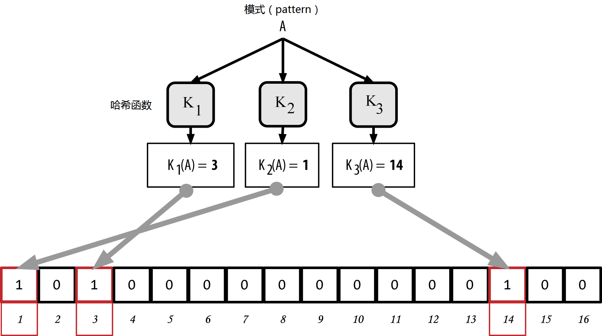

第6章  比特币网络
========

## 点对点网络架构

比特币是一种基于互联网之上的点对点网络架构。所谓点对点（或者P2P）是指加入网络中的所有计算机均互为对等关系，节点与节点是平等的，没有“特殊”性，所有节点共同承担提供网络服务的责任。网络节点间以一种“扁平”的网状拓扑结构互联。网络中没有服务器，没有中心化服务，没有层次化。处于点对点网络中的节点同时提供和消费服务，互惠互利。P2P网络具有天然的弹性，去中心化和开放的特点。一个P2P网络架构的典型例子就是早期的互联网本身，那时，基于IP网络之上的节点都是平等的。如今的互联网架构变得更加层次化了，但是网络互联协议仍然保持了它的扁平拓扑的本质。除了比特币，最大最成功的P2P技术的应用应该就是文件分享了，包括作为先驱的Napster，以及作为架构最新演化的BitTorrent。

比特币的P2P网络架构不仅仅是拓扑结构的选择。比特币是一个特意设计的点对点的数字货币系统，网络架构既是其核心特性的反映，也是其特性的基础。去中心化控制是其核心设计原则，只有通过扁平的、去中心化的P2P共识网络才能被实现和维护。

名词“比特币网络”是指运行比特币P2P协议的所有节点的集合。除了比特币P2P协议，还有其他协议存在，比如Strtum协议，用于挖矿以及轻量级或移动钱包。这些额外的协议由网关路由服务器提供，这些服务器自身使用比特币P2P协议接入比特币网络，通过提供网关功能，将网络扩展到那些运行其他协议的节点。比如，Stratum服务器通过Stratum协议将Stratum挖矿节点与主比特币网络相连，将Stratum协议桥接至比特币P2P协议上。我们使用名词“扩展比特币网络”指代包含比特币P2P协议，矿池挖矿协议，Stratum协议，以及其他用于连接比特币系统组件的协议的整个网络。

## 节点类型与角色

虽然在比特币网络中的节点是平等的，但基于他们支持的功能，他们可能充当了不同的角色。一个比特币节点是一系列功能的集合：路由，区块链数据库，挖矿，钱包服务。一个完全节点拥有全部四个功能，如图6-1。

*
图6-1 比特币网络节点，拥有所有四项功能：钱包，挖矿，全量区块链数据库，网络路由
*

所有节点均带有路由功能，从而得以加入网络，当然也可能还含有其他功能。所有节点验证并传播交易和区块，发现并维护与其他节点的连接。在完全节点的例子中（**图6-1**），路由功能用橘色圆圈标出，成为“网络路由节点”。

有些节点被称为完全节点，它们维护着一份完整的最新的区块链副本。完全节点可以不依赖外部而自主权威的验证任何交易。而另一些节点只维护区块链的一个子集，它们验证交易需要用到一个叫做*简单支付验证（simplified payment verification，SPV）*的方法。这些节点也称之为SPV或轻量级节点。在完全节点的示例图中，完全节点的区块链数据库功能用蓝色圆圈标识，称之为“完全区块链”。在**图6-3**中，SPV节点没有用蓝圈标识，说明它们没有区块链的全量副本。

挖矿节点采用特殊的硬件来求解工作量证明算法，它们通过竞争的方式创建新的区块。某些挖矿节点本身就是完全节点，维护一个完整的区块链副本，而另外一些则是轻量级节点，它们加入矿池，并依赖矿池服务器来维护完全节点功能。挖矿功能以黑色圆圈标识为完全节点，并命名为“矿工”。

用户钱包可以是完全节点的一部分，这在桌面比特币客户端中比较常见。越来越多的用户钱包，特别是运行在像智能手机等资源有限的设备上的钱包，则是SPV节点。钱包功能在**图6-1**中以绿色圆圈标注为“钱包”。

除了运行比特币P2P协议的主要节点类型，网络上还有一些服务器和节点运行其他协议，比如专业矿池协议，轻量级客户端访问协议等。

**图6-2**显示了在扩展比特币网络上最常见的几种协议类型。

*
图6-2 扩展比特币网络上不同类型的节点
*

## 扩展比特币网络

主比特币网络运行的是比特币P2P协议，大概包含7,000到10,000个运行不同版本比特币参考客户端（比特币核心）的节点，以及几百个运行着其他兼容比特币P2P协议软件的节点，这些实现包括BitcoinJ，Libbitcoin，btcd等。在这些节点当中，只有少量节点同时也是挖矿节点，它们竞争挖矿，验证交易，并创建新的区块。各类大公司通过运行基于比特币核心的完全节点与比特币网络相连，它们拥有完整的区块链拷贝和网络节点功能，但是不具有挖矿和钱包功能。这些节点充当网络的边缘路由器，允许在其上构建各种其他服务，比如交易所，钱包，区块浏览器，商户支付处理等。

扩展比特币网络不仅包含前面介绍的运行比特币P2P协议的网络，也包含运行其他专门协议的节点。与比特币主网相连的矿池服务器和协议网关将运行其他协议的节点连接到网络中。这些运行其他协议的节点主要是矿池节点（参看**第8章**）以及轻量钱包客户端，这些节点均不保存全量区块链副本。

**图6-3**描述了含有各类型节点的扩展比特币网络，包括网关服务器，边缘路由器，钱包客户端以及用于它们彼此相连的协议。

*
图6-3 描述了包括节点类型、网关和协议的扩展比特币网络
*

## 网络发现

当新节点启动时，首先需要找到网络中的其他比特币节点以加入进去。为开始这一流程，新节点必须至少在网络上找到一个节点，并与之连接。其他节点的地理位置无关紧要；比特币的网络拓扑不是以地理位置来定义的。因此，新节点可以随机选择任意存在的节点进行连接。

为了与已知节点相连，需要与之建立起TCP连接，比特币节点的服务端口通常为8333（约定俗成的比特币端口），或者其他约定的服务端口。一旦连接建立，新节点立即向服务端发送一个版本信息进行“握手（handshake）”。握手信息主要是识别信息，包含：

协议版本（PROTOCO_VERSION）

	定义比特币协议版本的常量（比如：70002）

本地服务（nLocalServices）

	节点提供的本地服务列表，目前只有网络节点（NODE_NETWORK）

时间（nTime）

	当前时间

对端地址（addrYou）

	从本地节点看到的远端节点IP地址

本地地址(addMe)

	本地节点发现的本机IP地址

子版本（subver）

	显示本地节点软件类型的子版本号（比如：“/Satoshi:0.9.2.1/”）

最佳高度（BestHeight）

	本地节点区块链的高度

（[GitHub](http://bit.ly/1qlsC7w "GitHub")上可看到版本网络信息的例子）

远端节点返回一个*verack*信息进行应答，并建立连接，如果希望回连新节点并互换信息，也可以将它自己的版本信息发给新节点。

新节点如何发现对等节点呢？虽然比特币中没有特殊的节点，但总有一些长期运行的稳定节点，它们被列在客户端中作为*种子节点*。虽然新节点不必非要跟种子节点相连，它们至少可以帮助新节点更快的发现网络中的其他节点。在比特币核心客户端中，是否使用种子节点是由选项开关*-dnsseed*控制的，若设为1，就使用种子节点，这也是默认设置。反之，一个对网络完全不了解的自举节点，需要提供至少一个比特币节点的IP地址，通过该节点的介绍，实现与更多节点相连。命令行参数*-seednode*可用于连接一个节点，并仅让该节点充当介绍节点，这种用法称为DNS种子。当初始节点完成介绍任务后，客户端就可以与该节点断开，接着使用新发现的节点作为对等节点。

*图6-4 对等节点间的握手会话*

当一到多个连接建立起来后，新节点就向其所有邻居发送包含自身IP地址的*addr*信息。而邻居们则把该*addr*信息继续转发给自己的邻居，确保新加入的节点让更多节点知道以便更好的连接。另外，新加入的节点也会发送*getaddr*给它的邻居，要求它们返回它们所知的对等节点IP地址列表。通过这种方式，新节点就可以找到新的对等节点并与之连接，同时它也会在网络上广播它自己的信息，以让其他节点找到。**图6-5**描述了地址发现协议。

*
图6-5 地址广播与发现
*

节点必须连接到不同的对等节点以建立到比特币网络的多条路径。路径总是不可靠的，节点会新增也会减少，所以节点必须不停的发现新的节点以便在旧的连接丢失时可以建立新的连接，同时也需要帮助那些新加入的节点找到对等节点。启动时只需要一个连接即可，因为第一个对等节点会将其知道的对等节点介绍给新加入的节点，与这些对等节点建立连接后，这些节点也会继续将它们知道的对等节点信息告诉这个新节点。当然，连接太多的对等节点是没必要的，这是对网络资源的浪费。首次启动后，节点会记住它最近成功连接的节点，当节点重启时，它就可以快速重新建立与之前节点的连接。如果之前的任何节点都没有响应，节点可以利用种子节点重新连接。

在一个运行比特币核心客户端的节点，利用命令*getpeerinfo*，可以列出所有已知对等节点信息：

	$ bitcoin-cli getpeerinfo

	[
	    {
	        "addr" : "85.213.199.39:8333",
	        "services" : "00000001",
	        "lastsend" : 1405634126,
	        "lastrecv" : 1405634127,
	        "bytessent" : 23487651,
	        "bytesrecv" : 138679099,
	        "conntime" : 1405021768,
	        "pingtime" : 0.00000000,
	        "version" : 70002,
	        "subver" : "/Satoshi:0.9.2.1/",
	        "inbound" : false,
	        "startingheight" : 310131,
	        "banscore" : 0,
	        "syncnode" : true
	    },
	    {
	        "addr" : "58.23.244.20:8333",
	        "services" : "00000001",
	        "lastsend" : 1405634127,
	        "lastrecv" : 1405634124,
	        "bytessent" : 4460918,
	        "bytesrecv" : 8903575,
	        "conntime" : 1405559628,
	        "pingtime" : 0.00000000,
	        "version" : 70001,
	        "subver" : "/Satoshi:0.8.6/",
	        "inbound" : false,
	        "startingheight" : 311074,
	        "banscore" : 0,
	        "syncnode" : false
	    }
	]

为覆盖自动节点管理，指定IP地址列表，用户可使用选项*-connect=<IPAddress>*指派一个到多个IP地址。一旦启用这一选项，节点将只与给定的IP地址相连，而不会自动发现并维护节点连接。

如果一个连接上没有网络流量，节点会定期发送一个信息以维持连接。如果节点在某个连接上超过90分钟没有通讯，它将被认定为已与网络失去连接，需要寻找新的对等节点替代这个没有通讯的节点。通过这种方式，网络会根据节点的变化和网络问题自动进行动态调整，从而达到不依赖中央控制而实现自主伸缩的目的。

## 完全节点

完全节点是指那些维护了包含所有交易的区块链的全量副本的节点。更确切的说，它们应该被叫做“完全区块链节点”。早期的比特币系统，所有节点都是完全节点，现在，比特币核心客户端依然是一个完全区块链节点。在过去的两年中，出现了新的比特币客户端，这些客户端不维护全量区块链，只是运行一个轻量级的客户端。我们将在下一节中更详细解释这种节点类型。

完全区块链节点维护一个包含所有交易的完整的最新比特币区块链副本，它们可以独立的创建和验证区块链，从第一个区块（创世块）一直创建到网络中最新的已知区块。完全区块链节点可以自主权威的验证任何交易而不需要借助其他节点或其他信息来源。完全区块链节点依赖网络获取新交易区块的更新信息，验证并包含进本地区块链副本中。

运行完全区块链节点会给你带来纯粹的比特币体验：不用依赖或信任任何其他系统，对所有交易的独立验证。要判断你是否在运行完全节点非常容易，因为它需要20几G的永久存储（磁盘空间）来保存全量区块链。如果你需要很大的硬盘空间，并且需要2到3天才能与网络同步，那么你运行的是一个完全节点。这是摆脱中央集权，获得独立和自由的代价。

也有一些完全区块链比特币客户端的替代实现，使用不同的编程语言和软件架构实现。但是，最常见的实现还是参考客户端比特币核心，也叫中本聪客户端。比特币网络中超过90%的节点运行着不同版本的比特币核心。在客户端发送的子版本字符串中，以及在*getpeerinfo*命令的结果显示中，它被标识为“Satoshi”，比如“*/Satoshi:0.8.6/”。

## 交换“存货”

完全节点与其他节点连接后，它要做的第一件事就是尝试创建一个完整的区块链。如果这是一个全新节点，本地完全没有区块链，那么它将只知道一个区块，即创世区块，这是被静态内嵌到客户端软件里的。从0号区块（创世区块）开始，新节点必须下载成千上万的区块以与网络同步，并重建本地区块链。

同步区块链的过程始于*版本（version）*消息，版本消息中包含了*最佳高度（BestHeight）*信息，它是节点当前的区块链高度（区块数量）。节点从其对等节点获取*version*消息，了解他们有多少区块，并与自身区块数量进行比较。互联的对等节点首先交换一个*getblocks*消息，消息包含各自本地区块链最新区块的哈希（指纹）。如果某个节点发现哈希不等于区块链最顶部区块的哈希值，它就可以判断出接收到的哈希不属于最新区块，而是一个比较老的区块，从而判断自身的区块链比对等节点更长。

拥有更长区块链的节点，其区块数量比对等节点更多，因而能识别哪些区块是对端需要“追赶”的。它将识别出第一批需要分享的500个区块，通过inv（存货，inventory）消息将这500个区块的哈希传播出去。缺失这些区块的节点通过发送一系列*getdata*消息，并根据从inv消息获取到的哈希，请求完整的区块数据。

举个例子，我们假设一个节点只有创世区块。它会从对等节点接收到一个inv消息，包含了接下来500个区块的哈希值。接下来，这个节点将向所有相连的节点请求区块数据，为防止将单一节点压垮，它会把负载分散到不同节点上。节点跟踪每个对等节点正在“传输”的区块数量（已发送请求，尚未接收到），检查其是否超过限制（MAX_BLOCKS_IN_TRANSIT_PER_PEER）。这样，如果一个节点需要获取大量的区块，它只会在早先的请求完成后才发送新的请求，这样，节点就能够控制更新节奏，避免压垮网络。当区块接收到后，它被加入区块链（我们将在第7章看到相关介绍）。随着本地区块链的逐步建立，更多的区块被请求和接收，整个过程将一直持续到这个节点完成与全网络的同步。

不管与网络断开多长时间，一旦重新连接，节点都要重新进行本地区块链与对等节点的比较过程，从而获取任何丢失的区块。不管是离线几分钟，丢失几个区块，还是离线一个月，丢失几千个区块，节点都要从发送*getblocks*开始，获取inv应答，并下载丢失的区块。（**图6-6描述了存货和区块传播协议）。

*图6-6 节点通过从对等节点获取区块同步区块链*

## 简单支付验证（SPV）节点

不是所有节点都有能力存储完整区块链。很多比特币客户端是设计来在空间、性能均有限的设备上运行的，比如智能电话，平板或嵌入式系统上运行的。对于这些设备来说，*简单支付验证（SPV）*方法可以保证它们在不保存全量区块链的情况下也能正常运行。这些类型的客户端称作SPV客户端或者轻量级客户端。随着比特币的使用越来越广泛，SPV节点已逐渐成为比特币节点的最常见形式，尤其是比特币钱包。

SPV节点只需要下载区块头，而不用下载每个区块中的交易。这种不带交易的区块链条，其大小比完全区块链小1000倍。SPV节点不能全景展示所有可花费UTXO的完整视图，因为它们并不了解网络上的所有交易。SPV节点使用一套稍有不同的方法验证交易，这种方法依赖于对等节点按需提供相关区块链的局部视图。

作为类比，完全节点就像一个处在陌生城市的游客，带了一张包含所有街道所有地址的详细地图。而SPV节点就像另一个同在陌生城市的游客，只知道一条主干道，通过随机询问陌生人来进行路线规划。虽然两个游客都能通过实地参观验证街道是否存在，但没有地图的游客不知道每个小巷中有些什么，也不知道附近还有什么其他街道。站在教堂街23号前，没有地图的游客无法知道这个城市是否还有其他“教堂街23号”的地址，也不知道这个地方是不是就是自己要找的一个。对于没有地图的游客来说，最好的办法就是询问足够多的人，并希望不会有人试图抢劫他。

简单支付验证通过引用交易在区块链中的*深度（depth）*而不是它们的*高度（height）*来验证交易。而完全区块链节点则创建一条完整的验证过的区块链，这条链由区块和交易组成，并按时间倒序一直延伸到创世区块。一个SPV节点会验证所有区块的链（但不是所有的交易），并且把链和有关感兴趣的交易进行关联。

比如，当检查区块300,000中的某个交易时，完全节点将300,000个区块连接在一起，一直连接到创世区块，由此构建了一个完整的UTXO数据库，通过验证UTXO未被花费，来确定交易的有效性。SPV节点无法确定UTXO是否已被花费，不能直接判断UTXO的有效性。因此SPV节点验证方法不同，首先，利用*墨克尔路径*（参看第164页《默克尔树》）建立交易和包含这笔交易的区块间的关联关系。接着，SPV节点一直等到序号从300,001到300,006的六个区块堆叠在该交易所在的区块之上，并通过确定交易的深度是在第300,006区块到第300,001区块之下来验证交易的有效性。事实上，网络上的其他节点接受了区块300,000，并在其上创建了额外的6个区块，根据代理协议，可以证明交易不是一个双重支付交易。

当交易不存在时，SPV节点不会认为交易在区块中存在。它通过请求默克尔路径证明，验证区块链中的工作量证明来确保交易存在于区块中。但是，交易存在性却可以对SPV节点进行“隐藏”。SPV节点可以明确证明交易的存在性，但无法验证一个交易（比如同一个UTXO的双重支付交易）是不存在的，因为这类节点没有保存全部交易的记录。这个弱点可被用于针对SPV节点的拒绝服务攻击或双重支付攻击。为了防范这类攻击，SPV节点需要随机连接到几个节点，以提高它至少与一个诚实节点保持联系的可能性。这种随机连接需求意味着当SPV节点只有到虚假节点或虚假网络的连接，而没有到诚实节点或真实比特币网络的连接时，它们仍然是网络分区攻击或女巫攻击的脆弱环节。

对于大多数实际应用来说，只要能确保与网络保持良好连接，SPV节点就是足够安全的，这很好的平衡了资源、实用性和安全性的需求。若需要保证绝对安全性，那就只能选用完全区块链节点，完全节点相对SPV节点要更加安全。

完全区块链节点通过检查区块链中，交易所在区块以下的所有区块来验证交易，确保UTXO尚未被使用，SPV节点则通过计算交易所在区块之上的区块数量，来检查交易被埋了多深。

为了获取区块头，SPV节点使用*getheaders*请求消息来取代*getblocks*消息。收到请求的对等节点使用*headers*消息发送区块头，一次最多发送2000个区块头。这与完全节点获取完全区块的过程是一样的。SPV节点在与对等节点的链路上设置一个过滤器，过滤对等节点发送来的区块和交易数据流。对于感兴趣的交易，则使用*getdata*请求进行获取。对等节点生成一个包含交易的*tx*消息作为应答。**图6-7**展示了区块头的同步过程。

*图6-7 SPV节点同步区块头*

因为SPV节点需要获取特定的交易以有选择的验证它们，这带来了隐私威胁。不像完全区块链节点收集每个区块中的所有交易，SPV节点对特定数据的请求会无意中泄露它们钱包中的地址。比如，第三方通过持续监视网络，就可以跟踪一个SPV节点钱包发送的所有交易请求，从而将这些请求与用户钱包的比特币地址进行关联，达到侵犯用户隐私的目的。

SPV/轻量级节点引入不久，开发者又新增了一个叫做*布隆过滤器（bloom filter）*的功能，用以处理SPV节点的隐私问题。布隆过滤器通过概率而不是固定匹配模式的机制，使得SPV节点可以接收交易子集而不用暴露精确的感兴趣地址。

## 布隆过滤器

布隆过滤器是一个概率搜索过滤器，采用一种不精确指定的方式来描述期望的匹配模式。布隆过滤器提供了一种在保护隐私的前提下表达搜索模式的有效途径。SPV节点使用这种方式向其对等节点请求匹配特定模式的交易列表，而不暴露它们搜索的确切地址。

在我们之前的例子中，一个没有地图的游客询问到特定地点“教堂街23号（23 Church St.）”的路线。如果她向一个陌生人询问到该街道的路线，无意间就暴露了她的目的地。如果使用布隆过滤器，她可能问的就是“这附近是否有条街道，它的名字以R-C-H结尾？”这种提问方式，暴露的信息就要比直接说“教堂街23号”少一些。通过这项技术，游客可以使用较详细的信息，如“以U-R-C-H结尾”来描述地址，也可以使用如“以H”结尾这样更简短的信息。通过改变搜索的精确度，游客可提供更多或更少的信息，相应的代价就是获取更精确或更模糊的结果。如果提供模糊的信息，她可以更好保护隐私，但将得到非常多的地址，而大多数地址都是不相干的。如果提供相对精确的信息，得到的地址则较少，但隐私保护上也会较弱。

布隆过滤器通过允许SPV节点调节搜索条件的精确度来提供这项服务。更明确的布隆过滤器将产生更精确的结果，但是代价是暴露用户钱包中使用的地址。粗略的布隆过滤器则因匹配更多的交易带来更大的数据量，这些交易大多与本节点无关，但是可以为节点提供更好的隐私保护。

SPV节点初始化时把布隆过滤器设置为“空”，在此状态下，布隆过滤器不匹配任何模式。接着，SPV节点生成一个钱包中所有地址的列表，并创建一个匹配所有地址的交易输出的搜索条件。通常，每个搜索条件就是“发送到公钥哈希”的脚本，这个脚本实际上就是出现在每个发送到公钥哈希（地址）的交易输出上的锁定脚本。如果SPV节点正在跟踪一个P2SH地址的余额，那么搜索条件就是“支付到脚本哈希”的脚本。接下来，SPV节点将这些条件添加到布隆过滤器中，使得过滤器能够在符合搜索条件的情况下识别出交易。最后，把布隆过滤器发送给对等节点，对等节点依据设定条件将匹配的交易传到本地SPV节点。

布隆过滤器在实现上是由一个包含N个二进制数（位域）的可变长度数组和M个哈希函数构成。哈希函数设置成输出总是在1到N之间，与二进制数数组长度对应。哈希函数是确定的，因此，任何实现布隆过滤器的节点都使用相同的哈希函数，并且在输入确定的情况下，将得到相同的结果。通过选择不同长度（N）的布隆过滤器，选用不同数量（M）的哈希函数，布隆过滤器可以调整精确程度和隐私保护级别。

在**图6-8**中，我们使用一个很小的16位数组，以及一个包含三个哈希函数的集合演示布隆过滤器的工作过程。

*图6-8 简单布隆过滤器的例子，使用16位域和3个哈希函数*

布隆过滤器初始化时，二进制数组被设置为全零。为了往布隆过滤器中添加新的匹配模式，首先需要顺次利用预设的哈希函数对模式进行计算。使用第一个哈希函数计算后，将得到一个1到N间的数字，然后将数组上对应的比特位（从1到N编号）设置为1，从而记录下哈希函数的输出。接着，使用第二个哈希函数设置数组的第二个比特位，以此类推。一旦M个哈希函数都计算完成后，搜索模式将被“记录”在布隆过滤器上--即二进制数组中的M个比特位被从0改为1。

**图6-9**是向**图6-8**所示的简单布隆过滤器中添加一个模式“A”的例子

添加新的模式非常简单，只是重复一下刚才的步骤。模式被每个哈希函数顺序计算，然后在二进制数组相应位置设置1以记录哈希结果。注意，当采用更多的哈希函数时，可能出现多个哈希结果一样的情况，这时该比特位维持为1不变。实际上，随着模式的增多，越来越多的哈希结果会被记录在相同的位置上，过滤器也因设置为1的位置变多而开始变得饱和，准确性也相应降低了。这就是为什么布隆过滤器是一种概率数据结构的原因---它会随着更多的模式加入而变得不精确。精确度依赖于添加的模式数量、二进制数组大小（N）以及哈希函数数量（M）三者关系。更大的二进制数组、更多的哈希函数可以在较高精确度的情况下记录更多的模式。而较小的二进制数组或者更少的哈希函数只能记录较少的模式，相应的精确度也较低。

*图6-9 添加模式“A”到简单布隆过滤器中*

**图6-10**是添加第二个模式“B”到简单布隆过滤器的例子

*图6-10 添加第二个模式“B”到我们的简单布隆过滤器中*

为测试一个模式是否为布隆过滤器的一部分，用M个哈希函数依次对模式进行计算，并用其结果与二进制数组进行比对。如果数组中所有索引号等于哈希结果的位均设为“1”，那么这个模式很可能已被记入布隆过滤器。因为这些位也可能是其他模式的哈希结果的重叠，答案是不确定的，但确实具有可能性。简而言之，布隆过滤器的正匹配代表“可能是的”。

**图6-11**是测试模式“X”是否在简单布隆过滤器中存在的例子。其相应的比特位均已设为“1”，因此模式可能是匹配的。

*图6-11 测试模式“X”在布隆过滤器中的存在性。结果是一个概率正匹配，意思是“可能”*

相反，如果模式与布隆过滤器测试过后，某些位不是设置为1，则可以证明模式没有被布隆过滤器记录。否定的结果不是可能，而是确定。简单的说，布隆过滤器上的负匹配意味着“肯定不是！”

**图6-12** 是测试简单布隆过滤器中是否存在模式“Y”的例子。其中有一位被设成了0，则此模式一定是不匹配的。

*图6-12 测试模式“Y”是否在过滤器中存在，结果是确定不匹配，意味着“一定不！”*

比特币对布隆过滤器的实现在**比特币改进提案37（BIP0037）**中描述。参见**附录B**或访问**[GitHub](http://bit.ly/1x6qCiO)。

## 布隆过滤器与存货更新

SPV节点使用布隆过滤器过滤从它的对等节点接收到的交易（以及包含它们的区块）。SPV节点首先创建一个用于匹配其钱包中所有地址的过滤器。然后，SPV节点发送一个*filterload（过滤器负载）*消息给其对等节点，消息中包含了需要在连接上使用的布隆过滤器。当过滤器建立起来后，对等节点依据过滤器测试每个交易的输出。只有匹配过滤器的交易才发送给SPV节点。

作为对SPV节点*getdata*消息的应答，对等节点向其发送*merkleblock（默克尔区块）*和匹配交易的默克尔路径（参看第164页，《默克尔树》），其中merkleblock消息仅包含那些匹配过滤器的区块头。对等节点同时也传送包含匹配过滤器的交易信息给SPV节点，使用*tx*消息格式。

设置过滤器的节点也可交互式的增加新的模式到过滤器中，通过发送*filteradd（过滤器增加）*消息实现。要清除过滤器，节点可以发送*filterclear（过滤器清除）*消息。由于无法从过滤器中移除单个模式，当某个模式不再需要时，需要通过清除过滤器并重新发送过滤器的方式进行更新。

## 交易池

比特币网络中几乎每个节点都会维护一个临时的未确认交易列表，称作*内存池*或*交易池*。节点使用这个池子对那些已发布到网络但尚未包含进区块链中的交易进行跟踪。比如，持有用户钱包的节点可以利用交易池跟踪发送到用户钱包但尚未确认的支付交易。

随着交易被接收和验证，它们被加入交易池并且被中继到相邻节点，从而在网络中实现传播。

有些节点的实现也维护一个独立的孤儿交易池。如果一个交易的输入引用了一个尚处未知状态的交易，比如说父交易缺失，这个孤儿交易就将被临时存储在孤儿交易池中，直到其父交易抵达本节点。

当交易被加到交易池中时，将对孤儿交易池进行检查，以发现是否有交易引用了这个交易的输出（即其子交易）。若匹配，孤儿交易就会通过验证，并从孤儿交易池中移到普通交易池，将交易链条被补全。鉴于新移入的交易不再是孤儿交易，处理进程将递归寻找新的后代交易，直到再也找不到更多的后代。一个父交易进来后，通过重新组合孤儿交易与父交易的关系，会触发互相依赖的交易链的连锁重建。

不管是交易池还是孤儿交易池（如果实现了的话）都存放于内存中，而不是保存到永久存储上；它们随着接收到的网络消息而被动态填充。当一个节点启动时，两个池都是空的，随着不断从网络上接收新的交易，内存池也逐步被填上。

有些比特币客户端的实现还维护一个UTXO数据库或者UTXO池，这是一个区块链上的未花费交易输出的集合。虽然“UTXO池”听起来跟交易池类似，但是它代表的是一个完全不同的数据集合。不像交易池或孤儿交易池，UTXO池不会被初始化为空集合，而是包含几百万条未花费交易输出，甚至包括一些2009年的交易。UTXO池可保存在本地内存中，也可以存储在持久化的带索引的数据库上。

然而交易池或孤儿交易池都只是单个节点的本地视图，节点与节点间可能由于节点的启动或者重启而区别巨大；UTXO池代表网络当前的共识，节点间的差异通常非常小。另外，交易和孤儿交易池只包含未确认交易，而UTXO只包含已确认的交易输出。

## 警告消息

警告消息是一个极少使用的功能，但大多数节点均实现了该功能。警告消息是比特币的“紧急广播系统”，通过它，比特币核心开发者可以向所有的比特币节点发送紧急文本消息。这个特性使得在比特币网络发生严重问题时，核心开发团队可以通知所有比特币用户，比方说，需要用户注意的严重bug。警告系统只被用过几次，影响最大的一次是在2013年早期，那时发生了一次严重的数据库bug，导致了比特币区块链上的一个多区块分叉。

警告消息通过*alert*消息传输。警告信息包含几个字段，包括：

**ID**

>标识警告信息，使得重复信息可被发现

**Expiration**
>警告到期时间

**RelayUntil**
>到点后警告消息不再被中继

**MinVer，MaxVer**
>警告消息适用的比特币协议版本范围

**subVer**
>警告消息适用的客户端软件版本

**Priority**
>警告级别，目前未启用

警告消息使用公钥进行密码学签名。对应的私钥由选定的几个核心开发团队成员持有。数字签名可防止虚假警告消息通过网络传播。

每个接收到警告消息的节点都会对其进行验证，检查其有效期，然后继续向其邻居广播该消息，这样确保了消息很快在全网中进行传播。除了传播警告消息，节点可能还会实现一些用户界面功能，将警告消息推送给用户。

在比特币核心客户端中，警告是通过命令行选项*-alertnotify*进行配置的，该选项允许用户指定收到警告后需要运行的命令。警告消息以参数的形式，将其传给*alertnotify*指定的命令。最常见的方式是，将*alertnotify*的指定命令设置为生成一个email消息，发送到节点的管理员，email内容为警告消息。若图形用户界面客户端（bitcoin-qt）正在运行，警告消息也将以弹出对话框的方式显示给用户。

其他比特币协议的实现软件可能以其他方式处理警告消息。很多嵌入式硬件挖矿系统则不实现警告消息功能，因为他们没有用户界面。强烈建议运行此类挖矿系统的矿工向矿池经营者订阅警告信息或者运行一个轻量级的节点专用于接收警告消息。

