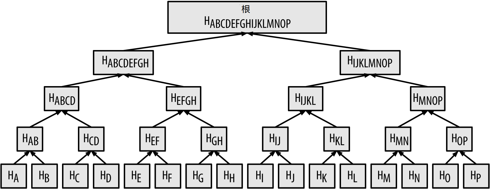

第7章 区块链
===============

## 介绍

区块链数据结构是一种有序的，后向连接的交易区块列表。区块链既可存储于扁平文件中，也可存储于简单数据库里。比特币核心客户端使用谷歌的LevelDB数据库存储区块链元数据。区块是“后向”连接的，每个区块都有链接指向链条上的前序区块。区块链通常可想象为一个垂直堆栈，新的区块堆叠在其他区块的顶部，第一个区块是堆栈的基础。区块堆叠在其他区块之上的形象比喻导致了一些名词的引入，比如，“高度（height），指本区块到第一个区块的距离，“顶部（top）”或“顶端”指最新加入的区块。

区块链中的每个区块在其头部使用通过SHA256加密哈希算法生成的哈希值进行标识。每个区块头还包含一个“前序区块哈希”的字段，对前序区块（*父区块*）进行引用。换句话说，每个区块在区块头中均存有父区块的哈希。将每个区块连接到其父区块的哈希序列形成了一条可以一直回溯到第一个区块（*创世区块*）的链条。

虽然一个区块只能有一个父区块，但它却可以临时拥有多个子区块。每个子区块都指向相同的父区块，在“前序区块哈希”字段中拥有相同的父区块哈希。多子区块的现象是区块“分叉（fork）*时才发生的临时状态，其原因是不同的矿工几乎同时发现了不同的新区块（参看第199页《区块链分叉》）。“分叉”最终都会得以解决，只有一个子区块会成为区块链的一部分。虽然一个区块可以有多个子区块，但每个区块只能有一个父区块，这是因为区块只有一个“前序区块哈希”字段，指向它的唯一父区块。

“前序区块哈希”字段位于区块头部，因此会影响到*当前*区块的哈希。如果父区块的标识改变，子区块的标识也会随之变化。当一个父区块以任何方式改变时，父区块的哈希值必然跟着变化。而父区块哈希的改变，又迫使子区块“前序区块哈希”指针跟着变化。这必将导致子区块哈希的变化，进一步导致了孙区块到子区块指针的变化，从而孙区块哈希也必须改变，以此类推。这种串联影响可以确保一旦一个区块有了多个后代，除非重新计算所有的后续区块，这个区块就没法修改。因为重新计算需要极大的计算量，长区块链的存在使得区块链中较深的历史区块不可修改，这是保证区块链安全性的重要特性。

一种思考区块链的方式是将其想象为地质构造层或者冰川核心样本。表层可能会因季节变换而有所改变，甚至还没沉淀就已经被风吹走。但是一旦你深入地下几英寸，地质层将越来越稳定。深入几百英尺的地底进行考察，你会发现一个几百万年未曾受过干扰的历史快照。在区块链中，最新的几个区块可能会因分叉而出现重计算的情况。最新的6个区块就如地质结构的表层。但是一旦更加深入区块链，超过6个区块，区块被改变的可能性将越来越小。当往前回溯100个区块后，已经变得如此稳定，以致币基交易（产生新比特币的交易）也可以花费了。回溯几千个区块（差不多一个月）后，区块链成了稳定的历史，再也无法改变。

## 区块结构
区块是一种数据结构容器，用以汇聚交易以加入公共账本---区块链。区块由包含元数据的区块头，以及紧跟其后的长长的交易列表组成。区块头80字节长，而一般交易最少250字节，一般区块则包含超过500个交易。一个完整的区块，包含所有交易，其长度超过区块头的1000倍。**表7-1**描述了区块的结构：

*表7-1 区块结构*

|大小|字段|描述|
|----|-----|-----|
|4字节|区块大小（Block Size）|区块按字节计算的大小，不含本字段|
|80字节|区块头（Block Header）|几个字段构成了区块头|
|1-9字节（varint）|交易计数器（Transaction Counter）|紧跟的交易数量|
|可变长度|交易（Transactions）|区块中的交易记录|

## 区块头

区块头包含三个区块元数据集合。首先，有一个到前序区块哈希的引用，在区块链中将本区块与前面的区块相连；第二个元数据集，即*难度（difficulty）*，*时间戳（timestamp）*，*随机数（nonce）*，与挖矿竞争相关，将在第8章详述；第三个元数据集是默克尔树（merkle tree）的根，一个高效概括区块中所有交易的数据结构。**表7-2**描述了区块头的结构。

*表7-2 区块头结构*

|大小|字段|描述|
|----|----|----|
|4字节|版本（Version）|跟踪软件/协议更新的版本号|
|32字节|前序区块哈希（Previous Block Hash）|对链中前序（父）区块哈希值的引用|
|32字节|默克尔根（Merkle Root）|本区块所有交易的默克尔树根的哈希|
|4字节|时间戳（Timestamp）|本区块大致的创建时间（Unix时间戳）|
|4字节|难度目标（Difficulty Target）|本区块工作量证明算法的难度目标|
|4字节|随机数（Nonce）|用于工作量证明算法的一个计数器|

其中，随机数，难度目标，时间戳用于挖矿过程，将在第8章详细介绍。

## 区块标识符：区块头哈希和区块高度

区块的主标识符是它的加密哈希，或者称为数字指纹，通过对区块头运行两次SHA256算法得到。结果的32字节哈希值叫作 *区块哈希（block hash）*，但是叫做 *区块头哈希（block header hash）*更准确，因为只有区块头被用于哈希计算。举例来说，*000000000019d6689c085ae165831e934ff763ae46a2a6c172b3f1b60a8ce26f* 是第一个比特币区块的区块头哈希。区块哈希唯一标识一个区块，没有歧义，任何节点通过对区块头进行简单哈希既可以独立计算得到。

需要注意的是，区块哈希并没有包含在区块的数据结构中，既不会在区块传输时存在，也不会作为区块链的一部分保存到节点的持久化存储设备中。实际上，区块哈希只在节点从网络上接收到区块时才自行计算生成。区块哈希可以保存在一个独立的数据库表中，作为区块元数据的一部分，以便索引和从磁盘上快速存取区块。

标识区块的另一种方式是它在区块链中的位置，称作 *区块高度（block height）*。第一个被创建的区块其高度为0，它与前面提到的区块哈希为*000000000019d6689c085ae165831e934ff763ae46a2a6c172b3f1b60a8ce26f*的区块是一样的。因此，一个区块可以通过两种方式标识：引用区块哈希或者引用区块高度。在区块链中，每个被加到上一区块顶部的后续区块比前一区块“高”一个位置，就像堆叠到其他盒子上面的盒子。2014年1月1日的区块高度大约是278,000，意味着总共有278,000个区块叠加到了2009年1月创建的第一个区块之上。

不像区块哈希，区块高度不是唯一的标识符。虽然单一的区块总是有个特定的不变高度，但是反之则不对--区块高度不总是能标识一个单一区块。有可能有多个区块同时拥有相同高度，竞争区块链中的同一位置。这种情形将在第199页《区块链分叉》中讨论。区块高度也不是区块数据结构的一部分，它也没有存储在区块上。每个节点从网络上接收到区块时，在区块链中动态标识区块的位置（高度）。区块高度也可以作为元数据存储在一个索引数据库中以提高存取速度。

一个区块的 *区块哈希*总能唯一标识一个区块。一个区块也总是具有一个特定的 *区块高度*。但是特定的区块高度却不一定能唯一标识一个区块。实际上，可能多个区块会参与竞争区块链中的同一个位置。

## 创世区块

区块链中的第一个区块叫做创世区块，创建于2009年。它是区块链中所有区块的共同祖先，也就是说，如果你从任何一个区块开始，沿着区块链回溯，最终都会到达创世区块。

每个节点启动时，其区块链中至少包含一个区块，因为创世区块是被静态编码到比特币客户端软件中的，无法被修改。每个节点都“知道”创世区块的哈希和结构，其创建时间，以及它包含的唯一一个交易。这样每个区块都拥有了区块链的起始点，一个安全的“根”，从它开始可以构建一条可信任的区块链。

若需了解比特币核心客户端是如何静态编码创世区块的，可以查看**chainparams.cpp**源代码。

以下标识哈希属于创世区块：
>000000000019d6689c085ae165831e934ff763ae46a2a6c172b3f1b60a8ce26f

你也可以使用任何区块链浏览器网站（比如：blockchain.info），通过提供包含这个哈希值的URL，搜索区块链上的这个区块，你将看到一个页面描述这个区块的内容：

* https://blockchain.info/block/000000000019d6689c085ae165831e934ff763ae46a2a6c172b3f1b60a8ce26f *

* https://blockexplorer.com/block/000000000019d6689c085ae165831e934ff763ae46a2a6c172b3f1b60a8ce26f *

也可以使用比特币核心参考客户端的命令行：
```json
	$ bitcoin-cli getblock 000000000019d6689c085ae165831e934ff763ae46a2a6c172b3f1b60a8ce26f
	
	{
	    "hash" : "000000000019d6689c085ae165831e934ff763ae46a2a6c172b3f1b60a8ce26f",
	    "confirmations" : 308321,
	    "size" : 285,
	    "height" : 0,
	    "version" : 1,
	    "merkleroot" : "4a5e1e4baab89f3a32518a88c31bc87f618f76673e2cc77ab2127b7afdeda33b",
	    "tx" : [
	        "4a5e1e4baab89f3a32518a88c31bc87f618f76673e2cc77ab2127b7afdeda33b"
	    ],
	    "time" : 1231006505,
	    "nonce" : 2083236893,
	    "bits" : "1d00ffff",
	    "difficulty" : 1.00000000,
	    "nextblockhash" : "00000000839a8e6886ab5951d76f411475428afc90947ee320161bbf18eb6048"
	}
```

创世区块中隐含着一条消息。币基交易的输入包含一段话：“The Times 03/Jan/2009 Chancellor on brink of second bailout for banks.（《泰晤士报》，2009年1月3日，财政大臣正站在第二轮救助银行业的边缘）”这段话通过引用英国报纸《泰晤士报》的头条新闻，证明了这个区块最迟创建日期。比特币诞生时，一场空前的货币危机正席卷全球，这段话以半开玩笑的方式提醒建立一种独立货币系统的重要性。这段话被比特币的创建者中本聪嵌入到第一个区块中。

## 区块链中连接区块

比特币完全节点从创世区块开始，维护一套完整的区块链副本。区块链的本地副本随着新区块的发现并用于延展链条而得到持续更新。当节点从网络上接收到进来的区块时，首先对其进行验证，通过后，节点会检查其区块头，查找“前序区块哈希”，并使用该值与已存在的区块链进行连接。

我们来做个假设，一个节点在本地区块链副本中共有277,314个区块。那么，这个节点所知的最新区块就是区块277,314，其区块头哈希为“00000000000000027e7ba6fe7bad39faf3b5a83daed765f05f7d1b71a1632249”。

比特币节点从网络上接收到一个新区块，经过解析，看起来像这样：
```json
	{
	    "size" : 43560,
	    "version" : 2,
	    "previousblockhash" :
	        "00000000000000027e7ba6fe7bad39faf3b5a83daed765f05f7d1b71a1632249",
	    "merkleroot" :
	        "5e049f4030e0ab2debb92378f53c0a6e09548aea083f3ab25e1d94ea1155e29d",
	    "time" : 1388185038,
	    "difficulty" : 1180923195.25802612,
	    "nonce" : 4215469401,
	    "tx" : [
	        "257e7497fb8bc68421eb2c7b699dbab234831600e7352f0d9e6522c7cf3f6c77",
	
	 #[... 其他交易 ...]
	
	        "05cfd38f6ae6aa83674cc99e4d75a1458c165b7ab84725eda41d018a09176634"
	    ]
	}
```

从新区块中找到*previousblockhash*字段，这个字段包含了它的父区块的哈希。这个哈希值对节点来说是已知的，就是在高度277,314上的区块。这样，这个新区块就成了链上最后一个区块的子区块，区块链的长度又延伸了，高度变为277,315。**图7-1**是一条三个区块组成的区块链链，通过引用*previousblockhash*字段进行连接。


*图7-1 通过引用前序区块头哈希，将区块连接成一条链*

## 默克尔树

区块链中的每个区块都使用 *默克尔树（merkle tree）*来代表区块中所有交易的摘要。

*默克尔树*，也称 *二分哈希树*，用于高效汇总和验证大数据集的完整性。默克尔树是一个由加密哈希组成的二叉树。名词“树”在计算机科学中用于描述分支数据结构，“树”作为数据结构，与通常理解不同的是，在示意图上它的“根”常常被在最上面，而“叶子”则在底部，形成一个自上而下的结构，在下面的例子中将看到一个示意图的例子。

默克尔树在比特币中通过产生一个全部交易集的数字指纹以汇总区块中的所有交易，从而提供了一套非常高效的验证交易是否包含在区块里的流程。通过递归计算一对对节点的哈希值，直到只剩一个节点，即 *根*或 *默克尔根*，就构成了一棵默克尔树。比特币中默克尔树采用的加密哈希算法是SHA256，因为需要重复两次，所以也称为双重SHA256。

当N个数据元素被哈希并汇总到一棵默克尔树，你就可以检查某个元素是否已被包含在树上，这个检查过程只需进行最多2*log2(N)次运算，可以看到这种数据结构是非常高效的。

默克尔树自底至上进行构建。在后面的例子中，我们将创建4个交易的默克尔树，A，B，C，D，是构成默克尔树的叶子节点，如**图7-2**。交易数据本身不存储于默克尔树上，实际上，保存在叶子节点中的数据是交易数据经过哈希计算的结果，记为HA，HB，HC和HD：

	H~A~ = SHA256(SHA256(Transaction A))

通过连接两个哈希值，并进行哈希计算，相邻的叶子节点对得以在父节点上汇总。比方说，为构建一个父节点Hab，两个子节点的32字节哈希值被连接在一起，形成一个64字节的字符串。接着，这个字符串进行双重哈希，构成父节点的哈希：

	H~AB~ = SHA256(SHA256(H~A~ + H~B~))

过程持续进行，直到只在顶端留下一个节点，这个节点就是默克尔根。这个32字节哈希值存储于区块头中，作为所有四个交易数据的汇总。


*图7-2 在默克尔树上计算节点*

由于默克尔树是一个二叉树，它需要一个偶数的叶子节点。如果只有奇数个交易需要进行汇总，那么需要复制最后一个交易的哈希，作为新的一个叶子节点，保证叶子数量为偶数，即形成 *平衡树（balanced tree）*。如**图7-3**，交易C被复制了。


*图7-3 复制一个数据元素以得到偶数个数据元素*

使用同样的方法，可以创建任何尺寸的默克尔树。在比特币中，一个区块中含有几百上千个交易是很平常的，它们构建交易汇总的方法与前述方法完全一样，最终都会产生一个32字节的数据作为默克尔树根。在 **图7-4**中，你将看到一棵由16个交易构成的树。注意到，虽然根在图上看起来比叶子节点大很多，实际上它们的尺寸完全一样，都是32字节。不管区块中是一个交易还是一百个交易，默克尔根总是将它们汇总成32字节。



*图7-4 一棵汇总了很多数据元素的默克尔树*

为了证明一个特定交易包含在区块中，节点只需创建log2(N) 个32字节的哈希值，形成一条从交易到根的路径，叫*认证路径*或*默克尔路径*。当交易数量增长时，这显得尤为重要，因为底数为2的交易数量的对数增长相对交易数量增长要慢得多。这允许比特币节点高效的产生一条10到12个哈希值（320到384字节）的路径，从而证明交易是否属于区块，通常一个1M左右大小的区块含有超过1000个交易。

在**图7-5**中，节点只要产生一条包含4个哈希的默克尔路径就能够证明交易K从属于区块，每个哈希32字节，总共也就128字节。这条路径包含4个哈希值（**图7-5**中用蓝色标注）：HL，HIJ,HMNOP和HABCDEFGG。这四个哈希组成了一条认证路径，再加上另外四个与这些节点成对出现的哈希值HKL，HIJKL，HIJKLMNOP以及默克尔根，任何节点就可通过计算证明Hk（图中绿色标注）包含在默克尔根中。


*图7-5 一条默克尔路径，用于证明包含某个数据元素*

**例7-1**的代码演示了从叶子节点哈希一直到根节点创建默克尔树的过程，例中使用到了libbitcoin库中的一些辅助函数。

*例7-1 创建一棵默克尔树*

```cpp
	#include <bitcoin/bitcoin.hpp>
	
	bc::hash_digest create_merkle(bc::hash_list& merkle)
	{
	    // 如果哈希列表为空则停止
	    if (merkle.empty())
	        return bc::null_hash;
	    else if (merkle.size() == 1)
	        return merkle[0];
	
	    // 只要列表中超过1个哈希，就继续...
	    while (merkle.size() > 1)
	    {
	        // 如果哈希数量为奇数，复制列表中最后一个哈希.
	        if (merkle.size() % 2 != 0)
	            merkle.push_back(merkle.back());
	        // 现在列表大小是偶数了
	        assert(merkle.size() % 2 == 0);
	
	        // 新哈希列表
	        bc::hash_list new_merkle;
	        // 依次哈希，每次2个
	        for (auto it = merkle.begin(); it != merkle.end(); it += 2)
	        {
	            // 将当前的两个哈希值连接在一起.
	            bc::data_chunk concat_data(bc::hash_size * 2);
	            auto concat = bc::make_serializer(concat_data.begin());
	            concat.write_hash(*it);
	            concat.write_hash(*(it + 1));
	            assert(concat.iterator() == concat_data.end());
	            // 对两个哈希值进行哈希
	            bc::hash_digest new_root = bc::bitcoin_hash(concat_data);
	            // 加入新列表
	            new_merkle.push_back(new_root);
	        }
	        // 新列表
	        merkle = new_merkle;
	
	        // DEBUG output -------------------------------------
	        std::cout << "Current merkle hash list:" << std::endl;
	        for (const auto& hash: merkle)
	            std::cout << "  " << bc::encode_hex(hash) << std::endl;
	        std::cout << std::endl;
	        // --------------------------------------------------
	    }
	    // Finally we end up with a single item.
	    return merkle[0];
	}
	
	int main()
	{
	    // 将下面的哈希值替换为从区块中取得的值，以产生相同的默克尔根.
	    bc::hash_list tx_hashes{{
	        bc::hash_literal("0000000000000000000000000000000000000000000000000000000000000000"),
	        bc::hash_literal("0000000000000000000000000000000000000000000000000000000000000011"),
	        bc::hash_literal("0000000000000000000000000000000000000000000000000000000000000022"),
	    }};
	    const bc::hash_digest merkle_root = create_merkle(tx_hashes);
	    std::cout << "Result: " << bc::encode_hex(merkle_root) << std::endl;
	    return 0;
	}
```

**例7-2**显示编译运行代码的结果。

*例7-2 编译并运行示例代码*

```
	$ # Compile the merkle.cpp code
	$ g++ -o merkle merkle.cpp $(pkg-config --cflags --libs libbitcoin)
	$ # Run the merkle executable
	$ ./merkle
	Current merkle hash list:
	  32650049a0418e4380db0af81788635d8b65424d397170b8499cdc28c4d27006
	  30861db96905c8dc8b99398ca1cd5bd5b84ac3264a4e1b3e65afa1bcee7540c4

	Current merkle hash list:
	  d47780c084bad3830bcdaf6eace035e4c6cbf646d103795d22104fb105014ba3

	Result: d47780c084bad3830bcdaf6eace035e4c6cbf646d103795d22104fb105014ba3
```

当规模增长时，默克尔树的效率变得非常明显。**表7-3**展示了为证明区块中存在某交易而创建默克尔路径所需交换的数据量。

*表7-3 默克尔树的效率*

|交易数量|区块粗略大小|路径尺寸（哈希数）|路径尺寸（字节）|
|--------|------------|------------------|-------------|
|16个交易|4K字节|4哈希|128字节|
|512个交易|128K字节|9哈希|288字节|
|2048交易|512K字节|11哈希|352字节|
|65,535交易|16M字节|16哈希|512字节|

正如在表中看到的，区块大小增长很快，从4KB，16个交易，到16M，65535个交易，但是用于证明交易是否包含的默克尔路径增长却慢得多，仅仅从128字节增长到512字节。有了默克尔树，节点可以只下载区块头（每区块80字节），通过从其他完全节点获取一个很小的默克尔路径，即可以判断交易是否包含在区块中，不需要存储或传输区块链中的绝大部分内容，这些数据有好几G字节。不维护全量区块链的节点叫作简单支付验证节点（SPV节点），它们使用默克尔路径来验证交易，不需要下载全部区块。

## 默克尔树和简单支付验证（SPV）

默克尔树在SPV节点中得到了广泛应用。SPV节点不保存全部交易，也不保存完整区块数据，仅仅存有区块头信息。在不必下载区块中完整交易的情况下，SPV节点利用认证路径或默克尔路径来验证交易是否包含在区块中。

考虑一个SPV节点，它对接收到的向它钱包中某个地址进行支付的交易感兴趣。SPV节点在与其他对等节点的连接上建立一个布隆过滤器，限制只接收那些它感兴趣的地址相关的交易。当对等节点看到某个交易与布隆过滤器匹配时，就使用*merkleblock*消息将相关区块发送到SPV节点上。*merkleblock*消息包含区块头以及一条将区块中感兴趣的交易连接到默克尔根的默克尔路径。SPV节点可利用默克尔路径将交易与区块相连，并验证交易确实被区块所包含。SPV节点也利用区块头信息将区块连接到区块链。交易与区块，区块与区块链，这两个连接的组合，提供了交易已记录于区块链中的证明。总之，SPV节点收到的包含区块头和默克尔路径的数据还不到1K字节，比整个区块数据（目前大约1M）小了一千倍。