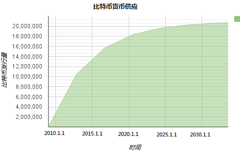
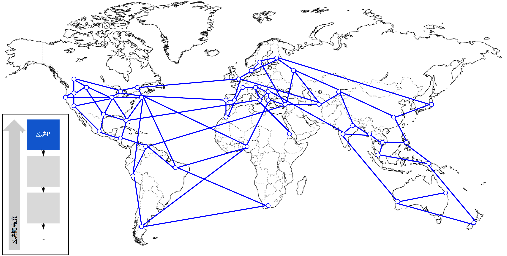
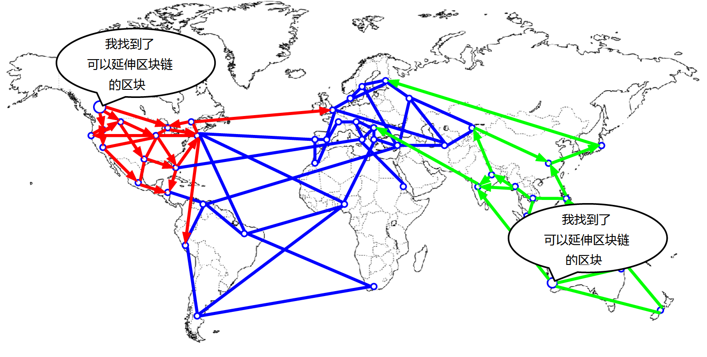
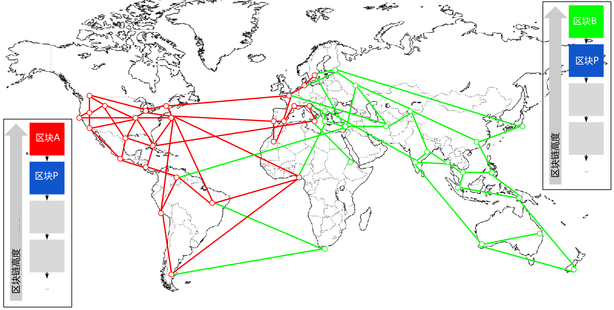
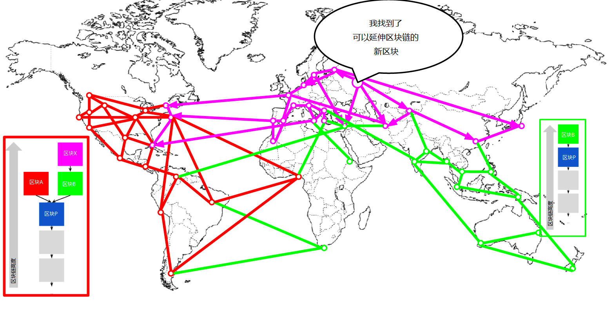
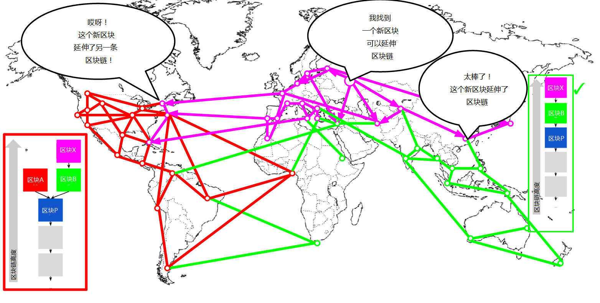
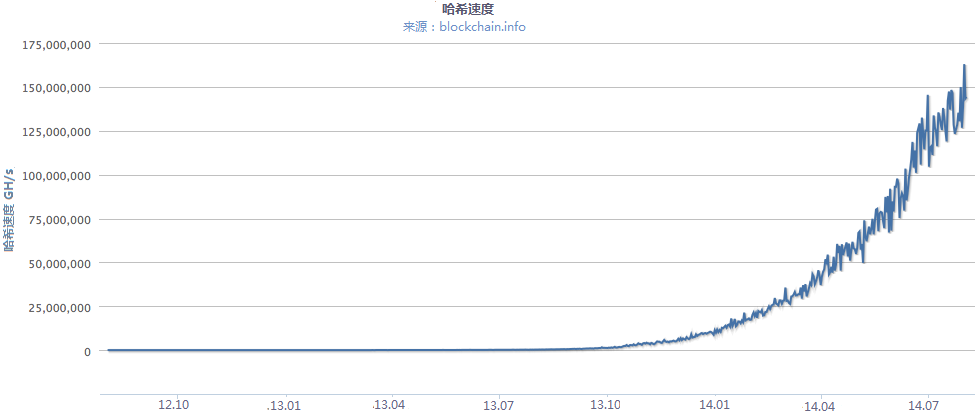

第8章 挖矿与共识
=======

# 介绍

挖矿是维持比特币货币供应中的一个过程。同时，挖矿也保护着比特币系统的安全，防止不当交易或者双重支付。即同一笔比特币资金在不同交易里使用。矿工向比特币网络提供处理能力，以交换获取比特币奖励的机会。

矿工验证新的交易，并把它们记录到全局账本上。一个新区块，包含从上个区块以来发生的交易，每隔10分钟左右被“开采”出，从而将这些交易记录到区块链当中。成为区块一部分的交易并被加入区块链的交易被认为是“已确认的”，这使得比特币新的所有者可以花费在这些交易中收到的比特币。

矿工们获得两种类型的挖矿补偿：每个新区块中产生的新比特币；新区块中包含的所有交易的交易费用。为了赢得这些报酬，矿工通过竞争的方式基于加密哈希算法解决一个极为复杂的数学问题。问题的解称为工作量证明，包含在新区块中，作为矿工付出的显著计算工作量的证明。竞争解决工作量证明算法，赢取奖励以及在区块链上记录交易的权利构成了比特币安全模型的基础。

新比特币产生的过程之所以叫做挖矿，是因为奖励是设计成递减的，就像贵金属的挖矿。比特币的货币供应通过挖矿来实现，类似中央银行通过印钞来发行货币。矿工可以加入区块的新产生比特币数量大概四年（精确的说是每210,000个区块）减少一次。2009年1月比特币网络开始运行的时候每挖出一个区块有50比特币产生，到2012年11月，这个数额减少一半，降为25比特币。到2016年7月（译者：原书为2016年某个时候），已降至12.5比特币每区块。基于这个公式，比特币挖矿奖励以指数级下降一直到大约2140年，所有比特币（20999.99998万）都将被发行完毕。2140后将不会在发行新比特币。

比科比矿工也从交易中赚交易费。每个交易都可能包含有交易费用，交易费用以交易输入和输出金额差值的形式存在。赢得竞争的比特币矿工获得包含在赢得的区块中的所有交易“小费”。目前，交易费用仅占矿工收入的0.5%或更少，主要的收入来源还是新挖出的比特币。但是，随着时间推移，奖励金额不断减少，而每个区块中包含的交易却在增加，交易费用在矿工收入中的占比必将逐步变大。2140年后，由于新比特币枯竭，比特币矿工的收入将全部来自交易费用。

“挖矿”这个词容易让人产生误解。让人想起贵金属挖矿，它将我们的注意力集中到挖矿的奖励上，也就是每个区块产生的新比特币。虽然挖矿是被这些新比特币所激励，挖矿的最主要目的其实不是报酬或者产生新比特币。如果你仅仅将挖矿看做一个创建比特币的过程，你就把手段（激励）当成了此过程的目的。挖矿是去中心化清算所的主要流程，通过清算所，交易被验证和清算。挖矿保护了比特币系统的安全，使得没有中心机构的情况下全网共识得以实现。

挖矿的发明使比特币变成一种特别的货币，而去中心化的安全机制则构成了点对点数字货币的基础。铸币奖励以及交易费用作为一种激励方案，不仅规范了矿工的行为使其符合网络安全的要求，同时也实现了货币的供应。

在本章中，我们首先研究作为货币供应机制的挖矿过程，然后将目光聚焦在其最重要的功能，即：支撑了比特币安全的去中心化共识机制。

## 比特币经济学和货币创造

比特币在创建区块的过程中以固定和递减的速率被“铸造”出来。通常每10分钟左右产生一个新的区块，而每个区块均会从无到有产生全新比特币。每经过210,000个区块，或者大约4年，货币发行速率会降低50%。比特币刚开始运作的首个四年，每个区块包含有50个新比特币。

2012年11月，比特币的发行速率降低到了每区块25个比特币，这个过程将继续，到2016年的某个时候，发行速率将降低到每区块12.5比特币（译者：2016年7月已降至12.5比特币）。新比特币的创建速率以这种指数级的方式递减，经过64次“减半”，直到13,230,000号区块被挖出（大致在2137年），每区块创建比特币数量降到货币最小单位1聪。最终，大约到2140年，13.44*10^6个区块被创建后，所有2,099,999,997,690,000聪，或者大约21*10^6个比特币将全部发行完毕。从此以后，区块不再包含新比特币，矿工的报酬将完全来自于交易费用。**图8-1**显示了随着货币发行减少，流通货币与时间的对应关系。

*图8-1 指数递减的发行速率下，比特币货币供应与时间的关系*

在示例代码**例8-1**中，我们计算一下将被发行的所有比特币数量。

*例8-1 计算总共会发行多少比特币的脚本*

    # 最早每个区块奖励给矿工的报酬是50BTC
    start_block_reward = 50
    # 每隔10分钟一个区块，210000个区块约4年
    reward_interval = 210000
    def max_money():
        # 50 BTC = 50 0000 0000 Satoshis
        current_reward = 50 * 10**8
        total = 0
        while current_reward > 0:
        total += reward_interval * current_reward
        current_reward /= 2
        return total
    print "Total BTC to ever be created:" , max_money(), "Satoshis"

**例8-2**展示了脚本运行后的输出结果

*例8-2 运行max_money.py脚本*

    $ python max_money.py
    Total BTC to ever be created: 2099999997690000 Satoshis

总量有限和递减的发行速度保证了货币供应的稳定性，防止了通货膨胀的发生。不像法币，法币可以被中央银行无限制的印制，比特币永远不可能因为超发而导致通胀。

<table>
<tr>
<th>
通货紧缩的货币
</th>
</tr>
<tr>
<td>
一个固定和递减的货币发行机制的最重要也是最具争议的结果是它天然趋向于*通货紧缩*，通货紧缩是一种价值升值的现象，是因为供应与需求的错配推高了货币的价值（以及兑换汇率）。与通货膨胀相反，价格收水意味着货币随着时间推移拥有了更强的购买力。

很多经济学家认为通缩经济是一场灾难，应不惜任何代价进行避免。因为一段时间内的快速通缩，人民会有价格将继续下降的预期，因此倾向于将钱存起来而不是用于消费。这种现象在日本的“失去的十年”中得以无情展现，当需求完全瓦解时，也将货币推进了通货紧缩的漩涡。

比特币专家认为通缩本身并不是坏事。当然，通货紧缩是与需求的萎缩相关的，因为这也是我们需要研究的通缩的唯一例子。在一个无限印刷可能性的法币系统中，除非消费需求完全萎缩并且没有印钞欲望，陷入通货紧缩的漩涡是很困难的。比特币中的通缩不是由消费需求萎缩引起的，而是因可预期的货币供应的限制引起的。

在实践中，很明显的是，通缩货币导致的货币囤积本能可以被供应商的折扣所抵消，当折扣率到达一定程度，就可以战胜消费者的储蓄本能。因为不管商家还是消费者都有囤积货币的动机，通过折扣最终将达成一个平衡的价格，在这个价格上，双方的囤积欲望互相匹配达到平衡。如果折扣达到30%，大多数基于比特币的零售商都可以轻松的重新挑起消费者的购物欲望，并获得收益。当然，比特币这种不是因经济快速衰退而引起的通缩，是否会引发其他问题，仍有待观察。
</td>
</tr>
</table>

# 去中心化共识

在前面章节中，我们观察了区块链，一个包含全部交易的全局公共账本（列表），比特币网络中的所有参与者都可以接受它，并将其视为所有权证明的权威记录。

但是，在不信任任何其他人的情况下，如何让网络中的每个人都能对一个关于谁拥有什么的普遍“真理”取得共识呢？所有传统的支付系统所依赖的信任模型都有一个提供清算服务的中央权威机构，对每一笔交易进行验证并对所有交易进行清算处理。比特币没有中央权威，不过每个完全节点都有一个公共账本的完整拷贝，可以认为是一份权威的记录。区块链不是由中央机构创建的，而是由网络中的每个节点独立组装而成。通过某种方式，网络上的每个节点，基于不安全的网络连接上传输的信息，可以达成一个共同的结论，并且能装配一份与别人完全一样的公共的账本。本章将研究在没有中央机构介入的情况下，比特币如何达成全局共识的过程。

中本聪的发明主要在于建立了一种去中心化的*自发共识（emergent consesus）*机制。自发，是因为共识不是明确达成的--没有选举，也没有一个固定的达成共识的时刻。相反，共识是一种自发的产物，是由成千上万遵循一些简单规则的节点异步交互形成的。所有比特币的属性，包括货币，交易，支付，不依赖于中央机构或信任的安全模型，而是从这一发明衍生而来。

比特币的去中心化共识是由四个过程的相互影响而自发产生的，这些过程是网络上的节点独立进行的。

* 基于对规则的完整列表，各个完全节点独立验证每个交易。
* 通过基于工作量证明算法的证明运算，挖矿节点独立将交易汇聚到新区块中。
* 每个区块独立验证新区块并将其整合进区块链。
* 每个节点独立选择累积进行了最多工作量证明计算的链条。

在接下来的几个小节中，我们将考察这些过程，了解它们是如何通过互相作用，形成自发的全网共识，从而使任意节点组合出它自己的权威、可信、公开的总帐。

# 独立交易验证

在**第5章*中，我们看到了钱包软件是如何通过收集UTXO，提供合适的解锁脚本，创建指派给新所有者的输出从而创建新交易的。以上过程新建的交易被发送到网络中的邻居节点，从而被广播道整个比特币网络。

但是，将交易转发给邻居前，每个接收到交易的比特币节点首先会验证交易的有效性。这使得只有有效的交易才会在网络中传播，而无效的交易在第一个碰到它的节点就被丢弃了。

每个节点验证交易都要遵守一个长长的规则列表：

* 交易的语法和数据结构必须正确
* 交易的输入和输出均不能为空
* 交易大小字节数必须小于**MAX_BLOCK_SIZE**
* 每个交易输出的汇总价值必须在允许范围内（小于21m比特币，大于0）
* 任何交易输入的哈希不能为0，N不能等于-1（币基交易不能被转发）
* **nLockTime**小于等于**INT_MAX**
* 交易大小字节数必须大于等于100
* 交易中签名操作的数量必须小于签名操作的限制值
* 解锁脚本（**scriptSig**）只能将数字压入堆栈，锁定脚本（**scriptPubKey**)必须匹配**isStandard**格式（这将拒绝“非标准”交易）
* 交易池或者主分支的区块中必须存在匹配的交易
* 对于每个输入，如果引用的输出在交易池的其它交易中存在，交易必须被拒绝
* 对于每个输入，需要在主分支和交易池中查找被引用的输出交易。如果任何输入对应的输出交易不存在，那么这就是个孤儿交易。如果其对应的交易不在孤儿交易池中，将其加入孤儿交易池。
* 对于每个输入，如果引用的输出交易是一个币基输出，必须至少经过**COINBASE_MATURITY(100)**次确认
* 使用输出交易计算输入价值，检查每个输入价值以及汇总值，看其是否超过允许范围（小于21m比特币，大于0）
* 如果输入价值汇总小于输出价值，拒绝
* 如果交易费用太小以致无法加入一个空的区块，拒绝
* 每个输入的解锁脚本必须与相应的输出锁定脚本进行验证

这些条件的细节可以在比特币参考客户端的函数**AcceptToMemoryPool**，**CheckTransaction**,**CheckInput**中看到。注意，这些条件经常变动，添加新约束以防范新类型的拒绝服务攻击，有时也会放松规则以支持新类型的交易。

通过在接收后，发出前独立验证每个交易，每个节点都会依据接收到交易的先后顺序，创建一个有效新交易的池子（交易池）。

# 挖矿节点

比特币网络上的有些特殊的节点，称作*矿工*。在**第1章**中，我们介绍了景，一个在中国上海的计算机工程专业学生，他是一个比特币矿工。景通过运行一套为挖矿特制的计算机硬件系统（叫做“矿机”）来赚取比特币。景的特制挖矿硬件连接到一台运行完全节点的服务器上。不像景，还有些矿工是在没有完全节点的情况下进行挖矿，我们将在第207页《矿池》中看到。就如任何其他完全节点，景的节点也在比特币网络上接收并传播未确认交易。当然，景的节点同时还将这些交易整合到新区块中。

景的节点随时监听新的区块，并将其传播到网络中，就像所有其他节点一样。但是，新节点的到来对挖矿节点来说有特殊的意义。矿工间的竞争随着新节点的传播而有效终止，新节点是这次竞争赢家的胜利宣言。对于矿工来说，接收到一个新节点意味着有人已经赢得了这次竞争，而他们输了。但是一轮竞争的结束也同样意味着新一轮竞争又开始了。新区块不仅是一面方格旗，标志着竞赛的结束；它也是发令枪，标志着下一个区块的竞赛开始了。

# 整合交易到区块中

验证交易之后，比特币节点会将它们加入到*内存池*中，或者叫做*交易池*，交易在那儿等待被包含（挖矿）到一个区块内。景的节点与其他节点一样，收集，验证，转发交易。与其他节点不同的是，景的节点在完成那些动作后，还把这些交易整合到一个*候选区块（candidate block）*中。

我们来跟踪一些区块，这些区块是在爱丽丝从鲍勃咖啡店购买一杯咖啡时创建的（参看第16页，《购买一杯咖啡》）。爱丽丝的交易被包含进277,316号区块。为了演示本章的概念，我们假设这个区块是景的挖矿系统挖出的，并且在爱丽丝的交易成为新区块一部分后，继续跟进这笔交易。

景的挖矿节点维护着一份区块链的完整副本，它是所有区块的列表，包含了2009年比特币系统创建以来的所有区块。在爱丽丝购买那杯咖啡前，景的节点已经装配了一个包含277,314个区块的链条。景的节点持续监听交易，尝试挖出新的区块，同时，它也监听其他节点发现的区块。当景的节点正挖矿时，它从比特币网络中接收到了区块277,315。这个区块的到达，标志着区块277,315的挖矿竞争结束了，而创建区块277,316的竞争从此开始。

在之前的10分钟中，景的节点在查找区块255,315的解决方案的过程中，也在收集交易，为创建下个区块作准备。到此时，它已经收集了几百个交易并保存在内存池中。当收到区块277,315并验证后，景的节点对内存池中的交易进行检查，剔除那些已被包含到277,315区块的交易。仍然在内存池中的交易都是未确认的交易，它们继续等待被记录到新区块中。

完成这些准备工作后，景的节点立即创建一个新空区块，作为区块277,316的候选。这个区块就叫做候选区块，因为它尚未成为有效区块，不含有有效的工作量证明。这个区块只有在矿工成功找到一个工作量证明算法的解后才变成有效。

## 交易年龄，费用和优先级

为了构建候选区块，景的比特币节点从内存池中选择交易，选择过程首先对每个交易赋予一个优先级权数，并将最高优先级的交易优先选出。交易基于交易输入中即将被花费的UTXO的“年龄”进行排序，允许那些老的、高价值的交易输入比新的、小价值的输入拥有更高的优先级。只要区块空间足够，高优先级的交易可以免费发送。

交易优先级是通过输入价值与输入“年龄”乘积的汇总除以区块总大小后得出的：

    Priority = Sum (Value of input * Input Age) / Transaction Size

在等式中，输入价值的单位是比特币的基础单位，即聪（一个比特币的1/100m）。UTXO的年龄是UTXO被记入区块起经过的区块数量，即这个UTXO在区块链中的深度。交易记录的大小由字节来表示。

对一个被认为是“高优先级”的交易来说，它的优先级必须大于57,600,000，即1个比特币（1亿聪），年龄为1天（144区块），交易大小为250字节：

    High Priority > 100,000,000 satoshis * 144 blocks / 250 bytes = 57,600,000

区块交易空间的前50K字节是保留给高优先级交易的。景的节点将填充前50K字节，最高优先级交易优先，不管有没有交易费用。这使得高优先级交易即使没有交易费用也能得到处理。

接着，景的节点继续填充区块的剩余部分，直到其大小的上限（代码中设定的MAX_BLOCK_SIZE），这部分交易必须至少包含最低交易费用，并且依据每千字节交易费用的高低进行排序。

如果区块中仍有空间，景的节点可能会选择使用没有交易费用的交易来填充它。某些矿工基于最大努力原则将没有交易费用的交易加入区块。而有些矿工则可能选择忽略没有交易费的交易。

区块填充后，若还有交易留在内存池中，它们将继续在内存池中等待下个区块的处理。由于交易停留在内存池中，它们的输入“年龄”，即它们花费的UTXO在区块链中的深度随着新区块的加入而变得更深。因为交易的优先级基于输入年龄，交易保留在内存池中会“变老”，从而优先级得以提高。最终，没有交易费用的交易也可能拥有足够高的优先级，从而被免费包含进区块当中。

比特币的交易没有超时时间。一个当前有效的交易也将永久有效。但是，如果一个交易只在网络中传播一次，它只会停留在一个矿工节点的内存池中。当矿工节点重启后，它的内存池被清空，因为内存只是个短暂的非持久化存储形式。虽然有效交易可能已经被传播到网络上，但是如果它一直未被处理，最终可能所有从挖矿节点的内存池中消失。如果交易未在一定时间内得到处理，钱包软件应该重新发送交易或重新创建包含较高交易费用的交易。

当景的节点会和了内存池中的所有交易后，新的候选区块包含了418个交易，合计交易费用为0.09094928比特币。你可以利用比特币核心客户端的命令行接口看到区块链中的这个区块，如**例8-3**所示：

    $ bitcoin-cli getblockhash 2773160000000000000001b6b9a13b095e96db41c4a928b97ef2d944a9b31b2cc7bdc4

    $ bitcoin-cli getblock 0000000000000001b6b9a13b095e96db41c4a928b97ef2d944a9b31b2cc7bdc4

*例8-3 区块277,316*

    {
        "hash" : "0000000000000001b6b9a13b095e96db41c4a928b97ef2d944a9b31b2cc7bdc4",
        "confirmations" : 35561,
        "size" : 218629,
        "height" : 277316,
        "version" : 2,
        "merkleroot" : "c91c008c26e50763e9f548bb8b2fc323735f73577effbc55502c51eb4cc7cf2e",
        "tx" : [
            "d5ada064c6417ca25c4308bd158c34b77e1c0eca2a73cda16c737e7424afba2f",
            "b268b45c59b39d759614757718b9918caf0ba9d97c56f3b91956ff877c503fbe",

            ... 417 个其他交易 ...

        ],
        "time" : 1388185914,
        "nonce" : 924591752,
        "bits" : "1903a30c",
        "difficulty" : 1180923195.25802612,
        "chainwork" : "000000000000000000000000000000000000000000000934695e92aaf53afa1a",
        "previousblockhash" : "0000000000000002a7bbd25a417c0374cc55261021e8a9ca74442b01284f0569",
        "nextblockhash" : "000000000000000010236c269dd6ed714dd5db39d36b33959079d78dfd431ba7"
    }

## 生成交易

加入区块的第一个交易时一个特殊交易，叫做*生成交易（generation transaction）*或*币基交易（coinbase transaction）*。这个交易由景的节点创建，也是对他挖矿付出的报酬。景的节点创建了一个生成交易，内容为向其钱包发起支付：“支付25.09094928比特币到景的地址” 。景通过挖出一个节点获得的总报酬为币基奖励（25新比特币）和区块中所有交易的交易费用汇总（0.09094928比特币）的和。如**例8-4**：

    $ bitcoin-cli getrawtransaction d5ada064c6417ca25c4308bd158c34b77e1c0eca2a73cda16c737e7424afba2f 1

*例8-4 生成交易*

    {
        "hex" : "01000000010000000000000000000000000000000000000000000000000000000000000000ffffffff0f03443b0403858402062f503253482fffffffff0110c08d9500000000232102aa970c592640d19de03ff6f329d6fd2eecb023263b9ba5d1b81c29b523da8b21ac00000000",
        "txid" : "d5ada064c6417ca25c4308bd158c34b77e1c0eca2a73cda16c737e7424afba2f",
        "version" : 1,
        "locktime" : 0,
        "vin" : [
            {
                "coinbase" : "03443b0403858402062f503253482f",
                "sequence" : 4294967295
            }
        ],
        "vout" : [
            {
                "value" : 25.09094928,
                "n" : 0,
                "scriptPubKey" : {
                    "asm" : "02aa970c592640d19de03ff6f329d6fd2eecb023263b9ba5d1b81c29b523da8b21OP_CHECKSIG",
                    "hex" : "2102aa970c592640d19de03ff6f329d6fd2eecb023263b9ba5d1b81c29b523da8b21ac",
                    "reqSigs" : 1,
                    "type" : "pubkey",
                    "addresses" : [
                        "1MxTkeEP2PmHSMze5tUZ1hAV3YTKu2Gh1N"
                    ]
                }
            }
        ],
        "blockhash" : "0000000000000001b6b9a13b095e96db41c4a928b97ef2d944a9b31b2cc7bdc4",
        "confirmations" : 35566,
        "time" : 1388185914,
        "blocktime" : 1388185914
    }

不像普通交易，生成交易不需要消耗（花费）UTXO。实际上，它只有一个输入，叫做*币基（coinbase）*，这个交易从无到有生成了比特币。生成交易有一个输出，支付到矿工的比特币地址。生成交易的输出将25.09094928比特币发送到矿工的比特币地址。在本例中，地址为：*1MxTkeEP2PmHSMze5tUZ1hAV3YTKu2Gh1N*。

## 币基奖励与交易费用

首先，为了构建一个生成交易，景的节点对所有加入区块的418个交易的输入和输出进行汇总扎差，计算得出交易费用。计算公式如下：

    Total Fees = Sum(Inputs) - Sum(Outputs)

在区块277,316中，总的交易费用是0.09094928比特币。

其次，景的节点需要计算新区块的准确奖励金额。奖励金额的计算基于区块高度，从每区块50比特币开始，每210,000个区块减半。当前的区块高度是277,316，因此正确的奖励是25比特币。

计算过程可以在比特币核心客户端的函数*GetBlockValue*中查到，如**例8-5**所示。

*例8-5 计算区块奖励---函数GetBlockValue，比特币核心客户端，main.cpp, 第1305行*

    int64_t GetBlockValue(int nHeight, int64_t nFees)
    {
        int64_t nSubsidy = 50 * COIN;
        int halvings = nHeight / Params(). SubsidyHalvingInterval();
        // 如果右移未设置，强制区块奖励为0
        if (halvings >= 64)
       	    return nFees;
        // 每经过210,000个区块奖金减半，大致4年发生一次
        nSubsidy >>= halvings;
        return nSubsidy + nFees;
    }

初始奖励是以聪为单位进行计算的，其值为50*COIN常量（100,000,000聪）。即初始的奖励金（**nSubsidy**）为50亿聪。

接下来，计算已经发生的**halvings**（减半）次数：将当前的区块高度除以减半间隔（**SubsidyHalvingInterval**）。对区块277,316来说，除以210,000的减半间隔，其结果为1，即1个减半。

允许的最大的减半次数为64次，所以在代码中，如果减半次数超出了64，就将奖励金设置为0（只返回交易费用）。

再接下来，函数采用右移操作符对奖励（nSubsidy）进行除2操作，每次减半右移一位，即除2。对于区块277,316，由于减半次数为1次，则对奖励金（50亿聪）右移操作一次，得到的结果是25亿聪，或者25个比特币。之所以使用右移操作符是因为它做除2操作的效率比整形或浮点型除法高得多。

最后，函数将币基奖励（nSubsidy）与交易费用（nFees）相加，返回和。

## 生成交易的结构

通过以上计算，景的节点创建了一个生成交易，向他自己支付了25.09094928比特币。

从**例8-4**可以看到，生成交易使用一种特殊的格式。相对普通交易的输入需要指定用于花费的前序UTXO，生成交易只有一个“币基”输出。我们在**表5-3**中考察了普通交易的输入。现在我们将普通交易的输入与生成交易的输入做个对比。**表8-1**显示的是普通交易输入的数据结构，**表8-2**显示的是生成交易输入的数据结构。

*表8-1 “普通”交易的输入结构*

|大小|字段|描述|
|----|----|----|
|32字节|交易哈希(Transaction Hash)|指向待花费UTXO所在交易的指针|
|4字节|输出索引号(Output Index)|UTXO的索引号，开始值为0|
|1-9字节(VarInt)|解锁脚本大小(Unlocking-Script Size)|紧跟其后的解锁脚本大小，单位字节|
|变长|解锁脚本(Unlocking-Script)|满足UTXO锁定脚本条件的脚本|
|4字节|序列号(Sequence Number)|当前尚未启用的Tx替代功能，设置为0xFFFFFFFF|

*表8-2 生成交易的输入结构*

|大小|字段|描述|
|----|----|----|
|32字节|交易哈希|所有位均为0:不是一个交易引用|
|4字节|输出索引号|所有位均为1:0xFFFFFFFF|
|1-9字节(VarInt)|币基数据大小(Coinbase Data Size)|币基数据的大小，从2到100字节|
|变长|币基数据(Coinbase Data)|任意长度的数据，用于额外的随机数以及v2区块中的挖矿标签，必须以区块高度开头|
|4字节|序列号(Sequence Number)|设置为0xFFFFFFFF|

在生成交易中，前两个字段设置为与UTXO引用无关的值。第一个字段是32位的“0”，而不是“交易哈希”。“输出索引”用4字节0xFF填充（十进制255）。“解锁脚本”被替换为币基数据，一个可由矿工自由定义的数据。

## 币基数据

生成交易没有解锁脚本（*scriptSig*）字段。相反，这个字段被替换为币基数据，长度限定在2到100字节间。除了前面几个字节，币基数据剩余部分可被矿工用于其原意的任何用途，填充任意数据。

作为例子，在创世区块中，中本聪在币基数据中填上了这段话：“《泰晤士报》，2009年1月3日，财政大臣站在第二次救助银行的边缘（The Times 03/Jan/2009 Chancellor on brink of second bailout for banks）”，用以证明比特币发明日期并传达一条信息。当前，矿工们通常使用币基数据包含额外的随机数，并附上标识其矿池信息的字符串，我们将在接下来的几个章节讨论。

币基的前几个字节曾经也是任意的，但是现在不这样了。依据比特币改进建议34号（BIP0034），版本2区块（版本字段设置为2的区块）必须在币基字段的最前面附加区块高度索引，作为脚本的“推送”操作。

在区块277,316，我们看到币基（参看**例8-4**），在交易输入的“解锁脚本”或*scriptSig*字段，包含一段十六进制数据*03443b0403858402062f503253482f*。我们将其解码，看看其内容。

第一个字节，03，指示脚本指向引擎将后续三个字节推送到脚本堆栈中（参看**表A-1**）。接下来的三个字节，0x443b04，以小字节序（little endian）格式编码的区块高度。将其字节序翻转，结果就是0x043b44，对应的十进制就是277,316。

紧接着的几个十六进制数字（03858402062）用于编码额外随机数（参看第206页《额外随机数解决方案》），以用于找到合适的工作量证明的解。

最后部分（2f503253482f）是ASCII编码的字符串（“/P2SH/”），提示本区块的挖矿节点支持BIP0016定义的“支付到脚本哈希（P2SH）”。P2SH能力的引进的时候要求矿工“投票”从BIP0016和BIP0017中间选择一个。那些选择了BIP0016实现的矿工会将"/P2SH/"加进币基数据。而那些选择了BIP0017的P2SH实现的矿工则在币基数据中加入字符串“p2sh/CHV”。最终BIP0016成了赢家，但是很多矿工依然将字符串/P2SH/加入到币基中，说明其支持这个特性。

**例8-6**使用libbitcoin库（第56页《替代客户端，库和工具集》）从创世区块中提取币基数据，并显示中本聪在区块中留下的信息。需要注意的是，libbitcoin内嵌了创世区块的静态拷贝，所以示例代码可以直接从库中提取创世区块。

*例8-6 从创世区块提取币基数据*

    /*
    显示中本聪在创世区块中留下的信息
    */
    #include <iostream>
    #include <bitcoin/bitcoin.hpp>
    int main()
    {
        // 生成创世区块
        bc::block_type block = bc::genesis_block();
        // 创世区块包含只包含一个币基交易
        assert(block. transactions.size() == 1);
        // 取区块中的第一个交易 (coinbase).
        const bc::transaction_type& coinbase_tx = block. transactions[0];
        // 币基交易只有个输入.
        assert(coinbase_tx.inputs.size() == 1);
        const bc::transaction_input_type& coinbase_input = coinbase_tx.inputs[0];
        // 将输入脚本转换为其原始格式
        const bc::data_chunk& raw_message = save_script(coinbase_input.script);
        // 转换为 std::string.
        std::string message;
        message.resize(raw_message.size());
        std::copy(raw_message.begin(), raw_message.end(), message.begin());
        // 显示创世区块信息
        std::cout << message << std::endl;
        return 0;
    }

使用GNU C++编译这段代码，运行生成的可执行程序，结果如**例8-7**所示。

*例8-7 编译运行satoshi-words示例代码*

    $ # Compile the code
    $  g++ -o satoshi-words satoshi-words.cpp $(pkg-config --cflags --libs libbitcoin)
    $ # Run the executable
    $ ./satoshi-words
    ^D��<GS>^A^DEThe Times 03/Jan/2009 Chancellor on brink of second bailout for banks

# 创建区块头

为了创建区块头，挖矿节点需要填充六个字段，见**表8-3**

*表8-3 区块头结构*

|大小|字段|描述|
|-----|-----|------|
|4字节|版本（Version）|用于跟踪软件/协议更新的版本号|
|32字节|前序区块哈希（Previous Block Hash）|链中前一个区块（父区块）的哈希值|
|32字节|默克尔根（Merkle Root）|本区块交易默克尔树的根的哈希|
|4字节|时间戳（Timestamp）|区块大致创建时间（Unix时间戳）|
|4字节|难度目标（Difficulty Target）|本区块工作量证明算法的难度目标|
|4字节|随机数（Nonce）|用于工作量证明算法的计数器|

在区块277,316被开采出来时，描述区块结构的版本号是2，以小字节序格式编码的4字节数字是0x02000000。

接着，挖矿节点需要添加“前序区块哈希”。即区块277,315的区块头哈希，区块277,315是景的节点从网络上接收到的最新区块，景已接受，并选为候选区块277,316的父区块。区块277,315区块头的哈希是：

    0000000000000002a7bbd25a417c0374cc55261021e8a9ca74442b01284f0569

下一个步骤是将所要交易汇总成一棵默克尔树，以便计算并添加默克尔根至区块头中。生成交易将被列到区块中的第一个交易。然后，418个其他交易添加在其后，最终总共有419个交易被添加到区块中。正如我们在第164页《默克尔树》中看到的，树的叶子节点数量必须为偶数，所有将最后一笔交易复制一便，形成420个叶子节点，每个节点均对应一笔交易的哈希值。交易哈希按对组合，继续进行哈希计算，从而生成树的不同层次，直到所有交易被汇总到位于树“根”的节点。默克尔树的根将所有交易摘要汇总成一个32字节的数值，如**例8-3**所示的“默克尔根”：

    c91c008c26e50763e9f548bb8b2fc323735f73577effbc55502c51eb4cc7cf2e

接下来，挖矿节点添加上一个4字节的时间戳，以Unix“纪元（Epoch）”时间戳格式编码，它是以1970年1月1日0点（UTC/GMT时区）为起点，到目前经历的时间秒数的计时方式。时间1388185914与“2013年12月27日星期五23：11：54 UTC/GMT”等价。

再下一步，节点填充难度目标值，这个值定义了保证本区块有效的工作量证明难度的要求值。难度值在区块中以“难度位”度量标准进行存储，难度位是尾数-指数格式编码的。这种编码格式含1字节的指数，紧跟3字节的尾数（系数）。举例来说，在区块277,316中，难度位的值为0x1903a30c，第一部分0x19是十六进制的指数，第二部分0x03a30c为系数。难度目标的概念在第195页《难度目标与重定目标》描述，“难度位”表示在第194页《难度表示》中解释。

最后一个字段是随机数（Nonce），初始化为0。

填充完所有其它字段后，区块头就完成了，而区块的挖矿过程就可以开始进行了。现在的目标是找到一个随机数（Nonce），使得区块头的哈希小于难度目标。挖矿节点需要测试成千上万亿个随机数（Nonce），直到找到一个满足要求的Nonce值。

# 区块开采

现在候选区块已经被景的节点构建完成，是时候让硬件矿机来“开采”这个区块了---找到工作量证明算法的解，使得区块有效。在本书中，我们已经学习了加密哈希函数，它们在比特币系统的各个方面被广泛采用。SHA256是用于比特币挖矿过程的哈希函数。

用最简单的话说，挖矿就是通过不断修改一个参数，重复计算区块头的哈希，直到找到一个与目标值匹配的哈希的过程。哈希函数的结果无法提前预知，也不能创建一个模式使其产生特定哈希。哈希函数的这个特性意味着生成哈希结果并匹配特定目标的唯一途径就是不停的尝试，通过随机修改输入，生成不同哈希，直到碰巧得到希望的结果。

## 工作量证明算法

哈希算法使用任意长度的数据作为输入，生成一个固定长度的确定结果，即输入数据的数字指纹。对于任意特定的输入，结果总是相同的，可被任何实现了相同哈希算法的人轻易计算并验证。加密哈希算法的关键特性是对于两个不同的输入，几乎不可能生成相同的指纹。作为推论，给定一个数字指纹，除了尝试随机输入，几乎不可能选择一个输入使其哈希值与给定指纹相同。

采用SHA256算法，不管输入的长度是多少，其输出总是256位。在**例8-8**中，我们利于Python解释器来计算短语“I am Satoshi Nakamoto”（我是中本聪）的SHA256哈希。

*例8-8 SHA256示例*

    $ python
    Python 2.7.1
    >>> import hashlib
    >>> print hashlib.sha256("I am Satoshi Nakamoto" ).hexdigest()
    5d7c7ba21cbbcd75d14800b100252d5b428e5b1213d27c385bc141ca6b47989e
**例8-8**显示了“I am Satoshi Nakamoto”的哈希值计算结果：5d7c7ba21cbbcd75d14800b100252d5b428e5b1213d27c385bc141ca6b47989e。这个256位的数字就是短语的*哈希*或者*摘要*，它依赖于短语中的所有部分。增加一个字母，标点符号，或任何其他字符都会导致生成不同的哈希。

现在，如果我们改变短语，我们将会看到一个完全不同的哈希。让我们试着加一个数字到短语的末尾，仍然使用简单的Python脚本进行计算，如**例8-9**：

*例8-9 SHA256， 使用脚本通过迭代一个随机数产生多个哈希值*

    # 示例：在哈希算法的输入中迭代一个随机数
    import hashlib
    text = "I am Satoshi Nakamoto"
    # 从0到19迭代nonce
    for nonce in xrange(20):
        # 将nonce加到文本结尾处
        input = text + str(nonce)
        # 计算SHA-256哈希 (text+nonce)
        hash = hashlib.sha256(input).hexdigest()
        # 显示输入和哈希结果
        print input, '=>' ,  hash

运行这个脚本将产生几个短语的哈希值，这些短语通过在文本最后添加一个数字而有所不同。通过增加数字，我们能够得到不同的哈希，如**例8-10**所示：

*例8-10 SHA256的输出，使用脚本通过迭代一个随机数产生多个哈希值*

    $ python hash_example.py
    I am Satoshi Nakamoto0 => a80a81401765c8eddee25df36728d732...
    I am Satoshi Nakamoto1 => f7bc9a6304a4647bb41241a677b5345f...
    I am Satoshi Nakamoto2 => ea758a8134b115298a1583ffb80ae629...
    I am Satoshi Nakamoto3 => bfa9779618ff072c903d773de30c99bd...
    I am Satoshi Nakamoto4 => bce8564de9a83c18c31944a66bde992f...
    I am Satoshi Nakamoto5 => eb362c3cf3479be0a97a20163589038e...
    I am Satoshi Nakamoto6 => 4a2fd48e3be420d0d28e202360cfbaba...
    I am Satoshi Nakamoto7 => 790b5a1349a5f2b909bf74d0d166b17a...
    I am Satoshi Nakamoto8 => 702c45e5b15aa54b625d68dd947f1597...
    I am Satoshi Nakamoto9 => 7007cf7dd40f5e933cd89fff5b791ff0...
    I am Satoshi Nakamoto10 => c2f38c81992f4614206a21537bd634a...
    I am Satoshi Nakamoto11 => 7045da6ed8a914690f087690e1e8d66...
    I am Satoshi Nakamoto12 => 60f01db30c1a0d4cbce2b4b22e88b9b...
    I am Satoshi Nakamoto13 => 0ebc56d59a34f5082aaef3d66b37a66...
    I am Satoshi Nakamoto14 => 27ead1ca85da66981fd9da01a8c6816...
    I am Satoshi Nakamoto15 => 394809fb809c5f83ce97ab554a2812c...
    I am Satoshi Nakamoto16 => 8fa4992219df33f50834465d3047429...
    I am Satoshi Nakamoto17 => dca9b8b4f8d8e1521fa4eaa46f4f0cd...
    I am Satoshi Nakamoto18 => 9989a401b2a3a318b01e9ca9a22b0f3...
    I am Satoshi Nakamoto19 => cda56022ecb5b67b2bc93a2d764e75f...

每个短语均产生一个完全不同的输出。它们看起来完全随机，但是你可以在任何计算机上使用Python重新生成完全相同的结果，看到完全一样的哈希值。

在这类场景中作为变量使用的数字叫做*随机数（nonce）*。这个随机数用于改变加密函数的输出，在本例中，它用于改变短语的SHA256指纹。

为了使这个算法具有挑战性，我们任意设置一个目标：找到一个短语，它的十六进制哈希值开始于0。很幸运，这个不难！**例8-10**显示，短语“I am Satoshi Nakamoto13”的哈希值“0ebc56d59a34f5082aaef3d66b37a661696c2b618e62432727216ba9531041a5”符合我们的规则。经过13次尝试我们达成了目标，从概率的角度看，如果哈希函数的输出是均匀分布的，我们可以期望每经过十六次哈希计算就找到一个以十六进制0开头的结果（十六进制0到F的十六分之一）。用数字的角度看，就是找到一个比0x1000000000000000000000000000000000000000000000000000000000000000小的哈希值。我们把这个阈值叫做*目标（target）*，要做的就是找到一个哈希值，其数值*小于这个目标*。如果缩小目标，要查找小于它的哈希值的任务将变得越来越困难。

做一个简单类比，我们想象一个游戏，游戏玩家重复投一对骰子，试图找到一个小于特定目标的点数。在第一回合，目标是12，除非投了两个6，都会赢。第二轮，目标为11，玩家必须投出10或以下的点数才能赢，这轮仍然很简单。几轮过后，目标降到了5。现在，半数以上的投掷点数之和都会超过5，也就是无效的。随着目标值越小，有效投掷次数将成指数级增加。最终，当目标降到2时（最小可能点数），赢得几率只剩下1/36，或者2%。

在**例8-10**中，获胜的“随机数”是13，这个结果可以被任何人独立确认。任何人都可以将13添加到短语“I am Satoshi Nakamoto”之后并计算哈希，验证结果是否小于目标值。成功结果也是工作量的证明，因为它证明了我们已经做了足够多工作找到了随机数。虽然只要进行一次哈希计算就能进行验证，但是找到一个可用的随机数却需要进行13次的哈希计算。如果我们的目标值更低（难度更高），就需要更多次数的哈希计算才能找到合适的随机数，但是任何人想验证，仍然只需要进行一次哈希计算。此外，知道目标值后，任何人都可以利用统计学原理对难度进行估算，进而知道需要完成多少工作才能找到一个合适的随机数。

比特币的工作量证明与**例8-10**的挑战非常类似。首先，矿工创建一个填满交易的候选区块。接着，矿工计算区块头的哈希，看其是否小于当前的*目标值*。如果哈希不小于目标，矿工就修改随机数（通常就是对随机数加1）并重新计算。在比特币网络当前的难度值下，矿工平均需要尝试千万亿（10^15）次以上才能找到一个随机数，使得区块头的哈希值足够小。

**例8-11**是一个高度简化的工作量证明算法，基于Python实现。

*例8-11 简化的工作量证明实现*

    #!/usr/bin/env python
    # 工作量证明算法示例

    import hashlib
    import time

    max_nonce = 2 ** 32 # 4 billion

    def proof_of_work(header, difficulty_bits):

        # 计算难度目标
        target = 2 ** (256-difficulty_bits)

        for nonce in xrange(max_nonce):
            hash_result = hashlib.sha256(str(header)+str(nonce)).hexdigest()

            # 检查是否是有效结果，目标值之下
            if long(hash_result, 16) < target:
                print "Success with nonce %d" % nonce
                print "Hash is %s" % hash_result
                return (hash_result,nonce)

        print "Failed after %d (max_nonce) tries" % nonce
        return nonce

    if __name__ == '__main__':
        nonce = 0
        hash_result = ''
        # 难度从0到31位
        for difficulty_bits in xrange(32):
            difficulty = 2 ** difficulty_bits
            print "Difficulty: %ld (%d bits)" % (difficulty, difficulty_bits)

            print "Starting search..."

            # 检查点：起始时间
            start_time = time.time()

            # 创建一个新区块，包含上一区块的哈希
            # 伪造一个区块的交易-就是-一个字符串
            new_block = 'test block with transactions' + hash_result

            # 查找新区块的有效随机数
            (hash_result, nonce) = proof_of_work(new_block, difficulty_bits)

            # 检查点：多长时间找到结果
            end_time = time.time()

            elapsed_time = end_time - start_time
            print "Elapsed Time: %.4f seconds" % elapsed_time

            if elapsed_time > 0:
                # 估算每秒哈希数
                hash_power = float(long(nonce)/elapsed_time)
                print "Hashing Power: %ld hashes per second" % hash_power

运行这段代码，你可以设置希望的难度（比特位，即头部多少位为0），看看需要多长时间才能找到一个解。**例8-12**显示的是在一台普通台式机上的工作情况。

    $ python proof-of-work-example.py*
    Difficulty: 1 (0 bits)

    [...]

    Difficulty: 8 (3 bits)
    Starting search...
    Success with nonce 9
    Hash is 1c1c105e65b47142f028a8f93ddf3dabb9260491bc64474738133ce5256cb3c1
    Elapsed Time: 0.0004 seconds
    Hashing Power: 25065 hashes per second
    Difficulty: 16 (4 bits)
    Starting search...
    Success with nonce 25
    Hash is 0f7becfd3bcd1a82e06663c97176add89e7cae0268de46f94e7e11bc3863e148
    Elapsed Time: 0.0005 seconds
    Hashing Power: 52507 hashes per second
    Difficulty: 32 (5 bits)
    Starting search...
    Success with nonce 36
    Hash is 029ae6e5004302a120630adcbb808452346ab1cf0b94c5189ba8bac1d47e7903
    Elapsed Time: 0.0006 seconds
    Hashing Power: 58164 hashes per second

    [...]

    Difficulty: 4194304 (22 bits)
    Starting search...
    Success with nonce 1759164
    Hash is 0000008bb8f0e731f0496b8e530da984e85fb3cd2bd81882fe8ba3610b6cefc3
    Elapsed Time: 13.3201 seconds
    Hashing Power: 132068 hashes per second
    Difficulty: 8388608 (23 bits)
    Starting search...
    Success with nonce 14214729
    Hash is 000001408cf12dbd20fcba6372a223e098d58786c6ff93488a9f74f5df4df0a3
    Elapsed Time: 110.1507 seconds
    Hashing Power: 129048 hashes per second
    Difficulty: 16777216 (24 bits)
    Starting search...
    Success with nonce 24586379
    Hash is 0000002c3d6b370fccd699708d1b7cb4a94388595171366b944d68b2acce8b95
    Elapsed Time: 195.2991 seconds
    Hashing Power: 125890 hashes per second

    [...]

    Difficulty: 67108864 (26 bits)
    Starting search...
    Success with nonce 84561291
    Hash is 0000001f0ea21e676b6dde5ad429b9d131a9f2b000802ab2f169cbca22b1e21a
    Elapsed Time: 665.0949 seconds
    Hashing Power: 127141 hashes per second

正如你看到的，随着难度每次增加1位，寻找解所需时间呈指数增长。考虑整个256字节的数字空间，每次你将0的位数增加1个，就将搜索空间缩减了一半。在**例8-12**中，为找到前面26位为0的哈希，需要进行8.4亿次哈希计算才能找到合适的随机数。即使哈希速度超过12万次每秒，在一台普通笔记本上也需要耗费10分钟才能找到解决方案。

在写本书时，比特币网络挖矿的要求是找到的区块头哈希值必须小于000000000000004c296e6376db3a241271f43fd3f5de7ba18986e517a243baa7。就如你所见，这个目标哈希值前头有很多0，也就是说，可接受的哈希范围小了很多，因此，找到一个有效哈希也要困难很多。为了发现一个新的区块，平均每秒要进行1.5*10^17次哈希运算。看起来像不可能完成的任务，幸运的是，比特币网络目前已经具备了每秒10^17次哈希计算（100PH/sec）的处理能力，平均10分钟就可以找到一个新的区块。

## 难度的表示法

在**例8-3**中，我们看到区块中包含有难度目标，称作“难度位(difficulty bits)”或者直接叫“位”，在区块277,316中，它的值为0x1903a30c。这个标识以系数/指数的格式来表示难度目标，前两个十六进制数字代表指数，后面的六个十六进制数字是系数。在这个区块中，指数是0x19，系数是0x03130c。

根据这个表示法计算难度目标的公式如下：

    target = coefficient * 2^(8 * (exponent – 3))

套用公式，难度位的值为0x1903a30c，我们可以得到：

    target = 0x03a30c * 2^(0x08 * (0x19 - 0x03))
    => target = 0x03a30c * 2^(0x08 * 0x16)
    => target = 0x03a30c * 2^0xB0

用十进制表示：

    => target = 238,348 * 2^176
    => target = 22,829,202,948,393,929,850,749,706,076,701,368,331,072,452,018,388,575,715,328

转换为十六进制：

    => target = 0x0000000000000003A30C00000000000000000000000000000000000000000000

这意味着，一个有效的区块277,316，其区块头哈希必须小于这个目标。按照二进制数字的写法，其前60位必须为0.基于这个级别的难度值，如果一个矿工每秒可以处理1万亿次哈希计算（1tera-hash/秒或者1TH/sec），那么平均每经过8,496个区块，他有可能会找到一个合适区块头哈希，换句话说，平均59天可能会找到一个新区块。

## 难度目标和目标调整

我们看到，目标确定了寻找区块的难度，进而影响了解决工作量证明算法的所需时间。那么问题来了：为什么难度是可调整的，谁来调整，如何调整？

比特币区块平均每10分钟生成一个。这是比特币的心跳，也是货币发行频率和交易处理速度的基础。保持这个速度的恒定不仅是短期目标，也需要长期维持。随着时间推移，计算机的处理能力也持续得以快速提升。另外，参与挖矿的人数，以及他们使用的计算机也会不断变化。为维持10分钟的区块创建速度，挖矿的难度必须因应这些变化进行调整。实际上，难度是个动态参数，它会周期性的调整以适应10分钟挖出一个区块的目标。简而言之，难度目标设置为不管挖矿能力如何，新区块产生间隔都是10分钟。

那么在一个完全去中心化的网络中是如何调整难度的？难度目标的调整是自动发生的，并且是在每个完全节点独立完成。每经过2016个区块，所有节点都会调整工作量证明的难度。难度调整的方程会测算最后2016个区块的产生时间，并与预期时间20,160分钟（2周时间，基于每个区块10分钟计算）进行比较。计算得出实际时间与预期时间的比值后，对难度进行相应调整（调高或调低）。简单的说，如果网络找到区块的时间快于10分钟，难度调高。如果区块发行时间慢于10分钟，则难度调低。

方程式可归纳如下：

    New Difficulty = Old Difficulty * (Actual Time of Last 2016 Blocks / 20160 minutes)

**例8-13**显示了在比特币核心客户端中使用的代码

*例8-13 工作量证明难度调整--GetNextWorkRequired() pow.cpp 第43行*

    // 将挖矿时间调整回到我们希望的14天
    const CBlockIndex* pindexFirst = pindexLast;
    for (int i = 0; pindexFirst && i < Params().Interval()- 1; i++)
    pindexFirst = pindexFirst->pprev;
    assert(pindexFirst);
       // 限制调整幅度
    int64_t nActualTimespan = pindexLast->GetBlockTime() - nFirstBlockTime;
    LogPrintf("  nActualTimespan = %d  before bounds\n", nActualTimespan);
    if (nActualTimespan < params.nPowTargetTimespan/4)
        nActualTimespan = params.nPowTargetTimespan/4;
    if (nActualTimespan > params.nPowTargetTimespan*4)
        nActualTimespan = params.nPowTargetTimespan*4;

    // 调整目标
    const arith_uint256 bnPowLimit = UintToArith256(params.powLimit);
    arith_uint256 bnNew;
    arith_uint256 bnOld;
    bnNew.SetCompact(pindexLast->nBits);
    bnOld = bnNew;
    bnNew *= nActualTimespan;
    bnNew /= params.nPowTargetTimespan;

    if (bnNew > bnPowLimit)
        bnNew = bnPowLimit;

参数Interval（2016区块）、TargetTimespan（2周或1,209,600秒）在*chainparams.cpp*中定义

为防止难度调整速度过快，每轮调整的幅度必须小于一个引子（4）。如果计算得出的难度调整需要超过因子4，将只调整到最大值4，而不是更大。额外的调整推迟到下个调整周期完成，因为这种不平衡状态会延续到下个2016区块。因此，一旦出现了哈希算力大幅度变化，与难度形成巨大差异时，可能需要经过几个2016区块调整周期才能达到平衡。

找到一个比特币区块的难度大约需要全网10分钟的处理时间，每完成2016个区块，就会基于最近2016个区块的寻找时间，重新调整一次。

需要注意的是，难度与交易数量或者交易价值无关。也就是说维护比特币安全的哈希算力的数量以及相应的电力消耗也与交易数量完全无关。比特币可以横向扩展，获得更大范围的应用，即使哈希算力仍然维持当前的水平，其安全性也不会变化。哈希算力的提高代表着市场力量驱使更多的矿工进入这个市场参与竞争并获取报酬。只要有足够的哈希算力控制在诚实挖矿追逐奖励的矿工手里，就可以防止“接管”攻击，保证比特币足够安全。

难度目标与电力成本以及比特币与支付电费的货币的交换汇率紧密相关。高性能采矿系统就是利于当前技术，制造高性能的计算设备，使其尽可能高效地将电转换为哈希计算的能力。对挖矿市场最主要的影响因素是以比特币计价的每度电的价格，因为它决定了挖矿的收益，进而影响了人们对进入或退出挖矿市场的选择。

# 成功挖到区块

前面我们看到，景的节点创建了一个候选区块，并准备对其进行挖矿。景有几台带有专用ASIC芯片的硬件挖矿设备，每个芯片都用成百上千的电路以不可思议的速度并行运行SHA256算法。这些专用机器通过USB与挖矿节点相连。接下来，在景的桌面电脑上运行的挖矿节点将区块头信息发送到挖矿硬件，这些硬件则以每秒千万亿次的速度测试不同随机数。

大约在开始挖矿11分钟后，某个挖矿硬件找到了一个解，并将其回传给挖矿节点。将随机数4,215,469,401填入区块头后，产生了如下的区块头哈希：

    0000000000000002a7bbd25a417c0374cc55261021e8a9ca74442b01284f0569

这个哈希值小于当前目标：

    0000000000000003A30C00000000000000000000000000000000000000000000

景的挖矿节点立即将区块传送给它的所有对等节点。这些节点接收并验证后，再次将区块向网络传播。当区块呈波状传遍网络时，每个节点都将其加入到自己的区块链本地副本中，将区块链扩展到包含277,316个区块的新高度。当挖矿节点接收并验证这个区块后，它们将自己寻找相同高度区块的工作抛开，并立即进入下一区块的计算工作中。

在下一节，我们将研究每个节点验证区块和最长链选择的过程，这个过程建立共识，并最终形成去中心化的区块链。

## 验证新区块

比特币共识机制的第三个步骤是网络上的每个节点独立验证每个新区块。当新发现的节点在网络中移动时，每个节点在将其继续传播到它的对等节点前，会进行一系列的测试工作，以验证其有效性。这使得只有有效的区块才会被广播到网络当中。独立验证也保证了诚实矿工挖出的新区块能被区块链接纳从而赢得奖励。而那些不诚实的矿工，其区块将被拒绝，不仅失去了奖励，也浪费了寻找工作量证明解的努力，导致电力成本无法得到补偿。

当一个节点接收到新区块时，它将依据一个长长的规则列表对其进行验证，如果不符合任一要求，区块将被拒绝。这些规则可以在比特币核心客户端的函数**CheckBlock**和**CheckBlockHeader**中查到，主要包括：

* 区块数据结构的语法正确
* 区块头哈希比目标难度小（确认满足工作量证明要求）
* 区块时间戳早于未来2小时（允许时间错误）
* 区块大小在允许范围内
* 第一个交易（只有第一个）是一个币基生成交易
* 区块中的所有交易有效，通过交易检查列表验证（参看第177页 《独立交易验证》）

每个新区块均接受所有节点的独立验证确保了矿工不能欺诈。在前面几节中，我们看到了矿工们如何去记录一笔交易，以获得在此区块中产生的新比特币和交易费。为什么矿工不能写一个交易给自己发送一千个比特币而只能是正确的奖励金额？因为每个节点基于相同的规则来验证区块。一个无限的币基交易会导致整个区块无效，从而导致区块被拒绝，并永远无法成为账本的一部分。矿工必须创建完美的区块，基于所有节点接受的共享规则，并且根据正确的工作量证明方案进行挖矿。为了完成这个，他们已经投入大量的电力进挖矿，如果他们欺诈，所有的电力和努力都将付之一炬。这就是为什么独立验证会成为去中心化共识的重要组成部分。

# 组装和选择区块链

比特币去中心化共识机制的最后一个步骤是将区块链条的组装和最大工作量证明链条的选择。一旦节点完成一个新区块的验证，它将尝试将区块和已存在的区块链连接，形成新的链条。

节点维护三套区块集合：连接到主区块链的区块；形成主链分支的区块（次链）；最后，在存在的链条中均找不到新区块的父区块（孤儿）。只要不符合验证规则的任意一条，无效区块会立即被拒绝，因此不会包含在任何区块链条中。

“主链”在任何时候都是拥有最多累积难度的区块链条。在大多数情况下，这也是含有区块最多的链条，除非同时存在两条长度一样的链，其中一条工作量证明更多。主链也可能有分支，分支上有与主链区块存在同辈关系的区块。这些区块虽然同样是有效的，但不是主链的一部分。保留这些分支的目的在于，某些分支可能会在未来得以延长并在难度值上超过主链，那么后续的区块就会引用它们。在下一节（第199页，《区块链分叉》）中，我们将看到由于几乎同时挖出了相同高度的区块，导致了次链的产生。

当节点接收到新区块时，将尝试将其插入已存在的区块链中。首先在区块中检查“前序区块哈希”字段，它是新区块对其父区块的引用。接着，在已存在的区块链中查找这个父区块。大多数时候，父区块会在主链的“顶端”，意味着新区块延长了主链。举例来说，新区块277,316有一个到其父区块277,315的哈希的引用。大多数节点接收到区块277,316前，在其主链上已经存在区块277,315，并处于区块链顶部，接收277,316后会将其与主链相连，并将区块链延长。

有时，正如第199页《区块链分叉》中会看到的，新区块延长了一个链，但它却不是主链。在这种情况下，节点将区块连接到次链上，然后比较次链和主链的累积难度。如果次链的累积难度超过了主链，该节点将在次链上重新收敛，也就是说它选择了次链作为新的主链，而原来的主链则成了次链。如果该节点是矿工，它之后将在这个更新更长的链上构建区块并进一步延长它。

如果接收到的是一个有效的区块，但是其父区块却无法在已存在的链上找到，那么这个区块就被当作是一个“孤儿”区块。孤儿区块被保存到孤儿区块池中，知道它的父区块到达本节点。一旦接收到父区块并连接到已存在的链条上，孤儿区块就可以从孤儿区块池中取出，并与其父区块相连，成为区块链的一部分。孤儿区块的产生通常是因为两个区块被挖出的时间间隔比较短，而接收顺序刚好相反。（子区块先于父区块到达本节点）

通过选择最大难度的链条，所有节点最终将达成全网范围的共识。当更多的工作量证明加入，某个可能的链条延长时，不同链间暂时性的差异，最终将会得到解决。挖矿节点根据它们的挖矿能力，通过创建新区块的方式，“投票”决定待延长的链条。当它们开采出新的区块并延长了区块链条时，这个新区块本身就代表了它们的投票。

在下一节中，我们将讨论如何通过独立选择最长难度链条来解决竞争链（分叉）间的差异问题。

# 区块链分叉

因为区块链是一个去中心化的数据结构，区块链的不同副本不是时刻都能保持完全一致的。区块在不同节点间的到达时间会存在差异，使得不同的节点拥有不完全一样的区块链视图。为了解决这个问题，每个节点总是选择并尝试延伸代表了最大工作量证明的区块链条，即最长的链条或者最大累积难度的链条。通过汇总记录在链上的每个区块的难度值，节点可以计算出创建这个链耗费的工作量证明总额。只要所有节点都选择最长累积难度的链条，全局比特币网络最终将收敛到一致状态。分叉是不同版本的区块链间的暂时不一致现象，当更多区块被加入到其中某一个分支时，最终收敛将解决这一问题。

在接下来的几张图中，我们在全网范围内，追随“分叉”事件的整个过程。图像是比特币作为一个全球网络的简化表示。在现实中，比特币网络拓扑并没有按照地理位置进行组织。相反，互连的节点形成了一个网状网络，但是相连的节点间地理距离可能是非常遥远的。使用地理拓扑的表示法是为了更加简洁的演示分叉。的真实的比特币网络中，节点间的“距离”是用节点到节点间的“跳（hops）”来衡量的，不是基于他们的物理位置。出于演示目的，不同区块用不同颜色表示，散布在网络中，而他们经过的连接也用颜色标示出来。

第一个图例（**图8-2**），全网拥有统一的区块链视图，蓝色的区块位于主链的顶端。

*图8-2 区块链分叉事件演示---分叉前*

存在两个候选区块同时竞争以形成最长区块链时，“分叉”发生。通常情况下，这种情况的发生是因为两个矿工在间隔很短的时间内找到了工作量证明算法的解。当矿工发现各自候选区块工作量证明的解时，他们立即将他们“赢得”的区块发送给离他们最近的邻居，这些邻居则继续讲区块广播到网络中。每个节点接收到一个区块后，都会将其整合进它的区块链，将区块链延长一个区块。如果节点稍后又看到另一个候选区块一样延伸了相同的父区块，那么它将会把第二个候选区块连接到次链上。结果是，有些节点先“看到”这个候选区块，而其他节点则会先看到另外一个候选区块，这样两个竞争版本的区块链出现了。

**图8-3**中，我们看到两个矿工几乎在同时发现了两个不同的区块。两个区块均是蓝色区块的子区块，也就是说将在蓝色区块之上创建新区块来延伸区块链。为了便于跟踪，一个区块被标识为红色，从加拿大发起，另一个标为绿色，从澳大利亚发起。

*图8-3 区块链分叉事件演示：两个区块同时发现*

假设加拿大的矿工找到了“红色”区块的工作量证明的解，从而在父区块“蓝色”区块上延伸了区块链。几乎同时，澳大利亚的矿工也找到了“绿色”区块的解，也在“蓝色”区块上延伸了区块链。现在，存在两个可能的区块，一个是“红色”，来自于加拿大，另一个是“绿色”，来自于澳大利亚。两个区块都是有效的，都包含了有效的工作量证明，都在相同的位置延伸了区块链。两个区块中的交易也几乎相同，可能只是在交易顺序上有些微差异。

当两个区块都开始广播后，有效节点先接收到了“红色”区块，而有些节点则先收到了“绿色”区块。如**图8-4**，网络分裂为两个不同的区块链视图，一个视图顶端是“红色”区块，另一个则是“绿色”区块。

*图8-4 区块链分叉事件演示：两个区块的广播导致网络的分裂*

从这个时刻开始，离加拿大的挖矿节点最近的（拓扑上而不是地理上最近）比特币网络节点将首先接收到“红色”区块，并建立一个最大累计难度的区块链，“红色”区块为这个链的最后一个区块（蓝-红），同时忽略晚到的“绿色”候选区块。同时，接近澳大利亚的节点将认为“绿色”区块是赢家，并将其加入区块链的最后（蓝-绿），而忽略晚到的“红色”区块。任何先看到“红色”的矿工会以“红色”为父区块，立即开始构建新的候选区块，并尝试找到候选区块的工作量证明解。先接受“绿色”区块的节点则基于区块链顶端的“绿色”区块开始工作。

分叉问题几乎都能在一个区块内就得以解决。网络中的一部分哈希算力专注于在“红色”区块之上挖矿，而另一部分算力则专注在“绿色”区块之上挖矿。即便哈希算力能做到平均分配，其中某个阵营先找到新区块的工作量证明解并广播到网络的概率也是极高的。我们假定在“绿色”区块上挖矿的阵营先找到一个“粉色”的区块，从而扩展了区块链（蓝-绿-粉）。它们会立即将此区块广播到网络，整个网络都会确认其有效性。如**图8-5**：

*区块链分叉事件演示：一个区块延伸了一个分叉*

所有在上轮挖矿竞争中选择“绿色”作为赢家的节点，将简单的将区块链延伸一个区块。选择“红色”的，现在将看到两条链：蓝-绿-粉和蓝-红。蓝-绿-粉链相对蓝-红更长（累积难度更多）。结果，这些节点将重新将蓝-绿-粉设置为主链，而蓝-红则成为一个次链，如**图8-6**。这就是链的重收敛，因为那些节点被迫改变他们对区块链的观点，以接受更长链条的事实。所有正在在尝试延长蓝-红链的节点将放弃在那头链上的工作，因为父区块“红色”已不在最长的链条上，他们的候选区块变成了“孤儿”。由于区块已不在最长的主链中，“红色”区块内的交易只能重新进入队列，等待下一个区块处理。整个网络收敛到一个区块链，蓝-绿-粉，“粉色”则作为链条的最后一个区块。所有矿工立即投入新的以“粉色”区块为父区块的延展蓝-绿-粉区块链的工作。

*区块链分叉事件演示：网络重新收敛到一个区块链*

理论上，如果连续两个区块都几乎同时被处于分叉两侧的矿工挖出，则存在分叉延续两个区块的可能性。但是发生这种事情的概率非常低。一个区块的分叉可能每个星期会发生一次，但是两个区块的分叉极少出现。

10分钟的比特币区块间隔是一种在快速确认（交易结算）和分叉可能性间的一种权衡。更短的区块间隔时间可以使交易的清算更快，但是会导致更频繁的区块链分叉，而更长的区块间隔时间虽然可以降低分叉次数，却使得交易结算更慢了。

# 挖矿和哈希竞赛

比特币挖矿是一个极度竞争的行业。哈希算力自比特币诞生以来每年都呈指数级的增长。一些年份的增长反映了彻底的技术更新，比如2010和2011年，很多矿工从CPU挖矿转到了GPU挖矿以及现场可编程门阵列（FPGA）挖矿。在2013年，随着ASIC挖矿的引入，把SHA256函数直接集成到了挖矿的专用芯片上，导致了哈希算力的另一次巨大飞跃。第一台采用这种芯片的矿机提供的算力，比2010年整个比特币网络的算力还要大。

下面是比特币运行前五年全网哈希算力的情况：

###*2009*###
>0.5 MH/秒--8 MH/秒 （16倍增长）

###*2010*###
>8 MH/秒--116 GH/秒 （14,500倍增长）

###*2011*###
>16 GH/秒--9 TMH/秒 （562倍增长）

###*2012*###
>9 TH/秒--23 TH/秒 （2.5倍增长）

###*2013*###
>23 TH/秒--10 PH/秒 （450倍增长）

###*2014*###
>10 TH/秒--150 PH/秒 （截至8月份，15倍增长）

**图8-7**显示了两年间比特币网络哈希算力的增长情况。如你所见，矿工的竞争以及比特币成长导致了哈希算力（全网络每秒的哈希运算能力）的指数级增长。

*图8-7 两年间的总哈希算力变化（G次哈希/秒）*

随着投入挖矿运算的哈希算力的爆炸式增长，挖矿难度也相应的提高了。**图8-8**中难度值以当前难度与最小难度（第一个区块的难度）的比率来计量。

*图8-8 近两年的比特币挖矿难度*

在过去两年间，ASIC挖矿芯片的密度越来越高，已经接近了芯片制造业最前沿的22纳米特征尺寸（分辨率）。当前，ASIC制造商的目标是赶上通用CPU芯片制造商，设计出16纳米特征尺寸的芯片，基于挖矿利润的驱使，这个行业甚至比通用计算行业发展的更快。在比特币挖矿商已经很难有巨大的飞跃，这个行业已经达到了摩尔定律的极限，摩尔定律认为每18个月计算密度翻一番。尽管如此，随着更高密度的芯片出现，以及能部署成千上万芯片的更高密度数据中心的发展，网络算力继续保持指数级的增长。现在已经不再是比较单一芯片的能力，而是如何把更多芯片塞进一个建筑，并处理好散热和供电问题。

## 扩展随机数方案

从2012年起，比特币挖矿演化出一个解决区块头结构基础限制问题的方案。在比特币的早期，矿工可以不断迭代随机数找到一个区块，使其哈希值小于指定目标。随着难度的增加，矿工们经常碰到即使将随机数可能的40亿个值循环了一遍也没找到解的情况。不管怎样，随着时间流逝，时间戳的更新使得这个问题轻易得到了解决。由于时间戳是区块头的一部分，其改变允许矿工重新进行随机数迭代，找到不同的结果。但是，当挖矿硬件性能超过4GH/秒时，这个方法就变得越来越难了，因为随机数的值一秒钟内就耗尽了。当ASIC挖矿装备加入后，运算能力超过了TH/秒，挖矿软件需要更大的随机数空间以找到有效的区块。时间戳可以扩展一点，但是移动太后又会导致区块无效。区块头需要一个“变化”来源。解决方案是使用币基交易作为额外随机数的来源。因为币基脚本可以存储2到100字节的数据，矿工开始使用这个空间作为扩展的随机数空间，这使得他们可以探索更大范围的区块头以找到有效的区块。币基交易保护在默克尔树中，也就是说，币基脚本的任何修改会导致默克尔根的变化。8字节的扩展随机数，加上4字节的“标准”随机数，允许矿工在不改变时间戳的情况下，*每秒*尝试2^96（8后跟28个0）种可能性。如果在未来，矿工们有能力遍历所有这些可能性，他们仍然可以通过改变时间戳进一步增加可能。当然，币基脚本中也仍然有富余空间供未来扩展随机数使用。

## 矿池

在这种激烈竞争的环境下，单个矿工独立工作（也叫个体矿工）基本没有机会。他们通过挖矿弥补电力和硬件成本的机会如此之低，基本就是一场赌博，就像买彩票。即使最快的消费型ASIC挖矿系统也无法赶上那些安装了成千上万芯片的商业系统，那些系统通常建在水电站附近的巨大机房内。矿工们一般联合起来组成矿池，他们算力集中，而奖励也在成员间共享。通过加入矿池，矿工可以得到全部奖励的一小部分，但是这种方式削减了不确定性，矿工们几乎每天都能分到奖励。

我们来看一个具体的例子。假定一个矿工购买了一台矿机，其处理能力能达到6,000G哈希每秒(GH/s)，或者6TH/s。在2014年的八月份，这台设备的成本大概是1万美元。设备运行时的功率为3KW，每天72度（KWH），每天平均电力成本是7到8美元。在当前的比特币难度下，矿工单干的话，大概每155天或者5个月可以找到一个新区块。如果矿工在这个时间内真的找到了一个区块，那么他将得到25比特币的奖励，每个比特币价格大概是600美元，总的奖励是1.5万美元，这笔钱扣除硬件和电力的全部成本后，大概还有3000美元的收益。但是，五个月内找否找到一个区块，完全凭矿工的运气。他可能五个月内找到两个区块，从而获得了大得多的收益。或者他可能10个月也找不到一个区块，导致财务损失。更糟糕的是，比特币工作量证明的难度很可能在这段时间内已经显著提高了，以当前哈希算力的增长速度，矿工最多有六个月时间必须达到收支平衡，否则硬件就将过时，需要由更强的挖矿硬件取而代之。如果矿工加入一个矿池，每周就能赚到500到700美元，而不用等待5个月一次的横财。矿池定期派发的奖励帮他摊销了硬件和电力成本，不再需要承担巨大的风险。硬件仍然会在6到九个月后过时，风险依然很高，但是至少在这个时间内的回报是定期发放的，相对可靠的。

矿池通过专门的矿池协议，将成百上千的矿工整合在一起。个体矿工在矿池中创建账号后，通过设置把挖矿设备与矿池服务器相连。在挖矿的过程中，挖矿硬件保持与矿池服务器相连，与其他矿工同步挖矿工作。这样，矿池中的矿工共享挖矿的努力，也共享收获的奖励。

挖矿成功后，奖励将发给矿池的比特币地址，而不发给某个个体。当矿工的份额达到某个阈值后，矿池服务器将定期把奖励发送到矿工的比特币地址。通常，矿池服务器会抽取一定百分比的奖励作为提供矿池服务的报酬。

寻找候选区块工作量证明解的工作被分割成多个部分，分给所有加入矿池的矿工，这些矿工则根据其贡献赚取其奖金份额。矿池通常设置一个比比特币网络实际难度小1000倍的难度目标，用以衡量矿工的工作量投入，以分割奖励份额。当矿池中有人成功挖出一个区块，奖励由矿池领取，矿池再根据矿工贡献的大小分割奖金。

矿池对所有矿工开放，不管大还是小，专业还是业余。因此，一个矿池中不久存在只有单台小型矿机的矿工，也有拥有大量高端挖矿硬件的矿工。有些矿工挖矿耗费功率只有几十千瓦，有些则运营着功耗达到兆瓦级的数据中心。矿池如何才能做到既可以避免欺诈，又能基于每个矿工的贡献公平分配奖金？答案在于使用比特币的工作量证明算法来衡量矿工的贡献，矿池将难度值设得很低，确保即使是最小的矿工也能经常赢得奖励份额，使之觉得值得加入矿池。通过设置较低的分享份额的难度目标，矿池可以衡量每个矿工完成的工作量。每当矿工找到一个小于矿池难度的区块头哈希，她就证明了她已完成了寻找结果的哈希计算。更重要的，这些为获取份额而做的工作，能以一个统计可衡量的方法，为整个矿池寻找小于比特币网络目标的哈希作出贡献。成千的矿工寻找小值哈希，最终总能一个足够小的满足比特币网络目标的区块哈希。

我们回到骰子游戏的例子。假设骰子玩家的目标是总点数小于4点（全网难度），矿池可以设置一个较为简单的目标，比如，计算每个参与矿池的玩家掷出小于8的总点数的次数。当矿池中的玩家投掷出小于8点（矿池份额目标）时，他们赢得一个份额，但他们并没有赢得游戏，因为还没有达到游戏的目标（小于4点）。矿池玩家可以较容易就达到矿池目标，可以非常有规律地赢得他们的份额，即使最终他们都没有达到赢得游戏的目标。

时不时的，矿池中的玩家会投出一个总点数少于4点的组合使得矿池赢得游戏。接着，收益基于玩家们赢得的份额进行分配。虽然目标设置为8或更少并没有赢得游戏，但这是衡量玩家们投掷点数的公平方法，而且，偶尔也会产生一个小于4的点数。

类似的，一个矿池可以设置矿池的难度，确保矿池中的矿工可以经常找到小于矿池难度的区块头哈希，赢得份额。时不时的，这种尝试工作也会找到一个小于比特币网络目标的区块头哈希，从而产生有效区块，矿池成为这个区块的赢家。

### 托管矿池

大多数矿池都是“托管矿池”，即有公司或者个人运营着矿池服务器。矿池服务器的拥有人称作*矿池经营者*，他按一定百分比向加入矿池的矿工抽取奖励费用。

矿池服务器运行着专用的软件，使用矿池挖矿协议协调矿工们的行为。矿池服务器同时与一个或多个完全比特币节点相连，可以直接访问区块链数据库的完整拷贝。这使得矿池服务器可以代表矿工对区块和交易进行验证，使他们从运行完全节点的负担中解脱出来。对于矿池中的矿工而言，这是一个重要的考虑，因为一个完全节点需要一台专用的计算机，配置至少15到20G的硬盘，至少2G的内存（RAM）。此外，运行在完全节点上的比特币软件还需要时不时的监控，维护，升级。任何因为缺少维护或者资源导致的宕机都会损害到矿工的收益。对于很多矿工来说，不用维护完全节点即能挖矿是加入托管矿池的另一大好处。

矿池矿工利用挖矿协议，比如Stratum（STM）或GetBlockTemp（GBT）与矿池服务器相连。有个旧标准，称作GetWork（GWK），到2012年底基本上就被作废了，因为这个标准难以支撑哈希速度超过4GH/s的挖矿。不管是STM还是GBT协议都会创建一个区块*模板*，包含候选区块头的模板。矿池服务器通过整合交易，加入币基交易（包括扩展随机数空间），计算默克尔根，创建一个候选区块，连接到前序区块哈希fdsf 